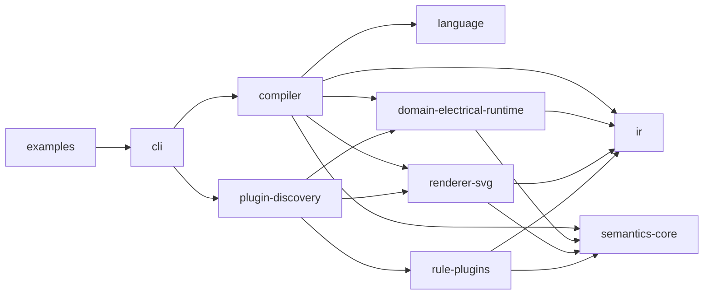
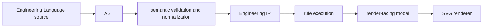

# Architecture Spine - Athena

## Design Paradigm

Athena M0 is a **single-process pipes-and-filters compiler substrate with typed plugin ports**.

- **Single-process** binds M0 to one JVM runtime and forbids service-shaped decomposition at proof stage.
- **Pipes-and-filters** binds compilation to explicit stage boundaries: DSL -> AST -> semantic validation/normalization -> `Engineering IR` -> render-facing model -> `SVG`.
- **Typed plugin ports** bind extensibility to core-owned contracts rather than ad hoc hooks or private semantic authority.

## Invariants & Rules

### AD-1 - M0 Is A JVM-First Single-Process Compiler Proof

- **Binds:** `FR-1`, `FR-2`, `FR-4`, `FR-6`, `FR-9`, `FR-12`, `FR-13`
- **Prevents:** early drift into distributed services, UI-first architecture, or multiplatform fragmentation
- **Rule:** M0 runs as one Kotlin/JVM process with a CLI shell. All proof-stage architecture is optimized for compiler clarity and deterministic local execution before any multiplatform, cloud, or service decomposition concerns.

### AD-2 - Core Semantics Stay General; Electrical/Runtime Is The First Domain Extension

- **Binds:** `FR-1`, `FR-2`, `FR-3`, `FR-7`, `FR-8`, `FR-9`
- **Prevents:** the first wedge becoming the permanent core vocabulary
- **Rule:** The semantic core owns only durable cross-domain concepts. Electrical/runtime concepts enter through the first domain extension and may not redefine the core ontology or `Engineering IR` contracts.

### AD-3 - Engineering IR Is The Only Canonical Semantic Authority

- **Binds:** `FR-2`, `FR-3`, `FR-4`, `FR-5`, `FR-6`
- **Prevents:** split semantic authority across AST, renderer internals, or multiple durable IR layers
- **Rule:** AST is syntax-level only. Semantic validation and normalization produce the first and only canonical semantic model in M0: `Engineering IR`. All rule execution authority belongs to `Engineering IR`, never to AST.

### AD-4 - Rendering Is Downstream Of Semantic Truth

- **Binds:** `FR-3`, `FR-6`, `FR-12`, `FR-13`
- **Prevents:** `SVG` or view logic becoming a second source of truth
- **Rule:** `Engineering IR` owns semantic truth. A compiler-owned translation step derives a separate render-facing model that owns view truth. `SVG` is a backend only and may not recover or invent missing semantics. Semantic/layout/geometry separation is binding from M0 onward, even if a full durable `Layout IR` is deferred.

### AD-5 - Plugins Are Real, Typed, And Non-Sovereign

- **Binds:** `FR-7`, `FR-8`, `FR-9`, `FR-10`, `FR-11`
- **Prevents:** `plugin` becoming a generic escape hatch, a second architecture, or private semantic authority
- **Rule:** M0 proves a real plugin system with typed plugin classes, at minimum domain, renderer, and rule extension contracts. Plugins may extend the system only through core-owned contracts and may not privately redefine the meaning of `Engineering Language`, `Engineering IR`, or compiler semantics. Plugins may depend on core contracts only, never on concrete sibling plugins.

### AD-6 - Plugin Discovery Is Manifest-Driven And Local

- **Binds:** `FR-9`, `FR-10`, `FR-11`
- **Prevents:** hidden/manual wiring masquerading as plugin architecture or premature remote-distribution complexity
- **Rule:** M0 plugins declare typed manifest metadata plus contract compatibility and are discovered from the local JVM classpath. Compatibility is validated before use. The compiler owns pass ordering and phase boundaries; plugins attach only at declared extension points inside that schedule. Remote distribution, hot loading, and marketplace concerns are deferred.

### AD-7 - Examples Are Conformance Artifacts

- **Binds:** `FR-1`, `FR-4`, `FR-5`, `FR-6`
- **Prevents:** language and compiler behavior drifting through casual fixture churn
- **Rule:** `examples/` is part of the architecture contract. Each example defines stable source input plus expected semantic validation outcome, expected `Engineering IR` shape, and expected `SVG` output class. Changing those expectations is an architectural change.



## Consistency Conventions

| Concern | Convention |
| --- | --- |
| Naming (entities, files, interfaces, events) | Core contracts use glossary-aligned nouns; modules are singular role names (`language`, `ir`, `compiler`, `renderer-svg`). Plugin classes are named by type plus capability. |
| Data & formats (ids, dates, error shapes, envelopes) | Stable semantic identity is assigned in semantic space, never from coordinates or renderer artifacts. Diagnostics carry typed severity plus provenance references. Manifests carry explicit plugin type and contract version. |
| State & cross-cutting (mutation, errors, logging, config, auth) | Compiler stages and plugins exchange explicit inputs and outputs; no ambient mutable semantic state. Diagnostics are accumulated explicitly. M0 is local CLI-only and has no auth or distributed config surface. |

## Stack

| Name | Version |
| --- | --- |
| Java | 25 LTS |
| Kotlin | 2.4.0 |
| Gradle | 9.6.1 |

## Structural Seed



```text
Athena/
  cli/                        # command-line entrypoint and orchestration
  language/                   # DSL syntax, parser, and AST
  semantics-core/             # general semantic concepts and validation contracts
  domain-electrical-runtime/  # first domain extension
  ir/                         # canonical Engineering IR model
  compiler/                   # pass pipeline over Engineering IR
  renderer-svg/               # SVG renderer plugin
  examples/                   # conformance examples and expected outputs
```

## Capability -> Architecture Map

| Capability / Area | Lives in | Governed by |
| --- | --- | --- |
| Authoring in `Engineering Language` | `language`, `cli` | AD-1, AD-2, AD-7 |
| Lowering and canonical semantic modeling | `language`, `semantics-core`, `ir`, `compiler` | AD-2, AD-3 |
| Semantic validation and diagnostics | `semantics-core`, `compiler` | AD-3, AD-7 |
| Stable `Engineering IR` and identity | `ir`, `compiler` | AD-2, AD-3, AD-4 |
| SVG proof output | `renderer-svg`, `compiler` | AD-4, AD-7 |
| Governed extension and rule growth | `semantics-core`, `compiler`, rule plugins | AD-5, AD-6 |
| Domain extension model | `domain-electrical-runtime` | AD-2, AD-5 |

## Deferred

- Full durable `Layout IR` and `Geometry IR` artifacts are deferred until view logic becomes substantial; M0 keeps only the separation rule and a thin render-facing model.
- AI, `OPC UA`, cloud, enterprise, and broader product-surface concerns are deferred beyond M0.
- `AutomationML` is a standards and ontology reference concept for boundary design only; it is not an M0 implementation target.
- Remote plugin distribution, hot loading, sandboxing, and marketplace mechanics are deferred.
- Rust splits, Compose, WASM, and multiplatform delivery are deferred until the JVM-first compiler proof is complete.
- First commercial packaging above the open semantic core is deferred.
