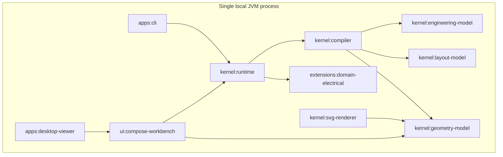

# Architecture Spine - Athena M2

## Design Paradigm

Athena M2 is a **single-process layered semantic runtime with compiler-derived projection pipeline and geometry-backed multi-view surfaces**.

- **Single-process** keeps M2 local, deterministic, and desktop-first while view projection is still being proven.
- **Layered semantic runtime** preserves the M1 rule that lifecycle, execution context, command flow, and refresh orchestration remain runtime-owned.
- **Compiler-derived projection pipeline** makes `Layout IR` and `Geometry IR` explicit deterministic outputs rather than hidden UI state.
- **Geometry-backed multi-view surfaces** let the desktop viewer and SVG backend consume the same downstream projection contract without competing semantic authority.

## Inherited Invariants

| Inherited | From parent | Binds here |
| --- | --- | --- |
| AD-3 | `architecture-Athena-2026-07-02` | `Engineering IR` remains the only canonical semantic authority. |
| AD-4 | `architecture-Athena-2026-07-02` | Rendering remains downstream of semantic truth. |
| AD-5 | `architecture-Athena-2026-07-02` | Plugins remain real, typed, and non-sovereign. |
| AD-6 | `architecture-Athena-2026-07-02` | Plugin discovery and compatibility remain explicit and governed. |
| AD-7 | `architecture-Athena-2026-07-02` | Examples remain architecture contract inputs, not disposable demo data. |
| AD-1 | `architecture-Athena-2026-07-03` | M2 remains a JVM-first single-process local proof. |
| AD-2 | `architecture-Athena-2026-07-03` | `Athena Runtime` owns lifecycle and service orchestration. |
| AD-4 | `architecture-Athena-2026-07-03` | All semantic mutation still flows through the command runtime. |
| AD-5 | `architecture-Athena-2026-07-03` | Graph-oriented runtime services reuse canonical semantic identity. |
| AD-7 | `architecture-Athena-2026-07-03` | Compose remains domain-neutral viewing infrastructure. |
| AD-8 | `architecture-Athena-2026-07-03` | Incremental work remains dependency-scoped and runtime-triggered. |
| AD-10 | `architecture-Athena-2026-07-03` | Shared build versions remain pinned through `gradle/libs.versions.toml`. |

## Invariants & Rules

### AD-1 - Layout IR And Geometry IR Are Explicit Kernel-Owned Projection Contracts

- **Binds:** `FR-1`, `FR-2`, `FR-3`, `FR-12`
- **Prevents:** layout intent or renderable geometry being hidden in Compose state, SVG DTOs, renderer internals, or extension-private view models
- **Rule:** M2 introduces first-class `Layout IR` and `Geometry IR` contracts under the kernel layer. Both are downstream of `Engineering IR`, both preserve canonical semantic identity, and neither may be replaced by a UI-owned or backend-owned durable model.

### AD-2 - Projection Derivation Is A Deterministic Two-Stage Compiler Concern

- **Binds:** `FR-1`, `FR-2`, `FR-7`, `FR-8`
- **Prevents:** runtime services, renderers, or desktop code each inventing incompatible derivation logic from canonical semantics
- **Rule:** `:kernel:compiler` owns deterministic projection derivation from `Engineering IR -> Layout IR -> Geometry IR`. The derivation path is pure with respect to a semantic snapshot plus a supported `View Definition`. Runtime may orchestrate when derivation runs, but may not privately reinterpret the transformation rules.

### AD-3 - Runtime Owns Projection Sessions, View Switching, And Refresh

- **Binds:** `FR-4`, `FR-5`, `FR-6`, `FR-7`, `FR-9`, `FR-10`
- **Prevents:** desktop UI state, SVG rendering code, or plugin internals from becoming the hidden owner of active views, refresh plans, or projection caches
- **Rule:** `:kernel:runtime` owns the active projection session for each active project, including supported view discovery, active-view switching, inspectable projection snapshots, refresh coordination, and cache invalidation. UI and backend consumers request projection state from runtime-owned contracts instead of assembling it privately.

### AD-4 - View Definitions Are Typed Contracts Contributed By Extensions

- **Binds:** `FR-4`, `FR-5`, `FR-6`, `FR-10`
- **Prevents:** view types being hard-coded into the desktop application or smuggled into canonical semantics as presentation truth
- **Rule:** Supported `View Definition` contracts are contributed through typed extension/runtime contracts. The first M2 proof pair is `cabinet` plus `wiring`, contributed by `:extensions:domain-electrical`. A view definition may declare layout intent, grouping rules, emphasis, and presentation policy, but it may not redefine engineering meaning.

### AD-5 - Semantic Identity Must Survive Across Semantic, Layout, And Geometry Layers

- **Binds:** `FR-3`, `FR-6`, `FR-9`, `FR-11`
- **Prevents:** selection, diagnostics, history, diff, and inspection from drifting into view-local identifiers that no longer map to the same engineering object
- **Rule:** Every `Layout IR` node, `Geometry IR` element, and runtime projection snapshot must carry canonical semantic identity references. Projection-local IDs may exist for structure and rendering, but they must always resolve back to stable semantic IDs first.

### AD-6 - Geometry IR Is The Only Renderer-Facing Projection Contract

- **Binds:** `FR-2`, `FR-8`, `FR-10`, `FR-11`, `FR-12`
- **Prevents:** `:kernel:svg-renderer` and `:ui:compose-workbench` from rebuilding geometry from `Engineering IR` or bypassing layout rules to satisfy one surface
- **Rule:** Downstream renderers and viewer surfaces consume `Geometry IR` or runtime projection snapshots backed by `Geometry IR`. `:kernel:svg-renderer` and `:ui:compose-workbench` may add ephemeral presentation state such as selection and camera position, but they may not reconstruct layout or geometry privately from semantic state alone.

### AD-7 - Projection Layers Are Inspectable But Not Authoritative Mutation Sources

- **Binds:** `FR-7`, `FR-9`, `FR-11`
- **Prevents:** M2 from backsliding into geometry-edit-first semantics or view-local write paths that bypass runtime and commands
- **Rule:** In M2, projection layers are inspection surfaces only. Selection, pan, zoom, and view switching remain ephemeral UI/runtime state. Any future authoring from projection surfaces must still resolve into explicit runtime-owned command flows over semantic state or explicitly-governed layout intent, never direct geometry mutation.

### AD-8 - M2 Seed Module Growth Separates Durable Projection Contracts From Surfaces

- **Binds:** `FR-1`, `FR-2`, `FR-10`, `FR-12`
- **Prevents:** one oversized projection module or UI/app modules becoming the long-term home of durable layout and geometry contracts
- **Rule:** M2 adds `:kernel:layout-model` and `:kernel:geometry-model` as the durable homes of projection contracts. Deterministic derivation remains in `:kernel:compiler`, projection orchestration remains in `:kernel:runtime`, backend consumption remains in `:kernel:svg-renderer`, and desktop consumption remains in `:ui:compose-workbench` plus `:apps:desktop-viewer`.

```mermaid
flowchart LR
  dsl[DSL]
  gui[Desktop UI]
  ai[Accepted AI proposal]

  runtime[Athena Runtime]
  command[Command Runtime]
  graph[Engineering Graph]
  eir[Engineering IR]
  compiler[Projection derivation in kernel compiler]
  layout[Layout IR]
  geometry[Geometry IR]
  views[View definitions]
  extension[Electrical extension]
  svg[SVG renderer]
  workbench[Compose workbench]

  dsl --> runtime
  gui --> runtime
  ai --> runtime

  runtime --> command
  runtime --> graph
  command --> eir
  graph --> eir
  runtime --> compiler
  extension --> views
  views --> compiler
  eir --> compiler
  compiler --> layout
  layout --> geometry
  geometry --> svg
  geometry --> workbench
  runtime --> workbench
```

## Consistency Conventions

| Concern | Convention |
| --- | --- |
| Naming (entities, files, interfaces, events) | Durable projection contracts use glossary-aligned nouns such as `LayoutIr`, `GeometryIr`, `ViewDefinition`, `ProjectionSnapshot`, and `ProjectionRefresh`. Renderer and surface adapters are suffixed by role (`Renderer`, `Presenter`, `Session`) rather than by domain semantics. |
| Data & formats (ids, dates, error shapes, envelopes) | Projection artifacts carry `semanticId` first, `viewId` second, and only then projection-local identifiers. Snapshot payloads are immutable per revision and deterministic for the same semantic revision plus view definition. |
| State & cross-cutting (mutation, errors, logging, config, auth) | Runtime owns active projection state and cache invalidation. Commands remain the only semantic mutation path. Layout and geometry layers are rebuildable derived state. M2 remains local and has no auth, service discovery, or distributed config surface. |
| Build and dependency management | Shared versions remain pinned in `gradle/libs.versions.toml`; M2 module additions consume catalog aliases instead of hard-coded versions in individual build files. |

## Stack

| Name | Version |
| --- | --- |
| Java | 25 LTS |
| Kotlin | 2.4.0 |
| Gradle | 9.6.1 |
| Compose Multiplatform | 1.11.1 |

## Structural Seed



```text
Athena/
  gradle/libs.versions.toml        # shared dependency and plugin catalog
  kernel/
    language/                      # DSL parsing and AST
    engineering-model/             # canonical Engineering IR
    validation/                    # generic semantic validation
    compiler/                      # deterministic lowering and projection derivation
    runtime/                       # workspace, execution context, graph, command, projection runtime
    layout-model/                  # view definitions and Layout IR contracts
    geometry-model/                # Geometry IR contracts and renderer-facing projection shapes
    svg-renderer/                  # Geometry IR -> SVG backend
  extensions/
    domain-electrical/             # electrical semantics plus cabinet/wiring view contributions
  ui/
    compose-workbench/             # runtime-backed geometry viewer and projection inspection
  apps/
    cli/                           # shell-facing entrypoint
    desktop-viewer/                # desktop application shell
  examples/
    m0/                            # existing compiler proof fixtures
    m2/                            # synchronized cabinet and wiring projection fixtures
```

## Capability -> Architecture Map

| Capability / Area | Lives in | Governed by |
| --- | --- | --- |
| Canonical engineering semantics | `:kernel:engineering-model`, `:kernel:validation`, `:kernel:compiler` | inherited AD-3, AD-2 |
| Layout IR contracts and view intent | `:kernel:layout-model` | AD-1, AD-4, AD-5, AD-8 |
| Geometry IR contracts and renderer-facing shapes | `:kernel:geometry-model` | AD-1, AD-5, AD-6, AD-8 |
| Deterministic projection derivation | `:kernel:compiler` | AD-2, AD-5 |
| Projection session ownership and refresh | `:kernel:runtime` | AD-3, AD-5, AD-7, AD-8 |
| Supported cabinet and wiring views | `:extensions:domain-electrical` plus runtime registration | AD-4, AD-5 |
| Desktop multi-view inspection | `:ui:compose-workbench`, `:apps:desktop-viewer` | inherited AD-7, AD-3, AD-6, AD-7 |
| SVG or equivalent downstream rendering | `:kernel:svg-renderer` | inherited AD-4, AD-6 |
| Projection proof fixtures and expectations | `examples/m2/` | inherited AD-7, AD-4 |

## Deferred

- Arbitrary manual layout authoring and any command surface that mutates layout intent directly are deferred until the inspection-first projection model is proven.
- Published serialization formats for `Layout IR` and `Geometry IR` are deferred; M2 may use internal deterministic snapshots first.
- Browser-first, WASM, and WebGPU delivery remain deferred until the desktop-first projection boundary is stable.
- Auto-layout, routing heuristics, and optimization engines are deferred beyond the first cabinet-plus-wiring proof.
- External geometry/target adapters beyond SVG and the desktop viewer are deferred until `Geometry IR` stabilizes.
- Additional view families such as functional, power, and safety views are deferred until the first two-view proof demonstrates stable projection rules.
