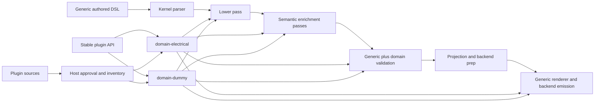
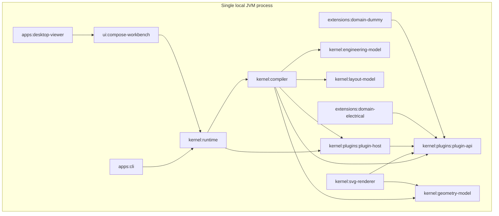

---
title: 'Athena M3'
type: architecture-spine
purpose: build-substrate
altitude: initiative
paradigm: 'single-process plugin-hosted compiler platform with kernel-owned canonical semantics and explicit pass-pipeline orchestration'
scope: 'Athena M3 kernel extensibility proof'
status: final
created: '2026-07-07'
updated: '2026-07-07'
binds:
  - 'FR-1'
  - 'FR-2'
  - 'FR-3'
  - 'FR-4'
  - 'FR-5'
  - 'FR-6'
  - 'FR-7'
  - 'FR-8'
  - 'FR-9'
  - 'FR-10'
  - 'FR-11'
  - 'FR-12'
  - 'FR-13'
  - 'FR-14'
sources:
  - '_bmad-output/planning-artifacts/prds/prd-Athena-2026-07-07/prd.md'
  - '_bmad-output/planning-artifacts/prds/prd-Athena-2026-07-07/addendum.md'
  - 'docs/usages/athena-workspace-summary.md'
  - 'manifesto/docs/architecture/01-compiler.md'
  - 'manifesto/docs/architecture/03-ir.md'
  - 'manifesto/docs/architecture/05-plugin.md'
companions:
  - '_bmad-output/planning-artifacts/architecture/architecture-Athena-2026-07-02/ARCHITECTURE-SPINE.md'
  - '_bmad-output/planning-artifacts/architecture/architecture-Athena-2026-07-03/ARCHITECTURE-SPINE.md'
  - '_bmad-output/planning-artifacts/architecture/architecture-Athena-2026-07-06/ARCHITECTURE-SPINE.md'
---

# Architecture Spine - Athena M3

## Design Paradigm

Athena M3 is a **single-process plugin-hosted compiler platform with kernel-owned canonical semantics and explicit pass-pipeline orchestration**.

- **Single-process** keeps the proof local, deterministic, and JVM-first while the extension boundary is being frozen.
- **Plugin-hosted** means domains are added through governed contracts and hosted inventories rather than by embedding new domain code into kernel modules.
- **Kernel-owned canonical semantics** preserves the earlier rule that authored DSL and `Engineering IR` remain the semantic source of truth.
- **Explicit pass-pipeline orchestration** ensures domain behavior enters through visible compiler stages and contribution points rather than hidden branching.

## Inherited Invariants

| Inherited | From parent | Binds here |
| --- | --- | --- |
| AD-3 | `architecture-Athena-2026-07-02` | `Engineering IR` remains the only canonical semantic authority. |
| AD-4 | `architecture-Athena-2026-07-02` | Rendering remains downstream of semantic truth. |
| AD-5 | `architecture-Athena-2026-07-02` | Plugins remain real, typed, and non-sovereign. |
| AD-6 | `architecture-Athena-2026-07-02` | Plugin discovery and compatibility remain explicit and governed. |
| AD-7 | `architecture-Athena-2026-07-02` | Examples remain architecture contract inputs, not disposable demo data. |
| AD-1 | `architecture-Athena-2026-07-03` | The proof remains JVM-first and single-process. |
| AD-2 | `architecture-Athena-2026-07-03` | Runtime owns lifecycle and service orchestration. |
| AD-4 | `architecture-Athena-2026-07-03` | Semantic mutation still flows through runtime-owned commands only. |
| AD-8 | `architecture-Athena-2026-07-03` | Incremental work remains dependency-scoped and runtime-triggered. |
| AD-1 | `architecture-Athena-2026-07-06` | Layout and geometry remain explicit downstream contracts, not replacement semantic truth. |
| AD-3 | `architecture-Athena-2026-07-06` | Runtime remains the owner of active projection sessions and refresh. |
| AD-6 | `architecture-Athena-2026-07-06` | Renderer-facing projection stays downstream of canonical semantics. |

## Invariants & Rules

### AD-1 - The Kernel Owns Generic Semantics And Orchestration Only

- **Binds:** `FR-1`, `FR-4`, `FR-6`, `FR-7`, `FR-9`
- **Prevents:** `kernel/*` modules from quietly reacquiring ownership of `Motor`, `Lamp`, `Switch`, `Wire`, dummy proof entities, or any future domain nouns
- **Rule:** Kernel modules own generic language structure, canonical semantic contracts, generic validation, pass orchestration, runtime orchestration, layout/geometry orchestration, and backend orchestration. Domain-specific entity meaning, domain validation, and domain rendering live outside the kernel in hosted plugins.

### AD-2 - The Authored DSL Stays Generic; Domain Meaning Enters Through Plugin Schema

- **Binds:** `FR-1`, `FR-4`, `FR-6`, `FR-11`
- **Prevents:** M3 from turning into a plugin-defined grammar system or a kernel-owned domain parser fork for every new engineering family
- **Rule:** M3 keeps the authored DSL structurally generic, using kernel-owned forms such as systems, devices, ports, properties, and connections. Domain plugins supply meaning through declared schema, lowering contributions, validation rules, and rendering contributions. In M3, plugin-hosted domains do not extend grammar; they extend interpretation.

### AD-3 - Stable Plugin Contracts Live In A Dedicated Kernel API Boundary

- **Binds:** `FR-1`, `FR-2`, `FR-3`, `FR-5`, `FR-6`
- **Prevents:** extensions from depending on compiler internals merely to implement SPI, and prevents compiler/runtime/plugin cycles from hardening into the architecture
- **Rule:** Stable plugin contracts move into a dedicated kernel API boundary rather than remaining buried inside compiler implementation packages. The durable SPI includes plugin manifest metadata, extension-point declarations, domain schema contracts, validation contribution contracts, compiler pass contribution contracts, and renderer contribution contracts. Extensions depend on this API boundary, not on compiler internals.

### AD-4 - Hosted Plugin Discovery Is A Two-Layer Concern: Source Then Approval

- **Binds:** `FR-2`, `FR-3`, `FR-13`, `FR-14`
- **Prevents:** ServiceLoader details from becoming the only possible plugin model and prevents unapproved plugin code from bypassing compatibility checks
- **Rule:** The hosted plugin path is split into two layers: a plugin source layer that enumerates candidates, and a host approval layer that validates manifests, compatibility, extension-point declarations, and contract conformance before any candidate becomes part of the approved inventory. ServiceLoader is the M3 plugin source. Future directory-based or remote sources must plug into the same approval boundary rather than bypass it.

### AD-5 - The Compiler Is Governed As A Named Pass Pipeline

- **Binds:** `FR-5`, `FR-6`, `FR-8`, `FR-9`
- **Prevents:** domain behavior being attached through opaque compiler branching or each plugin inventing its own compilation lifecycle
- **Rule:** The compiler is organized as an explicit pass pipeline with stable stage names and responsibilities. The minimum M3 path is `parse -> lower -> semantic enrichment -> validate -> projection/backend preparation -> render/backend emission`. Plugin participation happens only at governed stage contribution points, in deterministic approved-plugin order.

### AD-6 - Kernel Validation And Domain Validation Stay Separate

- **Binds:** `FR-7`, `FR-8`, `FR-13`
- **Prevents:** generic kernel invariants from depending on domain plugins, and prevents domain rules from being smuggled back into generic validation modules
- **Rule:** Kernel validation continues to own generic invariants such as duplicate identifiers, missing references, and generic graph correctness. Domain plugins may contribute additional diagnostics only through domain validation contracts executed after or alongside generic validation in the declared pass pipeline. Removing a plugin removes its domain rules but never disables kernel validation.

### AD-7 - Kernel Renderer Contracts Stay Generic; Domains Contribute Only Domain Presentation

- **Binds:** `FR-9`, `FR-10`, `FR-11`
- **Prevents:** SVG or downstream surfaces from importing domain plugin classes directly or reconstructing domain visuals by bypassing governed contracts
- **Rule:** Kernel renderer modules continue to consume canonical semantics and downstream projection contracts generically. Domain plugins may contribute symbol selection, render fragments, or renderer-facing descriptors through approved rendering contracts, but render orchestration remains kernel-owned and domain plugins do not become backend hosts.

### AD-8 - The Existing Electrical Extension Becomes The Reference Real Proof Domain

- **Binds:** `FR-11`, `FR-13`, `FR-14`
- **Prevents:** a second parallel electrical truth from being created just to satisfy the milestone
- **Rule:** `:extensions:domain-electrical` is refactored into the stable M3 SPI and becomes the first real proof domain. Its M3 scope is intentionally narrow: `Motor`, `Lamp`, `Switch`, `Wire`. The milestone proves extensibility, not electrical completeness.

### AD-9 - A Synthetic Dummy Domain Is Required To Prove Generality

- **Binds:** `FR-12`, `FR-13`, `FR-14`
- **Prevents:** the SPI from looking generic in prose while remaining secretly shaped around the electrical extension
- **Rule:** M3 includes a second proof plugin under `extensions/` with synthetic entities and rules that have no engineering meaning. The dummy domain must use the same stable SPI, the same hosted discovery path, and the same verification posture as the electrical proof domain.

### AD-10 - The Extensibility Matrix Is A First-Class Architecture Contract

- **Binds:** `FR-13`, `FR-14`
- **Prevents:** M3 from claiming platform extensibility through code structure alone without proving isolation through repeatable verification
- **Rule:** The architecture is not considered proven unless the hosted verification matrix is automated for four states: kernel with zero domain plugins, kernel with `domain-electrical`, kernel with `domain-dummy`, and kernel with both together. This matrix is part of the architecture contract, not an optional test flourish.



## Consistency Conventions

| Concern | Convention |
| --- | --- |
| Naming (entities, files, interfaces, events) | Kernel-owned contracts use generic nouns such as `Plugin`, `DomainSchema`, `ValidationContributor`, `CompilerPass`, `RenderContributor`, `PluginSource`, and `ApprovedPluginInventory`. Domain nouns such as `Motor` or `Lamp` stay inside extensions. |
| Data & formats (ids, dates, error shapes, envelopes) | Plugin manifests carry stable plugin identity and compatibility metadata. Diagnostics emitted by plugins must preserve canonical semantic identity and rule provenance so runtime, diff, and projection inspection still point back to the same semantic truth. |
| State & cross-cutting (mutation, errors, logging, config, auth) | Hosted plugin inventories are immutable for one compiler/runtime session. Plugin load approval happens before compilation or runtime hosting. Semantic mutation still flows through runtime-owned commands only. M3 remains local and has no auth or remote trust chain yet. |
| Build and dependency management | Shared versions remain pinned by the workspace catalog. Extensions depend on the dedicated plugin API boundary rather than compiler implementation packages. Hosted plugin discovery remains JVM-first for this milestone. |

## Stack

| Name | Role in M3 |
| --- | --- |
| Java 25 | JVM-first hosted runtime and verification baseline |
| Kotlin | language and compiler/runtime implementation |
| Gradle | module graph and verification orchestration |
| ServiceLoader | first hosted plugin source mechanism only |

## Structural Seed



```text
Athena/
  gradle/libs.versions.toml            # shared build catalog
  kernel/
    language/                          # generic DSL parsing and AST
    engineering-model/                 # canonical Engineering IR
    layout-model/                      # explicit downstream layout contracts
    geometry-model/                    # explicit downstream geometry contracts
    validation/                        # generic kernel validation only
    plugins/                           # plugin infrastructure subgroup
      plugin-api/                      # stable plugin SPI shared by kernel and extensions
      plugin-host/                     # plugin sources, approval, inventory, and hosted inspection
    compiler/                          # pass pipeline orchestration over canonical semantics
    runtime/                           # lifecycle, command runtime, hosted plugin services, projection runtime
    svg-renderer/                      # generic backend orchestration and renderer output
  extensions/
    domain-electrical/                 # first real proof domain through stable SPI
    domain-dummy/                      # synthetic proof domain through the same SPI
  ui/
    compose-workbench/                 # downstream inspection surfaces only
  apps/
    cli/                               # verification and operator shell
    desktop-viewer/                    # downstream operator inspection shell
  examples/
    m0/                                # original semantic compiler fixtures
    m2/                                # layout and geometry proof fixtures
    m3/                                # extension proof fixtures and matrix inputs
```

## Capability -> Architecture Map

| Capability / Area | Lives in | Governed by |
| --- | --- | --- |
| Generic authored DSL and AST | `:kernel:language` | AD-1, AD-2 |
| Canonical semantic contracts | `:kernel:engineering-model` | inherited AD-3, AD-1 |
| Generic kernel validation | `:kernel:validation` | AD-1, AD-6 |
| Stable plugin SPI | `:kernel:plugins:plugin-api` | AD-3, AD-5, AD-6, AD-7 |
| Hosted plugin discovery, approval, and inventory | `:kernel:plugins:plugin-host` | inherited AD-6, AD-4 |
| Pass pipeline orchestration | `:kernel:compiler` | AD-1, AD-2, AD-5, AD-6 |
| Runtime hosting and command-owned mutation | `:kernel:runtime` | inherited AD-2, inherited AD-4, AD-4 |
| Downstream projection contracts | `:kernel:layout-model`, `:kernel:geometry-model` | inherited AD-1, inherited AD-3 |
| Generic renderer orchestration | `:kernel:svg-renderer` | inherited AD-4, AD-7 |
| First real proof domain | `:extensions:domain-electrical` | AD-2, AD-8, AD-10 |
| Synthetic proof domain | `:extensions:domain-dummy` | AD-2, AD-9, AD-10 |
| Extensibility proof fixtures | `examples/m3/` | inherited AD-7, AD-10 |

## Deferred

- Dynamic local-directory plugin loading is deferred until after the stable source-versus-approval boundary is proven.
- Remote URL plugin acquisition, trust, signature, and lifecycle policies are deferred.
- Hot load and hot unload behavior are deferred.
- Plugin-defined grammar extensions are deferred; M3 proves plugin-defined interpretation, not plugin-defined syntax.
- Broader domain packs beyond the electrical proof set and the dummy proof set are deferred.
- Marketplace, remote registry, and organization-level plugin governance workflows are deferred.

