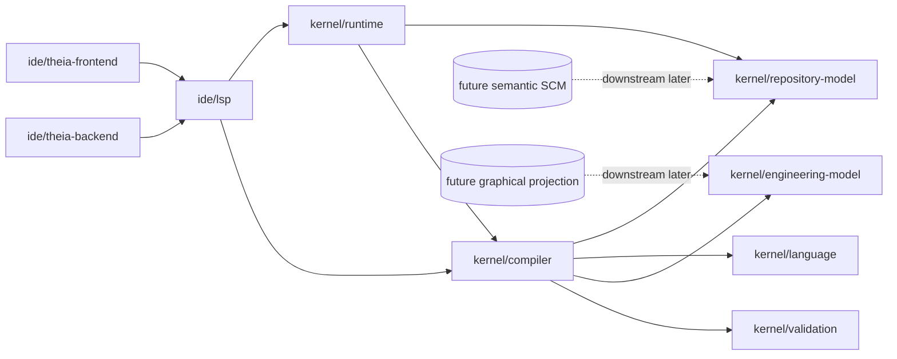
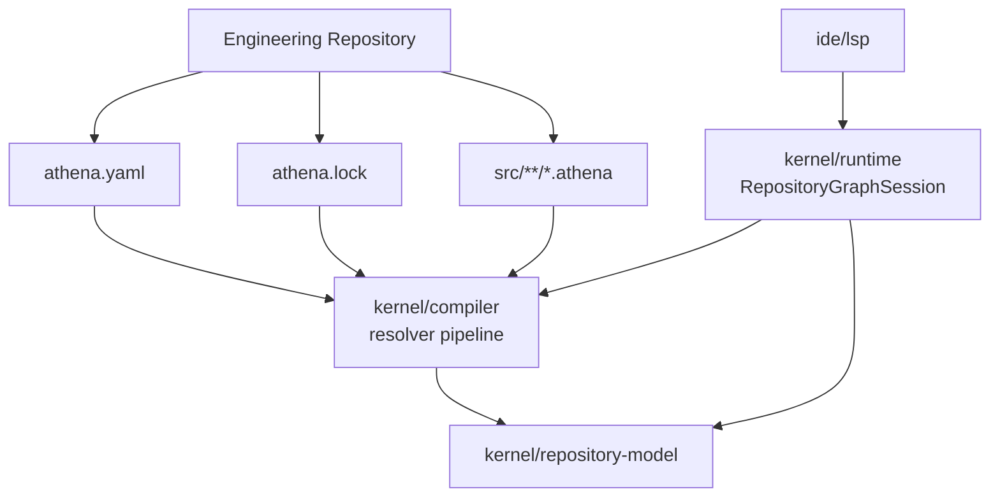

# Architecture Spine - Athena M5

## Design Paradigm

Athena M5 is a **root-manifest, lock-governed repository graph with LSP-hosted JVM semantic authority**.

- **Root-manifest** means the repository contract starts from one canonical repository-root `athena.yaml` in M5 rather than package-local manifests or frontend-owned metadata.
- **Lock-governed repository graph** means the resolved package graph is made inspectable and reproducible through a canonical `athena.lock` that is derived from Athena resolution rules rather than from generic package-manager conventions.
- **LSP-hosted JVM semantic authority** means the M4 IDE rule remains intact: repository/package meaning lives in the JVM runtime and compiler path exposed through `ide/lsp`, not in Theia frontend or backend state.
- **Narrow proof before ecosystem breadth** means M5 proves repository/package semantics first and defers semantic SCM, remote registry transport, publish flows, and graphical projection to later milestones.

## Inherited Invariants

| Inherited | From parent | Binds here |
| --- | --- | --- |
| AD-2 | `architecture-Athena-2026-07-08` | Theia frontend, Theia backend, and Athena LSP remain separate owners. |
| AD-3 | `architecture-Athena-2026-07-08` | `ide/lsp` remains the only semantic entry point for the IDE path. |
| AD-4 | `architecture-Athena-2026-07-08` | One Engineering Repository still maps to one active session per product window. |
| AD-5 | `architecture-Athena-2026-07-08` | Session authority remains in the LSP-embedded JVM runtime. |
| AD-7 | `architecture-Athena-2026-07-08` | The shipped IDE capability set remains curated rather than marketplace-shaped. |
| AD-8 | `architecture-Athena-2026-07-08` | Workbench state remains downstream of kernel, runtime, and compiler boundaries. |
| AD-10 | `architecture-Athena-2026-07-08` | Future graphical projection stays downstream of canonical semantic state. |

## Invariants & Rules

### AD-11 - The M5 Repository Contract Is Singular At Repository Root

- **Binds:** `FR-1`, `FR-2`, `FR-3`, `FR-8`, `FR-11`
- **Prevents:** repository meaning from splitting across package-local manifests, frontend-generated metadata, or ad hoc bootstrap files
- **Rule:** In M5, each Engineering Repository is governed by exactly one repository-root `athena.yaml` and one repository-root `athena.lock`. `athena.yaml` is the authored repository/package intent contract. `athena.lock` is the derived deterministic resolution artifact read and written by Athena-owned semantic flows. Package-local manifests are deferred.

### AD-12 - M5 Proves One Primary Package Per Repository

- **Binds:** `FR-1`, `FR-3`, `FR-4`, `FR-7`, `FR-11`
- **Prevents:** M5 from widening into monorepo or multi-package authoring semantics before the first package contract is proven
- **Rule:** An M5 Engineering Repository declares one primary Athena package in the repository-root manifest. The semantic package graph for M5 is that primary package plus its resolved dependencies. The primary package owns the governed authored source root under `src/`, and authored Athena sources live under that root using the existing `.athena` language surface. Multi-package repository authoring is deferred.

### AD-13 - Repository And Package Contracts Live In `kernel/repository-model`

- **Binds:** `FR-1`, `FR-2`, `FR-3`, `FR-6`, `FR-11`, `FR-12`
- **Prevents:** compiler, runtime, and IDE modules from inventing incompatible manifest, lock, package-identity, or resolution-report shapes
- **Rule:** M5 introduces `kernel/repository-model` as the canonical home for repository manifest contracts, lock contracts, package identity, dependency declarations, resolved package graph shapes, and package-resolution reports. `kernel/compiler`, `kernel/runtime`, and `ide/lsp` consume these contracts; none of them may define a parallel repository/package model.

### AD-14 - Package Imports Bind Only Through The Resolved Package Graph

- **Binds:** `FR-4`, `FR-5`, `FR-6`, `FR-11`
- **Prevents:** JVM classpath coincidence, raw filesystem traversal, or frontend heuristics from becoming the practical package authority
- **Rule:** Source-level package imports and package references resolve only against the manifest-declared, lock-backed package graph produced by Athena resolution. The compiler may not satisfy package imports from JAR classpath presence, arbitrary relative-path discovery, or frontend-local caches.

### AD-15 - Resolution Is Deterministic And Local-First In M5

- **Binds:** `FR-2`, `FR-4`, `FR-5`, `FR-6`, `FR-11`
- **Prevents:** non-reproducible graph state, hidden network dependence, or premature remote-package complexity from contaminating the first repository/package proof
- **Rule:** The M5 resolution path is an explicit compiler-owned sequence: manifest load, repository/package validation, dependency collection, deterministic dependency ordering, local-first source resolution, lock materialization, and package-diagnostic publication. Remote registry transport, Git transport, and publish-oriented resolution are deferred beyond M5.

### AD-16 - `athena.lock` Is Derived State, Not Dependency Intent

- **Binds:** `FR-2`, `FR-4`, `FR-6`, `FR-7`, `FR-11`
- **Prevents:** lockfile edits from becoming the hidden source of semantic dependency intent or frontend tools from writing incompatible lock state
- **Rule:** Dependency intent lives in `athena.yaml`. `athena.lock` records the resolved package graph and reproducibility-critical derived state in a stable, inspectable order. Manual lockfile edits are valid only as inputs to Athena validation; they do not replace manifest intent or bypass resolver authority.

### AD-17 - The Active Session Becomes A `RepositoryGraphSession`

- **Binds:** `FR-7`, `FR-8`, `FR-9`, `FR-10`, `FR-12`
- **Prevents:** repository/package authority from splitting between Theia shell state, LSP caches, and runtime session state
- **Rule:** The M4 active repository session evolves into one runtime-owned `RepositoryGraphSession` per product window. That session carries repository manifest state, lock state, resolved package graph state, and package diagnostics. `ide/lsp` is the transport boundary for this session. Theia frontend and backend may initiate repository open/create actions and render repository/package state, but they do not own the session.

### AD-18 - M5 IDE Work Stays Additive And Package-Operability Scoped

- **Binds:** `FR-8`, `FR-9`, `FR-10`, `FR-12`
- **Prevents:** the repository/package milestone from turning into a broad IDE-polish milestone or a second semantic implementation in Node
- **Rule:** Any M5 Theia work must directly expose repository/package graph state, package diagnostics, resolution feedback, or package-aware repository actions through the existing M4 additive seams. Syntax highlighting, semantic-token groundwork, hover, rename, or formatting work is allowed only when it makes governed package operation practical and remains downstream of the same semantic graph.



## Consistency Conventions

| Concern | Convention |
| --- | --- |
| Naming (entities, files, interfaces, events) | Use `EngineeringRepository`, `RepositoryManifest`, `RepositoryLock`, `PrimaryPackage`, `PackageDependency`, `ResolvedPackageGraph`, and `RepositoryGraphSession` consistently. Avoid `workspace` as the primary M5 architecture noun except when referring to upstream Theia terminology or inherited runtime APIs. |
| Data & formats (ids, dates, error shapes, envelopes) | `athena.yaml` is the authored YAML contract. `athena.lock` is the derived stable-order lock contract. Package diagnostics travel through LSP-native diagnostics and Athena-namespaced protocol payloads; frontend code does not invent alternate error envelopes for repository/package semantics. |
| State & cross-cutting (mutation, errors, logging, config, auth) | Repository/package state mutates only through JVM-owned manifest/resolution/session flows. Frontend state is disposable projection state. Backend state is product-process orchestration state. M5 remains local-only with no registry auth, remote trust, or publish credentials model. |
| Build and dependency management | `kernel/repository-model` remains a JVM-first typed contract module. `kernel/compiler` and `kernel/runtime` depend on it. `ide/*` only crosses the boundary through protocol contracts and never through direct JVM model redefinition in Node or TypeScript. |

## Stack

| Name | Version |
| --- | --- |
| Java | 25 |
| Kotlin | 2.4.0 |
| Gradle | 9.6.1 |
| Node.js | 22+ |
| Yarn | 1.22.22 |
| Eclipse Theia | 1.73.1 |

## Structural Seed



```text
Engineering Repository/
  athena.yaml                  # authored repository and primary-package intent
  athena.lock                  # derived deterministic resolution state
  src/                         # governed authored source root for the primary package
    *.athena
  .athena/                     # local product/runtime operational state
```

```text
Athena/
  ide/
    theia-product/             # packaged desktop-first Athena shell
    theia-frontend/            # repository/package views, commands, diagnostics projection
    theia-backend/             # path selection, repository bootstrap, process orchestration
    lsp/                       # sole IDE semantic entry point
  kernel/
    repository-model/          # manifest, lock, package identity, resolved graph contracts
    compiler/                  # manifest validation and deterministic resolver pipeline
    runtime/                   # RepositoryGraphSession ownership and repository operations
    language/                  # Athena language syntax and parse contracts
    engineering-model/         # canonical engineering semantics
    validation/                # semantic validation services
    plugins/                   # stable plugin API and hosting boundaries
    layout-model/              # downstream layout contracts
    geometry-model/            # downstream geometry contracts
    svg-renderer/              # downstream rendering backend
  examples/
    m5/                        # governed repository and resolver proof corpus
```

## Capability -> Architecture Map

| Capability / Area | Lives in | Governed by |
| --- | --- | --- |
| Repository manifest and lock contract | `kernel/repository-model`, `kernel/compiler` | AD-11, AD-13, AD-16 |
| Primary package identity and layout rules | `kernel/repository-model`, repository seed shape | AD-11, AD-12, conventions |
| Deterministic dependency resolution | `kernel/compiler`, `kernel/repository-model` | AD-14, AD-15, AD-16 |
| Package-aware diagnostics | `kernel/compiler`, `kernel/runtime`, `ide/lsp`, `ide/theia-frontend` | AD-14, AD-15, AD-17, AD-18 |
| Active repository graph session | `kernel/runtime`, `ide/lsp` | inherited AD-4, inherited AD-5, AD-17 |
| Repository open/create adaptation | `ide/theia-backend`, `ide/lsp`, `kernel/runtime` | inherited AD-2, AD-11, AD-17, AD-18 |
| Narrow editor operability hardening | `ide/theia-frontend`, `ide/lsp` | inherited AD-7, inherited AD-8, AD-18 |
| Future semantic SCM | deferred beyond M5 | AD-15, AD-16, AD-17 |
| Future graphical projection | deferred beyond M5 | inherited AD-10, AD-18 |

## Deferred

- Package-local manifests and multi-package repository authoring are deferred because M5 only needs to prove the first governed repository/package contract.
- Remote registry resolution, Git transport resolution, company registry support, and publish-oriented package transport are deferred because M5 is local-first and deterministic by design.
- Semantic SCM, intent commit, semantic review, and publish-oriented history remain deferred to M6.
- Graphical projection, graph editing, GLSP-class product work, and visual workbench semantics remain deferred to M7.
- Multi-root repository support remains deferred because M5 keeps the inherited one-window / one-session rule.
