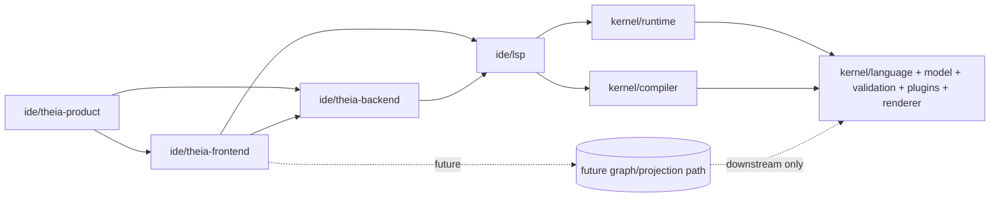
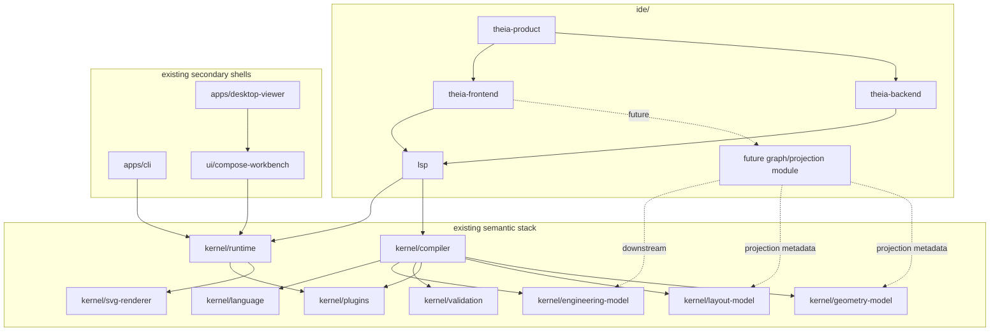

# Architecture Spine - Athena M4

## Design Paradigm

Athena M4 is a **Theia-based two-process IDE shell with LSP-hosted JVM semantic authority**.

- **Theia-based IDE shell** means Athena is built as its own Theia product, not as a VS Code extension and not as a thin adapter around some other editor.
- **Two-process** means the product follows the normal Theia split between frontend and backend product layers.
- **LSP-hosted JVM semantic authority** means the only semantic entry point from the IDE into Athena meaning is the Athena LSP server, which embeds the existing JVM runtime, compiler, and semantic services rather than duplicating them in frontend code.
- **Text-first, projection-safe growth** means M4 proves authored-source tooling first, while any later graphical or diagrammatic surface must attach as a downstream projection path rather than a second semantic authority.

## Inherited Invariants

| Inherited | From parent | Binds here |
| --- | --- | --- |
| AD-1 | `architecture-Athena-2026-07-07` | Kernel modules continue to own generic semantics and orchestration only. |
| AD-3 | `architecture-Athena-2026-07-07` | Stable plugin contracts remain in a dedicated kernel API boundary. |
| AD-5 | `architecture-Athena-2026-07-07` | Compiler behavior remains an explicit named pass pipeline. |
| AD-6 | `architecture-Athena-2026-07-07` | Generic kernel validation remains separate from domain validation. |
| AD-7 | `architecture-Athena-2026-07-07` | Renderer orchestration remains generic and downstream of semantic truth. |

## Invariants & Rules

### AD-1 - `ide/` Is The Product Group For The Athena IDE Path

- **Binds:** `FR-1`, `FR-2`, `FR-10`, `FR-11`, `FR-14`
- **Prevents:** Theia product code from being scattered across `apps/`, `ui/`, or `kernel/` until the primary IDE path becomes impossible to understand or evolve
- **Rule:** M4 introduces an `ide/` group for the Athena IDE product path. The minimal seed is `ide/theia-product`, `ide/theia-frontend`, `ide/theia-backend`, and `ide/lsp`. Existing `apps/` modules remain secondary runnable shells and verification surfaces rather than the home of the main Athena IDE product.

### AD-2 - Theia Frontend, Theia Backend, And Athena LSP Have Separate Ownership

- **Binds:** `FR-1`, `FR-3`, `FR-6`, `FR-7`, `FR-8`, `FR-11`, `FR-12`
- **Prevents:** one layer from quietly becoming owner of product shell, repository lifecycle, semantic authority, and workbench rendering all at once
- **Rule:** `ide/theia-frontend` owns presentation, panels, commands, and view composition. `ide/theia-backend` owns product startup, filesystem bootstrap, process orchestration, and Theia backend contribution wiring. `ide/lsp` owns Athena language services, repository session authority, diagnostics, navigation, and semantic inspection service methods by embedding the existing JVM runtime and compiler stack.

### AD-3 - The Athena LSP Server Is The Only Semantic Entry Point For The IDE

- **Binds:** `FR-3`, `FR-6`, `FR-7`, `FR-8`, `FR-9`, `FR-12`
- **Prevents:** the workbench from inventing a second semantic service, direct frontend calls into `kernel/*`, or a parallel Node-owned semantic model
- **Rule:** The Athena IDE path reaches semantic authority only through Athena LSP standard and Athena-namespaced custom protocol methods. The LSP server embeds the current runtime, compiler, validation, and plugin-hosting layers. Neither Theia frontend nor Theia backend may call kernel modules directly for semantic state or diagnostics.

### AD-4 - One Engineering Repository Maps To One Active Repository Session Per Product Window

- **Binds:** `FR-4`, `FR-5`, `FR-6`, `FR-13`
- **Prevents:** M4 from drifting into multi-root repository ambiguity or inventing a second session model that conflicts with the current single active runtime/workspace ownership
- **Rule:** One Athena product window hosts one active Engineering Repository and one active Repository Session in M4. Opening or creating a repository replaces the previous session in that window. Multi-root repository support is deferred.

### AD-5 - Repository Session Authority Lives In The LSP-Embedded Runtime

- **Binds:** `FR-4`, `FR-5`, `FR-6`, `FR-12`
- **Prevents:** repository lifecycle from splitting between Theia shell state and JVM runtime state in incompatible ways
- **Rule:** Theia backend may create directories, select paths, and manage recent-repository UX, but the authoritative active Repository Session is owned by the runtime embedded inside Athena LSP. Repository-open and repository-create actions must result in one explicit active session transition on the JVM side before semantic views are considered valid.

### AD-6 - Semantic Inspection Is Read-Only And Protocol-Driven In M4

- **Binds:** `FR-3`, `FR-9`, `FR-12`
- **Prevents:** inspection panels from mutating semantic state directly or from becoming hidden editor models with authority over Engineering IR
- **Rule:** Semantic inspection panels consume read-only responses returned through the Athena protocol boundary. In M4 they may show diagnostics, semantic entities, and closely related derived inspection data, but any semantic mutation remains outside inspection panels unless it already routes through a runtime-owned command boundary inherited from earlier milestones.

### AD-7 - The M4 Product Ships With A Curated Bundled Capability Set

- **Binds:** `FR-2`, `FR-10`, `FR-11`, `FR-13`
- **Prevents:** the first Athena IDE proof from being shaped by upstream defaults, random extension sprawl, or user-managed marketplace behavior
- **Rule:** `ide/theia-product` defines the bundled capability set for M4. Only capabilities needed for repository opening, authored-source editing, diagnostics, semantic inspection, console visibility, and product-workbench operation ship in the milestone. Marketplace-style extension management, open-ended user extension installation, and broad feature bundling are out of scope.

### AD-8 - The Workbench Remains Downstream Of Kernel, Runtime, And Compiler Boundaries

- **Binds:** `FR-3`, `FR-7`, `FR-9`, `FR-10`, `FR-12`
- **Prevents:** Studio drift where panels, editor caches, or frontend state become the practical source of truth instead of the semantic stack
- **Rule:** Workbench state is projection and orchestration state only. Diagnostics, navigation, semantic inspection, and future engineering panels must trace back to runtime- and compiler-owned data. UI composition changes, docking changes, or editor-local caches must not redefine engineering meaning or canonical identity.

### AD-9 - Repository Bootstrap In M4 Must Stay Deliberately Light

- **Binds:** `FR-4`, `FR-5`, `FR-14`
- **Prevents:** M4 from accidentally freezing the M5 repository manifest, lockfile, and package-graph contracts through a rushed product-shell implementation
- **Rule:** M4 may create and open a light repository bootstrap shape that is sufficient for the Theia product proof, but it must not hard-code final `athena.yaml`, `athena.lock`, dependency-resolution, or semantic package-graph rules. Those contracts are deferred to M5.

### AD-10 - Future Graphical Projection Must Remain Downstream Of Canonical Semantic State

- **Binds:** `FR-3`, `FR-10`, `FR-12`, `FR-14`
- **Prevents:** a later diagram canvas, graph model, or projection service from becoming canvas-owned engineering truth or a parallel semantic authority beside the kernel/runtime stack
- **Rule:** M4 does not implement graphical editing or a graph server. If Athena later adds graphical semantic-projection surfaces under the same Theia product, they must attach as downstream projection/service boundaries fed by canonical semantic state and projection metadata. Graphical state may govern presentation and layout only; it must not redefine engineering meaning, identity, or canonical relationships.



## Consistency Conventions

| Concern | Convention |
| --- | --- |
| Naming (entities, files, interfaces, events) | Use `Repository`, `RepositorySession`, `TheiaProduct`, `TheiaFrontend`, `TheiaBackend`, `AthenaLSPServer`, and `SemanticInspection` consistently. Do not reintroduce `workspace` as the main architecture noun for the M4 IDE path except when referring to inherited runtime APIs or upstream Theia terminology. |
| Data & formats (ids, dates, error shapes, envelopes) | Standard editor diagnostics and navigation use LSP-native shapes. Athena-specific semantic inspection and repository-session requests use an Athena-namespaced protocol contract with stable method names and JSON payloads. Any later graphical-projection protocol must treat projection metadata as downstream view data rather than canonical engineering truth. |
| State & cross-cutting (mutation, errors, logging, config, auth) | Frontend state is disposable presentation state. Backend state is product-process orchestration state. Semantic state lives in the LSP-embedded runtime. Inspection remains read-only. Any later graph/canvas state is projection state only. M4 remains local-only with no auth or remote trust model. |
| Build and dependency management | `ide/` owns Node/TypeScript/Theia product modules. `kernel/` remains the JVM semantic stack. Cross-language boundaries are protocol boundaries, not source-set shortcuts or direct mixed-runtime imports. |

## Stack

| Name | Version |
| --- | --- |
| Java | 25 |
| Kotlin | 2.4.0 |
| Gradle | 9.6.1 |
| Eclipse Theia | 1.73.0 |

## Structural Seed



```text
Athena/
  ide/
    theia-product/                     # product composition, packaging, curated capability set
    theia-frontend/                   # workbench views, commands, panel composition, welcome flow
    theia-backend/                    # filesystem bootstrap, process startup, Theia backend wiring
    lsp/                              # Athena LSP server embedding runtime and compiler semantics
    [future graph/projection module]/ # deferred graphical semantic-projection path, not part of M4 delivery
  kernel/
    language/                         # generic DSL parsing and syntax ownership
    engineering-model/                # canonical semantic model
    validation/                       # generic semantic validation
    plugins/                          # stable plugin API and host boundaries
    compiler/                         # named pass pipeline orchestration
    runtime/                          # active session, command, and service ownership
    layout-model/                     # downstream layout contracts
    geometry-model/                   # downstream geometry contracts
    svg-renderer/                     # downstream rendering backend
  apps/
    cli/                              # secondary shell and verification surface
    desktop-viewer/                   # existing proof shell retained until superseded
  ui/
    compose-workbench/                # existing non-Theia UI proof retained until superseded
  examples/                           # milestone proof corpora and regression fixtures
```

## Capability -> Architecture Map

| Capability / Area | Lives in | Governed by |
| --- | --- | --- |
| Custom Athena IDE product shell | `ide/theia-product` | AD-1, AD-2, AD-7 |
| Welcome flow and workbench composition | `ide/theia-frontend` | AD-2, AD-7, AD-8 |
| Repository create/open shell actions | `ide/theia-backend`, `ide/theia-frontend`, `ide/lsp` | AD-2, AD-4, AD-5, AD-9 |
| Active Repository Session | `ide/lsp`, `kernel/runtime` | AD-3, AD-4, AD-5 |
| Diagnostics and core language tooling | `ide/lsp`, `ide/theia-frontend` | AD-2, AD-3, AD-8 |
| Semantic inspection panels | `ide/theia-frontend`, `ide/lsp` | AD-3, AD-6, AD-8 |
| Future graphical semantic-projection surfaces | deferred under `ide/*` | AD-8, AD-10 |
| Bundled capability set and product policy | `ide/theia-product` | AD-1, AD-7 |
| Existing semantic authority | `kernel/*` | inherited AD-1, inherited AD-3, inherited AD-5, inherited AD-6, inherited AD-7, AD-8 |

## Deferred

- The exact protocol-home choice between a dedicated `ide/protocol` module and a first co-located protocol contract in `ide/lsp` is deferred to implementation planning.
- Multi-root repository support is deferred.
- Final `athena.yaml`, `athena.lock`, dependency resolution, and semantic package graph are deferred to M5.
- Semantic SCM, intent commit flows, repository review workflows, and publish-oriented history flows are deferred to M6.
- Graphical editing, graph-server implementation, and any dedicated graph/projection module are deferred beyond M4.
- Final visual language, design-token system, and emotion-system work are deferred beyond M4.
- Browser-first delivery and richer web deployment concerns are deferred.
