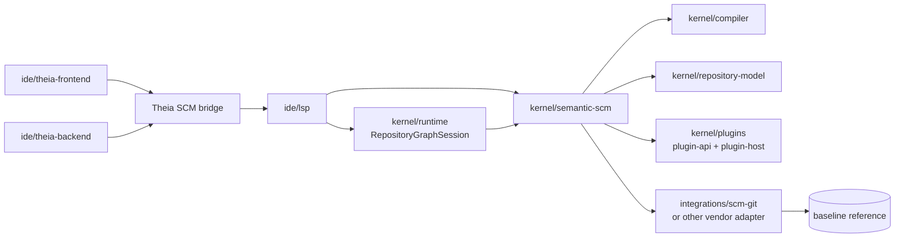
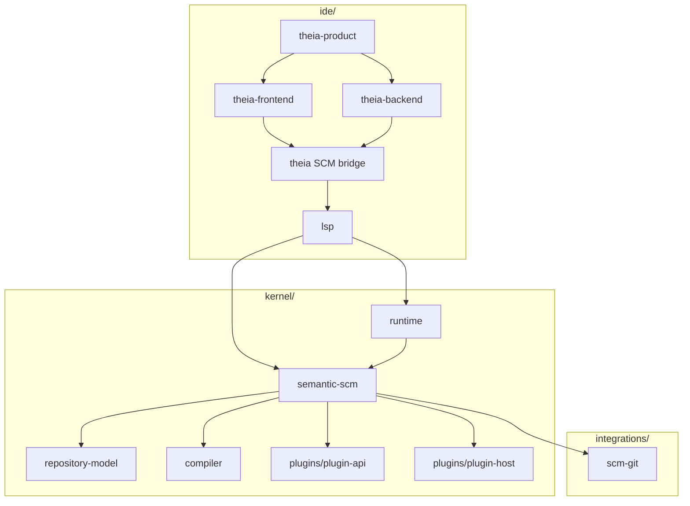

# Architecture Spine - Athena M6

## Design Paradigm

Athena M6 is a **VCS-neutral semantic SCM core with baseline-driven JVM semantic comparison, adapter-backed vendor execution, and Theia-hosted downstream SCM presentation**.

- **VCS-neutral semantic SCM core** means M6 introduces Athena-owned semantic change, review, commit-intent, and history contracts above M5 repository/package meaning rather than extending `repository-model` with Git or Theia vocabulary.
- **Baseline-driven JVM semantic comparison** means repository change is derived by comparing current repository/package and engineering meaning against a repository-scoped baseline through the same compiler/runtime semantic path, not by treating text diff as the primary truth.
- **Adapter-backed vendor execution** means Git or another storage substrate is consumed through an explicit adapter layer that loads baselines and executes commit-facing operations without becoming semantic authority.
- **Theia-hosted downstream SCM presentation** means Athena may use Theia SCM as the workbench integration surface, but Theia remains a downstream bridge and never defines Athena semantic SCM contracts.

## Inherited Invariants

| Inherited | From parent | Binds here |
| --- | --- | --- |
| AD-13 | `architecture-Athena-2026-07-08-m5` | `repository-model` remains the canonical home for repository/package contracts. |
| AD-16 | `architecture-Athena-2026-07-08-m5` | `athena.lock` remains derived state rather than authored dependency intent. |
| AD-17 | `architecture-Athena-2026-07-08-m5` | The active repository session remains a runtime-owned `RepositoryGraphSession`. |
| AD-18 | `architecture-Athena-2026-07-08-m5` | IDE work remains additive and package-operability scoped through existing product seams. |
| AD-3 | `architecture-Athena-2026-07-08` | `ide/lsp` remains the only semantic entry point for the IDE path. |
| AD-4 | `architecture-Athena-2026-07-08` | One Engineering Repository still maps to one active session per product window. |
| AD-5 | `architecture-Athena-2026-07-08` | Session authority remains in the LSP-embedded JVM runtime. |
| AD-8 | `architecture-Athena-2026-07-08` | Workbench state remains downstream of kernel, runtime, and compiler boundaries. |
| AD-10 | `architecture-Athena-2026-07-08` | Future graphical projection stays downstream of canonical semantic state. |
| AD-3 | `architecture-Athena-2026-07-07` | Stable hosted plugin contracts remain a dedicated kernel API boundary. |

## Invariants & Rules

### AD-19 - Semantic SCM Lives In A Dedicated VCS-Neutral Core Above M5 Repository Meaning

- **Binds:** `FR-1`, `FR-2`, `FR-3`, `FR-8`, `FR-10`, `FR-11`
- **Prevents:** Git vocabulary, Theia SCM types, or review UI concerns from polluting `repository-model`, compiler contracts, or runtime session ownership
- **Rule:** M6 introduces a dedicated semantic SCM core boundary for semantic baseline, semantic diff, semantic review summary, semantic commit intent, and publish-oriented semantic history. This core consumes `RepositoryGraphSession`, compiler/runtime semantic outputs, and `kernel/repository-model` contracts from above. `repository-model` remains unaware of source-control and review semantics.

### AD-20 - Repository Baselines Are Repository-Scoped Semantic Inputs, Not Reconstructed Command Journals

- **Binds:** `FR-3`, `FR-5`, `FR-8`, `FR-10`
- **Prevents:** semantic SCM from depending on transient in-process command history, current editor tabs, or raw file lists as the practical baseline authority
- **Rule:** Every M6 semantic comparison uses two explicit repository-scoped semantic states: the current state from the active runtime-owned `RepositoryGraphSession`, and a baseline state loaded through the semantic SCM boundary. M1 command history remains useful evidence and drill-down context, but it is not the baseline authority for repository-level semantic diff.

### AD-21 - Semantic Diff Compares Canonical Repository, Package, And Engineering Meaning Through The Same JVM Path

- **Binds:** `FR-3`, `FR-4`, `FR-5`, `FR-8`
- **Prevents:** M6 from reducing semantic change to text delta or from running a second SCM-only semantic interpreter beside compiler/runtime
- **Rule:** Semantic diff is produced by interpreting both current and baseline repository states through the same governed JVM semantic path used by repository/package validation and engineering compilation. Raw file diff may be attached as supporting evidence, but the primary M6 output is repository/package and engineering semantic change over stable canonical identities.

### AD-22 - Vendor SCM Adapters Are Substrate-Only And Live In A Separate Integration Layer

- **Binds:** `FR-1`, `FR-2`, `FR-6`, `FR-7`, `FR-11`
- **Prevents:** Git execution logic from becoming part of kernel semantic contracts or Theia workbench code, and prevents Athena semantic SCM from becoming vendor-shaped
- **Rule:** Vendor-specific baseline loading and commit execution sit in a separate integration layer, seeded under `integrations/` rather than `kernel/`, `extensions/`, or `ide/`. The first practical adapter may target Git, but adapters only provide substrate access, reference resolution, and execution handoff. They do not define semantic change categories, review summaries, or commit intent language.

### AD-23 - Theia SCM Is A Downstream Bridge, Not The Semantic SCM Core

- **Binds:** `FR-2`, `FR-8`, `FR-9`, `FR-12`
- **Prevents:** Athena semantic SCM contracts from being shaped around `@theia/scm` provider types, frontend lifecycle, or workbench-local state
- **Rule:** Theia SCM may host Athena SCM providers, resource groups, commands, decorators, and review-facing views in the product shell. All such work remains downstream of `ide/lsp` and JVM semantic authority. Athena semantic SCM contracts, baseline models, and review artifacts must not depend on Theia-specific types or APIs.

### AD-24 - Review And Commit Outputs Separate Authored Intent From Derived Consequences

- **Binds:** `FR-5`, `FR-6`, `FR-7`, `FR-8`, `FR-10`
- **Prevents:** derived lock churn, validation fallout, or downstream projection changes from being mistaken for primary authored intent
- **Rule:** M6 review summaries and commit-intent artifacts must distinguish between authored changes, repository/package contract changes, package graph changes, engineering semantic changes, and derived consequences such as `athena.lock` updates, validation deltas, or downstream view impact. This keeps M5's authored-intent versus derived-state rule visible during change review.

### AD-25 - Domain-Specific Semantic Review Enrichment Is Additive Through Hosted Plugin Contracts

- **Binds:** `FR-4`, `FR-5`, `FR-8`, `FR-10`, `FR-12`
- **Prevents:** kernel semantic SCM from hard-coding electrical-only change language or plugins from becoming alternative semantic diff authorities
- **Rule:** The semantic SCM core emits generic stable change records over repository/package and canonical engineering identities. Approved hosted plugins may contribute domain-specific review labels, impact hints, or summary enrichments through governed extension contracts. Plugin enrichments are additive, deterministic, and cannot suppress or rewrite core semantic SCM facts.

### AD-26 - Publish-Oriented Semantic History Is Package-Identity Anchored And Transport-Light In M6

- **Binds:** `FR-10`, `FR-11`, `FR-12`
- **Prevents:** M6 from expanding into registry, remote distribution, or cloud release infrastructure before semantic history meaning is stable
- **Rule:** Publish-oriented semantic history in M6 is expressed in terms of M5 package identity, version meaning, dependency movement, and release relevance. Registry protocols, remote package transport, and broader ecosystem distribution workflows remain deferred. M6 proves semantic history meaning first, not ecosystem transport.



## Consistency Conventions

| Concern | Convention |
| --- | --- |
| Naming (entities, files, interfaces, events) | Use `SemanticBaseline`, `SemanticDiff`, `SemanticReviewSummary`, `SemanticCommitIntent`, `SemanticHistorySummary`, `SemanticScmAdapter`, and `RepositoryGraphSession` consistently. Avoid Git-first nouns in core contracts. |
| Data & formats (ids, dates, error shapes, envelopes) | Baseline identity, semantic change categories, review entries, and commit-intent artifacts must be typed and inspectable. Package and engineering identities remain anchored in canonical repository/package and semantic ids rather than vendor revision strings alone. |
| State & cross-cutting (mutation, errors, logging, config, auth) | Current semantic state comes from the active `RepositoryGraphSession`. Baseline semantic state is immutable for one comparison. Frontend state is disposable projection state. Vendor credentials, remotes, and registry auth remain outside the semantic core. |
| Build and dependency management | `kernel/semantic-scm` remains JVM-first and depends on existing semantic layers. Vendor adapters live under `integrations/`. `ide/*` consumes semantic SCM only through protocol and product-bridge seams, never by direct kernel model imports in Node or TypeScript. |

## Stack

| Name | Version |
| --- | --- |
| Java | 25 |
| Kotlin | 2.4.0 |
| Gradle | 9.6.1 |
| Node.js | 22+ |
| Yarn | 1.22.22 |
| Eclipse Theia | 1.73.1 |

## Structural Seed



```text
Athena/
  kernel/
    repository-model/              # canonical repository/package contracts from M5
    compiler/                      # semantic interpretation over repository/package and engineering state
    runtime/                       # active RepositoryGraphSession and command/history ownership
    semantic-scm/                  # M6 semantic baseline, diff, review, commit-intent, and history core
    plugins/
      plugin-api/                  # governed domain enrichment contracts
      plugin-host/                 # approved plugin inventory and hosted lifecycle
  integrations/
    scm-git/                       # first vendor substrate adapter for baseline loading and execution handoff
  ide/
    theia-product/                 # curated product shell
    theia-frontend/                # downstream SCM views, commands, and review presentation
    theia-backend/                 # filesystem, process, and product orchestration
    lsp/                           # sole IDE semantic entry point
  examples/
    m5/                            # governed repository/package proof corpus reused by M6
    m6/                            # semantic SCM proof corpus
```

## Capability -> Architecture Map

| Capability / Area | Lives in | Governed by |
| --- | --- | --- |
| Semantic baseline model and comparison orchestration | `kernel/semantic-scm`, `kernel/runtime`, `kernel/repository-model` | AD-19, AD-20, AD-21 |
| Generic semantic change taxonomy | `kernel/semantic-scm` | AD-19, AD-21, AD-24 |
| Vendor baseline loading and execution handoff | `integrations/scm-git` or later vendor adapters | AD-22 |
| Semantic review summary | `kernel/semantic-scm`, `ide/lsp`, `ide/theia-frontend` | AD-21, AD-23, AD-24 |
| Commit-intent preparation | `kernel/semantic-scm`, vendor adapter handoff | AD-22, AD-24 |
| Domain-specific review enrichment | `kernel/plugins/plugin-api`, `kernel/plugins/plugin-host`, approved extensions | AD-25 |
| Publish-oriented semantic history | `kernel/semantic-scm`, `ide/lsp`, downstream product surfaces | AD-24, AD-26 |
| SCM workbench presentation | `ide/theia-frontend`, `ide/theia-backend`, Theia SCM bridge | AD-23 |
| Future graphical review or visualization | deferred beyond M6 | inherited AD-10, AD-26 |

## Deferred

- The exact first baseline reference vocabulary beyond the semantic core's VCS-neutral model is deferred to implementation planning, as long as vendor terms remain adapter-only.
- Full executable Git workflow coverage beyond the first semantic baseline and commit-intent handoff is deferred.
- Registry publish transport, package distribution infrastructure, and ecosystem release workflows are deferred.
- Rich review UI, multi-actor collaboration workflow, and cloud synchronization remain deferred.
- Graphical review, visual diff canvases, and graph/projection workbench surfaces remain deferred to M7 and later.
