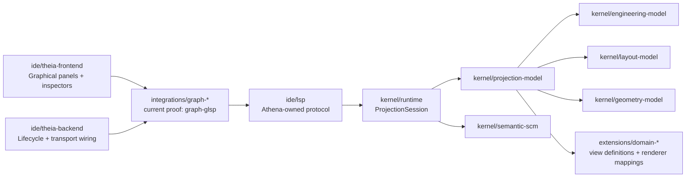
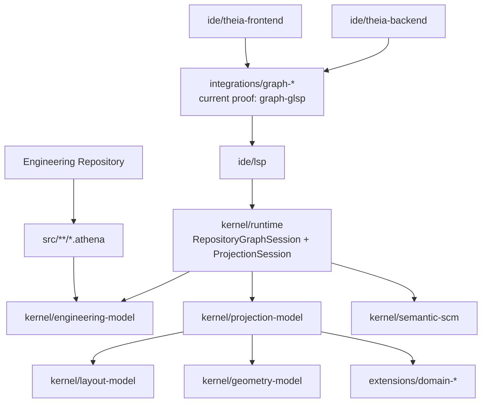

# Architecture Spine - Athena M7

## Design Paradigm

Athena M7 is an **engineering-object-graph-first visual projection with runtime-owned projection sessions and Theia-hosted downstream graphical workbench**.

- **engineering-object-graph-first** means canonical engineering identity remains an object graph of entities and relationships rather than a drawing-owned symbol tree.
- **visual projection** means graphical state is produced from downstream view definition, layout, and geometry layers instead of redefining semantics in canvas code.
- **runtime-owned projection sessions** means the active graphical projection state stays under JVM/runtime authority beside repository and semantic SCM meaning.
- **Theia-hosted downstream graphical workbench** means Athena adds real graphical capability inside the existing product shell while keeping frontend state disposable and downstream.

## Closure Sync

M7 closed on 2026-07-10 with the following implementation decisions aligned to this spine:

- the generic graph adapter boundary remained under `integrations/graph-*`
- the current proof implementation selected `integrations/graph-glsp`
- that adapter stayed translation-only and disposable
- runtime plus `ide/lsp` remained the only projection authorities
- the first delivered workbench posture was graph-first and inspect-first rather than unrestricted editing

## Inherited Invariants

| Inherited | From parent | Binds here |
| --- | --- | --- |
| AD-13 | `architecture-Athena-2026-07-08-m5` | Repository/package contracts still live in `kernel/repository-model`. |
| AD-17 | `architecture-Athena-2026-07-08-m5` | The active repository remains one runtime-owned `RepositoryGraphSession` per product window. |
| AD-18 | `architecture-Athena-2026-07-08-m5` | IDE work stays additive and product-operability scoped through existing seams. |
| AD-3 | `architecture-Athena-2026-07-08` | `ide/lsp` remains the only semantic entry point for the IDE path. |
| AD-5 | `architecture-Athena-2026-07-08` | Session authority remains in the LSP-embedded JVM runtime. |
| AD-8 | `architecture-Athena-2026-07-08` | Workbench state remains downstream of kernel, runtime, and compiler boundaries. |
| AD-10 | `architecture-Athena-2026-07-08` | Graphical projection stays downstream of canonical semantic state. |
| AD-19 | `architecture-Athena-2026-07-09-m6` | Semantic SCM remains a dedicated VCS-neutral core above repository/package meaning. |
| AD-23 | `architecture-Athena-2026-07-09-m6` | Theia-hosted surfaces remain downstream bridges rather than semantic cores. |
| AD-25 | `architecture-Athena-2026-07-09-m6` | Domain-specific enrichments remain additive through hosted plugin contracts. |

## Invariants & Rules

### AD-27 - M7 Introduces A Dedicated Projection-Model Boundary Above Layout And Geometry

- **Binds:** `FR-1`, `FR-2`, `FR-6`, `FR-7`
- **Prevents:** graphical delivery from reading raw engineering entities directly, or each renderer inventing incompatible projection shapes over the same semantic state
- **Rule:** M7 introduces a dedicated renderer-neutral `projection-model` boundary in the kernel. It consumes canonical engineering identities and relationships and produces projection-facing view definitions, projection elements, and stable references that downstream layout, geometry, and graphical surfaces can consume consistently.

### AD-28 - Engineering Identity Stays In The Object Graph; View Definitions And Renderer Assets Stay Downstream

- **Binds:** `FR-1`, `FR-2`, `FR-4`, `FR-8`
- **Prevents:** symbol libraries, notation templates, or renderer packs from becoming the practical semantic authority for engineering identity
- **Rule:** Canonical engineering truth stays in the engineering object graph. View definitions, notation mappings, symbol packs, and comparable renderer assets remain downstream projection concerns. One engineering object may participate in multiple projections without duplicating or replacing its semantic identity.

### AD-29 - Layout And Geometry Remain View-Scoped Metadata, Not Engineering Truth

- **Binds:** `FR-2`, `FR-5`, `FR-6`, `FR-7`
- **Prevents:** positional data, grouping coordinates, viewport state, or renderer-local geometry from leaking back into the engineering model as semantic facts
- **Rule:** Position, routing, grouping, viewport, and comparable presentational data remain view-scoped metadata owned by projection sessions and the existing `layout-model` and `geometry-model` layers. Any persisted graphical adjustments in M7 are projection metadata changes, never semantic identity changes. When upstream semantic, repository, or semantic-SCM state changes, stale projection state is invalidated and rebuilt deterministically from the current canonical inputs.

### AD-30 - The Graphical Workbench Consumes Runtime-Owned Projection Sessions Through Athena-Owned Transport

- **Binds:** `FR-1`, `FR-3`, `FR-4`, `FR-6`, `FR-8`
- **Prevents:** Theia frontend, backend, or a third-party canvas framework from becoming a second owner of projection truth or semantic synchronization
- **Rule:** The active graphical view in M7 is fed from runtime-owned projection sessions exposed through Athena-owned IDE transport rooted at `ide/lsp`. That transport is limited to typed projection queries, deterministic projection updates, and an explicit allowlist of governed commands. Theia frontend and backend may host graphical panels, lifecycle wiring, and transport bridges. Any optional graph-framework or protocol adapter remains downstream of Athena-owned projection contracts, may translate protocol and rendering mechanics only, and may not redefine semantic identity, synthesize engineering truth, or persist local state as authority. The completed M7 proof realizes this through `integrations/graph-glsp`.

### AD-31 - M7 Is Inspect-First; Meaningful Graphical Mutation Routes Through Governed Commands

- **Binds:** `FR-4`, `FR-5`, `FR-6`, `FR-7`
- **Prevents:** M7 from drifting into unrestricted canvas editing, private frontend mutation, or unreviewable projection state divergence
- **Rule:** M7 graphical interaction is inspect-first. Selection, focus, reveal, navigation, and panel synchronization are allowed as downstream UI behavior. Any action that changes persisted projection metadata or semantics must route back through governed runtime commands. Unapproved frontend interactions remain transient only and must either snap back or be discarded on refresh. Freeform semantic editing and broad graphical authoring are deferred.

### AD-32 - The First Renderer Proof Is Relationship-Forward And Must Preserve Multi-Projection Discipline

- **Binds:** `FR-3`, `FR-4`, `FR-7`, `FR-8`
- **Prevents:** the first graphical milestone from collapsing into notation-specific symbol editing before Athena proves object-graph-first projection discipline
- **Rule:** The first M7 renderer proof centers on relationship-forward engineering structure over canonical object identities. It must remain useful without notation-specific asset packs. Notation-specific views such as IEC-style symbol projection may layer on the same foundation, but they remain downstream renderer targets over the same `projection-model` boundary and may not become the milestone's semantic center.

### AD-33 - Domain Projection Contributions Enter Through Extensions, Not Kernel Forks

- **Binds:** `FR-2`, `FR-4`, `FR-7`, `FR-8`
- **Prevents:** electrical-specific or future domain-specific view logic from being hard-coded into kernel projection contracts or frontend panels
- **Rule:** Kernel projection contracts stay renderer-neutral. Domain-specific view definitions, renderer mappings, and optional review enrichments enter through `extensions/domain-*` packages and hosted plugin contracts. M7 may seed the first electrical projection path, but the kernel remains prepared for later mechanical, process, or other projection families without contract rewrites.



## Consistency Conventions

| Concern | Convention |
| --- | --- |
| Naming (entities, files, interfaces, events) | Use `EngineeringObjectGraph`, `ProjectionModel`, `ViewDefinition`, `ProjectionSession`, `GraphicalElementRef`, `GraphSelection`, `ViewAssetPack`, and `GraphWorkbenchState` consistently. `ProjectionModel` is the kernel boundary name; `ViewDefinition` is one downstream ingredient within it. Avoid naming renderer-facing contracts after specific notation standards unless they are extension-local. |
| Data & formats (ids, dates, error shapes, envelopes) | Graphical element ids must carry or reference stable canonical engineering ids plus view-scoped projection ids. Renderer asset references stay separate from engineering identity. Projection payloads must be inspectable and deterministic for the same upstream state. |
| State & cross-cutting (mutation, errors, logging, config, auth) | Runtime owns active projection sessions. Frontend state is disposable workbench state. Backend state is transport and process wiring. Projection refresh, inspection sync, and persisted layout changes route through governed commands or request-response boundaries rather than direct widget mutation. Stale or unapproved frontend projection state is discarded on refresh. |
| Build and dependency management | `kernel/projection-model` may depend on engineering, layout, and geometry contracts but not on Theia, Node, or any graph framework. `integrations/graph-*` is the only place allowed to depend on a chosen graphical transport or canvas framework, and it remains translation-only. The completed M7 proof uses `integrations/graph-glsp` as that adapter boundary. `ide/*` consumes projection state only through Athena-owned protocol seams. |

## Stack

| Name | Version |
| --- | --- |
| Java | 25 |
| Kotlin | 2.4.0 |
| Gradle | 9.6.1 |
| Node.js | 22+ |
| Yarn | 1.22.22 |
| Eclipse Theia | 1.73.1 |

## Structural Seed



```text
Athena/
  kernel/
    engineering-model/          # canonical engineering object graph and semantic identity
    projection-model/           # renderer-neutral projection boundary and projection-facing contracts
    layout-model/               # view-scoped layout metadata contracts
    geometry-model/             # view-scoped geometry and routing contracts
    runtime/                    # RepositoryGraphSession and active ProjectionSession ownership
    semantic-scm/               # package-aware semantic review/history context consumed beside graphics
    plugins/
      plugin-api/               # hosted extension contracts
      plugin-host/              # approved plugin inventory and lifecycle
  extensions/
    domain-electrical/          # electrical semantics plus projection/view contributions
  ide/
    theia-product/              # curated desktop-first Athena shell
    theia-frontend/             # graph panels, inspectors, selection synchronization, commands
    theia-backend/              # service lifecycle and process wiring
    lsp/                        # sole IDE semantic and projection entry point
  integrations/
    graph-*/                    # chosen graph transport or framework adapter boundary
  examples/
    m7/                         # graphical projection proof corpus
```

## Capability -> Architecture Map

| Capability / Area | Lives in | Governed by |
| --- | --- | --- |
| Stable graphical projection boundary | `kernel/projection-model`, `kernel/runtime`, `ide/lsp` | AD-27, AD-30 |
| Engineering object graph vs view assets separation | `kernel/engineering-model`, `kernel/projection-model`, `extensions/domain-*` | AD-28, AD-33 |
| Layout and geometry ownership | `kernel/layout-model`, `kernel/geometry-model`, `kernel/runtime` | AD-27, AD-29 |
| Graphical workbench delivery | `ide/theia-frontend`, `ide/theia-backend`, `integrations/graph-*` (`graph-glsp` in M7), `ide/lsp` | AD-30, inherited AD-18 |
| Graphical navigation and inspection sync | `ide/theia-frontend`, `ide/lsp`, `kernel/runtime`, `kernel/semantic-scm` | AD-30, AD-31 |
| First renderer target strategy | `kernel/projection-model`, `extensions/domain-*`, `integrations/graph-*` (`graph-glsp` in M7) | AD-32, AD-33 |
| Future notation-specific renderer packs | `extensions/domain-*`, later renderer integrations | AD-28, AD-32, AD-33 |

## Deferred

- The generic graph adapter boundary remains reusable beyond M7, but the completed M7 proof already selected `integrations/graph-glsp` as the first translation-only adapter implementation.
- Notation-specific IEC symbol packs, QElectroTech-style renderer assets, and broader renderer libraries are deferred until the relationship-forward proof path is stable.
- Broad graphical authoring, freeform semantic editing, and unrestricted canvas mutation are deferred beyond M7.
- Web-first or WASM-first graphical deployment is deferred; the inherited delivery target remains the desktop-first Theia product.
- Multi-view renderer orchestration across electrical, physical, manufacturing, and documentation projections is deferred beyond the first M7 proof, but the object-graph-first contract is fixed now.
