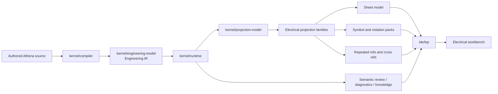

# Architecture Spine - Athena M11

## Design Paradigm

Athena M11 is a **canonical engineering entities with downstream electrical projection families, governed sheet and notation contracts, and dense operator workbench delivery** architecture.

- **canonical engineering entities** means electrical meaning continues to live in canonical `Engineering IR` and not in page structure, symbol instances, or renderer-local state.
- **downstream electrical projection families** means one engineering entity may project into schematic, cabinet, wiring, documentation, and related electrical workbench representations without creating parallel truths.
- **governed sheet and notation contracts** means sheet identity, symbol choice, labels, repeated references, and cross-reference behavior are explicit downstream contracts rather than ad hoc frontend or renderer behavior.
- **dense operator workbench delivery** means M11 is required to hold up under more realistic electrical-project density, not only toy graph proofs.

## Inherited Invariants

| Inherited | From parent | Binds here |
| --- | --- | --- |
| AD-13 | `architecture-Athena-2026-07-08-m5` | Repository and package contracts remain in `kernel/repository-model`. |
| AD-17 | `architecture-Athena-2026-07-08-m5` | The active repository remains one runtime-owned repository session per product window. |
| AD-18 | `architecture-Athena-2026-07-08-m5` | IDE work stays additive and product-operability scoped through existing seams. |
| AD-19 | `architecture-Athena-2026-07-09-m6` | Semantic SCM remains a dedicated VCS-neutral core above repository and package meaning. |
| AD-23 | `architecture-Athena-2026-07-09-m6` | Theia-hosted surfaces remain downstream bridges rather than semantic cores. |
| AD-25 | `architecture-Athena-2026-07-09-m6` | Domain-specific enrichments remain additive through hosted plugin contracts. |
| AD-27 | `architecture-Athena-2026-07-09-m7` | `kernel/projection-model` remains the dedicated renderer-neutral projection boundary. |
| AD-28 | `architecture-Athena-2026-07-09-m7` | Engineering identity remains in the object graph; view definitions and renderer assets stay downstream. |
| AD-29 | `architecture-Athena-2026-07-09-m7` | Layout and geometry remain view-scoped metadata, not engineering truth. |
| AD-30 | `architecture-Athena-2026-07-09-m7` | The graphical workbench continues to consume runtime-owned state through Athena-owned transport. |
| AD-34 | `architecture-Athena-2026-07-10-m8` | One mutation authority above source and graph remains binding. |
| AD-38 | `architecture-Athena-2026-07-10-m8` | Unified semantic review facts remain shared across interaction origins. |
| AD-39 | `architecture-Athena-2026-07-10-m8` | Cross-surface anchoring continues to use canonical semantic identity. |
| AD-43 | `architecture-Athena-2026-07-11-m9` | Knowledge derivation starts from canonical engineering state only. |
| AD-47 | `architecture-Athena-2026-07-11-m9` | Engineering sufficiency remains typed and separate from structural validation. |
| AD-49 | `architecture-Athena-2026-07-11-m9` | Existing semantic delivery surfaces remain the product path for new downstream meaning. |

## Invariants & Rules

### AD-53 - Electrical Workbench Depth Starts From Canonical Engineering Entities, Not Symbols

- **Binds:** `FR-1`, `FR-2`, `FR-4`, `FR-9`
- **Prevents:** page, symbol, or notation structures from becoming the hidden source of engineering truth
- **Rule:** Every M11 electrical workbench representation starts from canonical engineering entities already owned by `Engineering IR`. Symbol instances, page positions, labels, and documentation views are downstream projections only. No M11 feature may require symbol-local semantics or page-local semantics to define electrical truth.

### AD-54 - M11 Introduces Explicit Electrical Projection Families Above One Canonical Subject

- **Binds:** `FR-1`, `FR-2`
- **Prevents:** the electrical workbench from flattening every downstream view into one generic graph representation
- **Rule:** M11 defines explicit electrical projection families for at least schematic, cabinet, wiring, and documentation-oriented representations. The same canonical subject may appear in multiple families, but each family remains a downstream projection contract rather than a separate semantic model.

### AD-55 - Sheet Identity Is Projection-Owned And Separate From Engineering Identity

- **Binds:** `FR-3`, `FR-5`, `FR-9`
- **Prevents:** page structure from silently becoming the architecture center for electrical meaning
- **Rule:** M11 introduces a first explicit sheet or page model with stable sheet identity, ordering, and navigation semantics. Sheet identity is not engineering identity. Engineering entities may appear on one or more sheets, but sheets remain downstream containers and navigation surfaces rather than canonical truth holders.

### AD-56 - Symbol And Notation Packs Are Governed Downstream Contracts

- **Binds:** `FR-4`, `FR-5`, `FR-9`
- **Prevents:** symbol choice, label rules, or notation conventions from being hardcoded in renderer logic or UI-local data
- **Rule:** M11 introduces an explicit governed electrical symbol and notation boundary. Symbol selection, labels, markers, and similar notation behavior may vary by projection family or pack, but they must remain inspectable, extension-compatible, and downstream of canonical engineering meaning. The renderer may consume these packs, but it may not own them semantically.

### AD-57 - Repeated References And Cross References Anchor To Canonical Semantic Identity

- **Binds:** `FR-2`, `FR-5`, `FR-8`
- **Prevents:** repeated electrical representations from forking diagnostics, review context, or subject identity
- **Rule:** Any repeated reference, cross-reference, or alternate electrical representation must resolve through canonical semantic identity first. Repeated symbol instances are aliases of one engineering subject or its governed parts, not independent workbench-owned entities. Diagnostics, knowledge outputs, reveal, and review facts must remain compatible across those aliases.

### AD-58 - Dense Electrical Proof Cases Are A Required Architecture Contract

- **Binds:** `FR-6`, `FR-7`
- **Prevents:** M11 from claiming ECAD workbench depth while only validating narrow demo cases
- **Rule:** M11 must publish at least one realistic larger electrical proof repository or equivalent fixture that materially exceeds earlier proof density, including denser devices, denser connections, repeated structures, and heavier property or label load. This is not optional milestone polish; it is the architecture proof that the workbench depth actually holds under realistic electrical density.

### AD-59 - Workbench Density Remains Additive Through Existing Runtime And LSP Seams

- **Binds:** `FR-6`, `FR-7`, `FR-8`
- **Prevents:** electrical workbench depth from creating a second frontend-owned authority or side-channel state model
- **Rule:** Denser electrical workbench behavior must continue to route through existing runtime-owned projection sessions, Athena-owned `ide/lsp` delivery, and current workbench panels. M11 may add richer view models, panels, and interactions, but they remain additive consumers of governed runtime and projection state rather than private authorities.

### AD-60 - Electrical Workbench Depth Must Preserve Mutation, Review, And Knowledge Coherence

- **Binds:** `FR-2`, `FR-8`, `FR-9`
- **Prevents:** richer electrical representations from drifting away from the M8 mutation path or the M9 knowledge and review path
- **Rule:** All new electrical projection families, sheets, notation behavior, and repeated-reference patterns must remain coherent with:
  - the M8 mutation authority
  - the M6 semantic review path
  - the M9 knowledge diagnostics and impact path
  No M11 feature may require a separate mutation semantics model, a separate review vocabulary, or a separate knowledge path to operate.

### AD-61 - Product References Constrain UX And Workflow, Not Semantic Ownership

- **Binds:** `FR-1`, `FR-4`, `FR-6`, `FR-9`
- **Prevents:** QElectroTech or EPLAN workflow familiarity from dragging Athena back into legacy architecture assumptions
- **Rule:** QElectroTech and EPLAN may inform operator expectations, notation familiarity, project navigation, repeated-reference behavior, and workbench density. They do not define Athena’s semantic center. Compatibility, import/export, and migration strategies remain downstream concerns and may not weaken the canonical semantic-layer strategy.



## Consistency Conventions

| Concern | Convention |
| --- | --- |
| Naming (entities, files, interfaces, events) | Use `ElectricalProjectionFamily`, `SheetModel`, `NotationPack`, `CrossReference`, `RepeatedReference`, and `WorkbenchDensity` consistently. Avoid naming downstream contracts as if they were canonical engineering entities. |
| Data & formats (ids, dates, error shapes, envelopes) | Canonical engineering ids remain primary. Sheet ids, symbol ids, and repeated-reference ids are downstream aliases or containers. Diagnostics, knowledge outputs, and review facts must always be resolvable back to canonical subject identity. |
| State & cross-cutting (mutation, errors, logging, config, auth) | Runtime continues to own projection refresh, mutation coherence, and reveal anchors. Frontend state remains disposable. Denser workbench behavior may cache or organize downstream view data, but it may not privately redefine engineering state or repeated-reference meaning. |
| Build and dependency management | `kernel/engineering-model`, `kernel/projection-model`, `kernel/runtime`, and `ide/lsp` remain the semantic and delivery spine. Electrical sheet, notation, and repeated-reference depth may extend existing projection and frontend layers, but they must not force kernel semantics into renderer packages. |

## Stack

| Name | Version |
| --- | --- |
| Java | 25 |
| Kotlin | 2.4.0 |
| Gradle | 9.6.1 |
| Node.js | 22+ |
| Yarn | 1.22.22 |
| Eclipse Theia | 1.73.1 |

## Structural Seed

```mermaid
flowchart TB
  repo[Engineering Repository]
  source[Source editor]
  runtime[kernel/runtime]
  engineering[kernel/engineering-model]
  projection[kernel/projection-model]
  electrical[extensions/domain-electrical]
  sheets[Sheet model]
  notation[Notation packs]
  refs[Cross refs]
  lsp[ide/lsp]
  frontend[ide/theia-frontend]
  graph[integrations/graph-glsp]
  review[kernel/semantic-scm]

  repo --> source
  source --> lsp
  lsp --> runtime
  runtime --> engineering
  runtime --> projection
  projection --> electrical
  electrical --> sheets
  electrical --> notation
  electrical --> refs
  runtime --> review
  review --> lsp
  lsp --> frontend
  frontend --> graph
```

```text
Athena/
  kernel/
    engineering-model/          # canonical engineering truth
    projection-model/           # downstream projection contracts and family boundaries
    runtime/                    # projection session, mutation, reveal, and workbench coherence
    semantic-scm/               # diagnostics, review, history, and knowledge-aware consequence delivery
  extensions/
    domain-electrical/          # electrical view families, sheet/notation/reference contribution seams
  ide/
    lsp/                        # sole semantic/projection/workbench transport boundary
    theia-frontend/             # dense operator workbench presentation and interaction
  integrations/
    graph-glsp/                 # current downstream graph adapter
  examples/
    m11/                        # future dense electrical proof corpus
```

## Capability -> Architecture Map

| Capability / Area | Lives in | Governed by |
| --- | --- | --- |
| Richer electrical projection families | `kernel/projection-model`, `extensions/domain-electrical`, runtime projection orchestration | AD-53, AD-54 |
| First explicit sheet model | downstream projection and electrical contribution seams, workbench navigation | AD-55 |
| Symbol and notation boundary | governed electrical notation contracts plus renderer/workbench consumption | AD-56, AD-61 |
| Repeated references and cross references | projection/runtime/review anchoring through canonical ids | AD-57, AD-60 |
| Dense proof fixtures and scale validation | examples corpus plus runtime/LSP/workbench verification path | AD-58, AD-59 |
| Mutation, review, and knowledge coherence under ECAD depth | `kernel/runtime`, `kernel/semantic-scm`, `ide/lsp`, workbench panels | AD-59, AD-60 |

## Deferred

- Full EPLAN feature parity remains later than M11 and is not a success condition of this milestone.
- Procurement, article-master, ERP, and full report-automation depth remain later than M11.
- Full standards and compliance-platform breadth remain later than M11.
- Unrestricted freeform CAD drawing remains later than M11.
- Broad multi-domain drafting depth outside the first electrical ECAD target remains later than M11.
- Deeper compatibility adapters and import/export pipelines for incumbent electrical tools remain later than the first serious workbench-depth proof.
