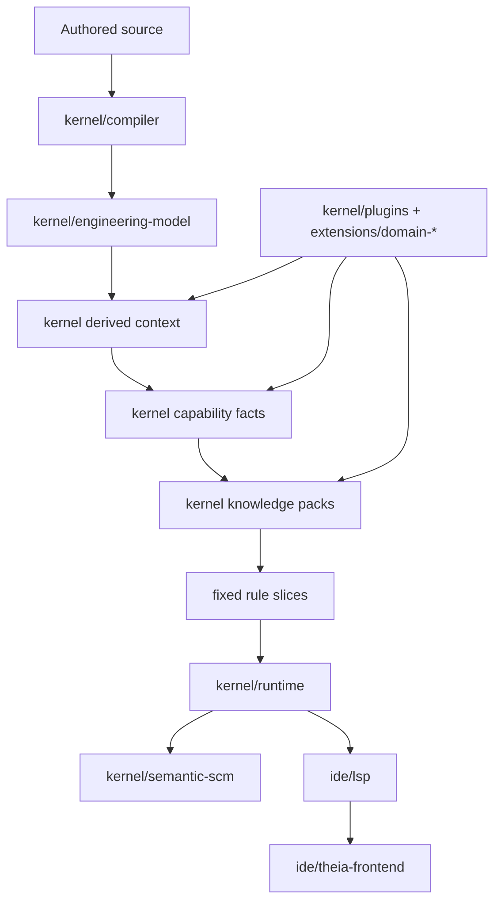

# Architecture Spine - Athena M9

## Design Paradigm

Athena M9 is a **kernel-owned engineering knowledge runtime with deterministic derived context, capability-fact semantics, governed knowledge packs, and downstream semantic delivery** architecture.

- **kernel-owned engineering knowledge runtime** means engineering capability, sufficiency, and impact are derived above canonical semantic state inside Athena-owned kernel and runtime seams rather than inside UI, renderer, or vendor adapters.
- **deterministic derived context** means the same canonical engineering state yields the same derived engineering context values with explicit traceability to authored semantic subjects.
- **capability-fact semantics** means Athena promotes selected derived context into inspectable engineering judgements rather than collapsing every computation into one generic "fact" layer.
- **governed knowledge packs** means M9 proves one fixed electrical pack cleanly instead of opening a broad expert-system, standards-platform, or end-user rule-authoring frontier.
- **downstream semantic delivery** means diagnostics, review, and inspection surfaces consume governed knowledge outputs through existing runtime and `ide/lsp` paths rather than defining a second knowledge vocabulary.

## Inherited Invariants

| Inherited | From parent | Binds here |
| --- | --- | --- |
| AD-13 | `architecture-Athena-2026-07-08-m5` | Repository and package contracts remain in `kernel/repository-model`. |
| AD-17 | `architecture-Athena-2026-07-08-m5` | The active repository remains one runtime-owned repository session per product window. |
| AD-18 | `architecture-Athena-2026-07-08-m5` | IDE work stays additive and product-operability scoped through existing seams. |
| AD-19 | `architecture-Athena-2026-07-09-m6` | Semantic SCM remains a dedicated VCS-neutral core above repository and package meaning. |
| AD-23 | `architecture-Athena-2026-07-09-m6` | Theia-hosted surfaces remain downstream bridges rather than semantic cores. |
| AD-25 | `architecture-Athena-2026-07-09-m6` | Domain-specific enrichments remain additive through hosted plugin contracts. |
| AD-27 | `architecture-Athena-2026-07-09-m7` | `kernel/projection-model` remains the dedicated renderer-neutral projection boundary. |
| AD-28 | `architecture-Athena-2026-07-09-m7` | Engineering identity remains in the object graph; view definitions and renderer assets stay downstream. |
| AD-29 | `architecture-Athena-2026-07-09-m7` | Layout and geometry remain view-scoped metadata, not engineering truth. |
| AD-30 | `architecture-Athena-2026-07-09-m7` | The graphical workbench continues to consume runtime-owned state through Athena-owned transport. |
| AD-34 | `architecture-Athena-2026-07-10-m8` | One mutation authority above source and graph remains binding. |
| AD-35 | `architecture-Athena-2026-07-10-m8` | Semantic mutation, projection mutation, and transient interaction remain explicit categories. |
| AD-38 | `architecture-Athena-2026-07-10-m8` | Unified semantic review facts remain shared across interaction origins. |
| AD-39 | `architecture-Athena-2026-07-10-m8` | Cross-surface anchoring continues to use canonical semantic identity. |
| AD-41 | `architecture-Athena-2026-07-10-m8` | Source and graph editing still converge before review and persistence. |

## Invariants & Rules

### AD-43 - M9 Knowledge Derivation Starts From Canonical Engineering State Only

- **Binds:** `FR-1`, `FR-2`, `FR-3`, `FR-5`
- **Prevents:** engineering knowledge from being inferred from renderer state, review text, vendor adapters, or ad hoc frontend metadata
- **Rule:** All M9 capability derivation, constraint evaluation, and impact consequence computation begins from canonical `Engineering IR` plus already-governed runtime context. No M9 rule may depend on graph coordinates, view-local renderer state, Theia widget state, or vendor-specific transport payloads as its source of engineering truth.

### AD-44 - Derived Engineering Context Is First-Class Kernel Output Above Raw Properties

- **Binds:** `FR-1`, `FR-2`
- **Prevents:** engineering values from remaining passive authored properties with no typed intermediate meaning
- **Rule:** M9 introduces explicit **Derived Engineering Context** as kernel output above canonical `Engineering IR`. Derived context values are not raw authored properties and are not yet capability judgements. Each derived context value must remain traceable to canonical semantic subjects and the authored inputs that produced it.

### AD-45 - Capability Facts Sit Above Derived Context As Engineering Judgements

- **Binds:** `FR-2`, `FR-3`
- **Prevents:** every intermediate computation from being mislabeled as a fact, or capability facts from collapsing into raw formulas
- **Rule:** M9 introduces explicit **Engineering Capability Facts** above derived engineering context. Capability facts are inspectable engineering judgements such as required protection current or relay sizing demand. They are not vendor parts and they are not interchangeable with raw calculations like full-load current or thermal load.

### AD-46 - The First Knowledge Proof Uses A Narrow Domain-Scoped Knowledge Pack

- **Binds:** `FR-2`, `FR-3`, `FR-4`
- **Prevents:** M9 from expanding into a broad standards platform, generic expert system, or uncontrolled multi-domain rule surface
- **Rule:** M9 proves one narrow electrical **Knowledge Pack** only. That pack may contribute derived-context formulas, capability-fact semantics, and a fixed rule slice for families such as motor-protection sufficiency, cable sufficiency, or relay compatibility, but it must stay small enough that correctness, inspectability, and architecture fit are reviewable. Broad standards-pack or multi-domain growth remains deferred.

### AD-47 - Constraint Evaluation Is Deterministic, Typed, And Separate From Structural Validation

- **Binds:** `FR-3`, `FR-4`
- **Prevents:** engineering sufficiency from being conflated with syntax or structural semantic validity, or becoming prose-only output
- **Rule:** Constraint evaluation produces typed engineering-sufficiency results over derived capability facts within the active knowledge-pack rule slice. These results remain deterministic for the same canonical state and are separate from parser errors, semantic reference errors, or renderer feedback. M9 outputs must distinguish structural validity from engineering sufficiency explicitly in the model and delivery path.

### AD-48 - Impact Consequences Are Computed Over Semantic Dependencies, Not Textual Diff Alone

- **Binds:** `FR-5`, `FR-6`
- **Prevents:** impact analysis from collapsing into raw changed-property listing or textual review summaries with no engineering consequence model
- **Rule:** M9 impact consequence computation must identify affected semantic subjects and rule evaluations from before/after canonical engineering state. Impact may reuse existing semantic diff inputs, but it must compute engineering consequence over semantic dependency, derived-context, and capability relationships rather than only listing directly changed authored fields.

### AD-49 - Existing Semantic Delivery Surfaces Remain The Product Path

- **Binds:** `FR-6`, `FR-7`, `FR-8`
- **Prevents:** M9 from widening into a new renderer, editor mode, or workbench-depth milestone just to display the first knowledge outputs
- **Rule:** The first M9 proof is delivered through existing runtime, `ide/lsp`, Problems, semantic inspection, semantic SCM, or other already-governed semantic surfaces. Supporting IDE work may improve clarity, but M9 may not require a new symbol palette, sheet workflow, or renderer-first UI path to prove engineering knowledge.

### AD-50 - Knowledge Outputs Reuse The Existing Review Vocabulary Instead Of Forking It

- **Binds:** `FR-4`, `FR-6`, `FR-7`
- **Prevents:** engineering diagnostics and impact from creating a second review or history authority outside the M6 and M8 semantic path
- **Rule:** Engineering sufficiency diagnostics and impact consequences must flow into the same downstream semantic review path already owned by runtime and `kernel/semantic-scm`. M9 may extend the vocabulary with new governed nouns, but it may not create a separate knowledge-review subsystem or IDE-only explanation path.

### AD-51 - Knowledge Runtime Remains Plugin-Extensible Through Governed Knowledge Packs

- **Binds:** `FR-2`, `FR-3`, `FR-8`
- **Prevents:** domain-specific knowledge growth from requiring kernel forks, while also preventing plugins from becoming ungoverned knowledge authorities
- **Rule:** M9 knowledge derivation and rule evaluation may be extended through governed plugin-hosted knowledge-pack contracts, but the kernel and runtime own the execution model, typed result shape, and delivery path. Plugins may contribute derived-context formulas, capability-fact semantics, or rule logic only through explicit hosted seams; they may not bypass typed capability, constraint, diagnostic, or impact contracts.

### AD-52 - Vendor Catalog And Standards Richness Stay Deferred Beyond The First Proof

- **Binds:** `FR-2`, `FR-8`
- **Prevents:** M9 from drifting into procurement modeling, catalog optimization, or deep compliance platforms before the first kernel proof is validated
- **Rule:** The first M9 architecture does not require vendor-part catalogs, procurement attributes, or broad standards databases. If a future knowledge pack needs richer external knowledge, it must be added after the first M9 proof succeeds and without weakening the kernel-owned context, fact, and rule model.

```mermaid
flowchart LR
  authored[Authored Athena source]
  compiler[kernel/compiler]
  ir[kernel/engineering-model\nEngineering IR]
  context[Derived Engineering Context]
  facts[Engineering Capability Facts]
  pack[Knowledge Pack]
  rules[Fixed Rule Slice]
  eval[Constraint Evaluation]
  impact[Impact Consequences]
  runtime[kernel/runtime]
  scm[kernel/semantic-scm]
  lsp[ide/lsp]
  ide[Problems / Inspection / Semantic SCM]

  authored --> compiler
  compiler --> ir
  ir --> context
  context --> facts
  pack --> rules
  facts --> rules
  rules --> eval
  eval --> impact
  eval --> runtime
  impact --> runtime
  runtime --> scm
  runtime --> lsp
  scm --> lsp
  lsp --> ide
```



## Consistency Conventions

| Concern | Convention |
| --- | --- |
| Naming (entities, files, interfaces, events) | Use `DerivedEngineeringContext`, `EngineeringCapabilityFact`, `KnowledgePack`, `ConstraintEvaluation`, `ImpactConsequence`, and `EngineeringSufficiencyDiagnostic` consistently. Avoid naming knowledge outputs after UI surfaces or vendor products. |
| Data & formats (ids, dates, error shapes, envelopes) | Derived context, capability facts, rule results, diagnostics, and impact consequences must preserve canonical semantic identities and typed severity or consequence categories. Delivery envelopes may extend current runtime/LSP payloads but must stay inspectable and deterministic. |
| State & cross-cutting (mutation, errors, logging, config, auth) | Runtime owns orchestration of derived context, capability-fact evaluation, rule execution, and delivery. Frontend remains a consumer only. Knowledge outputs must remain attributable to a specific canonical state and, when relevant, to a specific before/after comparison. |
| Build and dependency management | `kernel/engineering-model`, `kernel/runtime`, `kernel/semantic-scm`, and hosted plugin seams remain the core of M9. `ide/*` consumes the outputs. `integrations/*` and renderer stacks remain downstream and may not own engineering knowledge logic. |

## Stack

| Name | Version |
| --- | --- |
| Java | 25 |
| Kotlin | 2.4.0 |
| Gradle | 9.6.1 |
| Node.js | 22+ |
| Yarn | 1.22.22 |
| Eclipse Theia | 1.73.1 |

## Structural Seed



```text
Athena/
  kernel/
    engineering-model/          # canonical engineering truth
    runtime/                    # context, fact, rule, mutation, review, delivery orchestration
    semantic-scm/               # downstream review/history authority
    plugins/                    # hosted knowledge contribution seams
    compiler/                   # canonical IR derivation
  extensions/
    knowledge-*/                # governed knowledge-pack contributions
  ide/
    lsp/                        # sole IDE semantic and knowledge transport boundary
    theia-frontend/             # Problems, inspection, semantic SCM presentation
  integrations/
    graph-glsp/                 # still downstream; not a knowledge authority
  examples/
    m9/                         # future engineering-knowledge proof corpus
```

## Capability -> Architecture Map

| Capability / Area | Lives in | Governed by |
| --- | --- | --- |
| Derived engineering context | `kernel/engineering-model`, compiler-adjacent derivation, runtime-owned typed outputs | AD-43, AD-44 |
| Capability facts | runtime-owned typed engineering judgements above derived context | AD-45 |
| Fixed electrical knowledge pack and rule slice | kernel-owned knowledge-pack model plus hosted extension seams | AD-46, AD-51 |
| Deterministic constraint evaluation | `kernel/runtime` and governed typed evaluation outputs | AD-47 |
| Impact consequences for changed engineering meaning | runtime-owned before/after consequence evaluation | AD-48 |
| Diagnostics and review delivery | `kernel/runtime`, `kernel/semantic-scm`, `ide/lsp`, existing IDE surfaces | AD-49, AD-50 |
| Plugin-extensible knowledge growth | `kernel/plugins:*`, `extensions/knowledge-*` | AD-51 |

## Deferred

- QElectroTech- or EPLAN-class workbench depth remains later than M9.
- Broad notation, symbol-pack, and sheet-management concerns remain later than M9.
- Vendor catalog and procurement modeling remain later than the first M9 proof.
- Full standards and compliance packs remain later than the first M9 proof.
- AI-driven remediation, recommendation, or auto-design remains later than M9.
- Source apply or persist behavior beyond the M8 preview-first source path remains a later milestone concern.
