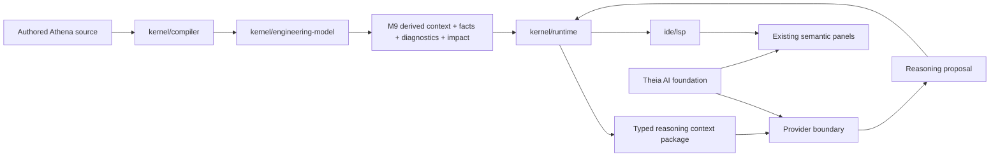
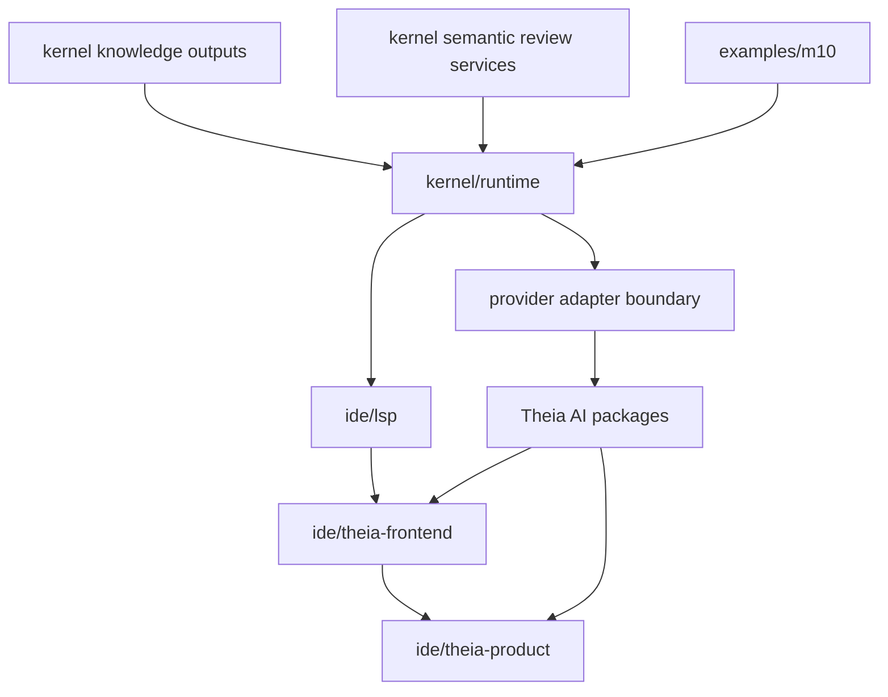

# Architecture Spine - Athena M10

## Design Paradigm

Athena M10 is an **Athena-owned deterministic reasoning contexts with provider-neutral AI assistance over governed engineering knowledge outputs** architecture.

- **Athena-owned deterministic reasoning contexts** means runtime assembles the exact AI input package from canonical semantic identities, derived engineering context, knowledge facts, diagnostics, impact consequences, and review facts.
- **provider-neutral AI assistance** means model transport, model selection, and provider credentials stay replaceable and downstream of Athena-owned reasoning contracts.
- **governed engineering knowledge outputs** means M10 sits above completed M9 knowledge runtime outputs instead of asking a model to infer engineering truth from raw source text or frontend state.

## Inherited Invariants

| Inherited | From parent | Binds here |
| --- | --- | --- |
| AD-18 | `architecture-Athena-2026-07-08-m5` | IDE work stays additive and product-operability scoped through existing seams. |
| AD-23 | `architecture-Athena-2026-07-09-m6` | Theia-hosted surfaces remain downstream bridges rather than semantic cores. |
| AD-25 | `architecture-Athena-2026-07-09-m6` | Domain-specific enrichments remain additive through hosted plugin contracts. |
| AD-34 | `architecture-Athena-2026-07-10-m8` | One mutation authority above source and graph remains binding. |
| AD-38 | `architecture-Athena-2026-07-10-m8` | Unified semantic review facts remain shared across interaction origins. |
| AD-39 | `architecture-Athena-2026-07-10-m8` | Cross-surface anchoring continues to use canonical semantic identity. |
| AD-43 | `architecture-Athena-2026-07-11-m9` | Knowledge derivation starts from canonical engineering state only. |
| AD-47 | `architecture-Athena-2026-07-11-m9` | Engineering sufficiency remains typed and separate from structural validation. |
| AD-49 | `architecture-Athena-2026-07-11-m9` | Existing semantic delivery surfaces remain the product path for new downstream meaning. |

## Invariants & Rules

### AD-50 - Runtime Owns Deterministic Reasoning Context Assembly

- **Binds:** `FR-1`, `FR-2`, `FR-3`, `FR-6`, `FR-9`
- **Prevents:** raw source prompts, frontend-owned prompt state, or provider adapters from becoming hidden semantic authorities
- **Rule:** Every M10 reasoning request starts from runtime-owned canonical semantic state and is assembled into one typed reasoning context package in JVM runtime code. That package may include canonical subject identities, derived engineering context, capability facts, constraint evaluations, diagnostics, impact consequences, and semantic review facts. The same request kind over the same semantic state must yield the same context package bytes and ordering.

### AD-51 - AI Output Is A Typed Reasoning Proposal, Never Canonical Truth

- **Binds:** `FR-2`, `FR-3`, `FR-4`, `FR-5`, `FR-6`, `FR-7`
- **Prevents:** assistant text from silently becoming a second diagnostic model, review model, or mutation authority
- **Rule:** M10 records every AI result as a typed reasoning proposal with explicit category, cited facts, provider status, response content, and decision state. Proposal states must include accepted, dismissed, unresolved, and unavailable. Accepted means accepted as review guidance only unless and until a separate existing mutation path is invoked. No provider response may directly mutate `Engineering IR`, review state, or source text inside M10.

### AD-52 - Theia AI And Provider Transports Stay Downstream Of Athena Contracts

- **Binds:** `FR-4`, `FR-7`, `FR-8`, `FR-9`
- **Prevents:** Theia AI packages or one vendor SDK from hardwiring Athena semantics, lifecycle, or audit requirements
- **Rule:** Athena may reuse Theia AI packages for generic provider registration, configuration, model selection, and additive assistant UI. Athena semantic products still travel only through `ide/lsp`, and provider integrations consume Athena-owned reasoning requests instead of inventing them. Product surfaces must extend current semantic inspection and semantic review seams before opening any broad chat-first shell redesign.



## Consistency Conventions

| Concern | Convention |
| --- | --- |
| Naming (entities, files, interfaces, events) | Prefer `ReasoningContext`, `ReasoningRequestCategory`, `ReasoningProposal`, `ReasoningEvidenceRef`, `ReasoningProviderResult`, and `ProposalDecisionState`. Avoid vague names like `PromptData`, `AssistantState`, or `ChatThing`. |
| Data & formats (ids, dates, error shapes, envelopes) | Reasoning proposal ids stay Athena-owned and stable. Evidence references always point back to canonical semantic ids, diagnostics, or review record ids. Provider metadata stays additive and transport-neutral. |
| State & cross-cutting (mutation, errors, logging, config, auth) | Runtime owns proposal lifecycle and audit snapshots. Frontend state is disposable. Provider failures surface as typed unavailable or failed outcomes, never synthetic semantic facts. |
| Build and dependency management | `kernel/runtime` owns context assembly and proposal lifecycle. `ide/lsp` remains sole IDE semantic transport. `ide/theia-product` and `ide/theia-frontend` may add Theia AI dependencies and UI only after runtime and LSP contracts exist. |

## Stack

| Name | Version |
| --- | --- |
| Java | 25 |
| Kotlin | 2.4.0 |
| Gradle | 9.6.1 |
| Node.js | 22+ |
| Yarn | 1.22.22 |
| Eclipse Theia | 1.73.1 |
| Theia AI packages | 1.73.1 |

## Structural Seed



```text
Athena/
  kernel/
    runtime/                    # reasoning context assembly, proposal lifecycle, provider-neutral contracts
    semantic-scm/               # existing review, commit, and history facts reused by M10
    compiler/                   # current source of canonical compilation and M9 outputs
  ide/
    lsp/                        # sole semantic and reasoning transport boundary
    theia-frontend/             # additive reasoning actions and panels
    theia-product/              # Theia AI package wiring and desktop shell configuration
  examples/
    m10/                        # proof corpus and mock-provider verification fixtures
```

## Capability -> Architecture Map

| Capability / Area | Lives in | Governed by |
| --- | --- | --- |
| Typed reasoning request, evidence, proposal, and decision contracts | `kernel/runtime` | AD-50, AD-51 |
| Deterministic reasoning context assembly from M9 outputs | `kernel/runtime` using existing compiler and review services | AD-50 |
| Provider-neutral invocation boundary and typed provider outcomes | `kernel/runtime` with downstream provider adapters | AD-50, AD-52 |
| Additive AI delivery in inspection and review surfaces | `ide/lsp`, `ide/theia-frontend`, `ide/theia-product` | AD-51, AD-52 |
| Theia AI package reuse for provider configuration and assistant chrome | `ide/theia-product`, `ide/theia-frontend` | AD-52 |
| Proof corpus and deterministic mock-provider verification | `examples/m10`, runtime and LSP tests | AD-50, AD-51 |

## Deferred

- Direct AI-authored source apply or graph apply remains later than M10.
- Broad chat-with-repository scope remains later than M10.
- Knowledge-pack ecosystem growth remains later than M10.
- Company policy and standards packs remain later than M10.
- Dense renderer scale and graph-workbench redesign remain outside M10 except for proof-fixture compatibility checks.
