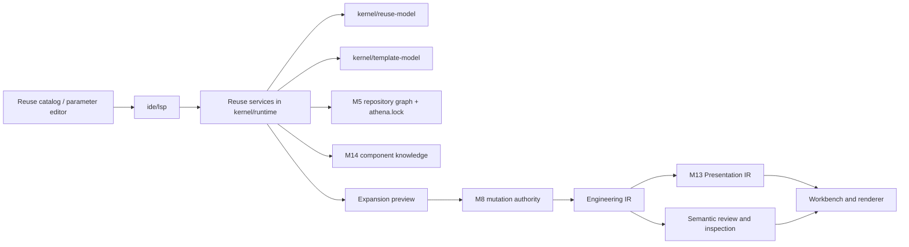

# Architecture Spine - Athena M16

## Design Paradigm

Athena M16 is a **package-governed semantic macro instantiation with preview-first expansion and traceable reusable origin** architecture.

- **package-governed semantic macro instantiation** means reusable assemblies are contributed and selected through the existing M5 repository and package graph rather than through a second package core or ad hoc runtime catalog.
- **preview-first expansion** means one configured Semantic Macro becomes a deterministic expansion preview before any accepted mutation reaches canonical state.
- **traceable reusable origin** means every accepted expansion preserves machine-readable origin and membership facts so later review, diff, replacement, and AI reasoning can stay grounded.

## Inherited Invariants

| Inherited | From parent | Binds here |
| --- | --- | --- |
| AD-13 | `architecture-Athena-2026-07-08-m5` | Repository and package contracts remain in `kernel/repository-model`. |
| AD-16 | `architecture-Athena-2026-07-08-m5` | `athena.lock` remains derived reproducibility state, not authored intent. |
| AD-17 | `architecture-Athena-2026-07-08-m5` | Runtime continues to own one active repository graph session per product window. |
| AD-18 | `architecture-Athena-2026-07-08-m5` | IDE work stays additive and product-operability scoped through existing seams. |
| AD-34 | `architecture-Athena-2026-07-10-m8` | One mutation authority above source and graph remains binding. |
| AD-38 | `architecture-Athena-2026-07-10-m8` | Unified semantic review facts remain shared across interaction origins. |
| AD-39 | `architecture-Athena-2026-07-10-m8` | Cross-surface anchoring continues to use canonical semantic identity. |
| AD-41 | `architecture-Athena-2026-07-10-m8` | Source and graph editing still converge before review and persistence. |
| AD-49 | `architecture-Athena-2026-07-11-m9` | Existing semantic delivery surfaces remain the product path. |
| AD-67 | `architecture-Athena-2026-07-12-m13` | `Presentation IR` remains a dedicated downstream layer. |
| AD-72 | `architecture-Athena-2026-07-12-m13` | Canonical semantic identity stays stronger than presentation occurrences. |
| AD-74 | `architecture-Athena-2026-07-12-m13` | Downstream packs remain extension-compatible assets. |
| AD-75 | `architecture-Athena-2026-07-13-m14` | Component knowledge resolution remains a dedicated layer above `Engineering IR` and below later consumers. |
| AD-77 | `architecture-Athena-2026-07-13-m14` | Engineering concepts remain vendor-neutral while vendor parts remain implementations. |
| AD-78 | `architecture-Athena-2026-07-13-m14` | Semantic ports remain first-class knowledge contracts. |
| AD-80 | `architecture-Athena-2026-07-13-m14` | Resolved component knowledge remains read-only and does not create a new mutation path. |
| AD-84 | `architecture-Athena-2026-07-13-m15` | Guided authoring remains above M8, not a frontend mutation shortcut. |
| AD-87 | `architecture-Athena-2026-07-13-m15` | One user intent may expand into multiple governed mutations. |
| AD-88 | `architecture-Athena-2026-07-13-m15` | Workbench surfaces stay consumers of shared platform services. |
| AD-90 | `architecture-Athena-2026-07-13-m15` | Cross-surface synchronization remains canonical-state-first. |
| AD-91 | `architecture-Athena-2026-07-13-m15` | Preview and approval reuse the review-first product direction. |
| AD-92 | `architecture-Athena-2026-07-13-m15` | Reveal remains canonical-identity-first across workbench surfaces. |

## Invariants & Rules

### AD-94 - M16 Introduces A Semantic Reuse Layer Above Package Governance And Above Guided Authoring

- **Binds:** `FR-1`, `FR-2`, `FR-11`
- **Prevents:** M16 from collapsing into package-manager work or into UI-local template behavior
- **Rule:** M16 introduces a dedicated semantic reuse layer whose job is to define reusable engineering assemblies, validate configured instantiations, preview expansion, and preserve origin traceability. This layer sits above the existing M5 repository and package graph, above M14 component knowledge, and above the M15 guided-authoring substrate. It does not redefine repository/package authority and it does not let frontend surfaces become reuse authority.

### AD-95 - Semantic Macro Definitions Resolve Through The Existing Package Graph

- **Binds:** `FR-1`, `FR-7`, `FR-11`
- **Prevents:** a second lockfile, ad hoc macro registry, or hidden runtime fetches from becoming practical truth
- **Rule:** Semantic Macro definitions and supporting template assets are resolved only from the active repository and package graph already governed by `athena.yaml` and `athena.lock`. Availability, versioning, and compatibility of reusable assemblies remain package-governed. M16 adds no second resolver and no separate package metadata authority for reuse.

### AD-96 - Semantic Macro Contracts Describe Engineering Assemblies, Not Graphics

- **Binds:** `FR-1`, `FR-2`, `FR-12`
- **Prevents:** SVG groups, copied symbols, or manual layout blocks from becoming canonical engineering meaning
- **Rule:** A Semantic Macro contract may define component templates, connection templates, parameter schema, default knowledge metadata, presentation hints, and documentation hints. It may not treat SVG, pixel layout, or copied graphics as the engineering source of truth. Presentation hints remain optional downstream inputs only.

### AD-97 - Parameter Validation And Expansion Preview Are Runtime-Owned Before Mutation Acceptance

- **Binds:** `FR-3`, `FR-4`, `FR-8`
- **Prevents:** parameter defaults, validation rules, or preview logic from fragmenting across workbench widgets
- **Rule:** Parameter normalization, required-value checks, default application, and preview assembly all remain runtime-owned reuse services. The workbench may edit parameter values and render validation messages, but it may not own the validation rules or preview logic. A Semantic Macro may not bypass preview because the resulting expansion always carries semantic consequences larger than one local widget edit.

### AD-98 - Expansion Preview Materializes Semantic Consequences, Not Opaque Generated Blobs

- **Binds:** `FR-4`, `FR-6`, `FR-8`
- **Prevents:** M16 previews from becoming uninspectable confirmations or hidden code generation
- **Rule:** The preview model must surface the semantic consequences of one configured instantiation in inspectable form: components, semantic ports, connections, origin anchors, and presentation-facing consequences where relevant. Preview remains deterministic for the same repository state, active packs, Semantic Macro identity, and parameter set.

### AD-99 - Accepted Expansion Commits As One Governed Mutation Bundle Through M8

- **Binds:** `FR-5`, `FR-6`
- **Prevents:** macro acceptance from writing source, graph, or review state directly from reuse services or frontend code
- **Rule:** Approving a Semantic Macro preview hands one governed mutation bundle to the existing M8 authority. The bundle may contain multiple low-level mutations, but acceptance is atomic at the user-intent level. Rejection discards the preview result without partially mutating canonical engineering state.

### AD-100 - Origin Traceability Is A First-Class Canonical Derivative Of Accepted Expansion

- **Binds:** `FR-2`, `FR-9`, `FR-10`
- **Prevents:** expanded structures from becoming indistinguishable copy-paste output
- **Rule:** Every accepted expansion records Semantic Macro identity, instantiation identity, applied parameter values, and membership mapping for expanded semantic subjects. Origin traceability must remain machine-readable and available to source, graph, inspection, and semantic SCM consumers. M16 does not need full replace or rebind workflows, but it must preserve the facts those workflows would later require.

### AD-101 - Reuse Catalog And Parameter Editors Stay Thin Consumers Of Shared Reuse Services

- **Binds:** `FR-7`, `FR-8`
- **Prevents:** Theia panels or graph tools from becoming a second reuse model
- **Rule:** The first M16 workbench proof may use a reuse catalog, parameter editor, preview surface, and origin inspector, but these surfaces only consume Athena-owned reuse services over existing transport seams. Catalog grouping, parameter forms, and preview rendering remain UI concerns. Semantic Macro identity, template shape, parameter semantics, and accepted expansion truth remain platform-owned.

### AD-102 - Presentation Hints And Documentation Hints Remain Downstream And Replaceable

- **Binds:** `FR-1`, `FR-4`, `FR-12`
- **Prevents:** presentation pack coupling from making one macro definition inseparable from one renderer or sheet style
- **Rule:** A Semantic Macro may carry optional presentation and documentation hints to improve preview readability and downstream rendering. Those hints are advisory inputs consumed after semantic expansion. They do not own canonical geometry, sheet layout, or renderer truth, and they may be ignored or replaced by downstream presentation families without changing the macro's semantic meaning.

### AD-103 - The First Proof Slice Stays Narrow, Electrical, And Repository-Scoped

- **Binds:** `FR-7`, `FR-12`
- **Prevents:** M16 from widening into marketplace breadth, federation, or broad macro-class parity before the contract is proven
- **Rule:** The first M16 proof stays inside one governed repository and one narrow electrical slice such as `DOL Starter`, `PLC Rack`, and `24V Distribution Unit`. It proves catalog selection, parameter editing, deterministic preview, accepted expansion, and traceable origin. Broad macro ecosystems, cross-company federation, unrestricted macro classes, and update/rebind lifecycle work remain deferred.

## Layer Responsibilities

### Reuse Catalog And Workbench Surfaces

Own:

- catalog browsing and grouping
- parameter input widgets
- preview presentation
- reveal affordances for origin and membership

Do not own:

- Semantic Macro truth
- parameter validation rules
- accepted expansion semantics

### Semantic Reuse Contracts

Own:

- Semantic Macro identity
- parameter schema
- template payload contracts
- expansion preview contracts
- origin traceability contracts

Do not own:

- package graph authority
- renderer-specific view state
- canonical persistence

### Reuse Runtime Services

Own:

- active macro catalog resolution over repository context
- parameter validation and normalization
- deterministic preview assembly
- accepted-expansion bundle preparation
- origin and membership inspection

Do not own:

- direct source persistence
- graph-local mutation
- component concept truth outside M14

### M8 Semantic Mutation Authority

Owns:

- the only authoritative write path
- acceptance and persistence of expansion bundles
- review, undo, redo, and audit coherence

Does not own:

- catalog presentation
- parameter-editing UX

### Engineering IR

Owns:

- canonical authored engineering structure
- stable identities
- source-backed semantic state after acceptance

Does not own:

- macro-definition assets
- preview staging state
- presentation occurrence truth

### M14 Component Knowledge

Owns:

- concept identity
- semantic ports
- minimal physical traits
- vendor implementation mapping

Consumes:

- active repository and package context

Supports:

- Semantic Macro template expansion
- preview consequence shaping

### Presentation / Review / Inspection Consumers

Consume:

- accepted expansion outputs
- origin traceability
- presentation hints where appropriate

Do not own:

- macro semantics
- acceptance rules

## New Platform Boundaries

### `kernel/reuse-model`

Purpose:

- define `SemanticMacroIdentity`
- define parameter schema and instantiation contracts
- define expansion preview and accepted-expansion contracts
- define origin and membership contracts

Examples:

- `SemanticMacroIdentity`
- `SemanticMacroParameter`
- `SemanticMacroInstantiation`
- `SemanticMacroExpansionPreview`
- `ExpansionOrigin`
- `ExpansionMembership`

### `kernel/template-model`

Purpose:

- define reusable component-template and connection-template contracts
- define template-scoped default metadata and optional downstream hints
- keep template composition separate from package contracts and renderer contracts

Boundary:

- no package resolution logic
- no source persistence logic
- no graphic truth

### `kernel/runtime` Reuse Services

Purpose:

- resolve active Semantic Macros from repository context
- validate configured instantiations
- produce deterministic previews
- hand accepted mutation bundles to M8
- expose origin inspection read models

Boundary:

- stay inside the existing runtime authority instead of inventing a second runtime stack
- consume `kernel/reuse-model`, `kernel/template-model`, M14 knowledge, and M5 repository state

## Reuse Pack Loading Model

The M16 first proof uses this loading strategy:

1. Repository graph resolves first through existing M5 rules.
2. Active packs expose component knowledge and reusable assembly definitions through approved extension seams.
3. Runtime builds one active Semantic Macro catalog for the session from that governed context.
4. User selection creates one configured instantiation candidate.
5. Runtime validates parameters and builds one deterministic preview.
6. Accepted preview becomes one M8 mutation bundle.
7. Canonical rebuild produces source, graph, review, and traceability outputs.

This means:

- repository and dependency authority remain package-governed
- macro availability is reproducible from the same repository state
- no separate macro lockfile becomes canonical truth

## Structural Flow



## Consistency Conventions

| Concern | Convention |
| --- | --- |
| Naming (entities, files, interfaces, events) | Prefer `SemanticMacro`, `SemanticMacroCatalogEntry`, `SemanticMacroInstantiation`, `SemanticMacroExpansionPreview`, `ExpansionOrigin`, `ExpansionMembership`, and `TemplateComponentRef`. Avoid names that imply package or graphics ownership such as `MacroPackageCore`, `SvgMacroTruth`, or `BlockPasteTemplate`. |
| Data & formats (ids, dates, error shapes, envelopes) | Semantic Macro ids remain package-governed identifiers, but distinct from package ids. Preview payloads always preserve canonical semantic identity where already known and explicit origin anchors for newly derived subjects. Validation and preview errors travel through Athena-owned transport and runtime contracts. |
| State & cross-cutting (mutation, errors, logging, config, auth) | Preview state is disposable runtime-derived state. Accepted expansion is canonical only after M8 commit. Frontend caches are projection state only. Origin traceability is durable derivative state attached to accepted expansion outputs, not widget-local memory. |
| Build and dependency management | `kernel/reuse-model` and `kernel/template-model` become JVM-first typed contract modules. `kernel/runtime`, `kernel/compiler`, M14 knowledge consumers, and `ide/lsp` consume them. Node and Theia code never redefine macro semantics. |

## Stack

| Name | Version |
| --- | --- |
| Java | 25 |
| Kotlin | 2.4.0 |
| Gradle | 9.6.1 |
| Node.js | 22+ |
| Yarn | 1.22.22 |
| Eclipse Theia | 1.73.1 |

## Structural Seed

```text
Athena/
  kernel/
    reuse-model/              # Semantic Macro identity, instantiation, preview, origin contracts
    template-model/           # reusable component and connection template contracts
    runtime/                  # session-owned reuse services and acceptance orchestration
    compiler/                 # deterministic package-governed loading support
    repository-model/         # existing repository and package contracts
    engineering-model/        # canonical authored engineering structure
    component-model/          # concept identity
    connection-model/         # semantic ports
    physical-model/           # minimal physical traits
    part-model/               # vendor implementations
    presentation-model/       # downstream presentation contracts
    semantic-scm/             # downstream review and history consumers
  extensions/
    domain-electrical/        # first reusable electrical assembly definitions
    vendors/
      siemens/                # first vendor-backed implementation defaults
  ide/
    lsp/                      # sole transport boundary for reuse catalog, preview, accept, inspect
    theia-frontend/           # reuse catalog, parameter editor, preview rendering
  examples/
    m16/                      # governed reuse proof repositories
```

## Capability -> Architecture Map

| Capability / Area | Lives in | Governed by |
| --- | --- | --- |
| Semantic Macro identity and instantiation contracts | `kernel/reuse-model` | AD-94, AD-96 |
| Template composition and reusable assembly payloads | `kernel/template-model` | AD-96 |
| Active macro catalog resolution | `kernel/runtime`, M5 repository state, extension packs | AD-95, AD-101 |
| Parameter validation and deterministic preview | `kernel/runtime`, `kernel/reuse-model`, `kernel/template-model` | AD-97, AD-98 |
| Accepted expansion bundle handoff | `kernel/runtime`, M8 mutation authority | AD-99 |
| Origin traceability and membership inspection | `kernel/reuse-model`, `kernel/runtime`, semantic SCM consumers | AD-100 |
| Reuse catalog and parameter editor surfaces | `ide/lsp`, `ide/theia-frontend` | AD-101 |
| Presentation and documentation hints consumption | `kernel/presentation-model`, downstream consumers | AD-102 |
| Narrow electrical proof packs | `extensions/domain-electrical`, vendor-backed defaults | AD-103 |

## Deferred

- full update, replace, and rebind lifecycle over prior expansions
- broad macro federation and marketplace distribution
- arbitrary graphic-block ingestion or symbol-library reuse
- unrestricted macro classes beyond the first electrical proof slice
- final auto-routing and final schematic generation
- rule-engine-heavy downstream automation beyond narrow preview validation

## Final Statement

M16 should prove:

> Athena can instantiate reusable engineering assemblies as package-governed Semantic Macros through deterministic preview-first expansion while preserving canonical source authority and explicit reusable origin.

If this milestone succeeds, Athena moves from single-component guided authoring to governed assembly-scale reuse without surrendering semantic authority to packages, graphics, or frontend state.
