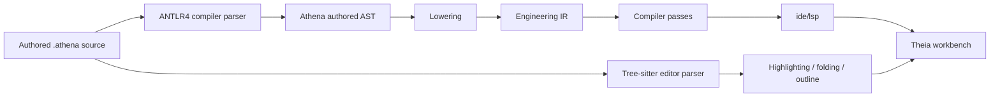

# Architecture Spine - Athena M17

## Design Paradigm

Athena M17 is a **dual-parser language substrate with compiler-owned authored AST and IDE-local incremental syntax parsing** architecture.

- **dual-parser language substrate** means Athena uses one compiler parser for semantic compilation and one editor parser for syntax UX, rather than forcing one parser implementation to own both jobs.
- **compiler-owned authored AST** means parser implementation details stop at the syntax layer and lowering continues to consume Athena-owned AST contracts rather than generated parse-tree types.
- **IDE-local incremental syntax parsing** means Tree-sitter improves editor responsiveness, tolerance, and syntax affordances without becoming canonical semantic truth.

## Inherited Invariants

| Inherited | From parent | Binds here |
| --- | --- | --- |
| AD-18 | `architecture-Athena-2026-07-08-m5` | IDE work stays additive and product-operability scoped through existing seams. |
| AD-34 | `architecture-Athena-2026-07-10-m8` | One mutation authority above source and graph remains binding. |
| AD-39 | `architecture-Athena-2026-07-10-m8` | Cross-surface anchoring continues to use canonical semantic identity. |
| AD-49 | `architecture-Athena-2026-07-11-m9` | Existing semantic delivery surfaces remain the product path. |
| AD-72 | `architecture-Athena-2026-07-12-m13` | Canonical semantic identity stays stronger than presentation occurrences. |
| AD-75 | `architecture-Athena-2026-07-13-m14` | Component knowledge resolution remains a dedicated layer above `Engineering IR` and below later consumers. |
| AD-80 | `architecture-Athena-2026-07-13-m14` | Resolved component knowledge remains read-only and does not create a new mutation path. |
| AD-82 | `architecture-Athena-2026-07-13-m14` | DSL remains canonical serialization, not the default human interface. |
| AD-88 | `architecture-Athena-2026-07-13-m15` | Workbench surfaces stay consumers of shared platform services. |
| AD-90 | `architecture-Athena-2026-07-13-m15` | Cross-surface synchronization remains canonical-state-first. |
| AD-95 | `architecture-Athena-2026-07-14-m16` | Governed package and repository context remain the source of package-level availability. |

## Invariants & Rules

### AD-104 - M17 Freezes One Language Architecture Before Language Breadth Expands

- **Binds:** `FR-1`, `FR-2`, `FR-9`
- **Prevents:** future syntax growth from accumulating on parser-specific shortcuts until migration becomes unsafe
- **Rule:** M17 is the milestone that freezes Athena's parser architecture, not Athena's final grammar. The language may continue to evolve after M17, but every future authored construct must land on the same architecture: compiler parser -> authored AST -> lowering -> `Engineering IR`, with a separate editor parser for syntax UX only.

### AD-105 - Compiler Parsing Uses ANTLR4 But Public Syntax Contracts Remain Athena-Owned

- **Binds:** `FR-1`, `FR-2`, `FR-3`
- **Prevents:** generated ANTLR classes from becoming public platform contracts
- **Rule:** M17 adopts `ANTLR4` as the compiler- and LSP-facing parser implementation. Generated lexer/parser artifacts are implementation detail. The public contracts consumed by compiler, runtime, IDE, and tests remain Athena-owned syntax models, parse results, spans, and diagnostics.

### AD-106 - Authored AST Remains The Only Lowering Input Before Engineering IR

- **Binds:** `FR-1`, `FR-4`
- **Prevents:** direct ANTLR parse-tree lowering, direct Tree-sitter lowering, or parser-library lock-in from becoming practical truth
- **Rule:** All canonical lowering into `Engineering IR` continues to consume authored AST only. Parse-tree-to-AST adaptation is isolated inside the syntax layer. `Engineering IR` may not depend on generated parser nodes, parser visitors, or editor CST nodes.

### AD-107 - Tree-sitter Owns Syntax UX Only

- **Binds:** `FR-2`, `FR-5`, `FR-6`
- **Prevents:** editor parsing from becoming a hidden second semantic compiler
- **Rule:** Tree-sitter is introduced only for syntax-oriented editor behavior such as highlighting, folding, outline-friendly structure, selection ranges, and bracket-aware navigation. Tree-sitter outputs may not own semantic diagnostics, canonical resolution, package meaning, or engineering truth.

### AD-108 - LSP Semantic Diagnostics Stay On The Compiler Parser Path

- **Binds:** `FR-3`, `FR-6`, `FR-7`, `FR-8`
- **Prevents:** Theia frontend or client parser state from becoming the source of semantic diagnostics
- **Rule:** `ide/lsp` remains the sole semantic entry point for IDE language meaning. Syntax and semantic diagnostics exposed through LSP continue to derive from compiler-owned parsing and later compiler/runtime stages. Tree-sitter may improve client syntax UX, but not semantic authority.

### AD-109 - Parser Migration Must Preserve Provenance And Failure Quality

- **Binds:** `FR-3`, `FR-8`
- **Prevents:** parser replacement from discarding line/column/span quality or weakening failure inspectability
- **Rule:** Parser migration must preserve inspectable source spans, file identity, and syntax diagnostics strongly enough for compiler, LSP, source edits, reveal, and downstream inspection workflows. Invalid source should fail as typed compiler diagnostics, not as opaque parser crashes or lost-position messages.

### AD-110 - The First M17 Proof Stays Parity-First On The Current Supported Syntax Subset

- **Binds:** `FR-3`, `FR-5`, `FR-10`
- **Prevents:** M17 from widening into a simultaneous parser migration and broad language-expansion milestone
- **Rule:** The first M17 proof uses the currently supported authored syntax subset as the parity target: `system`, `device`, `port`, `connect`, qualified names, string literals, and property assignments. M17 may prepare future constructs such as `import`, but it does not need to ship their final semantics in order to prove the parser foundation.

### AD-111 - Future Syntax Growth Lands Through AST Extensibility, Not Ad Hoc Grammar Patches

- **Binds:** `FR-1`, `FR-9`
- **Prevents:** future imports, macro-use forms, or package-aware declarations from being bolted directly into lowering or IDE adapters
- **Rule:** M17 must leave a deliberate landing zone for future authored constructs. That means AST contracts remain extensible, parser adaptation remains isolated, and lowering remains organized around authored semantic categories rather than parser token sequences.

### AD-112 - IDE Integration Remains Additive To The Existing Product Path

- **Binds:** `FR-5`, `FR-6`, `FR-7`
- **Prevents:** M17 from dissolving into unsupported Theia framework experiments or product-local parser forks
- **Rule:** Tree-sitter integration must enter through existing `ide/theia-frontend` and `ide/lsp` seams. Any Athena-owned grammar package or adapter remains subordinate to the current product structure. M17 does not justify direct kernel imports into frontend code or unsupported widget-layout hacks as parser strategy.

### AD-113 - Repository-Backed Proof Inputs Remain Stronger Than Inline-Only Parser Demos

- **Binds:** `FR-3`, `FR-10`
- **Prevents:** M17 from closing on synthetic grammar demos that do not reflect real Athena source usage
- **Rule:** M17 verification should include real checked-in proof inputs and, where practical, repository-backed examples that pass through the same compiler and IDE seams as product code. Narrow malformed and incomplete proof files should complement, not replace, real source fixtures.

## Layer Responsibilities

### Authored Source

Owns:

- user-authored `.athena` text
- current and future language surface
- file-backed provenance anchor

Does not own:

- canonical engineering meaning by itself
- editor-specific caches
- parser implementation detail

### Compiler Parser

Owns:

- authoritative compiler tokenization and parsing
- parse-tree construction inside compiler parsing
- compiler-facing syntax diagnostics before AST adaptation

Does not own:

- `Engineering IR`
- IDE syntax UX
- public semantic contracts outside Athena syntax models

### Authored AST

Owns:

- Athena-owned syntax contracts
- parse result contracts
- source spans and syntax diagnostics
- the stable seam consumed by lowering

Does not own:

- package resolution semantics
- runtime mutation behavior
- editor-specific CST behavior

### Lowering And Compiler Pipeline

Own:

- authored-AST-to-`Engineering IR` lowering
- existing named pass pipeline
- later validation, knowledge, and downstream derivation

Do not own:

- parser implementation internals
- client-side syntax UX

### Editor Parser

Owns:

- incremental syntax tree updates
- syntax-UX-friendly tolerance on incomplete text
- query-driven highlighting and structural editor affordances

Does not own:

- semantic compilation
- canonical diagnostics truth
- lowering or `Engineering IR`

### IDE / LSP / Workbench

Own:

- product-shell transport and presentation
- syntax UX composition
- semantic request routing through `ide/lsp`

Do not own:

- semantic compiler truth
- authored AST truth beyond transported results
- parser-specific semantic meaning

## New Platform Boundaries

### `kernel/language`

Purpose:

- remain Athena's public syntax boundary
- define authored AST contracts
- define syntax diagnostics and parse results
- expose a parser facade independent of parser generator internals

Boundary:

- downstream code depends on Athena syntax contracts, not generated parser classes
- lowering continues to target this boundary only

### `kernel/language` Compiler Parsing Internals

Purpose:

- host `ANTLR4` grammar and generated compiler parser artifacts
- adapt parse trees into Athena-authored AST
- preserve provenance and diagnostics

Boundary:

- parser-generation detail remains internal
- generated artifacts do not become architecture nouns outside the syntax layer

### `ide` Tree-sitter Grammar / Adapter

Purpose:

- host Athena's Tree-sitter grammar
- publish syntax queries for highlighting and related editor affordances
- bridge Tree-sitter output into supported Theia syntax UX

Boundary:

- no semantic compilation
- no `Engineering IR` derivation
- no direct replacement of LSP semantic authority

## Structural Flow



## Consistency Conventions

| Concern | Convention |
| --- | --- |
| Naming (entities, files, interfaces, events) | Prefer `CompilerParser`, `EditorParser`, `AuthoredAst`, `ParseResult`, `SyntaxDiagnostic`, `SourceSpan`, `ParseAdapter`, and `TreeSitterQuery` as architecture nouns. Avoid names that imply parser-library truth such as `AntlrSemanticModel`, `TreeSitterTruth`, or `GeneratedParseIr`. |
| Data & formats (ids, dates, error shapes, envelopes) | Parser outputs exposed outside implementation detail always travel as Athena-owned AST and diagnostic contracts. Line, column, and span data remain explicit and inspectable. |
| State & cross-cutting (mutation, errors, logging, config, auth) | Parser state is disposable and recomputable. Canonical engineering meaning still begins at `Engineering IR`. Client parser caches are UX aids only. Compiler parse failures remain typed and provenance-rich. |
| Build and dependency management | `kernel/language` remains the JVM syntax boundary. `ide/lsp` consumes compiler-facing parse outcomes through existing seams. Tree-sitter grammar and queries live under `ide` ownership or an Athena-owned IDE-facing package, not inside compiler or runtime modules. |

## Stack

| Name | Version |
| --- | --- |
| Java | 25 |
| Kotlin | 2.4.0 |
| Gradle | 9.6.1 |
| Node.js | 22+ |
| Yarn | 1.22.22 |
| Eclipse Theia | 1.73.1 |
| ANTLR4 | milestone-selected compiler parser |
| Tree-sitter | milestone-selected IDE parser |

## Structural Seed

```text
Athena/
  kernel/
    language/                    # public authored AST, parse facade, diagnostics, parser adaptation
    compiler/                    # lowering and named compiler pass pipeline
    runtime/                     # downstream runtime consumers of compiler outputs
    engineering-model/           # canonical Engineering IR
    repository-model/            # repository and package governance
  ide/
    lsp/                         # sole semantic entry point for IDE language meaning
    theia-frontend/              # syntax UX integration and editor presentation
    tree-sitter-athena/          # evaluated grammar/query package or equivalent owned adapter
  examples/
    m17/                         # parser parity and invalid/incomplete proof corpus
```

## Capability -> Architecture Map

| Capability / Area | Lives in | Governed by |
| --- | --- | --- |
| Compiler parser implementation | `kernel/language` internals | AD-104, AD-105 |
| Authored AST contracts and parse facade | `kernel/language` | AD-105, AD-106 |
| Lowering into canonical engineering meaning | `kernel/compiler`, `kernel/engineering-model` | AD-106 |
| Semantic diagnostics and IDE semantic authority | `ide/lsp`, compiler path | AD-108, AD-109 |
| Incremental syntax UX parsing | Tree-sitter grammar/adapter under `ide/*` | AD-107, AD-112 |
| Future syntax landing zone | AST contracts plus parser adaptation boundary | AD-104, AD-111 |
| Parser parity and malformed-source proof corpus | `examples/m17`, parser and IDE tests | AD-110, AD-113 |

## Deferred

- final `import` semantics and package-aware authored behavior
- full macro-use language syntax
- full expression system
- full compiler incremental semantic parsing redesign
- broad IDE semantic-feature redesign beyond syntax UX
- any architecture that makes Tree-sitter or generated parse trees canonical truth

## Final Statement

M17 should prove:

> Athena can grow its authored language on a durable parser architecture by using ANTLR4 for compiler parsing, Tree-sitter for IDE syntax UX, and a preserved authored AST boundary before lowering to Engineering IR.

If this milestone succeeds, Athena stops treating future language growth as a parser-risk problem and starts treating it as normal governed evolution above a stable architecture.
