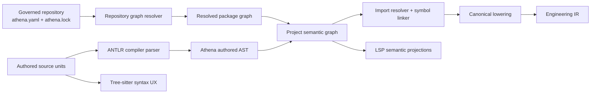
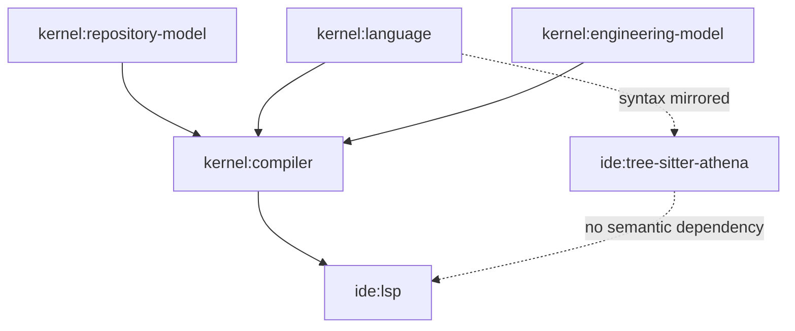
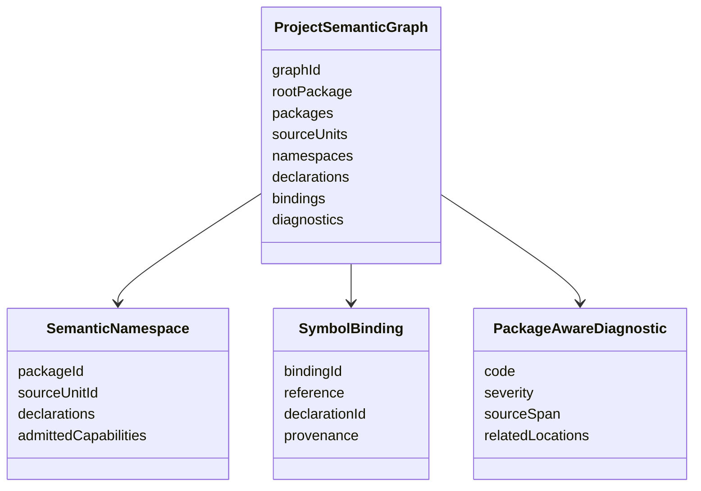

# Architecture Spine - Athena M18

## Design Paradigm

M18 uses a compiler-owned semantic workspace pipeline.

Authored package-aware meaning flows through the compiler parser, authored AST, governed repository graph, project semantic graph, symbol linker, and canonical lowering. LSP and IDE behavior consume projections of that compiler-owned semantic workspace. Tree-sitter mirrors syntax only.



## Invariants & Rules

### AD-1 - Compiler-Owned Semantic Workspace

- **Binds:** FR-3, FR-5, FR-7, NFR-1, NFR-3
- **Prevents:** Independent implementation of imports as syntax includes, frontend state, or filesystem lookup.
- **Rule:** M18 must introduce a compiler-owned project semantic graph that joins resolved package graph state, source-unit availability, authored AST package/import intent, symbol bindings, diagnostics, and provenance before lowering to `Engineering IR`.

### AD-2 - Parser Boundary Remains Split

- **Binds:** FR-1, FR-9, NFR-5
- **Prevents:** Generated ANTLR types or Tree-sitter CST nodes becoming Athena semantic contracts.
- **Rule:** Package and import declarations parse through the ANTLR compiler path and adapt into Athena-owned authored AST contracts. Tree-sitter may only mirror package/import syntax for highlighting, folding, outline, and recovery-oriented syntax UX.

### AD-3 - Governed Repository Graph Is The Only Import Authority

- **Binds:** FR-3, FR-4, FR-5, NFR-2, NFR-3
- **Prevents:** Raw path traversal, JVM classpath coincidence, or IDE heuristics resolving authored imports.
- **Rule:** Import resolution must accept only packages and source units admitted by Athena governed repository state: `athena.yaml`, `athena.lock`, deterministic resolution input, resolved package graph, and compiler-visible source-unit availability.

### AD-4 - Narrow Syntax Slice

- **Binds:** FR-1, FR-2, FR-11
- **Prevents:** M18 becoming a broad authored-language redesign.
- **Rule:** The first syntax slice is package declaration plus package import plus symbol-target import. Alias support is deferred unless needed to disambiguate proof fixtures. Export/visibility systems and unrelated declaration families are outside M18.

### AD-5 - Declaration-Level Linking Proof

- **Binds:** FR-5, FR-6, FR-7
- **Prevents:** A project graph that records dependencies but never proves semantic binding.
- **Rule:** M18 must link at least one authored declaration reference across source-unit or package boundaries and carry the binding into canonical lowering without AST paste or hidden include expansion.

### AD-6 - Stable Semantic Namespace Identity

- **Binds:** FR-5, FR-6, FR-8, NFR-4
- **Prevents:** Navigation and diagnostics depending on display names, parser offsets, or transient runtime objects.
- **Rule:** Imported semantic namespaces must preserve package id, source unit id, declaration id, source span, binding provenance, and admitted capability provenance strongly enough for diagnostics, go-to-definition, references, and later governed consumers.

### AD-7 - Typed Package-Aware Diagnostics

- **Binds:** FR-4, FR-8, NFR-4
- **Prevents:** Import failures surfacing as generic parse errors, frontend warnings, or opaque exceptions.
- **Rule:** Missing package, missing source unit, missing symbol, invalid availability, ambiguous binding, and graph-invalid or cycle cases must surface as Athena-owned typed compiler diagnostics with stable codes and source/span provenance, then project through LSP.

### AD-8 - LSP Projects Compiler Semantics

- **Binds:** FR-8, NFR-5
- **Prevents:** IDE package-awareness becoming a second semantic implementation.
- **Rule:** LSP diagnostics, definition, references, and symbol behavior must read compiler-owned semantic workspace snapshots or indexes derived from them. Frontend code may request and render these results but may not resolve imports or symbols itself.

### AD-9 - Deterministic Ordering And Explainability

- **Binds:** FR-3, FR-7, FR-10, NFR-3
- **Prevents:** Non-repeatable linking, diagnostics, or proof outputs when repository state is unchanged.
- **Rule:** Project semantic graph construction, namespace availability, symbol candidates, diagnostics, and lowering inputs must use deterministic package keys, source-unit keys, and sorted output order. The compiler must expose enough graph explanation for tests and review to inspect package dependencies, source availability, and symbol bindings.

### AD-10 - Executable Proof Corpus Owns Closeout

- **Binds:** FR-10, FR-11
- **Prevents:** Closing M18 on prose claims or isolated unit tests only.
- **Rule:** `examples/m18/` must contain governed repository-backed fixtures for single-package success, cross-package success, invalid import, unresolved symbol, graph-invalid or cycle behavior, and vendor/governed package availability. Compiler, LSP, and Tree-sitter tests must execute against those fixtures or equivalent mirrored test data.

### AD-11 - No New Operational Envelope

- **Binds:** all
- **Prevents:** M18 drifting into deployment, registry, marketplace, multi-root session, or package-manager redesign work.
- **Rule:** M18 runs inside the existing local Gradle/JVM repository and workbench/LSP environment. It introduces no remote service, cloud registry, publish transport, deployment topology, or multi-root workspace authority.

### AD-12 - Project Semantic Graph Contract

- **Binds:** FR-3, FR-4, FR-5, FR-6, FR-7, FR-8
- **Prevents:** Compiler, LSP, and tests each inventing incompatible graph payloads or partial semantic indexes.
- **Rule:** The project semantic graph contract must expose one compiler-owned immutable snapshot containing `graphId`, `rootPackageId`, ordered `packages`, ordered `sourceUnits`, ordered `namespaces`, ordered `declarations`, ordered `bindings`, and ordered `diagnostics`. LSP navigation indexes, lowering inputs, and explanation/test payloads must derive from this snapshot rather than from separate rescans.

### AD-13 - Canonical Identity Algorithms

- **Binds:** FR-3, FR-5, FR-7, FR-8, NFR-3, NFR-4
- **Prevents:** Package graph, symbol linking, diagnostics, and navigation joining different ids for the same semantic subject.
- **Rule:** M18 must define and reuse canonical builders for package keys, source unit ids, declaration ids, namespace ids, binding ids, and graph ids. Package keys follow existing governed package identity normalization. Source unit ids are package-key plus normalized source-root-relative path. Declaration ids are source-unit id plus declaration kind plus qualified authored name within the M18 proof slice. Binding ids are source-unit id plus reference span plus resolved declaration id. Graph ids are deterministic hashes or stable renderings of the resolved package graph plus ordered source-unit content identities.

### AD-14 - LSP Snapshot Projection Contract

- **Binds:** FR-4, FR-8
- **Prevents:** LSP package-aware diagnostics, definition, references, and symbols being computed from document-local state while compiler lowering uses another semantic graph.
- **Rule:** LSP must hold or request a project semantic graph snapshot version for package-aware behavior. Diagnostics, definition, references, document symbols, and any workspace symbols in M18 must report the snapshot `graphId` they came from internally and must use declaration/binding/provenance records from that snapshot.

### AD-15 - Semantic Namespace Capability Proof

- **Binds:** FR-6, FR-10, SM-7
- **Prevents:** Imported namespaces being proven only as code references while the PRD requires engineering capability preservation.
- **Rule:** M18 closeout must include at least one proof that an imported namespace preserves admitted governed capability provenance. The minimum accepted proof is a package import whose namespace records a governed package capability marker, such as component-knowledge availability, and carries that marker through compiler explanation or diagnostics without requiring all downstream consumers to execute it.

## Consistency Conventions

| Concern | Convention |
| --- | --- |
| Package identity | Use existing `PackageIdentifier` style identity and deterministic package keys from governed repository resolution. Do not introduce a parallel package id vocabulary. |
| Source unit identity | Source units are compiler-owned authored source inputs keyed relative to admitted package/source roots, not arbitrary filesystem paths. |
| Symbol identity | Symbol bindings use semantic namespace identity: package id, source unit id, declaration id, and provenance. |
| Snapshot identity | Project semantic graph snapshots carry one deterministic `graphId`; LSP and lowering must refer to the same snapshot identity when explaining package-aware behavior. |
| Diagnostics | Diagnostic codes use Athena-owned stable strings grouped by package/import/linking concern. LSP only transports them. |
| Ordering | Sort packages, source units, symbol candidates, diagnostics, and proof outputs by stable keys before publication. |
| Mutation | M18 semantic graph construction is read/analysis oriented. It does not create a new mutation path or bypass M8 authority. |
| File organization | Small related Kotlin support types may share cohesive `*Models.kt`, `*Protocol.kt`, `*Mapper.kt`, or `*Support.kt` files; split files when distinct roles grow past the local readability threshold. |

## Stack

| Name | Version |
| --- | --- |
| Java toolchain | 25 |
| Gradle wrapper | 9.6.1 |
| Kotlin | 2.4.0 |
| ANTLR | 4.13.2 |
| LSP4J | 0.23.1 |
| Tree-sitter CLI | >=0.26.1 |
| web-tree-sitter | ^0.26.0 |

## Structural Seed

```text
kernel/
  repository-model/       # governed repository, package, manifest, lock contracts
  language/               # ANTLR grammar, parser adapter, authored AST contracts
  compiler/               # repository graph resolution, project semantic graph, import resolution, linking, lowering
  engineering-model/      # canonical Engineering IR contracts
ide/
  lsp/                    # compiler-backed package-aware diagnostics and navigation projections
  tree-sitter-athena/     # syntax UX grammar and queries only
examples/
  m18/                    # governed proof corpus for package-aware imports and linking
```





## Capability To Architecture Map

| Capability / Area | Lives in | Governed by |
| --- | --- | --- |
| FR-1 package/import parsing | `kernel/language`, `kernel/compiler` AST adaptation | AD-2, AD-4 |
| FR-2 narrow syntax proof | `kernel/language`, `ide/tree-sitter-athena`, proof fixtures | AD-4 |
| FR-3 project semantic graph | `kernel/compiler` | AD-1, AD-3, AD-9 |
| FR-4 package-aware diagnostics | `kernel/compiler`, `ide/lsp` | AD-7, AD-8, AD-12, AD-14 |
| FR-5 cross-boundary symbol linking | `kernel/compiler` | AD-5, AD-6, AD-12, AD-13 |
| FR-6 engineering capability namespace | `kernel/compiler`, existing governed model seams | AD-6, AD-12, AD-15 |
| FR-7 deterministic lowering | `kernel/compiler`, `kernel/engineering-model` | AD-1, AD-5, AD-9, AD-12, AD-13 |
| FR-8 LSP semantic behavior | `ide/lsp` | AD-8, AD-12, AD-14 |
| FR-9 Tree-sitter syntax mirroring | `ide/tree-sitter-athena` | AD-2 |
| FR-10 proof corpus | `examples/m18`, compiler/LSP/Tree-sitter tests | AD-10 |
| FR-11 growth safety | milestone docs, story boundaries | AD-4, AD-10, AD-11 |

## Deferred

| Decision | Deferred Until |
| --- | --- |
| Alias import support | Add only if M18 implementation finds unavoidable ambiguity in proof fixtures. |
| Full export/visibility model | Later package-aware language milestone after declaration-level linking is proven. |
| Rich workspace symbol search beyond snapshot-derived document/workspace symbol projection | Later IDE milestone unless M18 closeout explicitly promotes richer search. |
| Remote registry, publish, marketplace, or cloud package resolution | Later ecosystem milestone, not M18. |
| Multi-root sessions or package-local manifest redesign | Later repository/workspace milestone. |
| Broad authored declaration families | Later language milestones built on this semantic graph. |
| Deep downstream capability execution across every governed consumer | Later milestones; M18 must prove capability provenance is preserved but does not need every consumer to execute imported meaning. |

## Open Questions

1. Is LSP workspace symbol behavior required for M18 closeout, or can M18 close on diagnostics, definition, references, and document symbols?
