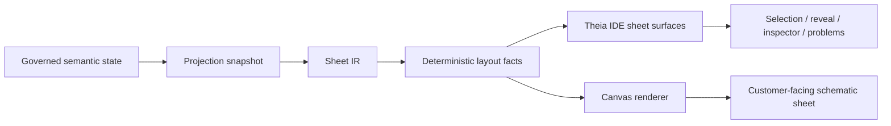
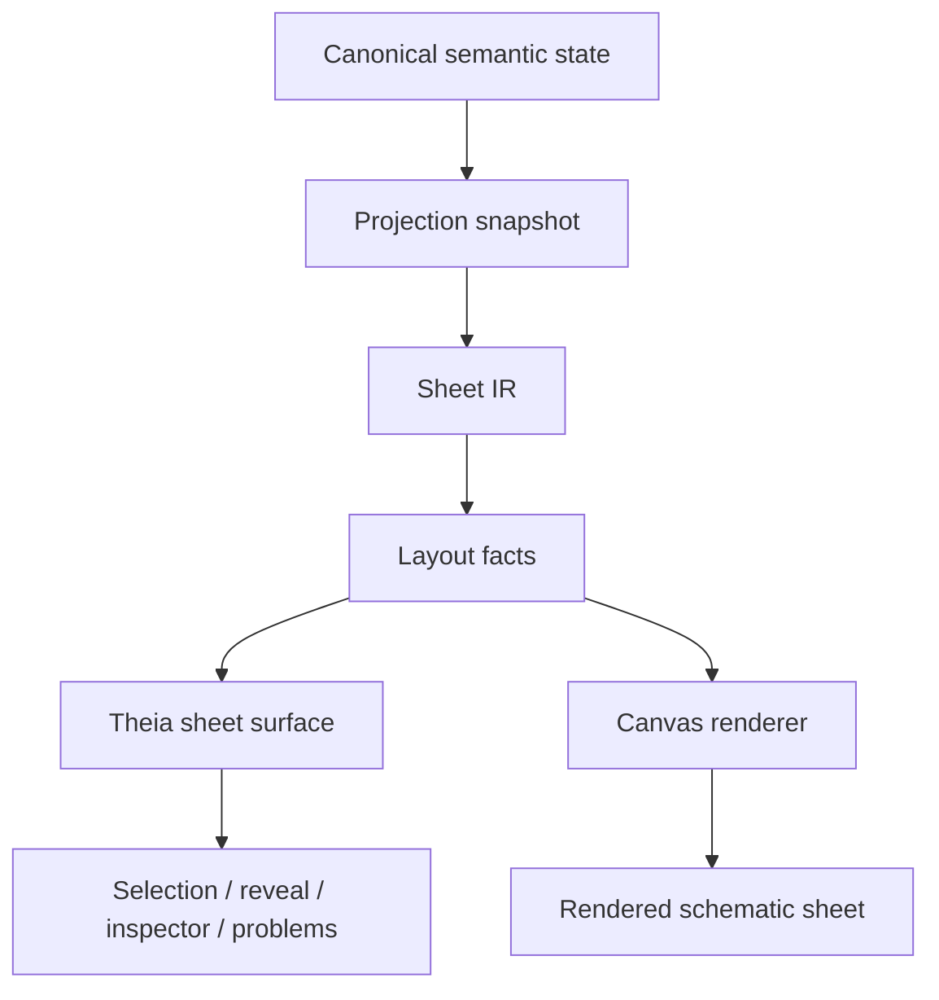

# Architecture Spine - Athena M19

## Design Paradigm

M19 uses a semantic sheet projection pipeline.

Governed semantic authority stays upstream in Athena. The milestone turns that authority into
deterministic sheet IR, layout facts, and identity snapshots. Theia and the renderer then consume
those projections. They may paint, inspect, reveal, and synchronize, but they may not reconstruct
engineering meaning from the canvas.



## Invariants & Rules

### AD-1 - Semantic Authority Stays Upstream

- **Binds:** FR-1, FR-2, FR-3, FR-5, FR-6, FR-7
- **Prevents:** frontend-owned meaning, renderer inference, or DOM state becoming the source of truth.
- **Rule:** All M19 sheet and navigation behavior must consume compiler/runtime-owned semantic
  snapshots. Theia and the renderer may consume projection results, but they may not resolve
  engineering meaning on their own.

### AD-2 - Schematic Sheet Is The Primary Workflow

- **Binds:** FR-1, FR-2, FR-6
- **Prevents:** M19 collapsing into a renderer-only milestone or a generic canvas demo.
- **Rule:** The first customer-visible M19 proof is a credible schematic sheet with page frame, grid,
  title block, labels, terminals, conductor routes, and cross-reference markers derived from the
  projection model.

### AD-3 - Layout Facts Are Deterministic

- **Binds:** FR-3, FR-6
- **Prevents:** ad hoc placement, renderer guesswork, or layout drift between runs.
- **Rule:** The same governed input state must produce the same sheet identity, occurrence ids, page
  bounds, and placement facts. Layout is a projection output, not a renderer decision.

### AD-4 - Canonical Identity Drives IDE Coherence

- **Binds:** FR-5
- **Prevents:** selection drift between source, inspector, diagnostics, and rendered subjects.
- **Rule:** source navigation, inspector state, Problems, and rendered selection must all round-trip
  through the same canonical subject and occurrence identities.

### AD-5 - Cabinet Preview Is Deferred

- **Binds:** FR-4, FR-7
- **Prevents:** cabinet work from becoming a second milestone, a hidden parallel story track, or a
  second semantic model inside M19.
- **Rule:** Cabinet preview is not part of the M19 MVP. Any later cabinet preview must be a read-only
  secondary view that reuses the same semantic, projection, sheet, and identity contracts.

### AD-6 - Proof Corpus Is Small And Governed

- **Binds:** FR-6
- **Prevents:** hand-wavy demos, oversized fixture sets, or unrepeatable validation.
- **Rule:** M19 must ship a small governed proof corpus with executable tests covering sheet
  rendering, selection/reveal coherence, and deterministic layout from local fixtures.

### AD-7 - M19 Excludes Ecosystem Expansion

- **Binds:** FR-7
- **Prevents:** scope drift into repository, registry, or language-platform work.
- **Rule:** Full EPLAN parity, full IEC library breadth, public repository/import ecosystem work, and
  frontend-owned semantic resolution stay out of M19.

### AD-8 - Existing Athena/Theia Boundary Remains Intact

- **Binds:** FR-1, FR-2, FR-3, FR-4, FR-5, FR-6, FR-7
- **Prevents:** new operational envelopes or shell replacement work sneaking into the milestone.
- **Rule:** M19 must live inside the existing Athena IDE/runtime stack and extend the current product
  shell rather than replace it or introduce a new remote service tier.

### AD-9 - Sheet IR Owns Publication Semantics

- **Binds:** FR-1, FR-2, FR-3, FR-4, FR-6
- **Prevents:** page size, frame, zones, title block, revision metadata, and view composition from
  collapsing into renderer-local state or ad hoc canvas chrome.
- **Rule:** M19 must model a sheet IR between projection and rendering. The sheet IR owns the
  publication semantics of a schematic sheet; layout facts may place content within it, but may not
  define the sheet itself.

## Consistency Conventions

| Concern | Convention |
| --- | --- |
| Naming | View families use stable lower-hyphen names such as `schematic-sheet` and `cabinet-preview`; ids use canonical subject, occurrence, and snapshot ids. |
| Data & formats | Projection snapshots are immutable, ordered, and replayable. Diagnostics and reveal payloads carry the same canonical ids and source spans used by projection. |
| State & cross-cutting | Mutation authority stays upstream. Sheet surfaces, reveal, and diagnostics are read-only projections of the same semantic snapshot. |

## Stack

| Name            | Version  |
| --------------- | -------- |
| Java toolchain  | 25       |
| Gradle wrapper  | 9.6.1    |
| Kotlin          | 2.4.0    |
| ANTLR           | 4.13.2   |
| LSP4J           | 0.23.1   |
| Tree-sitter CLI | >=0.26.1 |
| web-tree-sitter | ^0.26.0  |

## Structural Seed

```text
kernel/
  projection/        # semantic snapshots, view families, layout facts
  sheet-model/       # sheet IR, page identity, publication metadata, and view composition
  model/             # canonical subject, occurrence, and identity contracts
ide/
  workbench/         # Theia sheet surface, inspector, reveal, and Problems coherence
renderer/
  canvas/            # paint-only rendering of projected sheet facts
examples/
  m19/               # governed proof corpus and fixture data
```



## Capability To Architecture Map

| Capability / Area | Lives in | Governed by |
| --- | --- | --- |
| FR-1 project canonical semantics into a schematic sheet | `kernel/projection`, `kernel/sheet-model`, `ide/workbench`, `renderer/canvas` | AD-1, AD-2, AD-9 |
| FR-2 render schematic symbols, labels, and connections | `renderer/canvas`, `kernel/projection`, `kernel/sheet-model` | AD-1, AD-2, AD-3, AD-9 |
| FR-3 produce deterministic layout facts | `kernel/projection`, `kernel/sheet-model` | AD-3, AD-9 |
| FR-4 defer cabinet preview from M19 | milestone docs and story boundaries | AD-5, AD-7 |
| FR-5 keep selection and reveal synchronized | `ide/workbench`, canonical identity contracts | AD-4 |
| FR-6 publish a small customer-facing proof corpus | `examples/m19`, tests | AD-6 |
| FR-7 keep M19 bounded | milestone docs, reviews, and story boundaries | AD-5, AD-7, AD-8 |

## Deferred

| Decision | Deferred Until |
| --- | --- |
| Full EPLAN UI parity | A later milestone that is explicitly about complete authoring depth, not the M19 schematic proof. |
| Full IEC symbol library ingestion | A later library-program milestone after M19 proves the small governed subset. |
| Public Maven/npm-style repository or import ecosystem | A later ecosystem milestone, not the M19 customer-facing workflow. |
| Frontend-owned semantic resolution | Never in M19; the downstream shell must stay projection-only. |
| Cabinet preview, cabinet authoring, and physical-layout optimization | A later milestone after the schematic sheet foundation is proven. |
| Final diagram protocol and layout stack selection | A dedicated tech-selector discussion that can choose between the current adapter path and a GLSP/Sprotty/ELK-backed path. |
| New operational envelope or remote service tier | Not owned by M19. The milestone stays inside the existing Athena IDE/runtime boundary. |
| Broad authored-language redesign | A separate language milestone if one is needed. |
