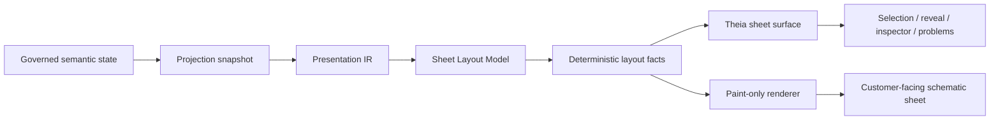

# Architecture Spine - Athena M20

## Design Paradigm

M20 uses a governed sheet presentation pipeline.

Semantic authority stays upstream in Athena. M20 keeps the canonical projection contracts from M19
and improves the visible sheet experience by refining sheet composition, engineering drawing rules,
viewport choreography, and render-time presentation. Theia and the renderer may improve readability
and selection visibility, but they may not invent semantic meaning or mutate the governing sheet
model.



## Invariants & Rules

### AD-1 - Semantic Authority Stays Upstream

- **Binds:** FR-1, FR-2, FR-3, FR-4, FR-5, FR-6
- **Prevents:** frontend-owned meaning or renderer-local inference from changing what the sheet is.
- **Rule:** M20 presentation changes must consume governed projection and sheet-model data only.

### AD-2 - Sheet Composition Is A Governed Contract

- **Binds:** FR-1, FR-2
- **Prevents:** the sheet becoming a loose collection of canvas decorations.
- **Rule:** Frame, title block, zones, views, occurrences, and representation families must stay
  explicit in the composition model.

### AD-3 - Sheet Layout Model Sits Between Presentation And Rendering

- **Binds:** FR-3, FR-4
- **Prevents:** renderer-local guessing and ad hoc placement logic.
- **Rule:** Layout facts are produced from Presentation IR and sheet composition before rendering.

### AD-4 - Engineering Drawing Rules Are Deterministic

- **Binds:** FR-3, FR-4
- **Prevents:** ad hoc spacing, routing drift, and inconsistent density handling.
- **Rule:** Placement, grouping, spacing, routing lanes, and label avoidance must be stable for the
  same governed input.

### AD-5 - Canonical Identity Drives IDE Coherence

- **Binds:** FR-5, FR-6
- **Prevents:** selection drift between source, inspector, Problems, and rendered subjects.
- **Rule:** source navigation, inspector state, Problems, and rendered selection must all round-trip
  through the same canonical subject and occurrence identities.

### AD-6 - Theia Remains The Frontend Boundary

- **Binds:** FR-1, FR-2, FR-3, FR-4, FR-5, FR-6
- **Prevents:** desktop-viewer, shell replacement, or remote-service drift.
- **Rule:** M20 lives inside the existing Athena/Theia frontend boundary.

### AD-7 - Proof Corpus Is Small And Governed

- **Binds:** FR-7
- **Prevents:** hand-wavy demos or oversized fixture sets.
- **Rule:** M20 must ship a small executable proof corpus that covers layout acceptability and
  interaction stability.

### AD-8 - M20 Excludes Ecosystem Expansion

- **Binds:** FR-8
- **Prevents:** scope drift into repository, registry, or language-platform work.
- **Rule:** Full EPLAN parity, full IEC library breadth, public repository/import ecosystem work, and
  frontend-owned semantic resolution stay out of M20.

### AD-9 - No New Stack Decision In M20

- **Binds:** FR-8
- **Prevents:** protocol/layout-stack churn from hiding inside a presentation milestone.
- **Rule:** M20 does not choose a new diagram protocol or layout engine.

### AD-10 - Layout Intelligence Remains Deferred

- **Binds:** FR-3, FR-4, FR-8
- **Prevents:** ELK-style optimization or auto-routing from becoming an M20 requirement.
- **Rule:** M20 may define the layout contract, but layout intelligence and optimization stay for a
  later milestone.

## Consistency Conventions

| Concern | Convention |
| --- | --- |
| Naming | View families use stable lower-hyphen names such as `schematic-sheet`; ids use canonical subject, occurrence, and snapshot ids. |
| Data & formats | Projection snapshots are immutable, ordered, and replayable. Diagnostics and reveal payloads carry the same canonical ids and source spans used by projection. |
| State & cross-cutting | Mutation authority stays upstream. Sheet surfaces, reveal, and diagnostics are read-only projections of the same semantic snapshot. |

## Stack

| Name | Version |
| --- | --- |
| Theia frontend | existing Athena workspace package |
| Graph projection seam | existing Athena adapter path |
| Renderer | existing sheet rendering path |

## Structural Seed

```text
kernel/
  projection/        # semantic snapshots, view families, layout facts
  sheet-model/       # sheet IR, page identity, publication metadata, and view composition
  sheet-layout-model/ # governed layout contract, drawing rules, and layout facts
  model/             # canonical subject, occurrence, and identity contracts
ide/
  workbench/         # Theia sheet surface, viewport choreography, selection coherence
renderer/
  canvas/            # paint-only rendering of projected sheet facts
examples/
  m20/               # layout acceptance proof corpus and fixture data
```

## Capability To Architecture Map

| Capability / Area | Lives in | Governed by |
| --- | --- | --- |
| Sheet composition and representation families | `kernel/sheet-model` | AD-1, AD-2 |
| Deterministic sheet layout model | `kernel/sheet-layout-model` | AD-3, AD-4 |
| Layout readability and density | `ide/workbench`, `renderer/canvas` | AD-1, AD-3, AD-4 |
| Viewport fit and zoom choreography | `ide/workbench` | AD-5, AD-6 |
| Source / Problems / sheet coherence | `ide/workbench`, `kernel/projection` | AD-1, AD-5 |
| Proof corpus and visual acceptance | `examples/m20`, tests | AD-7 |
| Boundary discipline | milestone docs and stories | AD-6, AD-8, AD-9, AD-10 |

## Deferred

| Decision | Deferred Until |
| --- | --- |
| Cabinet preview authoring | A later milestone that explicitly owns cabinet workflows. |
| Public repository/import ecosystem work | A later ecosystem milestone. |
| Full IEC library breadth | A later library milestone. |
| New diagram protocol or layout engine | A later tech-selector decision. |
| Layout intelligence, constraint solving, and auto-routing | A later milestone that explicitly owns presentation optimization. |
| Desktop viewer scope | Not owned by M20. |
| Broad authored-language redesign | A separate language milestone if needed. |
