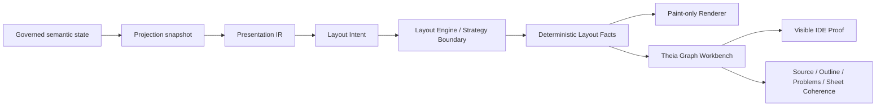
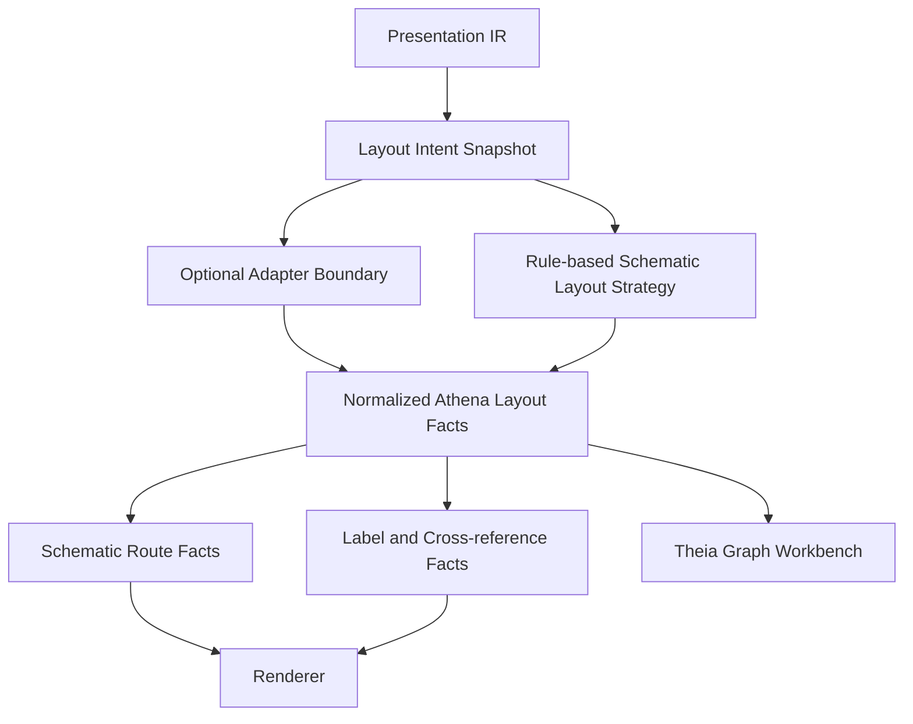

# Architecture Spine - Athena M21

## Design Paradigm

M21 uses a governed layout intelligence pipeline.

Semantic authority remains upstream. M21 adds an explainable layout-intent and layout-engine layer
between Presentation IR and solved layout facts. Theia, the renderer, and any layout helper may
consume or assist, but they may not become the owner of engineering meaning, layout authority, or
sheet-local truth.



## Inherited Invariants

| Parent | Invariant |
| --- | --- |
| M20 AD-1 | Semantic authority stays upstream; downstream surfaces consume governed projection outputs only. |
| M20 AD-5 | Canonical identity drives source, inspector, Problems, and rendered selection coherence. |
| M20 AD-6 | Theia remains the frontend boundary; no desktop-viewer or shell replacement scope. |
| M20 AD-7 | Proof corpus is small, governed, and executable. |
| M20 AD-8 | Repository/import ecosystem, full IEC breadth, and frontend-owned semantic resolution stay out of scope. |
| M20 accepted UI | Stage grid is the canvas coordinate surface; sheet/component bodies do not hide it. |
| M20 accepted UI | `Cabinet Main` information lives in the top information popover only. |
| M20 accepted UI | Top and bottom controls are transparent canvas overlays. |
| M20 accepted UI | Outline navigation keeps the same `.athena` editor tab. |

## Invariants & Rules

### AD-1 - Semantic Authority Remains Upstream

- **Binds:** FR-3, FR-4, FR-5, FR-6, FR-7, FR-8, FR-9, FR-10, FR-11
- **Prevents:** layout, renderer, adapter, or Theia code becoming a second source of engineering
  meaning.
- **Rule:** M21 layout intelligence consumes governed semantic, projection, presentation, and sheet
  facts. It may derive layout intent and layout facts, but it may not redefine canonical semantics.

### AD-2 - Layout Intent Is A First-Class Contract

- **Binds:** FR-3, FR-5, FR-6, FR-8
- **Prevents:** collapsing engineering layout decisions into opaque coordinates.
- **Rule:** M21 must model layout intent before solved layout facts. Intent carries explainable
  engineering placement meaning such as role, preferred zone, priority, alignment, and relationship
  constraints.

### AD-3 - Layout Engine Is A Strategy Boundary

- **Binds:** FR-3, FR-4, FR-5, FR-7, FR-8
- **Prevents:** hard-wiring a single algorithm or external helper into the architecture.
- **Rule:** A layout engine or strategy transforms layout intent and rules into deterministic layout
  facts. Rule-based logic, adapters, and future AI-assisted engines must all pass through the same
  strategy boundary.

### AD-4 - Layout Facts Are The Renderer Contract

- **Binds:** FR-3, FR-4, FR-7, FR-8, FR-10
- **Prevents:** renderer-local placement, route, or label inference.
- **Rule:** The renderer consumes deterministic layout facts for placement, schematic route segments,
  label placement, and cross-reference placement. The renderer paints; it does not solve engineering
  layout.

### AD-5 - Adapters Are Subordinate Helpers

- **Binds:** FR-4
- **Prevents:** ELK or another layout helper becoming architecture, authority, or renderer truth.
- **Rule:** Adapter output must be normalized into Athena layout facts. Engineering role, grouping,
  ordering, and schematic purpose remain governed by Athena layout intent and rules.

### AD-6 - Routing Is Schematic Topology Only

- **Binds:** FR-7, FR-11
- **Prevents:** M21 expanding into cabinet, harness, cable tray, 3D installation, or physical wire
  optimization.
- **Rule:** M21 route facts describe sheet-level schematic conductor topology between governed
  schematic endpoints only.

### AD-7 - Engineering Readability Beats Generic Graph Neatness

- **Binds:** FR-5, FR-7, FR-8
- **Prevents:** optimizing for visually tidy graphs that ignore electrical-engineering reading order.
- **Rule:** Layout intent and facts must make power source, protection, controller, terminals, and
  primary load path identifiable in the acceptance sheet.

### AD-8 - Canonical Identity Survives Layout Intelligence

- **Binds:** FR-6, FR-8, FR-9
- **Prevents:** layout refinement breaking source, outline, Problems, selection, or reveal behavior.
- **Rule:** Layout intent, layout facts, route facts, and label facts carry canonical subject,
  occurrence, snapshot, and source-span identities needed for existing IDE coherence.

### AD-9 - Visible IDE Proof Is A Gate

- **Binds:** FR-1, FR-2, FR-9, FR-10
- **Prevents:** repeating the M20 failure mode where internal scripts were mistaken for customer
  proof.
- **Rule:** M21 is not complete without an openable `examples/m21/sample-project` and graph
  workbench proof that exercises the accepted IDE surface.

### AD-10 - Accepted M20 Canvas Behavior Carries Forward

- **Binds:** FR-2, FR-9, FR-10
- **Prevents:** layout-intelligence work regressing the accepted graph workbench UX.
- **Rule:** M21 must preserve the stage grid as coordinate surface, transparent canvas overlays,
  popover-only `Cabinet Main` information, and same-tab `.athena` outline navigation.

### AD-11 - M21 Excludes Ecosystem And Authoring Expansion

- **Binds:** FR-11
- **Prevents:** scope drift into repository/import, IEC breadth, cabinet authoring, full EPLAN parity,
  or uncontrolled drag-save drawing behavior.
- **Rule:** M21 stories may improve schematic layout intelligence only. Public registry, broad
  library ingestion, cabinet authoring, physical routing, full EPLAN parity, AI layout, and
  sheet-local drag-save truth stay deferred.

## Consistency Conventions

| Concern | Convention |
| --- | --- |
| Naming | Layout view families use stable lower-hyphen names such as `schematic-sheet`; layout strategy names describe authority, such as `rule-based-schematic`. |
| Identity | Layout intent, layout facts, route facts, and label facts carry canonical subject ids, occurrence ids, snapshot ids, and source spans where applicable. |
| Data shape | Layout snapshots are immutable, ordered, replayable, and derived from governed projection/presentation inputs. |
| Routing | M21 route facts are schematic route facts only; physical route terminology is not used in M21 contracts. |
| Proof | IDE proof uses the M21 sample project and graph workbench evidence; model-only tests are supporting checks, not acceptance by themselves. |

## Stack

| Name | Version / Boundary |
| --- | --- |
| Theia frontend | existing Athena Theia product shell |
| Presentation IR | existing M13/M20 downstream presentation contracts |
| Sheet model | existing M19/M20 sheet publication contracts |
| Layout strategy | M21-owned strategy boundary; no final external stack decision |
| Renderer | existing paint-only graph/sheet rendering path |

## Structural Seed

```text
kernel/
  layout-model/       # LayoutIntent, LayoutConstraint, LayoutFact, LayoutSnapshot
  layout-engine/      # rule-based schematic strategy and adapter boundary
  routing-model/      # RouteIntent, schematic RouteSegment, schematic RouteFact
  sheet-model/        # sheet publication semantics from M19/M20
  presentation-model/ # Presentation IR from M13/M20
  projection/         # governed projection snapshots and identities
ide/
  theia-frontend/     # graph workbench consumes layout snapshots and proves IDE behavior
renderer/
  canvas/             # paint-only rendering of projected layout facts
examples/
  m21/
    sample-project/   # openable IDE proof with real .athena files
```



## Capability To Architecture Map

| Capability / Area | Lives in | Governed by |
| --- | --- | --- |
| Openable M21 sample project and visible proof | `examples/m21`, `ide/theia-frontend`, tests | AD-9, AD-10 |
| Layout intent contracts | `kernel/layout-model` | AD-1, AD-2, AD-8 |
| Layout strategy / engine boundary | `kernel/layout-engine` | AD-3, AD-5 |
| Deterministic layout facts | `kernel/layout-model`, runtime projection delivery | AD-3, AD-4, AD-8 |
| Semantic grouping and placement | `kernel/layout-model`, `kernel/layout-engine` | AD-2, AD-7 |
| Schematic conductor routing | `kernel/routing-model`, `kernel/layout-engine` | AD-6, AD-8 |
| Label and cross-reference readability | `kernel/layout-model`, `kernel/routing-model` | AD-4, AD-7, AD-8 |
| Source / outline / Problems / sheet coherence | `ide/theia-frontend`, existing LSP/runtime seams | AD-8, AD-10 |
| Boundary discipline | milestone docs, tests, stories | AD-5, AD-6, AD-11 |

## Deferred

| Decision | Deferred Until |
| --- | --- |
| Final ELK or external layout-stack selection | A later technology-selection milestone after the Athena strategy boundary is proven. |
| AI-assisted layout or optimization | A later milestone that can consume M21 layout intent as substrate. |
| Cabinet routing and physical wire paths | A cabinet/physical-layout milestone, not M21. |
| Harness, cable tray, or 3D installation routing | A physical routing milestone. |
| Public repository/import ecosystem work | A later ecosystem milestone. |
| Full IEC/QElectroTech library ingestion | A later library milestone. |
| Full EPLAN parity or manual drawing editor parity | A later product-depth milestone. |
| User drag-save as sheet-local truth | Deferred unless routed through governed mutation authority. |
| Desktop viewer scope | Not owned by M21. |

## Open Questions

| Question | Revisit Condition |
| --- | --- |
| Which M20 fixture is the formal M21 baseline comparison? | Before creating M21 epics and stories. |
| Which screenshot/E2E framework should prove the Theia graph workbench? | Before first implementation story closes. |
| Should M21 include an adapter spike behind the strategy boundary? | During architecture review; default is no final stack decision. |
