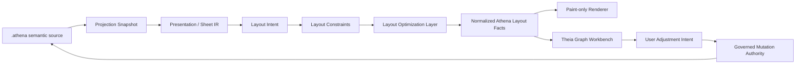
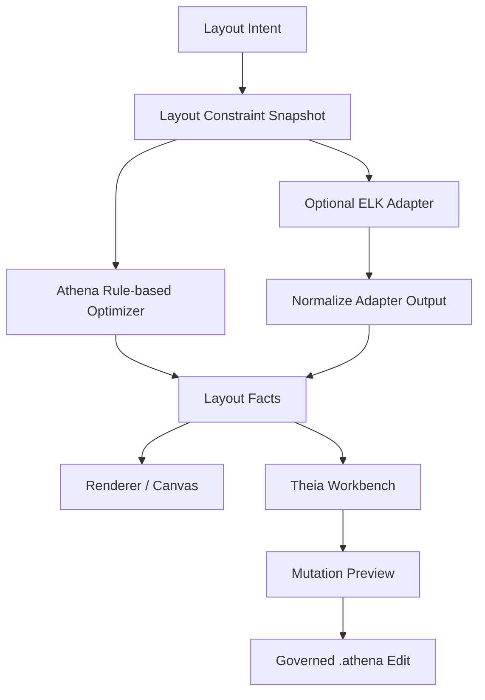
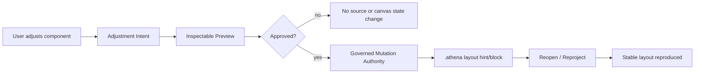

# Architecture Spine - Athena M22

## Design Paradigm

M22 uses a governed layout optimization round-trip.

Athena keeps engineering meaning upstream, inserts a small Layout Constraint Model between layout
intent and solved layout facts, and then allows a governed optimization layer to improve placement,
grouping, basic routing, and label readability. Theia and the renderer remain consumers. ELK may be
evaluated only as an optional helper behind Athena's layout contracts. User-approved layout
adjustments round-trip through governed mutation authority into `.athena` intent; the canvas never
becomes the hidden store of layout truth.



## Inherited Invariants

| Inherited | From parent | Binds here |
| --- | --- | --- |
| M21 AD-1 | Semantic authority remains upstream | Layout constraints, optimization, adapter input, and round-trip mutations cannot redefine canonical meaning. |
| M21 AD-2 | Layout intent is a first-class contract | M22 constraints extend layout intent; they do not replace it with coordinates. |
| M21 AD-3 | Layout engine is a strategy boundary | M22 optimization and adapters remain behind the same strategy boundary. |
| M21 AD-4 | Layout facts are the renderer contract | M22 renderer changes consume normalized Athena facts only. |
| M21 AD-5 | Adapters are subordinate helpers | ELK remains optional, experimental, and normalized back into Athena facts. |
| M21 AD-6 | Routing is schematic topology only | M22 keeps routing to basic schematic edge routing, not physical routing. |
| M21 AD-8 | Canonical identity survives layout intelligence | Round-trip adjustment payloads carry subject, occurrence, view, sheet, snapshot, and source identities. |
| M21 AD-9 | Visible IDE proof is a gate | M22 requires an openable `examples/m22/sample-project`, not script-only proof. |
| M21 AD-10 | Accepted M20 canvas behavior carries forward | Grid-backed canvas, transparent overlays, popover info, and same-tab outline navigation remain binding. |
| M21 AD-11 | M21 excludes ecosystem and authoring expansion | M22 does not expand into registry, broad IEC library, cabinet authoring, physical routing, AI layout, or EPLAN parity. |

## Invariants & Rules

### AD-1 - Layout Constraints Are The Optimization Contract

- **Binds:** FR-3, FR-4, FR-6, FR-8
- **Prevents:** layout quality work collapsing into opaque `x/y` coordinates or renderer-local
  placement decisions.
- **Rule:** M22 must model layout constraints between layout intent and solved layout facts.
  Constraints express inspectable relationships such as near, below, aligned-with, grouped-with,
  preferred-zone, preserve-order, and route-lane preference. Coordinates may appear only as solved
  layout facts or reviewable grid anchors, not as the primary authored language.

### AD-2 - Optimization Emits Athena Facts Only

- **Binds:** FR-4, FR-5, FR-6, FR-10, FR-11
- **Prevents:** solvers, adapters, or Theia code creating a second layout truth.
- **Rule:** The layout optimization layer consumes governed layout intent, constraints, rules, and
  existing facts, then emits normalized Athena layout facts. The same governed input must produce
  stable replayable output. Optimizer inputs are canonicalized, subject/occurrence/sheet ordering is
  stable, equal-cost choices use deterministic tie-breakers, adapter output is normalized before
  comparison, and replay tests compare layout facts before relying on screenshots.

### AD-3 - ELK Is Optional And Experimental

- **Binds:** FR-5, FR-12
- **Prevents:** ELK becoming Athena's architecture, semantic authority, persistence format, or final
  stack decision.
- **Rule:** ELK integration, if implemented in M22, lives behind an adapter boundary. Athena derives
  adapter input from layout intent and constraints, normalizes adapter output into Athena facts, and
  may fall back to Athena rules without changing the renderer contract. The M22 spike is local-only,
  has no remote service tier, stays isolated in an adapter package/module, emits deterministic
  normalized output, and can be removed without changing layout facts or renderer contracts.

### AD-4 - Round-Trip Scope Is Component Placement, Alignment, And Grouping

- **Binds:** FR-7, FR-8, FR-9, FR-12
- **Prevents:** M22 expanding into route editors, label-authoring systems, or free-form drawing
  behavior.
- **Rule:** M22 layout adjustment round-trip covers component placement, alignment, and grouping
  only. Route and label hint persistence may remain deferred unless it is mechanically trivial and
  still uses the same governed mutation path.

### AD-5 - Layout Adjustments Use Governed Mutation Authority

- **Binds:** FR-7, FR-8, FR-9, FR-10
- **Prevents:** canvas drag-save state, hidden browser storage, or renderer-owned source edits.
- **Rule:** User-approved layout adjustments must become adjustment intents carrying canonical
  subject, occurrence, view, sheet, snapshot, and source identities. They enter the existing
  governed mutation path and persist as reviewable `.athena` layout hints or layout blocks.
  Source-mutating round-trip stories are blocked until the minimal `.athena` layout-hint syntax
  direction is selected.

### AD-6 - Theia Remains A Projection Consumer

- **Binds:** FR-1, FR-10, FR-11
- **Prevents:** frontend-owned projection selection, duplicate editor tabs from outline navigation,
  or canvas chrome regressing accepted M20/M21 behavior.
- **Rule:** Theia opens the active `.athena` source, requests the matching projection snapshot,
  consumes layout facts, and preserves same-tab outline navigation, grid-backed canvas behavior,
  transparent floating controls, and top-popover information patterns.

### AD-7 - Professional Readability Beats Generic Graph Neatness

- **Binds:** FR-2, FR-6
- **Prevents:** optimizing for tidy graphs that still fail electrical-engineering readability.
- **Rule:** M22 layout optimization must keep power, protection, controller, HMI, terminals, and
  load path visually identifiable in the sample project. Basic edge routing and label placement are
  judged by schematic scanability, not by generic graph compactness alone. Before optimization
  stories close, M22 must publish a reviewable acceptance artifact/checklist naming the comparison
  set and covering zones, spacing, grouping, basic orthogonal edge routing, label overlap avoidance,
  and M21 baseline comparison.

### AD-8 - Deferred Domains Stay Explicit

- **Binds:** FR-12
- **Prevents:** scope drift into large adjacent milestones.
- **Rule:** M22 stories must explicitly defer public repository/import ecosystem work, broad IEC or
  QElectroTech library ingestion, cabinet authoring, physical routing, advanced electrical routing
  intelligence, standards-specific label generation, AI layout, and full EPLAN parity.

## Consistency Conventions

| Concern | Convention |
| --- | --- |
| Naming | Constraint types use relationship names (`near`, `below`, `aligned-with`, `grouped-with`, `preferred-zone`, `preserve-order`) rather than coordinate verbs. View families remain lower-hyphen names such as `schematic-sheet`. |
| Identity | Constraint, optimization, adjustment, and mutation payloads carry canonical subject ids, occurrence ids, sheet/view ids, snapshot ids, and source spans where available. |
| Data shape | Layout snapshots remain immutable, ordered, replayable, and derived from governed projection/presentation inputs. |
| Persistence | `.athena` persists layout intent and constraints as reviewable source; hidden canvas state and raw adapter output are not persistence formats. |
| Determinism | Layout input canonicalization, ordering, tie-breakers, adapter normalization, and layout-fact replay checks are part of the optimization contract. |
| Adapter envelope | M22 ELK work is local-only, isolated, removable, and normalized before Athena facts; no remote service or frontend-owned adapter truth. |
| Routing and labels | M22 route behavior is basic schematic edge routing; label behavior is basic overlap avoidance. Advanced routing and standards-specific label semantics are not named as M22 contracts. |
| Proof | M22 acceptance requires an openable sample project in the Athena Theia IDE plus a named visual acceptance checklist. Script and model tests support the proof but do not replace it. |

## Stack

| Name | Version / Boundary |
| --- | --- |
| Theia frontend | Existing Athena Theia product shell |
| Presentation / Sheet IR | Existing M13/M19/M20 contracts |
| Layout intent and facts | Existing M21 contracts extended by M22 constraints |
| Layout optimization layer | M22-owned strategy boundary; no final external solver decision |
| ELK | Optional experimental adapter only; no version or dependency is architecture-bound in M22 |
| Renderer | Existing paint-only graph/sheet rendering path |

## Structural Seed

```text
kernel/
  layout-model/        # LayoutIntent, LayoutConstraint, LayoutFact, LayoutSnapshot
  layout-engine/       # governed optimization layer and rule-based fallback
  layout-adapters/     # optional experimental ELK adapter boundary
  routing-model/       # basic schematic edge route facts only
  sheet-model/         # sheet publication semantics from M19/M20
  projection/          # governed snapshots and canonical identities
ide/
  theia-frontend/      # graph workbench, adjustment preview, same-tab navigation, active-source projection
examples/
  m22/
    sample-project/    # openable IDE proof with real .athena files
```





## Capability To Architecture Map

| Capability / Area | Lives in | Governed by |
| --- | --- | --- |
| Openable M22 sample project | `examples/m22/sample-project`, `ide/theia-frontend` | AD-6, AD-7 |
| Professional layout acceptance references | PRD/addendum, usage docs, sample project tests | AD-7, AD-8 |
| Layout constraint model | `kernel/layout-model` | AD-1, AD-2 |
| Layout solver / optimization boundary | `kernel/layout-engine` | AD-1, AD-2, AD-7 |
| Optional ELK adapter spike | `kernel/layout-adapters` | AD-3 |
| Improved schematic layout quality | `kernel/layout-engine`, `kernel/layout-model`, renderer facts | AD-1, AD-2, AD-7 |
| Layout adjustment intent | `ide/theia-frontend`, mutation payload contracts | AD-4, AD-5, AD-6 |
| `.athena` layout-hint round-trip | parser/compiler mutation path, source edit preview | AD-4, AD-5 |
| Mutation preview | `ide/theia-frontend`, governed mutation service | AD-5, AD-6 |
| Source / outline / Problems / graph coherence | Theia frontend, LSP/runtime projection request path | AD-5, AD-6 |
| Accepted canvas behavior | Theia graph workbench and stylesheet | AD-6 |
| Scope guardrails | milestone docs, stories, regression tests | AD-3, AD-4, AD-8 |

## Deferred

| Decision | Deferred Until |
| --- | --- |
| Final ELK dependency, package, or solver-stack selection | A later technology-selection milestone after the adapter boundary proves useful. |
| Full constraint solver language | A later layout-intelligence milestone after the small constraint vocabulary proves stable. |
| Route and label hint persistence | Later unless mechanically trivial inside M22's component round-trip path. |
| Advanced electrical routing intelligence | A dedicated routing milestone. |
| Standards-specific label generation | A standards/library milestone. |
| Cabinet authoring and physical routing | A cabinet/physical-layout milestone. |
| AI-assisted layout optimization | A later AI/layout milestone after constraints and facts become reliable training substrate. |
| Public repository/import ecosystem work | A later ecosystem milestone. |
| Full IEC/QElectroTech library ingestion | A later component-library milestone. |
| Full EPLAN parity or free-form drawing editor behavior | A later product-depth milestone, not M22. |

## Open Questions

| Question | Revisit Condition |
| --- | --- |
| What exact `.athena` layout-hint syntax should represent placement, alignment, and grouping constraints? | Blocking precondition before any implementation story persists layout adjustments into source. |
| Should M22 include an ELK dependency or isolate ELK behind an experimental adapter package? | Before the ELK adapter story starts. |
| Which `draft/screenshort` references define the M22 visual comparison set? | Before acceptance fixture and visual proof stories close. |
| Should a narrow route or label hint be allowed if it is mechanically simple? | During round-trip story review; default is defer. |
| Should layout adjustment preview reuse M15/M21 guided authoring UI patterns? | Before Theia mutation-preview implementation. |
