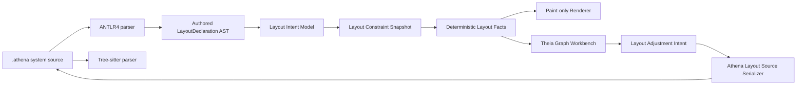
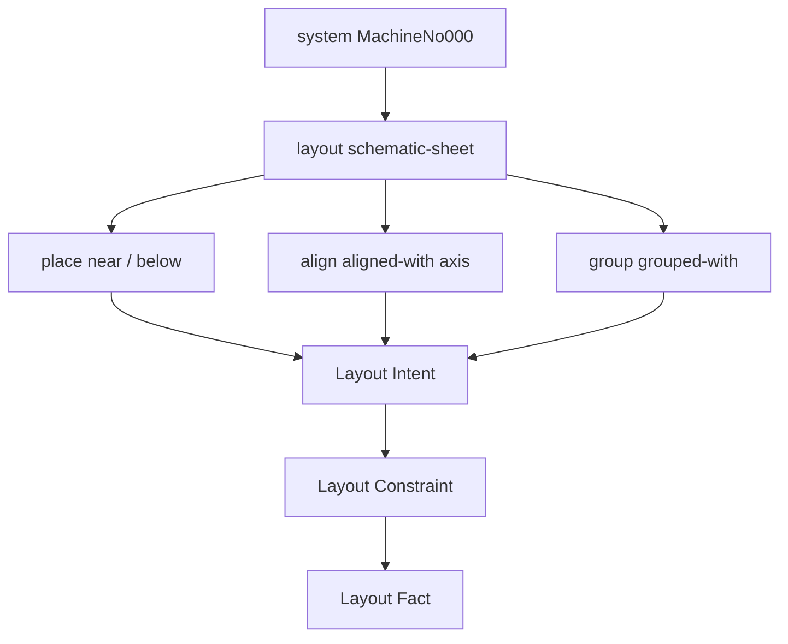

# Architecture Spine - Athena M23

## Design Paradigm

M23 uses governed authored layout language admission.

M22 selected and previewed a layout-hint block, but it did not make that block real source syntax.
M23 closes that truth gap. The `.athena` language admits a small system-scoped layout block, both
parsers accept it, Athena-owned AST carries it, compiler-owned layout intent lowers it into governed
constraints, and Theia may only emit accepted source through an Athena serializer/source-edit path.



## Inherited Invariants

| Inherited | From parent | Binds here |
| --- | --- | --- |
| M22 AD-1 | Layout constraints are the optimization contract | M23 syntax lowers into relationships and constraints, not hidden canvas coordinates. |
| M22 AD-2 | Optimization emits Athena facts only | Admitted layout hints influence facts only through normalized Athena contracts. |
| M22 AD-4 | Round-trip scope is placement, alignment, and grouping | M23 syntax admits only place, align, and group statements. |
| M22 AD-5 | Layout adjustments use governed mutation authority | Graph Workbench source edits must go through authored layout intent and a serializer path. |
| M22 AD-6 | Theia remains a projection consumer | Tree-sitter and frontend code do not resolve engineering meaning. |
| M22 AD-8 | Deferred domains stay explicit | M23 does not expand into EPLAN parity, advanced routing, AI layout, public repository/import ecosystem, or broad libraries. |

## Invariants & Rules

### AD-1 - Layout Blocks Are System-Scoped First

- **Binds:** FR-1, FR-2, FR-4, FR-8, FR-11
- **Prevents:** file-global layout policy, project style, or company-standard hierarchy becoming
  accidental M23 scope.
- **Rule:** M23 admits `layout schematic-sheet { ... }` only inside `system { ... }`. File-global,
  package-global, project-global, and company-standard layout declarations remain deferred.

### AD-2 - ANTLR4 And Tree-sitter Parser Parity Is Mandatory

- **Binds:** FR-1, FR-3, FR-8, FR-11, FR-12
- **Prevents:** source compiling in the backend while the IDE marks it invalid, or editor parsing
  syntax the compiler rejects.
- **Rule:** Every M23 valid and invalid layout syntax fixture must have ANTLR4 and Tree-sitter
  coverage. M23 is not complete if only one parser accepts the admitted syntax.

### AD-3 - Authored AST Owns Syntax Handoff

- **Binds:** FR-2, FR-4, FR-5, FR-8, FR-9
- **Prevents:** generated parser types leaking into compiler, LSP, layout model, or Theia source
  mutation code.
- **Rule:** ANTLR parse output must be adapted into Athena-owned `LayoutDeclaration` and
  `LayoutStatement` nodes with source spans. Downstream compiler and tooling code consumes authored
  AST, not generated parser classes.

### AD-4 - LayoutDeclaration Lowers Through Layout Intent

- **Binds:** FR-4, FR-5, FR-6, FR-7
- **Prevents:** syntax tokens being treated as solver constraints or renderer facts.
- **Rule:** `LayoutDeclaration` lowers first into a layout intent model, then into layout
  constraints. The compiler owns subject binding, view-family binding, diagnostics, duplicate
  detection, and unknown-subject handling.

### AD-5 - Priority Is Model-Owned

- **Binds:** FR-5, FR-6
- **Prevents:** future user hints, company rules, and solver proposals having no conflict semantics.
- **Rule:** M23 layout intent/constraint payloads must carry priority. Authored M23 statements
  default to preference priority. If existing layout code uses another priority vocabulary, M23 must
  add a compatible authored/constraint priority mapping rather than silently changing semantics.
  `prefer` and `require` source keywords remain deferred unless they are admitted with full parser
  parity and diagnostics.

### AD-6 - Graph Workbench Is Not Syntax Authority

- **Binds:** FR-5, FR-9, FR-10
- **Prevents:** frontend string templates becoming a second language or saving invalid snippets.
- **Rule:** Graph Workbench adjustment events produce layout intent objects and use an Athena
  serializer/source-edit path to produce `.athena` text. Preview text and persisted text must be the
  same accepted syntax.

### AD-7 - Compiler And LSP Own Meaning And Diagnostics

- **Binds:** FR-4, FR-8, FR-9
- **Prevents:** Tree-sitter or Theia performing semantic subject resolution.
- **Rule:** Tree-sitter may parse, recover, highlight, and expose structural editor feedback. ANTLR,
  authored AST, compiler, and LSP own semantic binding, unknown-subject diagnostics, invalid relation
  diagnostics, and layout-constraint emission.

### AD-8 - Existing Athena Source Compatibility Remains Binding

- **Binds:** FR-3, FR-8, FR-10
- **Prevents:** M23 grammar changes breaking device, port, connect, package, import, or prior sample
  files.
- **Rule:** M23 syntax admission must preserve M0-M22 source behavior, including M18 package/import
  parsing and active-source projection workflows.

### AD-9 - Accepted Graph Workbench Behavior Carries Forward

- **Binds:** FR-9, FR-10, FR-11, FR-12
- **Prevents:** language admission work regressing the visible IDE fixes from M20-M22.
- **Rule:** M23 must preserve active-source Graphical View projection, same-tab outline navigation,
  grid-backed canvas, transparent controls, top-popover `Cabinet Main` information, and whitespace
  popover dismissal.

### AD-10 - M23 Is Language Admission, Not New Layout Depth

- **Binds:** FR-7, FR-10, FR-12
- **Prevents:** scope drift into visual parity, routing, AI, or ecosystem milestones.
- **Rule:** M23 admits and round-trips layout hints. It does not claim full EPLAN parity, advanced
  routing, standards-specific label intelligence, physical/cabinet routing, AI layout optimization,
  public repository/import ecosystem work, or broad IEC/QElectroTech library ingestion.

## Consistency Conventions

| Concern | Convention |
| --- | --- |
| Syntax location | `layout <view-family> { ... }` lives inside `system { ... }` only. |
| View family names | Lower-hyphen identifiers such as `schematic-sheet`; parser support must not imply renderer ownership. |
| Statement vocabulary | M23 admits `place SUBJECT near TARGET`, `place SUBJECT below TARGET`, `align SUBJECT aligned-with TARGET axis horizontal|vertical`, and `group SUBJECT grouped-with TARGET`. |
| AST naming | Use authored names such as `LayoutDeclaration`, `LayoutStatement`, `PlaceNear`, `PlaceBelow`, `AlignWith`, and `GroupWith`; generated parser names stay internal. |
| Intent and constraints | Source statements lower into layout intent before constraint snapshots; constraints carry source spans and canonical identity where available. |
| Priority | Authored M23 hints default to preference priority; source-level priority keywords are deferred unless implemented fully. |
| Diagnostics | Syntax errors belong to parser/LSP diagnostics; unknown subject, unknown target, duplicate, and contradictory hints belong to compiler/LSP semantic diagnostics. |
| Persistence | Source owns layout intent. Hidden canvas state, DOM state, raw adapter output, and raw coordinates are not persistence formats. |
| Proof | `examples/m23/sample-project` must contain real `.athena` layout blocks and open through the normal Athena Theia IDE path. |

## Stack

| Name | Version / Boundary |
| --- | --- |
| Java toolchain | Existing Athena Java toolchain |
| Gradle wrapper | Existing repo wrapper; verification must run sequentially on Windows |
| Kotlin | Existing Athena Kotlin stack |
| ANTLR4 | Compiler/LSP parser path; must admit layout blocks |
| Tree-sitter | IDE syntax UX parser path; must match admitted syntax |
| LSP4J | Existing Athena LSP diagnostics and projection transport |
| Theia frontend | Existing Athena IDE shell only; no desktop-viewer/Kotlin Compose scope |
| Layout model/engine | Existing M21/M22 contracts extended by source-admitted layout intent/constraints |

## Structural Seed

```text
kernel/
  language/             # ANTLR grammar and parser tests for layout blocks
  compiler/             # authored AST adaptation, layout intent lowering, semantic diagnostics
  layout-model/         # layout intent, priority, constraint contracts
  layout-engine/        # deterministic fact consumption of admitted constraints
ide/
  tree-sitter-athena/   # editor parser/highlighting parity for layout blocks
  lsp/                  # syntax/semantic diagnostics and projection acceptance
  theia-frontend/       # graph workbench preview, serializer/source-edit use, canvas regression
examples/
  m23/
    sample-project/     # real .athena layout-block proof
_bmad-output/
  implementation-artifacts/m23/
```



## Capability To Architecture Map

| Capability / Area | Lives in | Governed by |
| --- | --- | --- |
| System-scoped layout syntax | `kernel/language`, `ide/tree-sitter-athena` | AD-1, AD-2, AD-8 |
| Parser parity fixtures | grammar tests and Tree-sitter corpus/tests | AD-2, AD-8 |
| Authored layout AST | compiler/language AST adaptation | AD-3, AD-4 |
| Layout intent model and priority | `kernel/layout-model`, compiler lowering | AD-4, AD-5 |
| Constraint lowering and diagnostics | compiler, LSP diagnostics | AD-4, AD-7 |
| Graph workbench source edit | `ide/theia-frontend`, LSP/source-edit transport | AD-6, AD-9 |
| Openable M23 sample project | `examples/m23/sample-project`, usage docs, smoke tests | AD-2, AD-8, AD-9 |
| Active-source and canvas behavior | Theia graph workbench tests | AD-9 |
| Scope guardrails | milestone docs, regression tests, retrospective | AD-10 |

## Deferred

| Decision | Deferred Until |
| --- | --- |
| File-global, project-global, package-global, or company-standard layout policy | A later layout-policy milestone after system-scoped blocks prove stable. |
| Explicit `prefer` / `require` source keywords | A later language increment unless M23 implementation keeps parity and diagnostics trivial. |
| Raw coordinate layout syntax | Not a primary authored form; only solved facts or explicitly reviewed grid anchors may carry coordinates. |
| Route and label hint language | A later routing/label milestone. |
| Advanced electrical routing intelligence | A dedicated routing milestone. |
| Full EPLAN parity | A later professional product-depth milestone. |
| AI layout optimization | A later AI/layout milestone after authored intent and constraints are reliable. |
| Public repository/import ecosystem and broad library ingestion | Later ecosystem/library milestones. |

## Open Questions

| Question | Revisit Condition |
| --- | --- |
| Should unknown layout subjects be surfaced as syntax diagnostics, semantic diagnostics, or both? | Before compiler/LSP diagnostic story closes. |
| Should layout declarations appear in Outline? | Before IDE coherence story closes; default is acceptance and diagnostics first. |
| Should current `LayoutPriority` be extended, mapped, or separated into authored constraint priority? | Before layout intent/constraint model story closes. |
| Should route/label syntax be reserved without semantics? | Default is no; revisit only if parser design needs unambiguous future reservation. |
