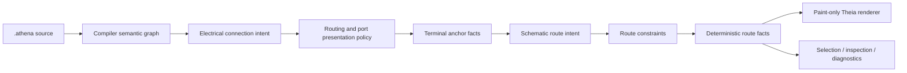
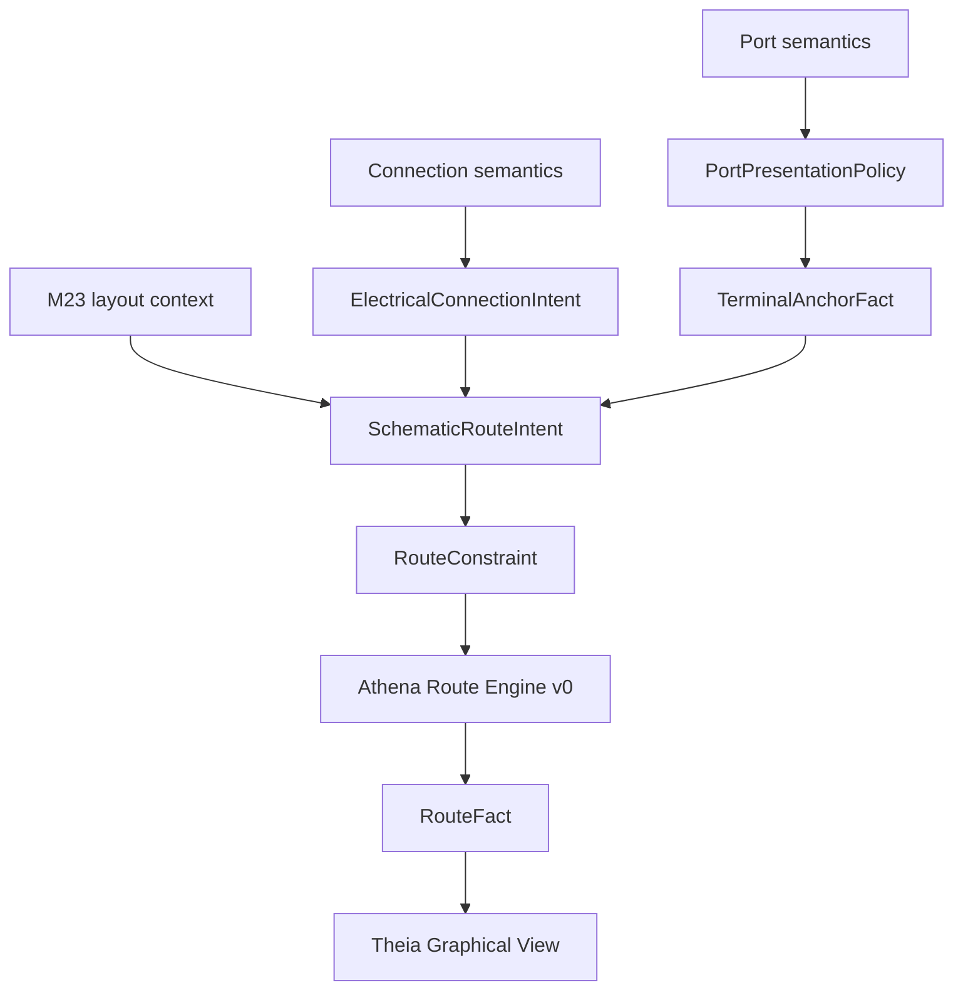

# Architecture Spine - Athena M24

## Design Paradigm

M24 uses governed schematic routing projection.

Semantic source still owns engineering truth. M23 layout hints remain valid source intent. M24 adds
a routing layer between connection semantics and rendering: electrical connection intent, routing
policy, terminal anchors, route constraints, and deterministic route facts. Theia and the renderer
paint and inspect those facts. They do not infer wire meaning or persist route geometry.



## Inherited Invariants

| Inherited | From parent | Binds here |
| --- | --- | --- |
| M23 AD-2 | ANTLR4 and Tree-sitter parser parity is mandatory | M24 does not add route syntax unless both parser paths and LSP/compiler admission are covered. |
| M23 AD-4 | LayoutDeclaration lowers through layout intent | M24 routing may consume layout constraints, but route facts stay downstream of governed intent. |
| M23 AD-6 | Graph Workbench is not syntax authority | Route UI cannot hand-own route source syntax or hidden route state. |
| M23 AD-7 | Compiler and LSP own meaning and diagnostics | Theia and Tree-sitter do not resolve route semantics. |
| M23 AD-8 | Existing Athena source compatibility remains binding | M24 preserves M23 layout block syntax and prior sample behavior. |
| M23 AD-9 | Accepted Graph Workbench behavior carries forward | Grid, transparent controls, active-source projection, and info-popover behavior remain accepted product contracts. |
| M23 AD-10 | M23 is language admission, not new layout depth | M24 is routing depth only; it does not expand into ecosystem, AI, full IEC, or full EPLAN parity. |

## Invariants & Rules

### AD-1 - Routing Model Owns Route Semantics

- **Binds:** FR-3, FR-4, FR-4A, FR-5, FR-6, FR-7, FR-8, FR-12
- **Prevents:** route meaning being hidden in presentation, renderer, DOM, or Theia state.
- **Rule:** M24 route concepts live in `kernel/routing-model`: electrical connection intent,
  routing policy, port presentation policy, terminal anchor facts, route constraints, route facts,
  and route quality state.

### AD-2 - Existing Source Derives Initial Route Intent

- **Binds:** FR-1, FR-3, FR-4, FR-10, FR-11
- **Prevents:** route syntax expansion before routing semantics prove useful.
- **Rule:** M24 derives route intent from existing `device`, `port`, `connect`, component role,
  signal, and M23 layout context. Route-hint syntax remains deferred unless admitted through ANTLR4,
  Tree-sitter, compiler, LSP, docs, and sample proof in the same milestone.

### AD-3 - Port Sides Are Policy-Owned

- **Binds:** FR-3, FR-4, FR-5, FR-7
- **Prevents:** universal renderer hardcoding such as input-left/output-right becoming architecture.
- **Rule:** preferred route entry/exit sides come from `PortPresentationPolicy` and component/port
  semantics. Default policies may be simple in M24, but renderer code cannot own the rule.

### AD-4 - Route Facts Attach To Terminal Anchors

- **Binds:** FR-3, FR-5, FR-7, FR-8, FR-12
- **Prevents:** center-to-center graph edges being accepted as M24 routing fidelity.
- **Rule:** accepted M24 route facts must attach to terminal anchor facts carrying canonical subject,
  port, occurrence, and connection identity. The accepted sample proof must reject renderer-side
  fallback to center-to-center component edges.

### AD-5 - Route Engine V0 Is Athena-Owned And Rule-Based

- **Binds:** FR-4, FR-5, FR-6, FR-11
- **Prevents:** ELK, Graphviz, yFiles, or another generic router becoming the M24 architecture.
- **Rule:** M24 uses an Athena route engine v0 with deterministic rule-based routing. External
  routing helpers are deferred until Athena owns routing semantics, policy, constraints, quality
  states, and fact formats.

### AD-6 - M24 Routing Is Schematic Topology Only

- **Binds:** FR-4, FR-5, FR-7, FR-9, FR-11
- **Prevents:** cabinet, physical wire, harness, cable tray, or 3D routing entering under the
  schematic-routing name.
- **Rule:** M24 route facts describe 2D schematic/document readability. Cabinet and physical routing
  remain deferred even when visual references have cabinet-like ordered lane qualities.

### AD-7 - Ordered Lanes And Bundles Are Semantic Presentation, Not Physical Truth

- **Binds:** FR-2, FR-4, FR-5, FR-7, FR-12
- **Prevents:** the EPLAN-style reference image becoming a full parity or physical-routing mandate.
- **Rule:** M24 may implement a small terminal-strip lane/bundle proof inspired by
  `../../../draft/screenshort/coffret_cordons_chauffants.png`, but only as governed schematic route
  presentation derived from semantic connections and terminal anchors.

### AD-8 - Route Quality Must Be Visible When Degraded

- **Binds:** FR-5, FR-6, FR-8, FR-12
- **Prevents:** fallback route output being silently presented as professional routing.
- **Rule:** route facts carry `RouteQuality` such as satisfied, degraded, or fallback. Diagnostics,
  inspector, or test output must be able to name degraded constraints for affected connections.

### AD-9 - Route Facts Are Deterministic And Reload-Stable

- **Binds:** FR-5, FR-8, FR-10, FR-12
- **Prevents:** SCM-hostile route drift across runs.
- **Rule:** the same source, semantic graph, layout context, and routing policy produce the same
  route facts after rebuild and source reload.

### AD-10 - Theia Renders And Inspects Facts Only

- **Binds:** FR-7, FR-8, FR-9, FR-12
- **Prevents:** frontend-owned route meaning, hidden route persistence, or manual canvas truth.
- **Rule:** Theia renders terminal anchors, route segments, labels, quality state, and selection from
  route facts. Any route editing or route-hint persistence remains deferred unless it goes through
  governed source/model mutation.

## Consistency Conventions

| Concern | Convention |
| --- | --- |
| Route authority | Source semantics -> compiler/projection -> routing model -> route facts -> renderer. |
| Kernel home | `kernel/routing-model` owns route contracts; `kernel/routing-engine` may own route engine v0 if split is useful. |
| Port sides | `PortPresentationPolicy` determines preferred sides; renderer does not. |
| Terminal anchors | Anchors carry subject, port, occurrence, side, and grid point. |
| Route geometry | M24 route facts use grid-aligned orthogonal segments. |
| Lanes and bundles | Ordered lanes/bundles are derived from route policy and semantic grouping, not physical wire truth. |
| Quality | Route facts carry satisfied/degraded/fallback status. |
| Syntax | No new route syntax by default; any syntax expansion requires M23-level dual-parser parity. |
| Proof | `examples/m24/sample-project` is the user-visible proof; `.mjs` files are support tests only. |

## Stack

| Name | Version / Boundary |
| --- | --- |
| Java toolchain | Existing Athena Java toolchain |
| Gradle wrapper | Existing repo wrapper; verification must run sequentially on Windows |
| Kotlin | Existing Athena Kotlin stack |
| ANTLR4 | Existing compiler/LSP parser; no route syntax unless fully admitted |
| Tree-sitter | Existing IDE syntax parser; no route syntax unless parity is complete |
| LSP4J | Existing diagnostics/projection transport |
| Theia frontend | Existing Athena IDE shell only; no desktop-viewer/Kotlin Compose scope |
| Routing engine | Athena route engine v0; no ELK/Graphviz/yFiles decision in M24 |

## Structural Seed

```text
kernel/
  routing-model/       # electrical intent, policies, anchors, constraints, facts, quality
  routing-engine/      # optional split for deterministic Athena route engine v0
  layout-model/        # existing layout context consumed by routing
  compiler/            # semantic connection intent and route projection feeding
ide/
  theia-frontend/      # route-fact rendering, inspection, regression proof
  theia-product/       # M24 sample smoke launch
examples/
  m24/
    sample-project/    # real .athena routing-fidelity proof
docs/
  usages/              # M24 usage and M23-vs-M24 comparison
```



## Capability To Architecture Map

| Capability / Area | Lives in | Governed by |
| --- | --- | --- |
| Openable M24 sample project | `examples/m24/sample-project`, Theia product smoke | AD-4, AD-7, AD-10 |
| Routing acceptance references | PRD/addendum/usage docs | AD-6, AD-7 |
| Terminal anchors | `kernel/routing-model`, compiler/projection mapping | AD-1, AD-3, AD-4 |
| Electrical route intent and policy | `kernel/routing-model` | AD-1, AD-2, AD-3 |
| Deterministic route facts | `kernel/routing-model`, route engine v0 | AD-4, AD-5, AD-8, AD-9 |
| Route rendering | `ide/theia-frontend` | AD-10 |
| Route inspection and diagnostics | compiler/LSP/Theia inspector | AD-8, AD-10 |
| M23 syntax regression | language, compiler, LSP, Tree-sitter tests | inherited M23 AD-2, M23 AD-8 |

## Deferred

| Decision | Deferred Until |
| --- | --- |
| Route-hint source syntax | A later milestone unless M24 implements full ANTLR4, Tree-sitter, compiler, LSP, docs, and sample parity. |
| ELK, Graphviz, yFiles, or external routing engine adoption | After Athena route semantics, policy, facts, and quality states are stable. |
| Physical wire, cabinet, harness, cable tray, or 3D routing | A dedicated physical-routing milestone. |
| Full EPLAN parity | A later professional product-depth milestone. |
| Standards-specific IEC/EPLAN/QElectroTech profiles | M25 or later standards/presentation-policy milestone. |
| Canvas route editing and persistence | A later governed mutation milestone. |
| AI routing | A later AI/layout milestone after deterministic routing facts are trustworthy. |

## Open Questions

| Question | Revisit Condition |
| --- | --- |
| What are the first default port presentation policies for power, ground, input, output, and bidirectional ports? | Before terminal-anchor story closes. |
| Should `kernel/routing-engine` be a separate module or initially part of `kernel/routing-model` tests/support? | Before route engine v0 implementation story starts. |
| What route labels should be shown first: signal, connection id, or source-authored name? | Before rendering/inspection story closes. |
| How strong should the terminal-strip bundle proof be in M24? | Before sample project story closes; must stay a narrow proof, not full reference-sheet replication. |
