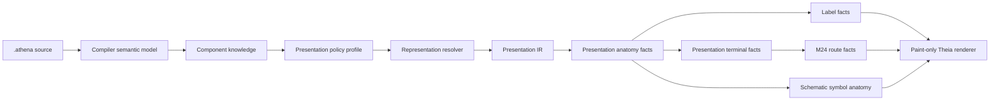
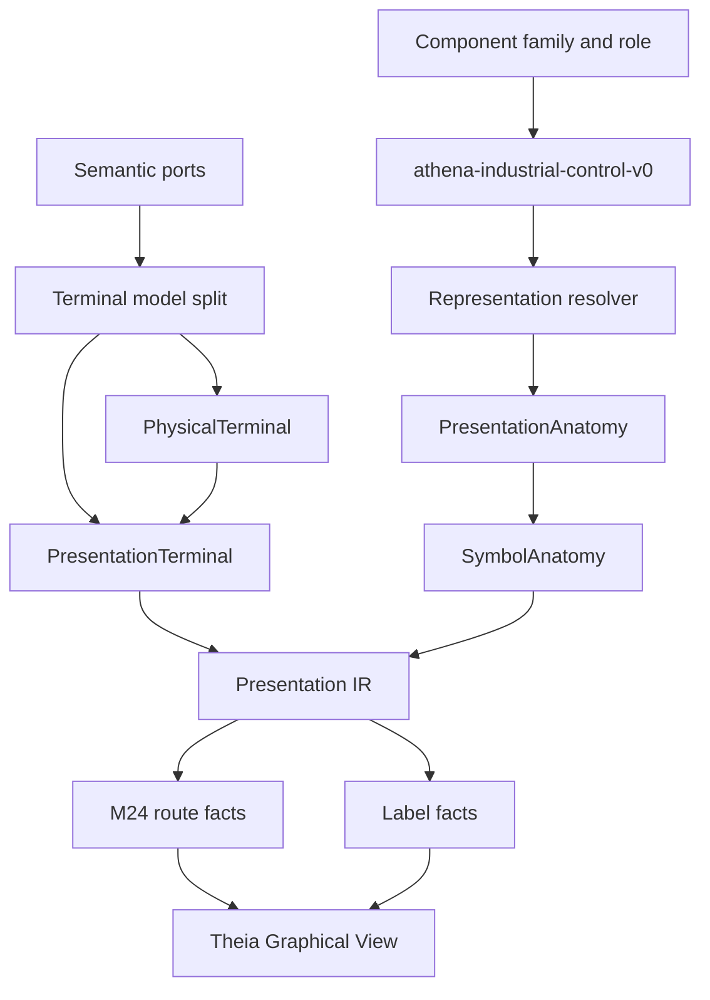

# Architecture Spine - Athena M25

## Design Paradigm

M25 uses governed engineering representation projection.

Semantic source and component knowledge still own engineering truth. M24 route facts remain the
connection rendering baseline. M25 adds a representation layer above schematic symbols:
presentation policy and component knowledge produce Presentation IR facts for presentation anatomy,
schematic symbol anatomy, presentation terminals, labels, and route attachments. Theia paints and
inspects those facts. It does not infer component family, terminal meaning, label identity, or hidden
symbol state from the canvas.



## Inherited Invariants

| Inherited | From parent | Binds here |
| --- | --- | --- |
| M24 AD-1 | Routing model owns route semantics | M25 symbol and terminal facts attach to route facts without moving route meaning into Theia. |
| M24 AD-3 | Port sides are policy-owned | M25 terminal notation and presentation terminals may refine sides, but renderer still cannot hardcode port meaning. |
| M24 AD-4 | Route facts attach to terminal anchors | M25 presentation terminals become the professional visible endpoint for those anchors. |
| M24 AD-8 | Route quality must be visible when degraded | M25 fallback symbol or terminal quality must be visible and diagnosable if outside accepted proof. |
| M24 AD-9 | Route facts are deterministic and reload-stable | M25 representation facts must also be deterministic and reload-stable. |
| M24 AD-10 | Theia renders and inspects facts only | M25 keeps Theia paint-only for representation, symbol, terminal, label, and route facts. |

## Invariants & Rules

### AD-1 - Representation Model Is Above Symbol Model

- **Binds:** FR-2, FR-3, FR-5, FR-6
- **Prevents:** M25 becoming an electrical-symbol database or CAD drawing model.
- **Rule:** M25 introduces an engineering representation model with `PresentationAnatomy` as the
  general contract. `SymbolAnatomy` is the electrical schematic subset, not the architectural root.

### AD-2 - Presentation IR Remains The Rendering Bridge

- **Binds:** FR-3, FR-5, FR-6, FR-7, FR-8, FR-9, FR-10
- **Prevents:** component knowledge or presentation policy bypassing the M13 presentation layer and
  coupling directly to Theia.
- **Rule:** M25 representation, symbol, terminal, label, route-anchor, and occurrence facts flow
  through Presentation IR before Theia rendering or inspection.

### AD-3 - Presentation Policy Profile Owns Representation Choice

- **Binds:** FR-2, FR-4, FR-5, FR-7, FR-8
- **Prevents:** renderer-side component family lookup, standards claims, or hardcoded visual
  behavior.
- **Rule:** M25 uses one active profile, `athena-industrial-control-v0`, to select schematic
  representation, terminal notation, label anchors, marker style, and fallback policy. The name is
  vendor-neutral and does not claim IEC completeness.

### AD-4 - Component Knowledge Compiles To Presentation Facts

- **Binds:** FR-3, FR-5, FR-6, FR-7, FR-8
- **Prevents:** symbol drawing becoming the source of engineering meaning.
- **Rule:** Component family, role, ports, terminal definitions, and labels compile into
  representation facts. The direction is always meaning -> presentation policy -> Presentation IR
  facts -> renderer.

### AD-5 - Terminal Meaning Is Layered

- **Binds:** FR-5, FR-7, FR-9
- **Prevents:** terminal identity collapsing into local symbol coordinates or route endpoints.
- **Rule:** M25 keeps `SemanticPort`, `PhysicalTerminal`, and `PresentationTerminal` distinct.
  Presentation terminals carry visible marker, number, route anchor, subject identity, occurrence
  identity, port identity, and terminal identity.

### AD-6 - Labels Are Semantic Presentation Facts

- **Binds:** FR-7, FR-8, FR-9, FR-10
- **Prevents:** raw renderer text or DOM labels becoming the label authority.
- **Rule:** Device tags, type labels, terminal labels, route labels, and dynamic text placeholders
  are `LabelFact`-style facts with subject identity, occurrence identity, role, value, anchor, and
  optional source identity.

### AD-7 - Accepted Proof Has Zero Generic Fallback Symbols

- **Binds:** FR-1, FR-5, FR-9, FR-10
- **Prevents:** a generic box proof being presented as professional symbol fidelity.
- **Rule:** The accepted M25 sample path must render supported representations for PLC/controller,
  terminal block, power supply, and load/actuator with no generic fallback symbols. Fallback may
  exist outside the accepted proof only when visible and diagnosable.

### AD-8 - QElectroTech Is Reference Vocabulary Only

- **Binds:** FR-2, FR-3, FR-5
- **Prevents:** M25 becoming a QElectroTech import, library, or compatibility milestone.
- **Rule:** M25 may document one QElectroTech-inspired anatomy mapping example from the local
  reference mirror, but it must not implement `.elmt` ingestion, runtime dependency, library
  parity, or QET-owned meaning.

### AD-9 - Theia IDE Is The Only Frontend Scope

- **Binds:** FR-1, FR-8, FR-9, FR-10
- **Prevents:** implementation drift into deprecated desktop-viewer, Compose, or KMP frontend
  modules.
- **Rule:** M25 product proof, rendering, inspection, and smoke coverage live in the existing Theia
  IDE path only.

### AD-10 - No New Source Syntax By Default

- **Binds:** FR-1, FR-4, FR-5, FR-10
- **Prevents:** repeating unsupported syntax/doc mismatches from prior milestones.
- **Rule:** M25 derives representation from existing component and port semantics. Any new `.athena`
  syntax requires ANTLR4, Tree-sitter, compiler, LSP, tests, sample project, and usage docs in the
  same milestone.

## Consistency Conventions

| Concern | Convention |
| --- | --- |
| Authority chain | Source -> compiler semantic model -> component knowledge -> presentation policy -> Presentation IR -> Theia renderer. |
| Profile name | `athena-industrial-control-v0` for all M25 accepted proof paths. |
| Representation terms | Use `PresentationAnatomy` for the general model; use `SymbolAnatomy` only for electrical schematic representation. |
| Terminal terms | `SemanticPort`, `PhysicalTerminal`, and `PresentationTerminal` remain separate concepts. |
| Label terms | Labels are facts with role and identity, not raw text draw calls. |
| Fallback | Zero fallback symbols in accepted proof; visible/diagnosable fallback outside proof. |
| QET | Reference vocabulary only; no import or dependency. |
| Frontend | Theia IDE only; no desktop-viewer, Compose, or KMP frontend work. |

## Stack

| Name | Version / Boundary |
| --- | --- |
| Java toolchain | Existing Athena Java toolchain |
| Gradle wrapper | Existing repo wrapper; verification must run sequentially on Windows |
| Kotlin | Existing Athena Kotlin stack |
| ANTLR4 | Existing compiler/LSP parser; no M25 syntax unless fully admitted |
| Tree-sitter | Existing IDE syntax parser; no M25 syntax unless parity is complete |
| LSP4J | Existing diagnostics/projection transport |
| Theia frontend | Existing Athena IDE shell only; no desktop-viewer/Kotlin Compose scope |
| QElectroTech reference | Local reference mirror and docs only; no runtime/import dependency |

## Structural Seed

```text
kernel/
  representation-model/          # PresentationAnatomy, representation ids, primitive contracts
  presentation-policy-model/     # athena-industrial-control-v0 profile, terminal/label policy
  symbol-model/                  # electrical schematic SymbolAnatomy subset if split is useful
  component-model/               # component knowledge consumed by representation resolver
  routing-model/                 # M24 route facts attaching to presentation terminals
  runtime/                       # projection / Presentation IR facts consumed by IDE
ide/
  theia-frontend/                # paint-only representation and notation rendering
  theia-product/                 # M25 sample smoke launch
examples/
  m25/
    sample-project/              # real .athena representation-fidelity proof
docs/
  usages/                        # M25 usage and M24-vs-M25 comparison
```



## Capability To Architecture Map

| Capability / Area | Lives in | Governed by |
| --- | --- | --- |
| Openable M25 sample project | `examples/m25/sample-project`, Theia product smoke | AD-7, AD-9 |
| Representation acceptance references | PRD/addendum/usage docs | AD-1, AD-8 |
| Presentation anatomy model | `kernel/representation-model` | AD-1, AD-2, AD-4 |
| Presentation policy profile | `kernel/presentation-policy-model` | AD-3 |
| Symbol anatomy subset | `kernel/symbol-model` or representation-model subset | AD-1, AD-4 |
| Terminal notation facts | representation/presentation policy + route anchor mapping | AD-5 |
| Label facts | representation/presentation policy + Presentation IR | AD-6 |
| M24 route integration | `kernel/routing-model`, Presentation IR | inherited M24 AD-4, AD-2, AD-5 |
| Theia rendering and inspection | `ide/theia-frontend` | AD-2, AD-9 |
| No syntax expansion | compiler, Tree-sitter, docs if ever needed | AD-10 |

## Deferred

| Decision | Deferred Until |
| --- | --- |
| Full IEC standards profile | A later standards/presentation-pack milestone. |
| QElectroTech `.elmt` ingestion | A later library/import milestone after representation contracts stabilize. |
| Public repository or symbol marketplace | A later ecosystem milestone. |
| Symbol authoring UI | A later governed authoring milestone. |
| EPLAN visual parity | A later product-depth milestone with explicit scope. |
| Cabinet, HMI, SCADA, 3D, or AR representation profiles | Later representation milestones after electrical schematic proof stabilizes. |
| New `.athena` representation syntax | Only when ANTLR4, Tree-sitter, compiler, LSP, docs, and sample proof are planned together. |
| Desktop-viewer / Compose frontend work | Not owned by M25. |

## Open Questions

| Question | Revisit Condition |
| --- | --- |
| Which QElectroTech element should serve as the documentation-only anatomy mapping example? | Before usage doc closes. |
| Should HMI/operator and protection device be required in first product smoke? | Before sample-project story closes. |
| Should signal labels remain route-label facts or become terminal signal-label facts? | Before label-fact story closes. |
