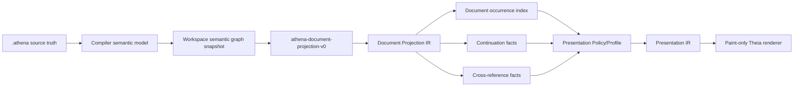
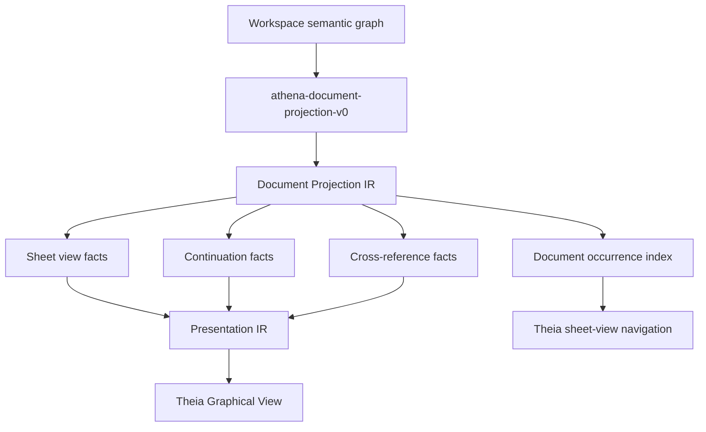

# Architecture Spine - Athena M26

## Design Paradigm

M26 uses semantic document projection.

Athena source remains the engineering truth. Document views are projection outputs over the
workspace semantic graph. M26 introduces a document projection layer that decides view organization,
occurrence membership, cross-view continuations, and reference topology before paint-ready
Presentation IR. Theia may navigate, reveal, inspect, and render those facts, but it may not infer
document meaning from canvas state, page geometry, or source-file names.



## Inherited Invariants

| Inherited | From parent | Binds here |
| --- | --- | --- |
| M25 AD-2 | Presentation IR remains the rendering bridge | M26 document facts must flow into Presentation IR before Theia rendering. |
| M25 AD-6 | Labels are semantic presentation facts | M26 compact reference labels remain facts, not raw canvas text. |
| M25 AD-9 | Theia IDE is the only frontend scope | M26 sheet-view navigation and proof stay in Theia, not desktop-viewer or Compose. |
| M25 AD-10 | No new source syntax by default | M26 uses admitted syntax only unless all parser/compiler/LSP/Tree-sitter paths are upgraded together. |
| M24 AD-9 | Route facts are deterministic and reload-stable | M26 continuation facts inherit route stability requirements. |
| M24 AD-10 | Theia renders and inspects facts only | M26 navigation and cross-reference clicks consume projection facts, not canvas scans. |

## Invariants & Rules

### AD-1 - Source Truth Remains Upstream

- **Binds:** FR-1, FR-3, FR-4, FR-5, FR-8, FR-9, FR-10, FR-11
- **Prevents:** document files, page databases, renderer caches, or UI state becoming engineering
  authority.
- **Rule:** `.athena` source plus compiler/runtime semantic snapshots remain the source of truth.
  Document Projection IR is derived projection output only.

### AD-2 - Document Projection Policy Owns View Organization

- **Binds:** FR-1, FR-3, FR-4, FR-5, FR-11
- **Prevents:** presentation policy, source-file layout, or Theia choosing document membership.
- **Rule:** M26 uses one compiler/runtime-owned policy, `athena-document-projection-v0`, to decide
  view organization, view roles, occurrence membership, continuation facts, cross-reference facts,
  and navigation topology.

### AD-3 - Document Projection IR Owns Topology, Not Geometry

- **Binds:** FR-2, FR-3, FR-4, FR-5, FR-6, FR-7
- **Prevents:** Document Projection IR becoming a CAD page model or layout engine.
- **Rule:** Document Projection IR owns projection identity, policy version/hash, view identity,
  view role/order, logical document locations, occurrence membership, occurrence index,
  continuation facts, cross-reference facts, and navigation topology. It never owns raw `x`, `y`,
  `width`, `height`, page packing, symbol geometry, route geometry, labels, terminal drawing, or
  renderer state.

### AD-4 - Presentation IR Owns Paint-Ready Sheet Presentation

- **Binds:** FR-2, FR-3, FR-6, FR-7, FR-9, FR-10
- **Prevents:** M26 bypassing M13/M25 Presentation IR or reintroducing renderer-owned semantics.
- **Rule:** Presentation Policy/Profile and Presentation IR own visual placement, symbols, labels,
  terminals, markers, primitives, paint-ready coordinates, title-block rendering, page frame, and
  sheet chrome.

### AD-5 - Workspace-Level Projection Entry Point Is Required

- **Binds:** FR-1, FR-3, FR-4, FR-5, FR-11
- **Prevents:** active-file-only compilation pretending to be project-level document projection.
- **Rule:** M26 document projection consumes a workspace/project semantic graph snapshot or
  linked/lowered project units. The accepted proof must not be built only from
  `AthenaCompiler.compile(path)` for the active file.

### AD-6 - Source Files Are Not Sheet Views

- **Binds:** FR-1, FR-4, FR-5, FR-10, FR-11
- **Prevents:** project file organization becoming document organization.
- **Rule:** A `.athena` source file is never a sheet-view boundary. The accepted sample must include
  at least one source file contributing subjects to more than one sheet view and at least one sheet
  view containing subjects not defined by its filename.

### AD-7 - Occurrence Identity Is Deterministic And Policy-Versioned

- **Binds:** FR-3, FR-4, FR-5, FR-6, FR-7, FR-9, FR-10
- **Prevents:** cross references degrading into unstable page-order strings.
- **Rule:** Document occurrence identity derives from
  `documentProjectionId + sheetViewId + canonicalSubjectId + occurrenceRole +
  representation/terminal/route role`. The document projection id includes policy id and policy
  version/hash. Same semantic graph plus same policy produces stable view ids, occurrence ids,
  document locations, and canonical cross-reference facts.

### AD-8 - Continuations Are Route-Segmentation Facts

- **Binds:** FR-4, FR-6, FR-7, FR-9, FR-10
- **Prevents:** Theia inferring continuation meaning from broken rendered lines.
- **Rule:** A canonical connection crossing sheet-view membership produces source and target route
  occurrences plus continuation markers attached to M24 anchors or corridors. The renderer paints
  those facts only.

### AD-9 - Cross References Are Typed Semantic Facts

- **Binds:** FR-5, FR-7, FR-8, FR-9, FR-10
- **Prevents:** cross references becoming opaque pointers or label strings.
- **Rule:** M26 defines explicit `DocumentOccurrence`, `DocumentLocation`, `ContinuationFact`, and
  `CrossReferenceFact` contracts. A cross-reference fact carries source identity, target identity,
  source occurrence, target occurrence, relation type, document locations, display notation, and
  provenance.

### AD-10 - Diagnostics Preserve Source And Projection Provenance

- **Binds:** FR-8, FR-9, FR-10, FR-11
- **Prevents:** projection-policy issues masquerading as authored source errors or frontend-local
  diagnostics.
- **Rule:** Source-caused document-reference diagnostics carry source provenance and may publish to
  Problems. Projection-policy or view-derived diagnostics carry projection provenance and may appear
  in inspector/proof metadata. Theia does not resolve document diagnostics locally.

### AD-11 - Theia Navigates Through The Occurrence Index

- **Binds:** FR-5, FR-7, FR-9, FR-10, FR-11
- **Prevents:** canvas scans, DOM search, or graph-node heuristics resolving document meaning.
- **Rule:** Sheet navigation and cross-reference clicks consume the compiler/runtime document
  occurrence index directly. Legacy presentation graph scanning may remain for prior reveal paths
  but is not M26 document-reference authority.

### AD-12 - No New Source Syntax By Default

- **Binds:** FR-1, FR-3, FR-4, FR-8, FR-11
- **Prevents:** unsupported `document`, `sheet`, `page`, `view`, `zone`, or reference syntax
  appearing in docs or samples.
- **Rule:** M26 sample source uses only admitted `.athena` syntax. Any new document projection syntax
  requires ANTLR4, Tree-sitter, parser, compiler, LSP, fixtures, tests, and docs in the same story.

## Consistency Conventions

| Concern | Convention |
| --- | --- |
| Authority chain | `.athena` source -> compiler semantic model -> workspace semantic graph -> Document Projection Policy -> Document Projection IR -> Presentation Policy/Profile -> Presentation IR -> Theia renderer. |
| First policy | `athena-document-projection-v0`, compiler/runtime-owned. |
| View wording | Use `sheet view`, `document occurrence`, `document location`, and `cross-view continuation`; avoid page-first terminology except deferred publishing boundaries. |
| Identity recipe | `documentProjectionId + sheetViewId + canonicalSubjectId + occurrenceRole + representation/terminal/route role`. |
| Coordinates | Document Projection IR may hold logical zones/locations only; raw coordinates belong to Presentation IR/layout facts. |
| Syntax | No new source syntax unless parser and IDE syntax parity are included in the same story. |
| Frontend | Theia IDE only; no desktop-viewer, Compose, or deprecated KMP frontend work. |

## Stack

| Name | Version / Boundary |
| --- | --- |
| Java toolchain | Existing Athena Java toolchain |
| Gradle wrapper | Existing repo wrapper; verification must run sequentially on Windows |
| Kotlin | Existing Athena Kotlin stack |
| ANTLR4 | Existing compiler/LSP parser; no M26 syntax unless fully admitted |
| Tree-sitter | Existing IDE syntax parser; no M26 syntax unless parity is complete |
| LSP4J | Existing diagnostics/projection transport |
| Theia frontend | Existing Athena IDE shell only; no desktop-viewer/Kotlin Compose scope |

## Structural Seed

```text
kernel/
  document-projection-model/        # DocumentProjectionId, DocumentOccurrence, DocumentLocation, reference facts
  document-projection-engine/       # athena-document-projection-v0 and materialization policy
  projection/                       # workspace semantic graph snapshot bridge
  presentation-model/               # Presentation IR integration and paint-ready facts
  routing-model/                    # M24 route anchors/corridors used by continuation facts
  representation-model/             # M25 presentation anatomy attached to occurrences
ide/
  lsp/                              # projection payload / diagnostics transport
  theia-frontend/                   # sheet-view navigation, inspector, reference reveal
  theia-product/                    # M26 smoke launch
examples/
  m26/
    sample-project/                 # one coherent project projected into multiple sheet views
docs/
  usages/                           # M26 usage and M25-vs-M26 acceptance proof
```



## Capability To Architecture Map

| Capability / Area | Lives in | Governed by |
| --- | --- | --- |
| FR-1 openable M26 sample project | `examples/m26`, Theia launch/smoke | AD-1, AD-5, AD-6, AD-12 |
| FR-2 acceptance references | `docs/usages`, tests | AD-3, AD-4, AD-7 |
| FR-3 Document Projection IR | `kernel/document-projection-model` | AD-1, AD-2, AD-3, AD-4 |
| FR-4 deterministic sheet-view materialization | `kernel/document-projection-engine` | AD-2, AD-5, AD-6, AD-7 |
| FR-5 document occurrence index | `kernel/document-projection-model`, runtime projection | AD-7, AD-9, AD-11 |
| FR-6 continuation facts | `kernel/document-projection-model`, `kernel/routing-model` bridge | AD-8, AD-9 |
| FR-7 cross-reference facts | `kernel/document-projection-model` | AD-7, AD-9 |
| FR-8 diagnostics with provenance | compiler/runtime projection, `ide/lsp` | AD-10 |
| FR-9 sheet-view navigation | `ide/theia-frontend` consuming occurrence index | AD-11 |
| FR-10 coherence | compiler/runtime ids, Theia reveal/inspector | AD-1, AD-7, AD-9, AD-11 |
| FR-11 usage and evidence | docs, product smoke, regression tests | AD-5, AD-6, AD-12 |

## Deferred

| Decision | Deferred Until |
| --- | --- |
| Final PDF/print export and page release workflow | A publishing milestone after Document Projection IR is stable. |
| Second full document projection organization | A later milestone; M26 proves policy identity boundary, not multi-policy breadth. |
| Public or company-specific document standard packs | Standards/library milestones after M26. |
| New document projection source syntax | Only when ANTLR4, Tree-sitter, compiler, LSP, fixtures, tests, and docs are admitted together. |
| Full terminal report, wire list, or part list | A later document artifact milestone. |
| Large-project auto-pagination or optimal page packing | A later layout/document optimization milestone. |
| Desktop-viewer, Compose, or deprecated KMP frontend support | Not in M26. |
