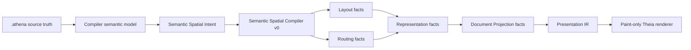
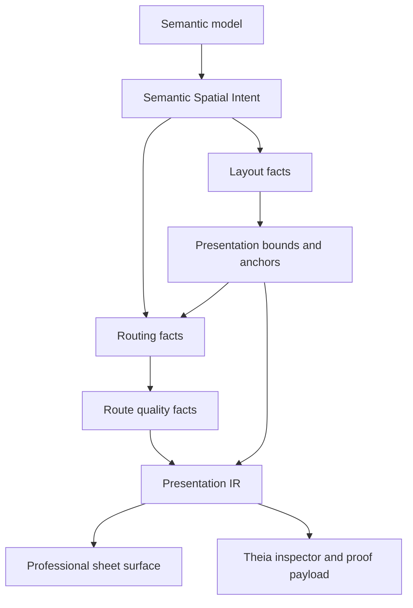

# Architecture Spine - Athena M27

## Design Paradigm

M27 uses semantic spatial projection.

Athena source and semantic identity remain upstream truth. M27 adds a narrow 2D electrical schematic
spatial-intent layer so visual sheet quality, linework, route quality, and connection previews are
compiled from engineering meaning instead of invented by the renderer. The visual proof is a
professional sheet surface; the architectural achievement is governed semantic spatial intent.



## Inherited Invariants

| Inherited | From parent | Binds here |
| --- | --- | --- |
| M26 AD-1 | Source truth remains upstream | M27 spatial intent and sheet visuals remain projection output. |
| M26 AD-3 | Document Projection IR owns topology, not geometry | M27 sheet frame and route geometry do not move document identity into canvas/page state. |
| M26 AD-4 | Presentation IR owns paint-ready sheet presentation | M27 sheet frame, title block, zones, labels, and route geometry flow through Presentation IR. |
| M26 AD-11 | Theia navigates through occurrence facts | M27 hover, selection, route inspection, and connection preview do not infer identity from DOM scans. |
| M25 AD-2 | Presentation IR remains the rendering bridge | M27 professional visuals must not bypass Presentation IR. |
| M25 AD-6 | Labels are semantic presentation facts | M27 compact labels remain facts, not raw renderer text. |
| M24 AD-4 | Route facts attach to terminal anchors | M27 route quality and linework preserve terminal-anchor authority. |
| M24 AD-8 | Route quality must be visible when degraded | M27 makes route quality an accepted proof dimension. |
| M24 AD-10 | Theia renders and inspects facts only | M27 keeps Theia paint-only and inspection-only for spatial truth. |

## Invariants & Rules

### AD-1 - Semantic Spatial Projection Is The M27 Paradigm

- **Binds:** FR-1, FR-2, FR-5, FR-7, FR-8, FR-10, FR-14
- **Prevents:** M27 becoming a CSS polish milestone or a renderer-owned routing patch.
- **Rule:** M27 visual quality is derived from semantic spatial intent, layout facts, routing
  facts, representation facts, document projection facts, and Presentation IR.

### AD-2 - Semantic Spatial Compiler v0 Is 2D Electrical Schematic Only

- **Binds:** FR-5, FR-6, FR-7, FR-8, FR-14
- **Prevents:** M27 becoming factory layout, 3D collision, cabinet routing, CAD solving, or a
  general spatial reasoning platform.
- **Rule:** M27 Semantic Spatial Compiler v0 compiles intent for 2D electrical schematic projection
  only. It may establish future-compatible contracts but must not implement a general geometry
  kernel.

### AD-3 - Spatial Intent Owns Preferences, Priority, Confidence, And Source

- **Binds:** FR-5, FR-7, FR-8, FR-10, FR-14
- **Prevents:** route behavior becoming unexplained heuristics or future AI suggestions becoming
  indistinguishable from hard engineering constraints.
- **Rule:** Spatial intent facts carry canonical subject references, preferred direction, side
  preference, grouping, separation, lane preference, terminal orientation, component avoidance,
  priority, confidence, and constraint source. They never persist raw canvas coordinates.

### AD-4 - Layout And Routing Are Separate Spatial Compilations

- **Binds:** FR-5, FR-7, FR-8
- **Prevents:** one engine or data model confusing subject placement with relationship occupancy.
- **Rule:** Layout facts decide where subjects should exist. Routing facts decide how relationships
  occupy space between those subjects. Both may consume spatial intent, but neither replaces the
  other.

### AD-5 - Route Geometry Is Normalized Athena Fact Output

- **Binds:** FR-6, FR-7, FR-8, FR-9, FR-14
- **Prevents:** ELK, libavoid, yFiles, custom routing, or Theia becoming route authority.
- **Rule:** Route solving produces Athena route geometry facts with ordered points, bends, terminal
  anchors, constraints, quality state, and canonical route identity. Any backend output must
  normalize into this contract.

### AD-6 - Accepted Routes Must Avoid Component Bodies

- **Binds:** FR-7, FR-8, FR-14
- **Prevents:** visually credible sheets still containing graph-like lines through symbols.
- **Rule:** The accepted M27 proof contains no route through component symbol bodies and no
  center-to-center fallback route. Failure to satisfy this produces route quality metadata rather
  than silent success.

### AD-7 - Routing Backend SPI Is A Boundary, Not A Dependency Decision

- **Binds:** FR-6, FR-7, FR-8
- **Prevents:** premature ELK/libavoid adoption or backend-driven architecture.
- **Rule:** M27 may define or test the smallest routing backend adapter seam, but the accepted proof
  uses Athena-owned intent and normalized facts. No external backend owns semantic connectivity,
  terminal identity, source mutation, document occurrence identity, or persisted route truth.

### AD-8 - Professional Sheet Surface Is Presentation IR Output

- **Binds:** FR-2, FR-3, FR-4, FR-9, FR-14
- **Prevents:** title block, coordinate zones, sheet frame, or grid becoming canvas-local state.
- **Rule:** Sheet frame, zones, title block, grid, route labels, compact references, and sheet chrome
  are governed presentation facts consumed by Theia.

### AD-9 - Semantic Connection Preview Is Transient

- **Binds:** FR-10, FR-11, FR-13
- **Prevents:** M27 accidentally becoming a source mutation milestone or canvas drawing editor.
- **Rule:** M27 previews semantic endpoint compatibility, spatial intent, and route geometry only.
  Creating or accepting a new `.athena` `connect` statement is deferred to M28 unless a story
  explicitly reuses an existing governed mutation path without expanding M27 scope.

### AD-10 - Route Quality Is A Fact, Not A Visual Guess

- **Binds:** FR-7, FR-8, FR-9, FR-12, FR-14
- **Prevents:** route defects being hidden in screenshots or hardcoded color rules.
- **Rule:** Route quality facts identify satisfied, degraded, fallback, crossing, crowded, or
  unresolved states and carry failed constraints. Inspector/proof payloads expose route quality.
  Problems view only shows source-backed or explicitly governed diagnostics.

### AD-11 - Theia Remains A Fact Consumer

- **Binds:** FR-10, FR-12, FR-13, FR-14
- **Prevents:** Theia inferring engineering truth from SVG segments, DOM labels, canvas scans, or
  visual line breaks.
- **Rule:** Theia may render, inspect, select, hover, preview, and navigate facts. It must not own
  semantic spatial intent, connection meaning, route identity, document identity, or hidden layout
  truth.

### AD-12 - Internal Refactor Is Allowed, Authority Drift Is Not

- **Binds:** FR-5, FR-6, FR-7, FR-8, FR-16
- **Prevents:** false stability that preserves weak internal APIs, and uncontrolled refactor that
  corrupts architecture.
- **Rule:** M27 may break internal APIs when that strengthens the long-term architecture. It must
  preserve the authority chain and remove obsolete paths before completion.

### AD-13 - Geometry Model Stays Minimal

- **Binds:** FR-5, FR-6, FR-7, FR-8
- **Prevents:** Athena drifting toward OpenCascade/Parasolid-style CAD topology.
- **Rule:** M27 geometry remains bounds, anchors, route geometry facts, and presentation primitives.
  It must not introduce curves, surfaces, solids, topology graphs, or general geometric constraint
  solving.

### AD-14 - No New Source Syntax By Default

- **Binds:** FR-1, FR-5, FR-10, FR-11, FR-15
- **Prevents:** unsupported source syntax appearing in samples or docs.
- **Rule:** M27 uses admitted `.athena` syntax. Any new syntax requires ANTLR4, Tree-sitter,
  compiler, LSP, fixtures, tests, usage docs, and IDE behavior in the same story.

### AD-15 - Theia IDE Is The Only Frontend Scope

- **Binds:** FR-1, FR-3, FR-4, FR-10, FR-12, FR-14, FR-16
- **Prevents:** implementation drift into deprecated desktop-viewer, Compose, or KMP frontend
  modules.
- **Rule:** M27 product proof, rendering, inspection, smoke, and visual acceptance live in the
  existing Theia IDE path only.

### AD-16 - Completion Requires A Cleanup Gate

- **Binds:** FR-15, FR-16
- **Prevents:** aggressive refactor leaving misleading code, docs, samples, or design claims behind.
- **Rule:** Final M27 completion includes a stale artifact purge. Removed or retained stale areas are
  named in the retrospective with owner, reason, and deferred milestone when retained.

## Consistency Conventions

| Concern | Convention |
| --- | --- |
| Authority chain | `.athena` source -> compiler semantic model -> semantic spatial intent -> layout/routing facts -> representation/document projection facts -> Presentation IR -> Theia renderer. |
| Spatial scope | `Semantic Spatial Compiler v0` means 2D electrical schematic projection only. |
| Layout vs routing | Layout decides subject placement. Routing decides relationship occupancy. |
| Spatial metadata | Spatial intent carries priority, confidence, and source attribution. |
| Backend boundary | ELK/libavoid/yFiles are future backend candidates behind Athena-owned adapter SPI only. |
| Visual reference | QElectroTech is a visual quality reference only, never data-model authority. |
| Geometry | Bounds, anchors, route geometry facts, and presentation primitives only. |
| Connection preview | Preview is transient in M27; mutation acceptance is deferred unless existing authority is reused explicitly. |
| Frontend | Theia IDE only; no desktop-viewer, Compose, or deprecated KMP frontend work. |
| Cleanup | Every M27 close-out includes stale code/docs/design purge evidence. |

## Stack

| Name | Version / Boundary |
| --- | --- |
| Java toolchain | Existing Athena Java toolchain |
| Gradle wrapper | Existing repo wrapper; verification must run sequentially on Windows |
| Kotlin | Existing Athena Kotlin stack |
| ANTLR4 | Existing compiler/LSP parser; no M27 syntax unless fully admitted |
| Tree-sitter | Existing IDE syntax parser; no M27 syntax unless parity is complete |
| LSP4J | Existing diagnostics/projection transport |
| Theia frontend | Existing Athena IDE shell only; no desktop-viewer/Kotlin Compose scope |
| GLSP/Sprotty | Existing projection interaction/rendering path; not semantic authority |
| QElectroTech reference | Local screenshot/reference material only; no runtime/import dependency |
| ELK/libavoid | Deferred backend candidates only; no M27 production dependency |

## Structural Seed

```text
kernel/
  spatial-model/                 # SemanticSpatialIntent, priority/confidence/source contracts if split is justified
  layout-model/                  # Existing layout constraints/facts consuming spatial intent where useful
  routing-model/                 # Route intent, constraints, quality, backend adapter seam, route engine v0
  representation-model/          # Symbol bounds, anchors, terminal presentation used by route quality
  presentation-model/            # Sheet frame/title block/zones/route geometry presentation facts
  document-projection-model/     # M26 sheet-view identity and occurrence membership
  compiler/                      # Projects semantic/source state into spatial intent and downstream facts
  runtime/                       # Aggregates presentation/document/spatial proof payloads for IDE
ide/
  lsp/                           # Diagnostics/projection transport; no new syntax unless full parity
  theia-frontend/                # Professional sheet render, route inspection, connection preview, visual polish
  theia-product/                 # M27 smoke and visual proof launch
examples/
  m27/
    sample-project/              # Real .athena professional sheet visual proof
docs/
  usages/                        # M27 usage and M26-vs-M27 comparison
```



## Capability To Architecture Map

| Capability / Area | Lives in | Governed by |
| --- | --- | --- |
| FR-1 openable M27 sample | `examples/m27/sample-project`, Theia smoke | AD-1, AD-14, AD-15 |
| FR-2 visual references | PRD/addendum/usage docs | AD-8, AD-13 |
| FR-3 sheet frame/zones/title block | `presentation-model`, `theia-frontend` | AD-8, AD-11 |
| FR-4 grid/density/text scale | `presentation-model`, `theia-frontend` | AD-8, AD-11 |
| FR-5 spatial intent contracts | `spatial-model` or focused additions to `layout-model`/`routing-model` | AD-2, AD-3, AD-4, AD-13 |
| FR-6 backend boundary | `routing-model` adapter seam | AD-5, AD-7 |
| FR-7 component crossing avoidance | `routing-model`, route engine v0 | AD-5, AD-6, AD-10 |
| FR-8 route lanes | `routing-model`, route engine v0 | AD-4, AD-5, AD-10 |
| FR-9 compact route/reference text | `presentation-model`, `representation-model`, Theia inspector | AD-8, AD-10, AD-11 |
| FR-10 connection preview | Theia frontend consuming semantic compatibility/projection facts | AD-9, AD-11 |
| FR-11 mutation deferral | docs, stories, Theia preview state | AD-9, AD-14 |
| FR-12 workbench polish | `ide/theia-frontend` | AD-11, AD-15 |
| FR-13 coherence | compiler/runtime ids, LSP, Theia reveal/inspector | AD-11, AD-14 |
| FR-14 screenshot/DOM proof | `ide/theia-product`, frontend tests | AD-6, AD-8, AD-10, AD-15 |
| FR-15 usage/retrospective | `docs/usages`, implementation artifacts | AD-16 |
| FR-16 stale purge | final story/retrospective cleanup pass | AD-12, AD-16 |

## Deferred

| Decision | Deferred Until |
| --- | --- |
| Production ELK/libavoid/yFiles backend | After Athena-owned spatial intent and route facts prove stable. |
| Auto-connection source mutation acceptance | M28 or later source-mutation milestone unless existing authority is reused without expansion. |
| General spatial reasoning, 3D, cabinet, harness, and physical routing | Later projection-specific milestones. |
| Standards-complete route/symbol rules | Later standards/presentation-pack milestones. |
| PDF/print/export fidelity | Later publishing milestone after visual sheet acceptance stabilizes. |
| New `.athena` spatial or connection syntax | Only with ANTLR4, Tree-sitter, compiler, LSP, docs, tests, and sample proof together. |
| Full workbench redesign outside Graphical View | Later UX/workbench milestone. |
| QElectroTech import or library ingestion | Later representation/library ecosystem milestone. |

## Open Questions

| Question | Revisit Condition |
| --- | --- |
| Should spatial intent be a new `kernel/spatial-model` module or a small contract cluster inside existing layout/routing modules? | Before Story 1.1 implementation. |
| What is the exact M27 sheet size and viewport acceptance matrix? | Before product smoke story closes. |
| Which visual assertions belong in screenshot comparison versus DOM/proof payloads? | Before visual acceptance test story closes. |
| How much Theia connection preview UI is included if source mutation remains deferred? | Before connection preview story starts. |
