# Architecture Spine - Athena M28

## Design Paradigm

M28 uses semantic relationship authoring.

Athena source and semantic identity remain upstream truth. M28 admits compact device-owned component
anatomy, then proves that a frontend can author a governed semantic relationship without becoming a
CAD canvas. Electrical connection is the first specialization; the platform boundary is generic
relationship authoring.

```mermaid
flowchart LR
    Source[.athena source truth today] --> Compiler[Compiler semantic model]
    Compiler --> Projection[Projection, document, symbol, spatial, route facts]
    Projection --> Theia[Theia selection and preview]
    Theia --> Intent[SemanticRelationshipIntent]
    Intent --> Electrical[ElectricalConnectionRelationship]
    Electrical --> Mutation[M8 mutation authority]
    Mutation --> Persistence[Canonical semantic persistence]
    Persistence --> Serialization[.athena serialization today]
    Serialization --> Compiler
```



## Inherited Invariants

| Inherited | From parent | Binds here |
| --- | --- | --- |
| M27 AD-1 | Semantic spatial projection | M28 relationship preview consumes semantic spatial facts instead of drawing canvas wires. |
| M27 AD-8 | Professional sheet surface is Presentation IR output | M28 overlays remain transient and do not add normal-state borders or wrappers. |
| M27 AD-9 | Preview is transient | M28 turns preview into accepted mutation only through M8 authority. |
| M27 AD-11 | Theia remains a fact consumer | M28 Theia may select and request mutation but cannot own relationship truth. |
| M27 AD-14 | New syntax requires full language admission | M28 nested ports must update ANTLR4, Tree-sitter, compiler, LSP, docs, and tests together. |
| M27 AD-16 | Completion requires cleanup gate | M28 closes with stale artifact purge and retention ledger. |
| M24 AD-4 | Route facts attach to terminal anchors | M28 accepted electrical relationships reproject through normal route facts. |
| M8 mutation principle | Runtime/mutation authority owns accepted changes | M28 does not let Theia write `.athena` directly. |

## Invariants & Rules

### AD-1 - SemanticRelationshipIntent Is The Authoring Boundary

- **Binds:** FR-7, FR-8, FR-9, FR-11, FR-13, FR-19
- **Prevents:** M28 hardening `ConnectPortsIntent` into the platform architecture.
- **Rule:** The authored interaction creates `SemanticRelationshipIntent`. M28 specializes it as
  `ElectricalConnectionRelationship`; future flow, containment, control, communication, mounting,
  and dependency relationships must fit the same boundary.

### AD-2 - Nested Ports Are First-Class Component Anatomy

- **Binds:** FR-1, FR-2, FR-3, FR-4, FR-5, FR-18, FR-19
- **Prevents:** nested ports becoming device property strings or source-only sugar with weak
  provenance.
- **Rule:** `device D { port p { ... } }` is a first-class port declaration owned by `D`, with
  spans, fields, diagnostics, navigation identity, and canonical identity `port:D.p`.

### AD-3 - Top-Level Ports Are Legacy-Compatible, Not Canonical

- **Binds:** FR-3, FR-4, FR-20
- **Prevents:** unsafe milestone-wide fixture churn and unclear future source style.
- **Rule:** `port D.p { ... }` remains accepted in M28 for compatibility. New M28 samples, docs,
  generated mutation output, and new tests use nested ports. Duplicate nested/top-level declarations
  of the same canonical port produce a governed duplicate-identity diagnostic.

### AD-4 - Parser Parity Is Mandatory For Nested Ports

- **Binds:** FR-1, FR-2, FR-3, FR-4, FR-19
- **Prevents:** ANTLR4, Tree-sitter, highlighting, LSP, and compiler drifting into different
  languages.
- **Rule:** Nested port admission updates ANTLR4 grammar, ANTLR parse adapter, authored AST,
  compiler lowering, semantic indexing/linking, Tree-sitter grammar/corpus/generated artifacts,
  LSP navigation/diagnostics, examples, and docs together.

### AD-5 - Canonical Semantic Persistence Owns Accepted Change

- **Binds:** FR-10, FR-12, FR-13, FR-14, FR-15
- **Prevents:** "source write-through" language from making text editing the permanent
  architecture.
- **Rule:** Accepted relationship mutation flows through canonical semantic persistence. M28
  implements persistence by serializing to `.athena` because `.athena` is Athena's current source of
  truth.

### AD-6 - Theia Is Downstream Interaction And Preview Only

- **Binds:** FR-6, FR-7, FR-8, FR-11, FR-12, FR-13, FR-16, FR-17
- **Prevents:** hidden graph-local relationship truth, SVG-coordinate identity, DOM text authority,
  or Theia-authored source edits.
- **Rule:** Theia may render facts, select semantic subjects, preview, inspect, and send mutation
  requests. It must not persist relationship truth, route truth, source text, or inferred identities.

### AD-7 - Acceptance Requires Round Trip Through Source And Projection

- **Binds:** FR-13, FR-14, FR-15, FR-17, FR-18, FR-19
- **Prevents:** preview state being mistaken for committed engineering state.
- **Rule:** A relationship is accepted only after mutation authority accepts, `.athena` source is
  serialized, compiler validation succeeds, and refreshed projection renders the committed route
  facts.

### AD-8 - M29 Owns The Full Semantic Interaction Compiler

- **Binds:** NFR-12, FR-20
- **Prevents:** Theia relationship mode becoming the long-term interaction architecture.
- **Rule:** M28 implements only the narrow interaction needed for relationship authoring. Selection,
  hover, focus, reveal, preview, command, undo, redo, gesture model, CLI, AI, Web, 3D, and VR
  interaction IR are reserved for M29.

### AD-9 - Completion Requires Cleanup And Retention Ledger

- **Binds:** FR-20, NFR-8
- **Prevents:** aggressive refactor leaving stale docs, screenshots, examples, or dead code paths.
- **Rule:** M28 completion includes stale artifact purge after verification. Anything intentionally
  retained is recorded with owner, reason, and target milestone.

## Consistency Conventions

| Concern | Convention |
| --- | --- |
| Authority chain | `.athena` source -> compiler semantic model -> projection facts -> Presentation IR -> Theia -> SemanticRelationshipIntent -> M8 mutation authority -> `.athena` serialization -> recompile/reproject. |
| Language style | Nested `device { port ... }` is canonical for new source; top-level `port D.p` is legacy-compatible. |
| Identity | Canonical port identity remains `port:Device.port`; no nested identity variant is introduced. |
| Authoring root | Use `SemanticRelationshipIntent`, not `ConnectPortsIntent`, as the architectural type. |
| Electrical specialization | Existing `connect A.p -> B.q` remains the M28 source representation for `ElectricalConnectionRelationship`. |
| Persistence wording | Say canonical semantic persistence; `.athena` serialization is today's implementation. |
| Frontend | Theia IDE only; no deprecated desktop-viewer, Compose, or KMP frontend expansion. |
| Visual density | Preserve M27 tight viewBox, transparent normal chrome, no wrapper borders, compact labels, stable sheet selector. |
| Verification | Gradle commands run sequentially on Windows. |

## Stack

| Name | Version / Boundary |
| --- | --- |
| Java toolchain | Existing Athena Java toolchain |
| Gradle wrapper | Existing repo wrapper; verification must run sequentially on Windows |
| Kotlin | Existing Athena Kotlin stack |
| ANTLR4 | Compiler/LSP parser; admits nested ports with authored AST support |
| Tree-sitter | IDE syntax parser; parity admission for nested ports |
| LSP4J | Existing diagnostics/projection/mutation transport |
| Theia frontend | Relationship-mode selection, preview, inspection, and product smoke |
| GLSP/Sprotty path | Existing projection interaction/rendering path; never semantic authority |

## Structural Seed

```text
kernel/
  language/
    src/main/antlr/.../Athena.g4
    src/main/kotlin/.../AthenaLanguageModel.kt
    src/main/kotlin/.../antlr/AthenaAntlrParseAdapter.kt
  compiler/
    src/main/kotlin/.../EngineeringIrLowerer.kt
    src/main/kotlin/.../semantic/ProjectSemanticDeclarationIndexer.kt
    src/main/kotlin/.../semantic/ProjectSemanticReferenceLinker.kt
  runtime/
    # SemanticRelationshipIntent and persistence orchestration if not already better housed in M8 mutation code
ide/
  tree-sitter-athena/
    grammar.js
    test/corpus/
  lsp/
    # nested-port navigation/diagnostics and relationship mutation request transport
  theia-frontend/
    # relationship mode, preview, inspector, and M27 density preservation
  theia-product/
    # M28 sample product-path smoke
examples/
  m28/sample-project/
docs/usages/
  m28-proof-usage.md
_bmad-output/implementation-artifacts/m28/
  epics.md
  sprint-status.yaml
  story files
  retrospective and cleanup ledger
```

## Capability To Architecture Map

| Capability / Area | Lives in | Governed by |
| --- | --- | --- |
| FR-1 nested ports | `kernel/language`, `ide/tree-sitter-athena` | AD-2, AD-4 |
| FR-2 canonical identity | compiler lowering, semantic index/linker | AD-2 |
| FR-3 canonical style | examples, docs, mutation serializer | AD-3 |
| FR-4 legacy top-level policy | grammar, diagnostics, docs | AD-3, AD-4 |
| FR-5 M28 sample | `examples/m28/sample-project` | AD-2, AD-3, AD-7 |
| FR-6 M27 visual baseline | Theia frontend/tests | AD-6, AD-9 |
| FR-7 subject selection | Theia frontend, projection ids | AD-1, AD-6 |
| FR-8 relationship intent | mutation/runtime/LSP seam | AD-1, AD-5 |
| FR-9 compatibility | compiler/runtime relationship validation | AD-1 |
| FR-10 persistence eligibility | M8 mutation authority | AD-5, AD-7 |
| FR-11 preview | Theia frontend using projection/routing facts | AD-6 |
| FR-12 source impact | preview inspector/proof payload | AD-5, AD-6 |
| FR-13 acceptance | M8 mutation path | AD-5, AD-7 |
| FR-14 serialization | source serializer/mutation path | AD-3, AD-5 |
| FR-15 refresh | compiler/runtime/projection session | AD-7 |
| FR-16 diagnostics | inspector/problems where governed | AD-1, AD-6 |
| FR-17 coherence | LSP/runtime/Theia reveal and inspector | AD-6, AD-7 |
| FR-18 smoke | `ide/theia-product`, product test | AD-7, AD-9 |
| FR-19 assertions | language/compiler/runtime/frontend tests | AD-1, AD-4, AD-7 |
| FR-20 docs/cleanup | docs and implementation artifacts | AD-8, AD-9 |

## Deferred

| Decision | Deferred Until |
| --- | --- |
| Full Semantic Interaction Compiler and Interaction IR | M29. |
| Component insertion and macro insertion workflows | After M28 relationship persistence is verified. |
| Removing legacy top-level ports | Later cleanup/migration milestone after all fixtures are migrated. |
| Standards-complete relationship rules | Later standards intelligence milestone. |
| AI-suggested relationship authoring | After interaction and mutation contracts are stable. |
| Multi-user semantic persistence | Later collaboration/persistence milestone. |
| Cabinet, harness, 3D, and physical routing authoring | Later projection-specific milestones. |

## Open Questions

| Question | Revisit Condition |
| --- | --- |
| Should `device` blocks allow properties and nested ports in any order? | Before nested-port parser story closes. |
| Should duplicate nested/top-level ports be hard errors or duplicate-identity diagnostics? | Before semantic index/linker story closes. |
| Where should `SemanticRelationshipIntent` live if existing mutation packages already contain an adequate intent model? | Before relationship-intent story starts. |
| Should first relationship mode use toolbar, context menu, or keyboard-modified selection? | Before frontend relationship-mode story starts. |
| Should accepted mutation reveal the inserted source statement? | Before product smoke story closes. |
