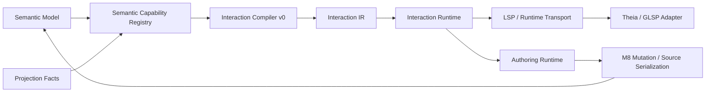

# Architecture Spine - Athena M29 Semantic Interaction Model

## Design Paradigm

M29 uses a semantic action pipeline:

```text
Semantic model and projection facts
  -> Semantic Capability Registry
  -> Interaction Compiler v0
  -> Interaction IR
  -> Interaction Runtime
  -> LSP/runtime transport
  -> Theia/GLSP/frontend adapter
  -> existing authoring/runtime mutation authority
```

Human UI gestures, AI proposals, workflow calls, and APIs may all become Semantic Action Intents.
Only accepted, validated commands may cross into mutation authority.



## Invariants And Rules

### AD-1 - Semantic Action Intent Is The Producer-Neutral Primitive

- **Binds:** FR-1, FR-2, FR-5, FR-7, FR-8, NFR-4, NFR-10
- **Prevents:** human UI gestures, AI actions, and API/workflow actions from growing incompatible command shapes.
- **Rule:** Interaction IR may expose human-facing selection, hover, focus, reveal, preview, accept, and reject actions, but all command-producing flows must use the `SemanticActionIntent -> InteractionCommand -> AuthoringIntent?` mapping in `INTERACTION-CONTRACT.md`.

### AD-2 - Interaction Contracts Live Outside Theia

- **Binds:** FR-1, FR-2, FR-13, NFR-2, NFR-3
- **Prevents:** Theia becoming the owner of interaction meaning.
- **Rule:** Interaction model types must live in a platform-owned boundary. The preferred M29 implementation is a new Gradle project `:kernel:interaction-model`; if the story chooses a lower-risk existing module, it must record why and preserve the same dependency direction. Theia may only consume transported payloads and submit action requests.

### AD-3 - Subject Index Is A Semantic Capability Registry

- **Binds:** FR-3, FR-9, FR-10, FR-11, FR-12, FR-15
- **Prevents:** building `Map<frontend-object, semantic-object>` as the real interaction authority.
- **Rule:** The registry is keyed by `InteractionSubjectKey` plus zero or more `InteractionOccurrenceKey` values as defined in `INTERACTION-CONTRACT.md`. Frontend ids, DOM ids, SVG nodes, and widget ids may appear only as adapter metadata.

### AD-4 - Interaction Compiler v0 Is Derivation Only

- **Binds:** FR-11, FR-12, FR-13, FR-14, FR-16
- **Prevents:** action discovery from mutating source, projection, standards meaning, or frontend state.
- **Rule:** Interaction Compiler v0 derives actions, reveal targets, previews, diagnostics, and transport-safe payloads from model/projection facts and policy. It must not write source, mutate projection facts, or infer standards authority.

### AD-5 - Accepted Commands Cross Existing Mutation Authority

- **Binds:** FR-22, FR-24, FR-26, FR-31, NFR-6
- **Prevents:** M29 creating a second mutation path beside M8/M28 authoring runtime.
- **Rule:** Accepted semantic relationship mutation and semantic entity creation must flow through existing authoring/runtime/source-edit gates. `SemanticRelationshipIntent` remains the relationship mutation contract; `ConnectPortsIntent` is legacy compatibility only.

### AD-6 - Interaction Runtime Owns Session State, Not Semantic Truth

- **Binds:** FR-6, FR-7, FR-8, FR-27, NFR-1, NFR-2
- **Prevents:** pending previews, stale commands, or active UI selections becoming durable engineering data.
- **Rule:** Interaction Runtime owns the `InteractionCommand` lifecycle state machine, pending commands, preview state, diagnostics, actor, origin surface, reason, confidence, and mutation id. It must enforce legal transitions and clear stale transient state on cancel, source reload, projection refresh, or accepted mutation.

### AD-7 - Frontends And Transports Are Adapters

- **Binds:** FR-13, FR-17, FR-18, FR-19, FR-20, FR-21, NFR-2, NFR-3
- **Prevents:** LSP, GLSP, SVG, DOM, or Theia widget behavior from becoming semantic authority.
- **Rule:** LSP/runtime transport carries product-safe Interaction payloads. Theia/GLSP may render affordances and request commands, but must not infer canonical subjects from DOM text, SVG geometry, CSS classes, or widget ids.

### AD-8 - Semantic Entity Creation Is Model-First

- **Binds:** FR-28, FR-29, FR-30, FR-31, FR-32, FR-33, FR-34, FR-35
- **Prevents:** component insertion becoming "drag symbol, then create meaning."
- **Rule:** M29 component insertion must map to the existing `CreateComponentIntent` authoring contract unless implementation documents and reviews a stricter replacement. Symbol placement, graph occurrence, and presentation are projection consequences. Generated component anatomy must use nested ports.

### AD-9 - Standards And Visual Fidelity Are Metadata Only In M29

- **Binds:** FR-16, NFR-5, NFR-9
- **Prevents:** M29 drifting into IEC/QElectroTech/EPLAN library expansion or visual parity work.
- **Rule:** M29 may preserve presentation, symbol, routing, sheet, and standards metadata in Interaction IR. It must not introduce IEC symbol families, QET `.elmt` import, EPLAN visual parity, or standards profile selection.

### AD-10 - Proof Is Structured Before Pixel/Click Assertions

- **Binds:** FR-36, FR-37, FR-38, FR-39, FR-40, SM-1..SM-7
- **Prevents:** brittle product smoke tests hiding broken semantic contracts behind UI luck.
- **Rule:** Verification must assert the structured proof payload inventory in `INTERACTION-CONTRACT.md` first. UI click smoke may be added only where stable. Gradle verification must run sequentially on Windows.

### AD-11 - Legacy Connect-Ports Has No New Direct Call Sites

- **Binds:** FR-22, FR-23, FR-24, FR-25, FR-26, FR-27
- **Prevents:** ledgering the old `connect-ports` path indefinitely while new M29 work still depends on it.
- **Rule:** M29 must create a `connect-ports` inventory before implementation cleanup. New M29 frontend/runtime/LSP work may not call legacy `ConnectPortsIntent` or old `connect-ports` commands directly; compatibility must adapt into `SemanticRelationshipIntent` through Interaction IR and be covered by migration tests.

## Consistency Conventions

| Concern | Convention |
| --- | --- |
| Canonical ids | Use existing `StableSemanticIdentity`-style ids for subjects; interaction ids are request/session ids, not semantic ids. |
| Lifecycle names | Use requested, discovered, validated, previewing, accepted, rejected, mutation-pending, committed, reprojected, blocked, stale, cancelled. |
| Diagnostics | Return structured diagnostics with stable codes for unresolved subjects, unsupported actions, invalid command state, and mutation-ineligible commands. |
| Provenance | Carry actor, origin surface, reason, timestamp when available, and confidence when available. |
| Legacy paths | Remove, migrate, or ledger each retained `connect-ports` path with owner, reason, and target milestone. |
| Source syntax | Do not add new Athena syntax in M29; generated component snippets use M28 nested ports. |

## Structural Seed

Current Gradle-backed projects:

```text
kernel/
  authoring-model/          # existing AuthoringIntent and SemanticRelationshipIntent contracts
  runtime/                  # interaction runtime integration and mutation handoff orchestration
  compiler/                 # interaction compiler derivation from semantic/projection facts
ide/
  lsp/                      # product-safe Interaction payload transport
apps/
  cli/                      # live CLI project; not an M29 adapter target unless stories choose it
```

M29 proposed/new or package-root integration surfaces:

```text
kernel/
  interaction-model/        # preferred new Gradle project for interaction contracts
ide/
  theia-frontend/           # package root/front-end adapter, not listed as a Gradle project today
integrations/
  graph-glsp/               # package root/downstream graph adapter if current implementation requires it
examples/
  m29/sample-project/       # reveal, relationship mutation, semantic entity creation proof
```

## Capability To Architecture Map

| Capability / Area | Lives in | Governed by |
| --- | --- | --- |
| Interaction IR contract | preferred new `:kernel:interaction-model`, or documented lower-risk existing module | AD-1, AD-2, AD-6 |
| Semantic Capability Registry | `kernel/compiler` or `kernel/interaction-model` support | AD-3, AD-4 |
| LSP/runtime payloads | `ide/lsp`, `kernel/runtime` | AD-4, AD-7 |
| Reveal/navigation | `kernel/interaction-model`, `ide/lsp`, `ide/theia-frontend` | AD-3, AD-7 |
| Relationship mutation cleanup | `kernel/authoring-model`, `kernel/runtime`, `ide/lsp`, `ide/theia-frontend` | AD-5, AD-6 |
| Semantic entity creation proof | `kernel/authoring-model`, `kernel/runtime`, source edit protocol, Theia adapter | AD-5, AD-8 |
| Product smoke and cleanup ledger | `examples/m29`, `_bmad-output/implementation-artifacts/m29`, test suites | AD-9, AD-10 |

## Deferred

| Deferred | Reason It Can Wait |
| --- | --- |
| Full undo/redo implementation | M29 only needs lifecycle vocabulary, `undoable`, and mutation id linkage. |
| AI action planner | M29 creates the action/runtime substrate; planning can build on it later. |
| Multi-user interaction state | Session/provenance vocabulary is enough for single-user proof. |
| Full palette/component library UX | M29 proves semantic entity creation with one governed example. |
| IEC/QET/EPLAN visual/library expansion | This is a standards/presentation milestone, not an interaction milestone. |
| New Web/3D/VR adapters and CLI interaction adapter behavior | M29 only needs the contract to keep those future adapters possible; existing `:apps:cli` remains out of scope unless a story explicitly uses it for proof tooling. |
| Full source conflict UI | Existing mutation/source-edit gates remain the authority for M29. |
