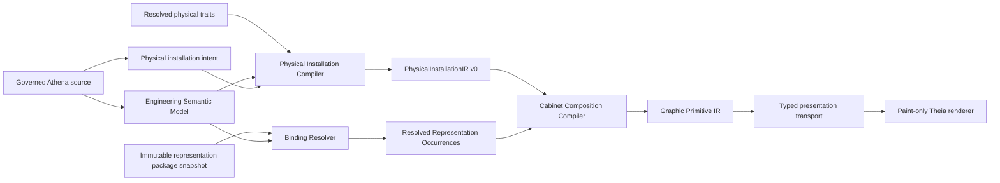
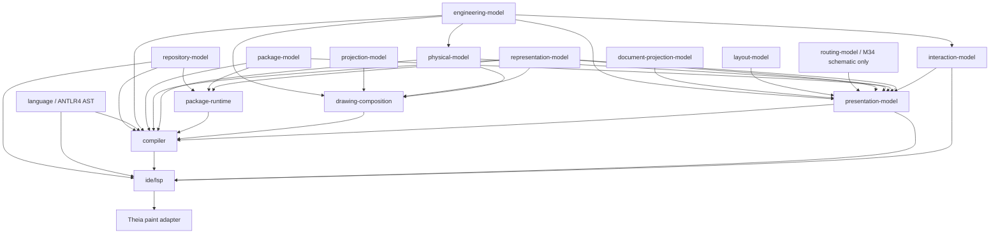
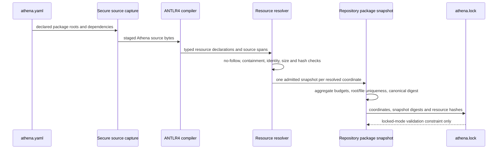

# Architecture Spine - Athena M35

## Design Paradigm

M35 uses a compiler-owned physical projection pipeline. Authored engineering and installation
intent compile into a renderer-neutral physical model. Representation selection remains an
independent policy path. The two paths meet only in Cabinet composition.



## Inherited Invariants

| Inherited | Source | Binds M35 |
| --- | --- | --- |
| Component knowledge is read-only above Engineering IR | M14 AD-75, AD-80 | Existing physical traits may inform installation but never create a mutation authority. |
| Project and representation truth are disjoint | M34 AD-9, AD-21 | Physical installation cannot collapse an Element into an engineering product. |
| RepresentationDefinition is canonical | M34 AD-11 | M35 reuses compiled Symbol/Element definitions and generated descriptors. |
| BindingResolver selects; RepresentationBindingCompiler constructs | M34 AD-16 | Physical placement cannot independently select a visual. |
| GraphicPrimitive is the active visual vocabulary | M34 AD-17 | Cabinet output adds no parallel rendering IR. |
| Package discovery produces immutable snapshots | M34 AD-18 | M35 resource declarations extend snapshot admission instead of bypassing it. |
| Intrinsic and project composition have separate owners | M34 AD-19 | Element child layout stays separate from Cabinet mounting and routing. |
| SVG compiles through a closed safe subset | M34 AD-12, AD-13 | Parser hardening, limits, reference expansion, and transform normalization remain mandatory while metadata authority narrows. |
| Asset bounds and document bounds differ | M34 AD-14 | Physical extents, representation bounds, drawing bounds, and viewport remain separately owned. |
| Visual credibility is an acceptance boundary | M34 AD-15 | Structured proof cannot substitute for professional desktop and narrow screenshots. |
| Function occurrences preserve physical subject identity | M34 AD-23, AD-24 | Schematic functions never become duplicate mounted Cabinet components. |
| QET is evidence, not authority | M34 AD-27 | QET assets and behavior never enter runtime or semantic ownership. |

M35 inherits M34's one-product-surface-at-a-time rule, not M34's final Control Drawing choice.
Cabinet is the single M35 product surface; Control Drawing, Documentation, and Wiring receive only
regression protection.

### M34 SVG Contract Supersession

M35 explicitly supersedes the metadata-authority portions of M34 AD-3, AD-4, AD-5, and the
annotated-SVG importer output allowed by M34 AD-8. The active contract no longer requires
`data-athena-schema` and no SVG attribute may define anchors, labels, roles, directions, signals,
compatibility, identity, lifecycle, profile, or binding. Importers output governed Athena metadata
source plus optional geometry SVG using only XML `id` and matching `data-athena-geometry-ref` hints.
M34 AD-12 and AD-13 remain binding for parser hardening, closed geometry subset, limits, safe
reference expansion, coordinate normalization, and compile-time GraphicPrimitive lowering.

## Invariants And Rules

### AD-1 - Physical Installation Is Derived Engineering Reality [ADOPTED]

- **Binds:** FR-18..FR-27, NFR-1, NFR-3, NFR-7
- **Prevents:** Cabinet state, renderer geometry, or a second semantic world becoming physical truth.
- **Rule:** Project `.athena` owns engineering facts and authored physical installation intent.
  `PhysicalInstallationIR v0` is deterministic compiler output. It is never persisted as independent
  authority and cannot mutate Engineering IR, source, representation definitions, or packages.

### AD-2 - Physical Contracts Have One Kernel Owner [ADOPTED]

- **Binds:** FR-18..FR-27, NFR-3, NFR-7
- **Prevents:** physical facts being split among compiler DTOs, drawing composition, package runtime,
  and frontend payloads.
- **Rule:** `kernel:physical-model` owns physical installation ids, contracts, topology, typed
  measurements, diagnostics, IR records, and pure constraint evaluation. It may depend on
  `kernel:engineering-model`; it must not depend on representation, presentation, package-runtime,
  LSP, renderer, or Theia modules. `kernel:compiler` orchestrates derivation, and
  `kernel:drawing-composition` consumes physical output.

### AD-3 - M35 Reuses Physical Traits Without Creating ECS [ADOPTED]

- **Binds:** FR-12, FR-25..FR-27, SM-7, NFR-7
- **Prevents:** a hidden Engineering Component System or Physical Installation Reference Package
  appearing inside Cabinet work.
- **Rule:** `kernel:physical-model` owns one pure `PhysicalInstallationContractResolver`. It resolves
  the closed `PhysicalInstallationContractV0`: required positive `PhysicalSize(width, height, depth)`,
  required `mountingTypeId`, required non-empty `allowedOrientations`, required non-negative
  `clearance(top, right, bottom, left)`, and required non-empty `compatibleContainerKinds`.
  An explicit project value overrides a resolved physical-trait value. Scalar dimensions and each
  clearance side resolve independently; set-valued fields replace atomically. Multiple values at the
  same precedence, missing fields, and empty required sets fail before IR construction. Every field
  carries typed source provenance. Canonical field order is size width/height/depth, mounting type,
  orientations by enum order, clearance top/right/bottom/left, and container kinds by typed id; this
  encoding owns the contract digest. Existing unchecked `PhysicalSize` remains legacy trait input
  only: the resolver validates each field and constructs new validated M35 measurements after
  diagnostics pass. No unchecked `PhysicalSize` enters `ResolvedPhysicalInstallationContract` or
  `PhysicalInstallationIR`. M35 introduces no product catalog language, manufacturer/article
  identity model, component package kind, or parallel package resolver. Visual Elements never own
  product identity, footprint, mounting, or clearance truth.

### AD-4 - PhysicalInstallationIR Has Stable Topology And Provenance [ADOPTED]

- **Binds:** FR-18..FR-23, FR-32..FR-34
- **Prevents:** unrelated epics inventing incompatible Cabinet object graphs or occurrence identity.
- **Rule:** `PhysicalInstallationIR v0` contains stable typed ids and source provenance for
  `InstallationSpace`, `Enclosure`, `MountingSurface`, `Rail`, `Duct`, `MountedOccurrence`,
  `TerminalGroup`, `RouteChannel`, `RouteChannelTopology`, and `PhysicalRouteIntent`. `Enclosure`
  is the sole physical container and belongs to one InstallationSpace. MountingSurface, Duct, and
  TerminalGroup belong to one Enclosure. MountingSurface and TerminalGroup have bounds and non-empty
  accepted mounting-type sets; TerminalGroup also has an ordering orientation. Rail mounts on one
  MountingSurface and declares length, orientation, and one mounting type. Every RouteChannel belongs
  to exactly one Duct and declares duct-interior-local position, size, axis-aligned orientation, lane
  count, and margin; its rectangle must fit the duct interior after the authored wall inset, and no
  channel is inferred from duct geometry. MountedOccurrence has exactly one
  `containerId: EnclosureId`, one
  `mountTarget: MountingSurfaceId | RailId | TerminalGroupId`, one canonical semantic subject, and
  one `InstallationOccurrenceKey`. Terminals are ordinary MountedOccurrences targeting a
  TerminalGroup; no separate `TerminalOccurrence` exists. Each TerminalGroup owns their deterministic
  key order: local along-axis placement, then cross-axis placement, then key. Duct and RouteChannel
  are not mount targets. Generic `parentId`, duplicate ids, orphan mounts, illegal edges, and cycles
  fail closed.

### AD-5 - Physical Coordinates And Drawing Coordinates Are Different [ADOPTED]

- **Binds:** FR-19..FR-24, NFR-3
- **Prevents:** pixels, drawing-grid positions, or SVG bounds becoming physical dimensions.
- **Rule:** `PhysicalFrame2D v0` uses an upper-left container-interior origin, positive X right,
  positive Y down, and clockwise `DEG_0|DEG_90|DEG_180|DEG_270`. MountingSurface, Duct, and
  TerminalGroup `at` coordinates are enclosure-interior-local; Rail is mounting-surface-local;
  RouteChannel is local to its Duct wall-inset interior; and MountedOccurrence is local to its mount
  target. MountingSurface and TerminalGroup use upper-left local origins with
  positive X right and positive Y down. Rail frame polarity derives only from orientation: a
  horizontal rail has local +X = enclosure +X and local +Y = enclosure +Y; a vertical rail has local
  +X = enclosure +Y and local +Y = enclosure -X. Every target basis is a rigid transform with
  determinant `+1`; target frames never mirror representation geometry. Placement is the upper-left of the
  post-orientation footprint AABB in
  that target-local frame. Nested transforms apply occurrence-local, mount-target-local,
  enclosure-local, then Cabinet drawing transform. Sizes and positions use validated integer
  millimetres: dimensions are positive; positions and four-sided clearances are non-negative. Source
  diagnostics precede construction of invalid value types. One shared transform implementation is
  used by constraints, anchors, routing, composition, and proof. Physical IR owns millimetre extents;
  composition alone owns drawing-unit bounds. Visual bounds never determine footprint, and drawing
  coordinates never flow back into the physical model.

### AD-6 - Physical Constraint Evaluation V0 Validates But Does Not Solve [ADOPTED]

- **Binds:** FR-23..FR-27, NFR-8
- **Prevents:** deterministic validation quietly expanding into a CAD solver or AI layout engine.
- **Rule:** `PhysicalRect` is a closed axis-aligned post-orientation rectangle in canonical
  container-local millimetres. Footprint collision requires intersection width `> 0` and height
  `> 0`; edge contact alone is allowed. Four-sided clearance inflates its owner's footprint. Two
  occurrences violate clearance when either inflated rectangle has positive-area intersection with
  the other's footprint. The selected orientation must belong to `allowedOrientations`; occurrence
  mounting type must belong to the mount target's accepted mounting types; and enclosure kind must
  belong to `compatibleContainerKinds`. In-plane orientation never rotates depth; v0 enclosure usable
  depth is exactly its authored depth, with no Z offset or depth zones, and occurrence depth must be
  less than or equal to that value. Every inflated footprint must fit the
  enclosure interior. For MountingSurface and TerminalGroup targets, the inflated footprint must also
  fit the target-local rectangle. For Rail, target-local normal coordinate must equal zero and the
  along-axis oriented footprint plus leading/trailing clearance must fit `[0, rail.length]`; normal
  extent is checked against the enclosure, not the zero-width rail line. MountingSurface and
  TerminalGroup declare non-empty accepted mounting-type sets; Rail accepts only its declared
  mounting type. Mounting and compatibility use exact typed-id set membership, never string matching.
  MountingSurface, Duct, and TerminalGroup rectangles must fit the Enclosure interior. A Rail's full
  oriented closed interval, including both endpoints, must fit its MountingSurface rectangle.
  Representation/renderer
  body bounds are excluded. Invalid input emits stable source-spanned diagnostics and blocks
  composition. V0 performs no optimization, automatic placement, general solving, or AI layout.

### AD-7 - Existing Repository Descriptor And Lock Remain The Package Contract [ADOPTED]

- **Binds:** FR-5..FR-12, NFR-1, NFR-2
- **Prevents:** `package.athena`, a second manifest, runtime descriptor interpretation, or namespace
  becoming product identity.
- **Rule:** `kernel:repository-model` extends the existing `RepositoryManifest` as the sole typed
  owner of authored package identity/coordinate intent, governed source roots,
  `representationPackageRoots`, and dependency intent. New `ResolvedPackageCoordinate` is derived
  state owned by the resolved package graph/snapshot and `RepositoryLockV2`, never by the manifest.
  One repository loader/parser supplies manifest intent to compiler, package
  runtime, and LSP; independent YAML line scanners are deleted. Governed Athena declarations own
  resources and exported definitions; `AthenaNamespace` is source namespace, not package coordinate.
  `repository-model` also owns the replacement `RepositoryLockV2` value schema and deterministic
  codec: schema identity, resolved coordinates/dependencies, admitted package snapshot digests,
  resource hashes, and compiler/schema identity. `kernel:compiler` is the sole lock validator and
  materializer. Because Athena is unreleased, M35 deletes the v1 reader/writer and old lock-dependent
  snapshot algorithm instead of retaining compatibility. Lock data is evidence, never source or
  runtime semantic authority. Package namespace cannot substitute for manufacturer, article,
  revision, lifecycle, rating, or engineering type.

### AD-8 - Resource Admission Is Two-Phase And AST-Driven [ADOPTED]

- **Binds:** FR-1..FR-11, FR-41..FR-42, NFR-2, NFR-4, NFR-6
- **Prevents:** regex source interpretation, directory-wide resource authority, path rewriting, and
  time-of-check/time-of-use races.
- **Rule:** Package admission first captures governed Athena sources with namespace-aware parsing,
  fail-closed no-follow/root-containment checks. `kernel:package-model` owns the immutable
  `PackageAdmissionLimitsV1` used unchanged by capture, SVG lowering, diagnostics, proof, and tests:
  at most 64 resolved packages, 1,024 governed source units and 1,024 declared resources per package,
  262,144 bytes per SVG, 32 MiB admitted bytes per package, 256 MiB per repository, SVG DOM depth 32,
  512 XML elements, 256 expanded `use` instances, 8,192 path segments, 256 emitted primitives,
  100,000 work units per package, and 1,000,000 per repository. Package-authored overrides are
  forbidden in M35. One work unit is charged for each admitted source/resource entry, parsed XML
  element, expanded `use` instance, parsed path segment, and emitted primitive. Absolute paths,
  traversal, symlinks, junctions/reparse points, external access, overlapping package roots, and one
  physical file admitted under multiple coordinates fail. The ANTLR4 compiler parses package and
  typed resource declarations from staged bytes. The resolver captures only declared package-local
  resources, verifies identity before and after read, and creates one `AdmittedPackageSnapshot` per
  coordinate. One ordered `ResolvedRepositoryPackageSnapshot` aggregates them and enforces both
  package and repository budgets. Compiler, binding, lock, proof, and rendering consume this same
  aggregate handle. Package/path and resource validation use AST facts; current regex scans for
  `package` and `graphic svg` are removed from the active path.

  For each governed source root, the compiled lowercase `AthenaNamespace` segments must equal the
  normalized source-root-relative parent directory exactly; default-package source is forbidden.

### AD-9 - Resource Identity Is Logical; Snapshot Identity Is Content-Bound [ADOPTED]

- **Binds:** FR-5..FR-10, NFR-2
- **Prevents:** same-named vendor assets colliding or caches surviving source/resource changes.
- **Rule:** `SourceUnitId` is `(ResolvedPackageCoordinate, normalized package-root-relative path)`;
  `PackageResourceKey` is `(SourceUnitId, resourceDeclarationId)`. A bare resource id is lexical to
  one governed source unit: `graphic svg resource <id>` may reference only a declaration in the same
  `.athena` file. Duplicate ids in one source unit fail; the same id in different source units is
  legal and does not shadow. Moving a declaration to another source unit intentionally changes its
  key. Dependencies expose compiled Symbol/Element definitions, never cross-source or cross-package
  raw resource references. Symbol/Element version is never package version. Portable paths use `/`,
  reject empty/`.`/`..` segments, normalize Unicode to NFC, and reject case-folded or normalization
  collisions within a package snapshot.
  A declared resource path resolves only from its declaring SourceUnit directory inside that
  package's admitted snapshot. Direct physical-path reads across package coordinates are forbidden;
  dependencies are reached only through exported logical definitions resolved inside the dependency
  snapshot.
  `AdmittedPackageSnapshotDigest` hashes normalized descriptor intent, resolved coordinate, sorted
  staged source/resource hashes, and compiler/schema version; it never hashes generated lock bytes.
  `athena.lock` records that digest. `ValidatedLockStateDigest` hashes canonical resolved lock facts,
  never file bytes; before successful validation its fixed sentinel is
  `lock-state/v1:unlocked`. Neither value participates in resource keys or package snapshot identity.
  The higher compilation/cache fingerprint includes only a validated digest. Validate mode is
  read-only and fails closed on missing, stale, or schema-incompatible lock state with stable
  `repository.lock.missing`, `repository.lock.stale`, or `repository.lock.schema-incompatible`
  diagnostics. Explicit update mode computes admitted state, writes canonical bytes to a
  same-directory temporary file, atomically replaces `athena.lock`, cleans temporary output on every
  failure, revalidates, and only then exposes a validated digest; unsupported atomic replacement or
  write failure emits `repository.lock.write-failed` and accepts no partial lock. Renderer and
  runtime never resolve original filesystem paths.

### AD-10 - SVG Can Point But Cannot Define [ADOPTED]

- **Binds:** FR-13..FR-17, NFR-1, NFR-5
- **Prevents:** M34's broad `data-athena-*` profile becoming a second representation language.
- **Rule:** Athena source owns identity, lifecycle, anchors, labels, roles, directions, signals,
  compatibility, profile, and binding. SVG owns untrusted geometry only. `SvgGeometryNodeIndex` uses
  XML `id` as its sole lookup key; optional `data-athena-geometry-ref` must equal that id. IDs are
  lookup keys before expansion. A referenced id must materialize exactly once after safe acyclic
  `use` expansion; zero instances fail missing and multiple instances fail ambiguous. Unreferenced
  geometry may repeat. Successful lookup returns the normalized node plus accumulated transform.
  Missing or ambiguous reference fails package admission. Geometry references never
  supply anchor coordinates, role, direction, signal, compatibility, or physical size. M34's
  namespace awareness, no-I/O parser hardening, closed SVG subset, coordinate normalization, and
  resource limits remain binding. Legacy SVG anchor/role/direction/signal metadata is deleted. Safe
  lowering emits `GraphicPrimitive`; raw markup never crosses compiler transport.

### AD-11 - Physical Placement And Representation Selection Stay Parallel [ADOPTED]

- **Binds:** FR-18..FR-27, FR-32..FR-34, NFR-3, NFR-7
- **Prevents:** physical constraints selecting Elements or visual geometry deciding installation.
- **Rule:** `InstallationOccurrenceKey` is owned by `physical-model` and is exactly
  `(SourceUnitId, installationDeclarationId, canonicalSemanticSubjectId)`. The compiler passes the
  same key to physical compilation and Cabinet representation
  construction. Cabinet v0 requires exactly one mounted occurrence and one resolved representation
  occurrence per key; missing or duplicate sides fail. `CabinetVisualTransform` maps non-degenerate
  intrinsic representation bounds in this exact order: (1) translate intrinsic-bounds minimum to
  origin; (2) uniformly scale with aspect ratio preserved into the unrotated footprint; (3) centre in
  that footprint; (4) rotate clockwise around the footprint centre; (5) translate the rotated AABB
  minimum to target-local placement; (6) apply target-to-enclosure transform; and (7) apply the
  millimetre-to-drawing scale and document offset. One transform id projects body, anchors, labels,
  hotspots, bounds, routes, and trace; no consumer recalculates it. Golden tests cover body bounds and
  anchors at 0, 90, 180, and 270 degrees plus horizontal/vertical Rail target frames, proving no
  reflection.
  Physical constraints never select an Element, and visual geometry never supplies physical facts.

### AD-12 - Physical Routing Has Three Explicit Owners [ADOPTED]

- **Binds:** FR-28..FR-31, SM-4
- **Prevents:** route geometry, channel topology, and semantic connections collapsing into renderer
  heuristics.
- **Rule:** Engineering connections own endpoint identity. `PhysicalInstallationIR` owns only
  `RouteChannelTopology`, physical obstacles, and `PhysicalRouteIntent` keyed by stable
  `EngineeringConnectionId`; it owns no final anchor coordinates or route segments.
  Every connection has one source-unit-unique authored alias. The canonical
  `EngineeringConnectionId` is `(SourceUnitId, connectionAlias)`; endpoint facts validate that
  identity but do not replace it. Group names remain non-semantic organization and never identify an
  individual connection. Alias-free grouped and ungrouped forms are removed in M35. A `route` resolves
  only an alias in its own SourceUnitId; cross-source lookup fails with
  `physical.route.connection-alias.out-of-scope`.
  `CabinetRoutingCompiler` in `drawing-composition` consumes those facts, bound representation
  anchors, and the shared CabinetVisualTransform, and emits one `CabinetRouteFact` per connection:
  ordered channel ids, transformed endpoint bindings, ordered orthogonal segments, intersection
  proof, and source provenance. Grouped `connect` syntax never merges connection identity. V0 is a
  fixed non-search algorithm. Each intent supplies ordered channel ids. For channel cross-axis span
  `S`, margin `M`, and lane count `N`, require `N > 0` and usable span `U = S - 2M > 0`; zero-based
  lane `i` has centre offset `M + ((2i + 1) * U) / (2N)` from the minimum cross-axis edge. Derived
  lane coordinates use reduced exact rational millimetres with no rounding before drawing transform.
  Connections using a channel sort by stable connection id and take lane indices in order up to
  capacity `N`; horizontal lanes therefore allocate top-to-bottom and vertical lanes left-to-right.
  Golden tests cover odd/non-divisible spans and full capacity.

  `RouteChannelTopology` owns one derived `RouteChannelAdjacency` only when two channels belong to the
  same Duct, their rectangle interiors are disjoint, and their boundaries intersect in exactly one
  axis-aligned segment whose length remains positive after trimming `max(marginA, marginB)` from both
  ends. The exact rational midpoint of that trimmed segment is the sole passable boundary. Cross-duct,
  corner-only, overlapping, gapped, or multiply intersecting transitions are unsupported and fail.
  Consecutive ids in a route must have that adjacency. Transitions use the passable-boundary midpoint
  projected to each lane; orthogonal bends are horizontal then vertical, with exact ties choosing
  lower X then lower Y. Endpoint stubs run from
  the transformed anchor to the nearest point on the first/last assigned lane using the same
  horizontal-then-vertical and tie rules. Stub and on-channel segments may not intersect any
  non-endpoint body. Invalid channel adjacency, duct containment, lane capacity, anchor compatibility,
  segment containment, or intersection fails composition; V0 performs no alternate-route search.
  Existing schematic `routing-model` is not M35 physical-route authority.

### AD-13 - Graphic Occurrence Trace Is Typed And End-To-End [ADOPTED]

- **Binds:** FR-32..FR-36, SM-5
- **Prevents:** source reveal and future editing depending on DOM ids, SVG nodes, labels, or file-name
  guesses.
- **Rule:** `presentation-model` owns versioned `GraphicOccurrenceTraceTable`, keyed by
  `GraphicOccurrenceId` distinct from `GraphicPrimitiveId`. `GraphicOccurrenceSubject` is a sealed
  union of MountedSemanticSubject, InstallationDeclarationSubject, and EngineeringConnectionSubject;
  no synthetic semantic ids are allowed. Each selectable primitive carries only its occurrence id;
  decorative primitives are explicitly nonselectable and excluded from completeness proof. Trace
  entries contain canonically ordered role-labelled typed ids, source spans, and digests for semantic
  subject, installation declaration, mounted occurrence, binding rule, representation definition,
  resource snapshot, and owning declarations, but no source bytes or snapshot objects. LSP transports
  the table; selection maps its typed subject through the existing `InteractionSubjectResolver`,
  backed by `SemanticCapabilityRegistry`. The frontend's semantic-id prefix inference is deleted when
  this table becomes active; DOM ids, label text, and prefix heuristics are never fallback authority.

### AD-14 - Trace Does Not Create A Graphic Mutation Path [ADOPTED]

- **Binds:** FR-35..FR-36, NFR-1
- **Prevents:** drag operations or AI agents editing renderer state and later attempting to reconcile
  source.
- **Rule:** M35 proves trace and declares the future edit contract only. `MoveMountedOccurrence`
  targets the authoritative installation declaration; `ChangeRepresentationBinding` targets
  binding/profile source; engineering replacement targets governed engineering source. A generic
  graphic/representation move intent is forbidden. Every action follows the single M31
  `SemanticActionIntent -> governed capability/command translation -> AuthoringIntent ->
  SemanticAuthoringTransaction -> AuthoringPreview + AuthoringSourceEditEvidence -> compile/lint ->
  accept/reject -> rerender` path. SVG DOM, Graphic
  Primitive IR, Presentation IR, and renderer state are never authoritative mutation targets.

### AD-15 - Language And Editor Grammars Move Together [ADOPTED]

- **Binds:** FR-1..FR-3, FR-9, FR-28, NFR-4
- **Prevents:** type-safe compiler syntax appearing as editor errors or package validation using a
  third parser.
- **Rule:** Public additions are the minimum domain-facing physical intent, the exact
  `resource <id> { kind svg path "./asset.svg" }` plus `graphic svg resource <id>` forms, and required
  connection aliases: `connect <alias> <from> -> <to>` or grouped
  `connect <group> { <alias>: <from> -> <to> }`. `installation cabinet <id>` is a system member and
  `cabinet` is the only admitted M35 installation kind; `route <alias> through [...]` is an
  installation member and resolves only a same-source-unit connection alias. Every connection is
  aliased. Existing alias-free AST/forms and all unreleased fixtures are migrated then deleted in the
  owning grammar story; there is no compatibility parser. ANTLR4 remains semantic parser authority.
  Tree-sitter provides
  editor parsing/highlighting only and must pass a shared accepted/rejected syntax corpus. Grammar,
  AST, type checking, formatter, LSP diagnostics/completion/tokens, Tree-sitter grammar, and examples
  ship in the same owning story. Internal names such as `PhysicalInstallationIR`, occurrence,
  descriptor, snapshot, and renderer are not public top-level keywords. The normative M35 source
  surface is the minimal grammar and accepted example in the PRD addendum; parser parity extends the
  existing `examples/m23/parser-parity-proof` corpus rather than creating a second corpus.

### AD-16 - M35 Is Offline, Deterministic, And Single-Surface [ADOPTED]

- **Binds:** FR-37..FR-40, NFR-2, NFR-5, NFR-7
- **Prevents:** network/environment variance and multiple partial views hiding a weak Cabinet proof.
- **Rule:** Compile, bind, compose, render, and E2E use repository-declared local packages and make no
  network request. Equal semantic snapshot, installation intent, physical-contract digest,
  representation snapshot, compiler/schema version, and `ValidatedLockStateDigest` produce
  byte-stable ordered facts. `PhysicalInstallationIR` owns physical extents. Cabinet composition derives drawing bounds
  from enclosure, mapped occurrences, rails, ducts, terminal groups, routes, labels, frame, and
  padding; PresentationDocument owns the viewport from those bounds. Label slots come from
  representation definitions, values from governed source, and placement from composition. One
  dedicated M35 sample with one standard package and one vendor/user package opens Cabinet by
  default. Completion requires zero diagnostics, fallback, XML authority, raw-markup transport,
  clipping, text overflow, unintended overlap, unbound anchors, off-channel routes, required body
  intersections, or missing trace. Fresh screenshots at 1920x1080, 1280x900, and one narrow viewport
  must visibly include enclosure, mounting surface/rail, duct/channels, terminal group, mounted
  controls, readable labels, contained routes, and professional density; canvas-pixel proof must be
  nonblank. Screenshot existence alone is not acceptance.

### AD-17 - Polish And Purge Is A Story Gate [ADOPTED]

- **Binds:** FR-41..FR-42, NFR-6
- **Prevents:** M35 leaving regex parsers, XML authority, SVG metadata authority, stale fixtures, or
  duplicate composition paths behind each story.
- **Rule:** Every story's last task inspects touched and adjacent paths, removes unreleased legacy and
  generated evidence, and records any genuinely deferred item with owner, reason, target milestone,
  and verification. Every story records RED/GREEN command evidence plus AC-to-evidence review before
  this gate. A story cannot become done before it passes.

### AD-18 - M35 Has One Cabinet Composition Path [ADOPTED]

- **Binds:** FR-18..FR-40, NFR-3, NFR-5, NFR-6
- **Prevents:** existing schematic Layout IR, legacy Geometry IR, Cabinet composition, and the new
  physical path becoming parallel active authorities.
- **Rule:** M35 Cabinet consumes `PhysicalInstallationIR + resolved RepresentationOccurrence ->
  CabinetCompositionCompiler -> GraphicPrimitive -> PresentationDocument`. It does not consume
  `LayoutIntent`, `SchematicPlacementFact`, legacy `GeometryDocument`, `PresentationPrimitive`, or
  direct SVG/box producers. The M34 Control Drawing retains regression tests on its existing
  schematic path. Any old Cabinet-specific producer gains no M35 caller and is migrated/deleted after
  a zero-caller/deletion test. No fourth spatial, geometry, route, or rendering IR is introduced.

## Dependency Direction

Arrows are provider-to-consumer. This is the M35 load-bearing dependency subgraph, not a complete
Gradle graph. Unshown existing direct dependencies remain code-owned and unchanged unless an AD or
ledger row explicitly removes them. Retained M34 Control Drawing edges that clarify authority are
shown even though they are not M35 authorities.



Forbidden reverse dependencies:

- `physical-model` -> representation, package runtime, presentation, LSP, renderer, or Theia;
- package/resource snapshot -> product identity or project semantic mutation;
- drawing composition -> source parsing or package discovery;
- `routing-model` -> M35 physical route topology or `CabinetRouteFact` ownership;
- presentation/renderer -> physical constraint evaluation, representation selection, or filesystem;
- SVG/resource internals -> semantic, physical, binding, or editing authority.

## Brownfield Contract Ledger

`[ADOPTED]` means the decision is accepted; it does not claim the target API already exists.

| Status | Contract / edge | M35 disposition |
| --- | --- | --- |
| EXISTING | `PhysicalSize` trait input | Retain as unchecked legacy input; validate and convert at `PhysicalInstallationContractResolver`. |
| EXISTING | `SemanticActionIntent`, `AuthoringIntent`, `SemanticAuthoringTransaction`, `AuthoringPreview`, `AuthoringSourceEditEvidence` | Reuse exact M31 authoring contracts and governed translation boundary; add no aliases. |
| EXISTING | `SemanticCapabilityRegistry`, `InteractionSubjectResolver` | Reuse for typed trace selection; delete frontend prefix inference. |
| EXISTING | `RepresentationDefinition`, resolved representation occurrence, `GraphicPrimitive`, `PresentationDocument` | Reuse as M35 representation and paint vocabulary. |
| EXISTING | M34 Control Drawing `LayoutIntent` / schematic placement and routing path | Retain for regression only; it is not a Cabinet authority. |
| EXTEND | `RepositoryManifest` and the repository contract loader | Add typed package roots and make one parser feed every consumer; delete duplicate YAML scanners. |
| REPLACE | `RepositoryLock` schema v1 and lock-dependent snapshot identity | Replace with `RepositoryLockV2`, canonical codec, and lock-independent snapshot identity; no compatibility reader. |
| EXTEND | ANTLR AST, compiler, Tree-sitter, formatter, LSP language features | Add typed resource and minimal physical installation syntax through one parity corpus. |
| REPLACE | Alias-free `ConnectionDeclaration` / grouped edge syntax and derived endpoint+ordinal identity | Require aliases in grouped and ungrouped AST; migrate grammar, semantic lowering, formatter, LSP, examples, and tests together; delete old forms under AD-12, AD-15. |
| EXTEND | `package-runtime -> package-model + representation-model` | Add `package-runtime -> repository-model` for typed manifest/snapshot ids under AD-7..AD-9. |
| EXTEND | `drawing-composition -> engineering-model + projection-model + representation-model` | Add `drawing-composition -> physical-model` for Cabinet join/routing under AD-11, AD-12, AD-18. |
| EXTEND | `presentation-model -> engineering-model + document-projection-model + layout-model + routing-model + representation-model` | Add typed M35 physical/package/interaction references under AD-13; retained routing dependency remains schematic-only. |
| NEW IN M35 | `PhysicalInstallationContractV0`, resolver, validated measurements, contract digest | Owned by `physical-model` under AD-2, AD-3. |
| NEW IN M35 | `PhysicalInstallationIR v0`, topology, evaluator, route intent, `InstallationOccurrenceKey` | Owned by `physical-model` under AD-4..AD-6, AD-11, AD-12. |
| NEW IN M35 | `PackageAdmissionLimitsV1`, `AdmittedPackageSnapshot`, `ResolvedRepositoryPackageSnapshot`, `ValidatedLockStateDigest` | Policy in `package-model`, values/ids in repository/package models, orchestration in package runtime/compiler under AD-7..AD-10. |
| NEW IN M35 | `ResolvedPackageCoordinate`, `SourceUnitId`, `PackageResourceKey` | Derived package/source/resource identity values; manifest owns authored intent, resolved graph/lock owns resolved coordinate, and source/resource keys follow AD-9. |
| NEW IN M35 | `CabinetCompositionCompiler`, `CabinetVisualTransform`, `CabinetRoutingCompiler`, `CabinetRouteFact` | Owned by `drawing-composition` under AD-11, AD-12, AD-18. |
| NEW IN M35 | `GraphicOccurrenceTraceTable` and typed occurrence subjects | Owned by `presentation-model` under AD-13, AD-14. |

## Physical Contract Seed

```text
PhysicalInstallationIR
  installationSpace
    enclosure
      mountingSurface
        rail
      terminalGroup -> ordered mounted-occurrence keys
      duct / routeChannel
      mountedOccurrence -> mount target + canonical semantic subject
  routeChannelTopology -> same-duct derived adjacency + exact rational lane centres
  physicalRouteIntent -> stable engineering connection id + authored channel sequence
  diagnostics
  provenance

CabinetComposition
  cabinetVisualTransform
  graphicOccurrence
  cabinetRouteFact -> endpoints + ordered channel traversal + ordered segments + proof
  graphicOccurrenceTraceTable
```

Required identity chain:

```text
canonical semantic subject
  -> authored installation intent
  -> mounted occurrence
  -> resolved representation occurrence
  -> composed graphic occurrence
  -> interaction subject
  -> source declarations
```

## Package Resource Admission



## Consistency Conventions

| Concern | Convention |
| --- | --- |
| Physical ids | Stable opaque value classes; never list indices, labels, DOM ids, or file names. |
| Physical measurements | Integer millimetres in `physical-model`; finite and non-negative; dimensions required positive. |
| Physical placement | Mount-target-local physical coordinates plus discrete orientation; enclosure is the sole container; no pixel or drawing-grid source truth. |
| Contract precedence | Project field overrides trait field; same-precedence duplicate is ambiguous; canonical resolved contract owns digest. |
| Physical topology | Typed containment and mount-target fields; no generic parent id. |
| Occurrence join | One `InstallationOccurrenceKey`; exactly one physical and one representation occurrence in Cabinet v0. |
| Source provenance | Repository/package id, normalized package-relative source path, declaration id, and source span. |
| Diagnostics | Stable code, severity, subject id, source span where available, measured value, and expected constraint. |
| Ordering | Sort by stable typed id before hashing, proof emission, transport, or snapshot comparison. |
| Resources | Bare id is source-unit lexical; typed declaration and package-local path; dependencies expose definitions, never raw resources. |
| Portable paths | `/` separators, NFC normalization, no empty/`.`/`..`; case-folded or normalized collisions reject. |
| Cache identity | Semantic/install/contract/admitted-snapshot/schema and validated-lock-state digests; generated lock bytes never feed snapshot identity. |
| Lock operation | Validate is read-only/fail-closed; update uses canonical temp + atomic replace + revalidation; compiler is sole materializer. |
| Admission limits | One non-overridable `PackageAdmissionLimitsV1` instance governs capture, SVG lowering, proof, diagnostics, and tests. |
| Route proof | Route count, channel usage, endpoint bindings, ordered segments, body intersections, off-channel segments, and unbound endpoints. |
| Trace transport | One versioned table per document; primitives carry occurrence id, never duplicate full traces. |
| Kotlin files | Group small related contracts in `*Models.kt`; split evaluator, compiler, resolver, protocol, and mapper behavior by role. |
| E2E evidence | Structured authority/geometry proof plus fresh screenshots and canvas-pixel check. |

## Stack

| Name | Declared constraint | Resolved / executable version |
| --- | --- | --- |
| Kotlin | 2.4.0 | 2.4.0 |
| Gradle | 9.6.1 | 9.6.1 |
| ANTLR | 4.13.2 | 4.13.2 |
| LSP4J | 0.23.1 | 0.23.1 |
| Eclipse Theia | 1.73.1 | 1.73.1 |
| Electron | transitive product runtime | 39.8.7 |
| TypeScript | 5.9.3 | 5.9.3 |
| Node.js | >=22 | CI/E2E-provisioned 22.x |
| tree-sitter CLI | >=0.26.1 | 0.26.11 |
| web-tree-sitter | ^0.26.0 | 0.26.11 |

These are existing repository constraints and resolved versions, not new M35 technology choices.
The checked-in Gradle wrapper/version declarations and npm lockfiles are CI/E2E executable-graph
authority. Gradle verification on this Windows repository runs sequentially.

## Structural Seed

```text
kernel/
  physical-model/          # installation contracts, IR, units, topology, evaluator, diagnostics
  repository-model/        # typed RepositoryManifest, RepositoryLockV2, canonical codec, snapshot ids
  language/                # typed resource and installation-intent AST; ANTLR remains authoritative
  package-model/           # package/resource keys and descriptor-independent resolved ids
  package-runtime/         # two-phase per-package and aggregate immutable snapshot admission
  compiler/                # physical derivation, resource declaration compilation, orchestration
  drawing-composition/     # Cabinet join, visual transform, physical routing, CabinetRouteFact
  representation-model/    # existing definitions, occurrences, GraphicPrimitive, transport
  interaction-model/       # existing capability registry and subject resolver
  presentation-model/      # Cabinet payload and normalized GraphicOccurrenceTraceTable

ide/
  lsp/                     # diagnostics, proof, trace, completion, semantic tokens
  tree-sitter-athena/      # editor-only syntax/highlighting grammar and shared corpus tests
  theia-frontend/          # paint, selection, reveal; no engineering/physical inference
  theia-product/           # dedicated M35 smoke and screenshot proof

examples/m35/physical-installation-cabinet/
  athena.yaml
  athena.lock
  src/com/engineeringood/m35/...                 # project source follows package hierarchy
  packages/representation/com/engineeringood/... # Athena definitions and package-local resources
```

## Capability To Architecture Map

| Capability / Area | Lives In | Governed By |
| --- | --- | --- |
| Package/path validation | language AST + compiler + repository contract | AD-7, AD-8, AD-15 |
| Package-local resources and lock evidence | language + repository-model + package-model + package-runtime | AD-7..AD-10 |
| Complex SVG-backed Element | compiler + representation-model | AD-9, AD-10 |
| Physical Installation Contract | physical-model | AD-2..AD-6 |
| PhysicalInstallationIR v0 | physical-model + compiler | AD-1..AD-6 |
| Cabinet composition | drawing-composition + compiler | AD-5, AD-11 |
| Physical routing | physical-model + drawing-composition + compiler | AD-12, AD-18 |
| Graphic/source trace | interaction-model + presentation-model + LSP | AD-13, AD-14 |
| IDE syntax support | language + LSP + tree-sitter-athena | AD-15 |
| Product proof | example + Theia product smoke + structured proof | AD-16, AD-17 |

## Deferred

| Deferred | Revisit Condition |
| --- | --- |
| Engineering Component System and vendor product catalog | M35 proves physical installation contracts without visual or package ownership leakage. |
| Reusable product-owned physical contract authoring | ECS has an explicit identity and version boundary; M35 uses project facts and existing resolved traits. |
| Physical Installation Reference Package | Not planned; reconsider only if the existing package graph cannot export future ECS contracts without a new authority. |
| Constraint solving, optimization, and Auto Layout AI | Validation-only physical model, diagnostics, trace, and deterministic sample placement are stable. |
| Shared authored keep-out / `ClearanceZone` topology | Four-sided occurrence clearance proves insufficient for a required Cabinet rule. |
| General 3D or mechanical assembly model | A second physical projection proves the 2D installation contract insufficient. |
| Network registry, publishing, signing, and trust distribution | Offline package/resource admission and lock reproducibility are proven. |
| Graphic-side mutation UI | Typed trace is stable and M31 authoring transactions can express physical movement/replacement safely. |
| Documentation, Schematic, Wiring, Panel, Machine, and Field polish | The single Cabinet product proof passes all M35 gates. |
| Full QET/vendor importer | Athena resource, physical, and representation contracts are stable; importer remains offline and outputs governed source. |

## Resolved Planning Questions

- Typed resource syntax is `resource <id> { kind svg path "./asset.svg" }`, consumed by
  `graphic svg resource <id>`; Athena source is the only resource-declaration authority.
- Mandatory visual approval is the AD-16 structural checklist plus structured package, physical,
  routing, bounds, and trace proof; pixel-perfect comparison is not authoritative.
