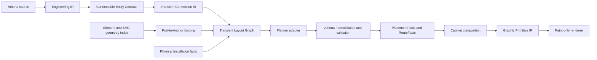
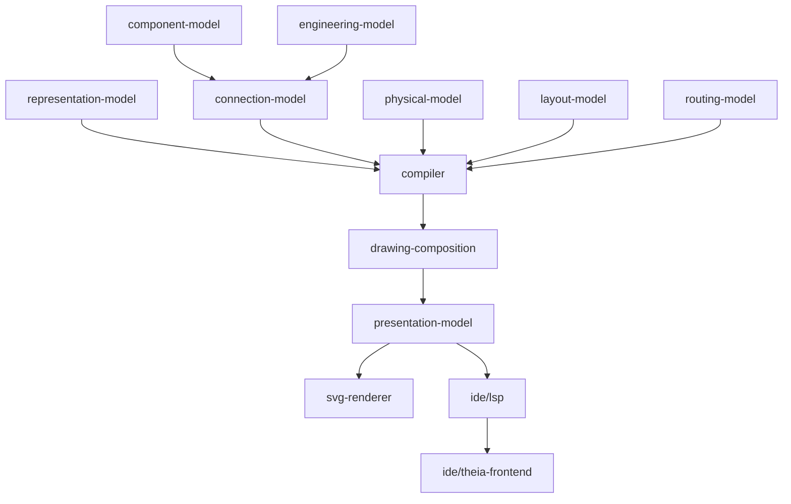

# Architecture Spine - Athena M36 Engineering Connectivity Semantics

## Design Paradigm

M36 is a compiler pipeline with authority-gated planner adapters.



All arrows after source are derived. No planner, SVG resource, frontend surface, or renderer owns
engineering identity, source mutation, or persisted layout truth.

## Inherited Invariants

| Inherited | Source | Binds M36 |
| --- | --- | --- |
| Athena source is SSOT | M34/M35/M36 PRD | Engineering and representation metadata remains compiler-owned. |
| SVG is geometry only | M35/M36 PRD | SVG may expose only `data-athena-ref`; it cannot declare semantic facts. |
| Renderer is paint-only | M30-M35 | Renderer consumes derived primitives and never infers placement or connections. |
| Physical Installation is a projection | M35 | Cabinet constraints remain outside semantic source truth and product identity. |
| Cabinet is the only product proof | M35/M36 PRD | Documentation and Schematic do not compete for M36 acceptance. |
| Legacy compatibility is not required | M35 | Unreleased XML and renderer-owned paths may be removed rather than adapted. |

## Invariants And Rules

### AD-1 - Athena Owns Connectivity Authority [ADOPTED]

- **Binds:** FR-1..FR-4, FR-10..FR-13, FR-30..FR-32, FR-37..FR-40
- **Prevents:** SVG, planner, frontend, or renderer code redefining engineering connectivity.
- **Rule:** `.athena` source and existing compiler-owned component knowledge are the sole authorities
  for Connectable Entity identity, Ports, Interfaces, Connections, Connection Networks, constraints,
  and Route Intent. Derived forms carry provenance but never precedence over source.

### AD-2 - Connectable Entity Contract Is A Narrow Compiler View [ADOPTED]

- **Binds:** FR-1..FR-4, FR-37
- **Prevents:** M36 creating a second component catalog or diluting M14 component knowledge.
- **Rule:** `component-model` and `connection-model` expose a Connectable Entity Contract that may
  resolve from existing component knowledge or a project entity. The contract contains only identity,
  typed Interfaces/Ports, compatibility parameters, and provenance required for connectivity.
  Manufacturer identity, lifecycle, catalogs, datasheets, behavior, and procurement stay upstream or
  deferred.

### AD-3 - Engineering Lowering Produces Transient IR [ADOPTED]

- **Binds:** FR-14..FR-18, FR-37, NFR-9
- **Prevents:** Layout Graph or planner coordinates becoming a second authored model.
- **Rule:** `compiler` lowers Engineering IR into snapshot-bound Connection IR and Layout Graph.
  These IR forms are immutable derived inputs, are not serialized as project authority, and cannot be
  edited independently. Only validated PlacementFacts and RouteFacts may cross into composition.

### AD-4 - Constraint Ownership Is Explicit [ADOPTED]

- **Binds:** FR-3, FR-7, FR-14..FR-18, FR-24, FR-26..FR-27, FR-38
- **Prevents:** a planner weakening engineering, representation, or physical requirements to improve
  aesthetics.
- **Rule:** Every lowered constraint records owner and strength. Semantic Constraints belong to
  `connection-model`; Representation Constraints belong to `representation-model`; Physical
  Constraints belong to `physical-model`; Layout Preferences belong to projection intent or planner
  policy. Required constraints are never traded. Preferred and optional layout preferences may be
  traded only with explicit RouteQuality/diagnostic evidence.

### AD-5 - Port-To-Anchor Binding Is Explicit And One-Way [ADOPTED]

- **Binds:** FR-2, FR-5..FR-9, FR-25..FR-26
- **Prevents:** geometry ids, SVG appearance, or DOM positions being guessed as Port semantics.
- **Rule:** `representation-model` binds a semantic Port to one compatible Element Anchor. An Anchor
  resolves to native geometry or exactly one SVG `data-athena-ref` location. SVG may identify a
  geometry location only. Missing, duplicate, ambiguous, or incompatible binding fails before
  lowering.

### AD-6 - Planner Is A Compiler-Owned Replaceable Optimizer [ADOPTED]

- **Binds:** FR-19..FR-24, FR-27, FR-38..FR-40
- **Prevents:** ELK, a frontend library, or a future algorithm becoming an authority boundary.
- **Rule:** `compiler` invokes Planner SPI with a transient Layout Graph and accepts only a
  snapshot-matched proposal. M36 Core ships Athena-native deterministic planning. A JVM ELK adapter
  is optional and must return the same normalized proposal contract. Planner output cannot mutate
  source, assign identities, select representations, or bypass validation.

### AD-7 - Route Intent Precedes Route Geometry [ADOPTED]

- **Binds:** FR-10..FR-13, FR-25..FR-29, FR-39..FR-40
- **Prevents:** point-to-point line drawing, mandatory authored channel sequences, and a visual
  bundle changing semantic connectivity.
- **Rule:** `connection-model` owns Connection and Connection Network facts. `routing-model` owns
  Route Intent, Route Bundle, Route Fact, junction, crossing, quality, and planner evidence.
  A Route Intent carries requirements/preferences only; final segments and channels appear only in a
  derived Route Fact. Crossings never imply joins and Route Bundles never alter Connection meaning.

### AD-8 - Cabinet Physical Policy Gates Planner Output [ADOPTED]

- **Binds:** FR-17, FR-24..FR-29, FR-33..FR-36
- **Prevents:** generic graph layout overriding rail, duct, clearance, or mounting reality.
- **Rule:** `physical-model` exposes enclosure containment, mount targets, rail fit, clearance,
  duct/channel feasibility, channel capacity, and physical routing policy. `compiler` evaluates that
  policy before emitting accepted facts; `drawing-composition` consumes accepted facts only. Generic
  planner placement may propose; Cabinet policy accepts or rejects.

### AD-9 - Frontend And Renderer Consume Normalized Facts Only [ADOPTED]

- **Binds:** FR-22, FR-30..FR-36, NFR-1..NFR-6
- **Prevents:** LSP/Theia lifecycle, raw SVG, DOM state, or renderer state becoming hidden authority.
- **Rule:** LSP transports typed diagnostics, source traces, PlacementFacts, RouteFacts, and Graphic
  Primitive payloads. Theia selects through occurrence/subject trace. The renderer paints primitives.
  Any graphic-side edit enters governed intent, source mutation preview, compile, validation, and
  rerender.

### AD-10 - Acceptance Requires Semantic And Visual Proof [ADOPTED]

- **Binds:** FR-33..FR-36, SM-1..SM-7
- **Prevents:** a visually plausible screenshot masking unbound ports, invalid routes, or fake source
  traceability.
- **Rule:** The dedicated Cabinet sample must compile source-first and prove each accepted Route Fact
  contains Connection, endpoint Ports/Anchors/occurrences, Route Intent, selected channels, planner,
  compiler snapshot, quality, and provenance. Desktop and narrow E2E screenshots supplement, but do
  not replace, structured evidence.

## Dependency Rules



- `connection-model`, `routing-model`, and `layout-model` never depend on renderer, LSP, or Theia.
- Planner SPI is consumed by `compiler`; a planner never reaches source files, package snapshots,
  or frontend state.
- `physical-model` supplies policy and facts. It does not select Symbols/Elements or paint output.
- `representation-model` supplies anchors and bounds. It does not determine semantic Ports or routes.

## Consistency Conventions

| Concern | Convention |
| --- | --- |
| Semantic identity | Use existing stable semantic identities and preserve them through all lowered forms. |
| Constraints | Every constraint has owner, strength, source provenance, and diagnostic id. |
| Planner data | Proposals are snapshot-bound, normalized, immutable, and contain no source mutation. |
| SVG bridge | `data-athena-ref` is the sole M36 SVG extension and is geometry-only. |
| Route evidence | Route facts always carry connection, endpoint, intent, planner, quality, and provenance evidence. |
| Failure | Missing or incompatible facts fail closed with typed compiler/LSP diagnostics. |
| Editing | UI -> intent -> source mutation preview -> compile -> accept/reject -> rerender. |
| Determinism | Canonical ordering and stable ties are required for identical source/package/planner inputs. |

## Structural Seed

```text
kernel/
  component-model/         # existing component knowledge; source for narrow connectivity views
  connection-model/        # Connectable Entity Contract, Ports, Connections, Networks
  representation-model/    # Elements, Anchors, SVG geometry-reference binding
  layout-model/            # transient layout graph and classified constraint contracts
  routing-model/           # Route Intent, bundles, facts, junctions, crossings, quality
  physical-model/          # Cabinet mounting, clearance, ducts, channels, validation policy
  compiler/                # lowering, Planner SPI invocation, normalization, validation
  drawing-composition/     # accepted Cabinet occurrence and route composition
  presentation-model/      # typed transport payloads and occurrence traces
  svg-renderer/            # paint-only Graphic Primitive rendering

ide/
  lsp/                     # diagnostics and normalized source/graphic traces
  theia-frontend/          # fact-driven Cabinet interaction and rendering surface

examples/m36/
  connectivity-cabinet/    # source-first semantic and visual acceptance fixture
```

## Capability To Architecture Map

| Capability / Area | Lives in | Governed by |
| --- | --- | --- |
| Connectable Entity Contract and Port compatibility | `component-model`, `connection-model`, `compiler` | AD-1, AD-2 |
| Native/SVG Anchor binding | `representation-model`, `compiler` | AD-1, AD-5 |
| Connection Networks and junction semantics | `connection-model`, `routing-model` | AD-1, AD-7 |
| Lowering and classified constraints | `compiler`, `layout-model` | AD-3, AD-4 |
| Planner proposals and normalization | `compiler`, `layout-engine`, `routing-model` | AD-3, AD-6 |
| Cabinet placement/channel validation | `physical-model`, `drawing-composition` | AD-4, AD-8 |
| Trace, diagnostics, and governed edits | `presentation-model`, `ide/lsp`, `runtime` | AD-1, AD-9 |
| Sample E2E proof | `examples/m36`, LSP, Theia smoke tests | AD-10 |

## Deferred

| Deferred | Revisit Condition |
| --- | --- |
| Production ELK dependency | Athena-native core planner emits normalized facts and the adapter conformance suite exists. |
| Advanced global optimization | Core Cabinet route quality and deterministic physical policy pass. |
| More `data-athena-*` extensions | A geometry-only need cannot be represented by `data-athena-ref` and a versioned proposal proves no semantic leakage. |
| Full Engineering Component System expansion | M36 Connectable Entity Contract proves insufficient for product knowledge use cases. |
| Documentation and Schematic professional surfaces | Cabinet M36 proof passes with structured and visual evidence. |
| Remote package resources | M37 package registry/trust model is designed. |
| AI layout proposals | Deterministic constraints, diagnostics, and planner facts are stable enough to validate agent proposals. |
