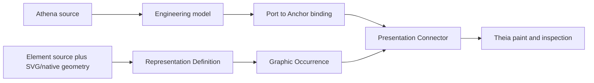
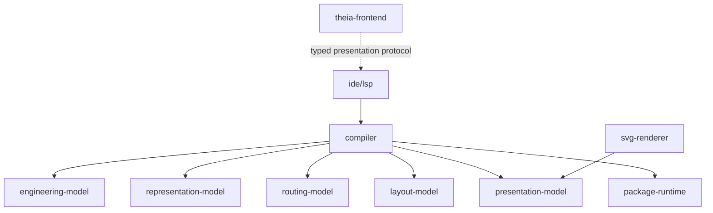

# Architecture Spine - Athena M38 Engineering Drawing Trust Foundation

## Paradigm

Athena is a semantic compiler. Engineers write engineering meaning. Compiler derives drawing facts.
Theia paints those facts.



M38 repairs one broken chain: visible connection geometry must end at the exact placed Anchor owned by
its source Port binding. Missing truth fails before paint. Renderer never guesses or repairs.

## Product Principles

| Principle | Rule |
| --- | --- |
| Human first | Athena source stays natural, concrete, AI-friendly, and K.I.S.S. |
| One truth | Athena source owns engineering meaning. SVG owns geometry only. |
| Compiler derives | Placement transforms, endpoint coordinates, route normalization, and paint facts stay internal. |
| Theia paints | Theia is the interactive render layer. It receives facts; it does not recover engineering truth. |
| Open source | Contracts stay small, documented, inspectable, and free from vendor-specific authority. |
| Pre-public cleanup | Wrong architecture is replaced directly. No compatibility layer or deprecated parallel path. |

## Architecture Decisions

### AD-1 - No New Drawing Language [ADOPTED]

- **Binds:** FR-1, FR-17, NFR-1, NFR-8, CM-1
- **Prevents:** compiler mechanics becoming engineer-facing grammar.
- **Rule:** M38 adds no normal-source syntax for coordinates, transforms, route bends, line paint,
  label placement, or renderer behavior. Existing engineering Connection, Port, Element, binding,
  profile, and projection concepts are enough.

### AD-2 - One Intrinsic Element Contract [ADOPTED]

- **Binds:** FR-2..FR-6, NFR-2..NFR-3, SM-1
- **Prevents:** SVG, native primitives, composite Elements, and legacy anatomy producing different
  downstream shapes.
- **Rule:** evolve existing `RepresentationDefinition` in place as sole intrinsic contract: local
  body geometry, local bounds, geometric Anchors, label slots, and source/resource trace. SVG may expose
  package-local `data-athena-ref` geometry IDs only. Port, signal, direction, role, compatibility, and
  other engineering facts remain in Athena source.

### AD-3 - Port Meaning And Anchor Geometry Stay Separate [ADOPTED]

- **Binds:** FR-3..FR-7, FR-10, NFR-1..NFR-2, SM-2
- **Prevents:** visual geometry becoming a second engineering language.
- **Rule:** engineering Port owns meaning. Element Anchor owns one local attachment point and hit
  geometry. Athena binding maps Port to Anchor. Compiler rejects missing, duplicate, or incompatible
  bindings. It never guesses from names, SVG nodes, body centers, or route points.

### AD-4 - One Placement Transform Owns Body And Anchors [ADOPTED]

- **Binds:** FR-7..FR-10, NFR-3, SM-2..SM-3
- **Prevents:** body and terminal coordinates drifting apart.
- **Rule:** rename/evolve the existing professional graphic occurrence path into one
  `GraphicOccurrence` compiled from one `RepresentationDefinition` and one current placement.
  The same transform is applied once to body geometry, bounds, Anchors, hit geometry, and label slots.
  Compiler normalizes each transformed Anchor once to the existing integer presentation/grid point;
  connector endpoint and terminal marker reuse that same value. Downstream code consumes placed
  coordinates. No renderer transform, global offset, second rounding, or second endpoint calculation
  is allowed.

### AD-5 - Attached Connection Is Visible Connection Authority [ADOPTED]

- **Binds:** FR-7..FR-13, FR-16, NFR-2..NFR-4, SM-2..SM-5
- **Prevents:** route IDs claiming attachment while visible geometry uses unrelated points.
- **Rule:** route engine emits untrusted `RouteCandidate`. Compiler alone lowers it into one strict
  `PresentationConnector` from engineering Connection, source/target Ports, bindings, Graphic
  Occurrence Anchors, and selected line class. Connector owns required typed source/target endpoint
  evidence and at least two route points. Its first and last route
  points are the exact placed Anchor points. Interior points may be normalized but M38 does not search
  for a better route. Invalid or ambiguous attachment, non-orthogonal route, or crossing meaning blocks
  presentation. `PresentationDocument.connectors` is the only visible connection collection.
  `routeFactSnapshot` is removed from public presentation/LSP/Theia payloads and remains only renamed
  compiler-internal candidate input.

### AD-6 - Presentation Is Explicit, Theia Remains Renderer [ADOPTED]

- **Binds:** FR-11..FR-16, NFR-4..NFR-5, SM-3..SM-6
- **Prevents:** second rendering engines and frontend engineering inference.
- **Rule:** compiler emits explicit occurrence geometry, attached route points, line appearance,
  junction/crossing facts, labels, and trace through current presentation contracts. Theia paints
  geometry and text. SVG export serializes the same presentation facts. Labels remain presentation;
  font shaping and text paint belong to renderer and never feed endpoint or topology truth. Required
  endpoint, line, marker, and label fields are typed connector fields, not `tokenOverrides` or generic
  maps. Frontend crossing detection, route-label recovery, terminal fallback, and style guessing are
  deleted. Junction, crossing, bus-tap, and continuation markers are document-level facts with one
  identity and one paint occurrence; connectors reference their IDs. Terminal marker/hit geometry
  belongs to Graphic Occurrence Anchor geometry; connector endpoint references it and never paints a
  duplicate terminal.

### AD-7 - Trace Is Complete And Human-Readable [ADOPTED]

- **Binds:** FR-14..FR-16, NFR-6, SM-4..SM-6
- **Prevents:** AI or humans seeing a line without its engineering reason.
- **Rule:** every visible connection endpoint traces through Connection, Port, binding, Element,
  Anchor, placed point, route point, and Athena source span. Internal diagnostic kinds remain protocol
  detail. Human diagnostics name exact subject, problem, and correction in plain engineering language.

### AD-8 - Hard Replacement, Not Migration [ADOPTED]

- **Binds:** FR-17..FR-20, NFR-7, SM-7..SM-8, CM-2..CM-4
- **Prevents:** new path sitting beside stale fallback and proof architecture.
- **Rule:** delete legacy representation anatomy authority, compatibility shells, accepted `RouteFact`
  naming, endpoint fallback, body-center fallback, duplicate connector lowering, renderer repair,
  hardcoded sample policy, milestone-named production classes, and stale docs/tests. Rename active
  route output to untrusted `RouteCandidate`; accepted visible output is strict
  `PresentationConnector`. No
  adapters, aliases, deprecations, or compatibility defaults. Every retained visible producer,
  including Cabinet, publishes strict connectors; a producer that cannot is removed from active
  product publication until rebuilt on the current path.

### AD-9 - Drawing Publication Is Atomic [ADOPTED]

- **Binds:** FR-10..FR-16, NFR-2..NFR-6, SM-3..SM-6
- **Prevents:** new occurrences appearing with stale connectors after concurrent or failed compile.
- **Rule:** compiler/LSP publishes one complete `PresentationDocument` only after occurrences,
  connectors, document markers, labels, and trace validate for the same compilation. Publication
  replaces the previous document atomically. Failed latest compilation invalidates current drawing;
  partial merge and stale connector retention are forbidden.

## Ownership



- `representation-model`: intrinsic geometry and Anchors; no Port meaning or route authority.
- `routing-model`: untrusted route candidates; no accepted visual endpoint authority.
- `presentation-model`: Graphic Occurrences, strict Presentation Connectors, line/marker/label facts,
  and trace.
- `compiler`: only cross-model join, validation, transform, and lowering owner.
- `package-runtime`: package-local resource resolution; remote resources remain deferred.
- `ide/lsp`: transports compiler output and diagnostics without recovery.
- `theia-frontend`: paints and inspects; no engineering inference.
- `svg-renderer`: consumes the same `PresentationDocument` as Theia and serializes occurrences,
  strict connectors, document markers, and labels; no independent connection lowering, topology,
  endpoint, crossing, or style invention.

## Core Contracts

These names describe responsibilities. They do not permit parallel models. Existing product types are
renamed or evolved in place; obsolete competitors are deleted in the same story.

### RepresentationDefinition

```text
definition identity
local bounds
body geometry
anchors: id + local point + hit geometry + neutral geometry ref
label slots
source and package-resource trace
```

### GraphicOccurrence

```text
occurrence identity
semantic subject identity
selected RepresentationDefinition
one placement transform
placed body and bounds
placed anchors, terminal-marker paint geometry, and hit geometry
source trace
```

### PresentationConnector

```text
Connection identity
source and target Port identities
source and target binding identities
source and target GraphicOccurrence/Anchor identities
source and target exact drawing points
ordered orthogonal route points
resolved line class
document marker reference IDs
source trace
```

### DocumentConnectionMarker

```text
marker identity
kind: junction, no-connect crossing, bus tap, or sheet continuation
exact drawing point
participating PresentationConnector identities
appearance
source trace
```

Required fields are typed and non-null. Transport may map them directly but does not create another
domain model.

## Replacement Map

| Delete | Current replacement |
| --- | --- |
| `RepresentationBodyAuthority`, authoritative `PresentationAnatomy`, compatibility shells | evolved `RepresentationDefinition` |
| parallel representation/presentation/package occurrence types | one compiler-produced `GraphicOccurrence` |
| semantic fields in SVG/Anchor geometry | Athena Port plus explicit binding |
| `RouteFact` accepted authority and `FALLBACK` states | untrusted `RouteCandidate` plus strict `PresentationConnector` |
| public `PresentationDocument.routeFactSnapshot` visible route path | compiler-internal candidate input plus `PresentationDocument.connectors` |
| nullable endpoint IDs and body-center/`(0,0)` fallback | required placed Anchor endpoint |
| duplicate `toPresentationConnector` implementations | one compiler lowering path |
| connector `tokenOverrides` for required route facts; renderer crossing/label detection, endpoint repair, style guessing | typed compiler presentation facts |
| legacy presentation substitution after professional compile failure | blocking diagnostic and no current drawing |
| production sample/default drawing policy | profile selected from Athena/package source |
| milestone/proof/demo/sample production names and stale docs | current product names and test/example evidence |

## Verification

Dedicated `examples/m38/professional-control-drawing` proves:

- one SVG-backed complex Element;
- one native simple Element;
- explicit Port-to-Anchor bindings;
- body and Anchor use the same placement transform;
- every route first/last point equals its placed Anchor point;
- no fallback or renderer repair path executes;
- junction/crossing meaning is explicit;
- line appearance and labels reach Theia as presentation facts;
- endpoint inspection reaches Athena source;
- desktop and narrow Electron screenshots exist under M38 artifacts.

Acceptance uses structural assertions first, screenshots second. Gradle verification stays sequential.
Repository-wide authority audit also proves every active drawing publication/export path consumes
strict `PresentationDocument.connectors`, with zero production references to forbidden fallback,
duplicate lowering, or renderer-repair paths.

## Deferred

| Deferred | Owner |
| --- | --- |
| Global composition, ordering, grouping, alignment, and placement quality | M39 may replace only the current-placement producer; M38 keeps Graphic Occurrence transform and attachment authority. |
| Lane routing, obstacle avoidance, bundles, bend/crossing minimization, and label optimization | M40 may replace only RouteCandidate production; M38 keeps endpoint validation and strict connector lowering. |
| Remote package resources | future package trust/cache milestone |
| Full vendor catalog and Engineering Component System | dedicated component-system milestone |
| Graphical editing and route locks | after M39/M40 computed facts stabilize |
