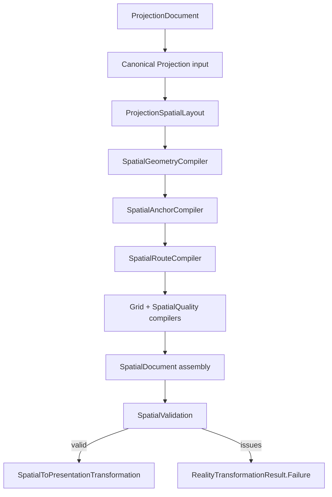

# Architecture Spine - Athena M41 Spatial Reality Recovery

## Design Paradigm

M41 uses a typed, staged Reality Graph pipeline. `ProjectionSpatialCompiler` is the only
Projection-to-Spatial orchestration boundary. It creates one complete immutable
`SpatialDocument`, or returns actionable diagnostics and no document.


Spatial owns geometry. Projection owns selection and grouping without coordinates. Presentation
preserves geometry. Theia paints. No downstream stage repairs an upstream fact.

## Inherited Invariants

M39 and M40 decisions bind by their original IDs. Local M41 decisions may specialize their M41
output but may not contradict their authority boundaries.

| Inherited | Binding M41 meaning |
| --- | --- |
| M39 AD-1..AD-2 | Reality Graph stays a typed pipeline; Engineering remains engineering truth. |
| M39 AD-3..AD-4 | Projection has no coordinates; Spatial owns geometry and routing. |
| M39 AD-5..AD-7 | Presentation owns paint facts; transformations stay thin; renderer never repairs truth. |
| M39 AD-8 | Human-first names; no milestone, `V0`/`V1`, or vague `Evidence` production types. |
| M40 AD-9..AD-12 | Projection owns views, Sheets, Occurrences, Regions, order, and domain-neutral Constructs. Regions remain coordinate-free in Projection. |
| M40 AD-13 | Spatial consumes immutable Projection facts and owns derived geometry. |
| M40 AD-14 | Quality measurements are acceptance evidence, not a new reality or authoring concept. Its M40 label baseline is M40-local and does not define the M41 metric schema. |
| M40 AD-15 | Invalid Projection Constructs fail before Spatial. |
| M40 AD-16 | Professional routing remains outside M40 and M41 correctness scope. |
| M40 AD-17 | Milestone proof uses milestone-local example, verifier, screenshots, and records. |
| M40 AD-18..AD-19 | One Projection construct authority remains; Projection compilation is thin and boundary-validated. |

Standing repository constraints also bind: pre-1.0 cleanup over compatibility, UTF-8 text,
production source-set hygiene, and strictly sequential Gradle verification on Windows.

## Dependency And State Flow



No stage mutates a Projection fact or a completed Spatial fact. Intermediate stage outputs remain
private to the compiler module until `SpatialDocument` assembly. Any stage failure stops assembly;
no downstream stage receives a partial list.

## Invariants And Rules

### AD-20 [ADOPTED] - Spatial Owns One Typed Per-Sheet Geometry Contract

- **Binds:** FR-1 through FR-4; FR-9; NFR-4
- **Prevents:** raw maps, overloaded identities, document-wide geometry without Sheet ownership,
  or a second owner of placement/bounds/Routes
- **Rule:** `SpatialDocument` contains canonical `SpatialSheet` values. Each `SpatialSheet` owns its
  extent, Drawing Area, grid, Occurrence rectangles, Region bounds, Construct envelopes,
  alignments, Anchors, Lanes, Routes, Grid References, quality snapshot, and Source Trace. Public
  Spatial geometry uses integer drawing units. Every fact is typed, immutable, positively sized
  where applicable, and carries stable identity, `sheetId`, and required Source Trace. Construct
  IDs never occupy Occurrence ID fields; Grid References are typed values, not `Map<String,String>`.

### AD-21 [ADOPTED] - Placement Is Canonical, Derived, And Explainable

- **Binds:** FR-1 through FR-3; NFR-1; SM-2
- **Prevents:** authored coordinates, one-row placeholder placement, solver-order drift, or hidden
  discard of unassigned Occurrences
- **Rule:** `ProjectionSpatialLayout` converts canonical Projection facts to domain-neutral layout
  constraints and normalizes solver output. Active policy is Sheet `1200 x 800`, Drawing Area
  `(40,60,1120,640)`, title-block boundary `y=740`, ordered Region columns, 32-unit Region gutter,
  at least 48 units vertical Occurrence separation, and 24-unit Region/Construct padding.
  Occurrence ordering uses Construct membership, Connection topology, authored/reading order, then
  stable identity. Unassigned Occurrences enter an explicit final Region. Every placement records
  the constraints actually used in human-first terms.

### AD-22 [ADOPTED] - Routing Starts From Exact Typed Port Anchors And Fails Closed

- **Binds:** FR-5 through FR-7; SM-3
- **Prevents:** first/last Occurrence fallback, approximate Anchors, `mapNotNull` Route loss,
  body-crossing Manhattan shortcuts, or renderer endpoint repair
- **Rule:** `SpatialAnchorCompiler` resolves each referenced occurrence-port exactly once and
  distributes stable boundary Anchors by canonical port order. `SpatialRouteCompiler` sends exact
  Anchors, Drawing Area, and non-endpoint Occurrence obstacles to the routing adapter. Every visible
  Connection yields exactly one Route with exact first/final Anchor points, positive orthogonal
  segments, stable Lane, and complete Connection/occurrence-port-anchor Source Trace. Missing,
  ambiguous, cross-Sheet, or unroutable endpoints return diagnostics and no `SpatialDocument`.

### AD-23 [ADOPTED] - M41 Basic Routing Does Not Claim Professional Optimization

- **Binds:** FR-8; SM-C4; M45 boundary
- **Prevents:** scope drift into bend/crossing optimization, bundles/trunks, or multi-Sheet
  continuation
- **Rule:** M41 may select deterministic obstacle-safe Paths and Lanes only. It does not optimize
  bend count, crossing count, Lane packing, bundle/trunk topology, or multi-Sheet continuation.
  Those decisions remain M45.

### AD-24 [ADOPTED] - Quality Is Exact, Per-Sheet, And Derived From Validated Geometry

- **Binds:** FR-12 through FR-13; SM-1 through SM-3
- **Prevents:** mislabeled proxy metrics, document-wide denominator drift, overlay-inflated
  Occupancy, copied constants, or pixel-derived kernel truth
- **Rule:** `SpatialQualityCompiler` implements PRD FR-12 formulas per `SpatialSheet` from the same
  facts validated for Presentation: Occurrence overlap, Construct containment failure, Route/body
  intersection, Route crossing, twist, used Lane count, peak Lane occupancy, Density, and union-area
  Occupancy. Region/Construct overlays do not contribute to Occupancy. M41 has no label metric.
  Baseline artifacts are generated from structured compiler output and verified against it.

### AD-25 [ADOPTED] - Grid References Use The Owning Sheet Only

- **Binds:** FR-4; FR-9.4
- **Prevents:** first-grid fallback, global fixed-grid assumptions, cross-Sheet contamination, or
  export-owned geometry
- **Rule:** the grid compiler maps each Occurrence rectangle center and Construct envelope center
  to a typed cell using only its owning `SpatialSheet` Drawing Area and Projection grid dimensions.
  Missing/invalid grids and out-of-area centers fail. M43 export consumes these facts without
  recomputing cells.

### AD-26 [ADOPTED] - Complete Spatial Validation Is The Presentation Gate

- **Binds:** FR-10; NFR-2
- **Prevents:** partial documents, one-error-at-a-time nondeterminism, renderer repair, or diagnostics
  that expose only internal codes
- **Rule:** `SpatialValidation` checks exact coverage, unique identity, Sheet ownership, positive
  in-area geometry, membership, containment, Anchor/Route/Lane/Grid integrity, endpoint equality,
  segment orthogonality/nonzero length, obstacle safety, Source Trace, and metric integrity after
  complete assembly and before Presentation. It returns all issues sorted by subject then problem.
  Each `SpatialDiagnostic` carries subject, problem, correction, and Source Trace. Any issue becomes
  `RealityTransformationResult.Failure` with no partial `SpatialDocument`.

### AD-27 [ADOPTED] - ProjectionSpatialCompiler Is The Single Spatial Orchestrator

- **Binds:** all M41 Functional Requirements; NFR-3
- **Prevents:** duplicate pipelines choosing different placement, grid, Route, or metric behavior
- **Rule:** all product/compiler callers use `ProjectionSpatialCompiler` for Projection-to-Spatial
  compilation. It owns the stage order shown above and the only success boundary. Once callers
  migrate, delete `AuthoredProjectionSpatialBridge`, `ProjectionToSpatialTransformation`, row-only
  `SpatialPlacementCompiler`, and `SpatialQualityMetricsReporter`; do not preserve adapters or
  compatibility branches for the failed flow.

### AD-28 [ADOPTED] - Existing Solvers Stay Internal And Domain-Neutral

- **Binds:** FR-1 through FR-8; NFR-4
- **Prevents:** duplicate layout/routing engines, electrical policy in kernel Spatial models, or
  solver implementation becoming authoring syntax
- **Rule:** reuse and refactor the current rule-based layout engine and `AthenaRouteEngine` geometry
  core behind internal Projection/Spatial adapters. Adapter inputs contain geometry, constraints,
  stable IDs, and obstacles only. Solver types, electrical roles, label facts, algorithm tuning,
  and paint mechanics do not appear in public Spatial facts or Athena source.

### AD-29 [ADOPTED] - Presentation And Product Proof Preserve Runtime Geometry

- **Binds:** FR-11; SM-4; GATE-4 through GATE-6
- **Prevents:** coordinate snapping/rerouting, hardcoded proof flags, script-text assertions, or PNG
  size as acceptance
- **Rule:** `SpatialToPresentationTransformation` copies Spatial rectangles and ordered Route points
  without mutation. The product proof compares runtime Spatial/Projection/Presentation payloads,
  verifies exact counts and zero Blocking Metrics, samples Drawing Area pixels across required
  buckets, and captures desktop/narrow screenshots after rebuilding kernel, LSP, frontend, and
  Electron surfaces.

### AD-30 [ADOPTED] - Normalization Owns Stable Identity, Trace, And Ordering

- **Binds:** FR-5.1; FR-7; FR-9; NFR-1
- **Prevents:** collection-order-dependent equality, locally invented IDs, nullable Source Trace,
  or different stories choosing incompatible sort rules
- **Rule:** compiler normalization derives fact IDs from owning Sheet plus Projection identity and
  endpoint IDs where applicable; preserves resolvable Projection/source references; and sorts every
  fact collection by explicit authored order followed by stable identity. All compilers consume the
  same normalized IDs and order. One-to-one facts retain typed Projection IDs; compound facts use
  typed component keys rather than delimiter-concatenated display strings. Tests must permute
  unordered Projection inputs and compare complete typed results.

## Contract Seed

The code owns full data shape after implementation. These relationships are fixed:

```kotlin
data class SpatialDocument(
    val sheets: List<SpatialSheet>,
)

data class SpatialSourceTrace(
    val projectionIds: List<String>,
    val geometryElementIds: List<GeometryElementId>,
)

data class SpatialDiagnostic(
    val subject: String,
    val problem: String,
    val correction: String,
    val sourceTrace: SpatialSourceTrace,
)

data class SpatialSheet(
    val sheetId: String,
    val extent: SpatialRect,
    val drawingArea: SpatialRect,
    val grid: SpatialGrid,
    val occurrences: List<SpatialOccurrenceGeometry>,
    val regions: List<SpatialRegionGeometry>,
    val constructs: List<SpatialConstructGeometry>,
    val alignments: List<SpatialAlignment>,
    val anchors: List<SpatialAnchorPosition>,
    val lanes: List<SpatialLane>,
    val routes: List<SpatialRoute>,
    val gridReferences: List<SpatialGridReference>,
    val quality: SpatialQualitySnapshot,
    val sourceTrace: SpatialSourceTrace,
)
```

Subject cardinalities and Source Trace requirements come from PRD Section 11. Route points and
Anchor points use the same `SpatialPoint` type. Region bounds and Construct envelopes use the same
`SpatialRect` value type but remain distinct facts with distinct IDs. The public orchestration
result remains `RealityTransformationResult<SpatialDocument>`: success contains one complete
document; failure contains sorted diagnostics and no document.

## Consistency Conventions

| Concern | Convention |
| --- | --- |
| File organization | Group small related values in `*Models.kt`; keep orchestration in `*Compiler.kt`; validation in `SpatialValidation.kt`; split mixed files near 200-300 lines by role. |
| Identity | Stable IDs derive from owning Sheet and Projection identity; endpoint facts add occurrence-port identity; never use list index as identity. |
| Ordering | Authored order first where defined, then stable identity; unordered input maps/sets never dictate output order. |
| Coordinates | Integer drawing units in Spatial public facts; rectangles are top-left plus positive width/height; edge contact is not positive-area overlap. |
| State | Projection and completed Spatial facts are immutable; only compiler-local intermediates may vary during a stage. |
| Failure | Collect actionable deterministic diagnostics; return no partial document. |
| Testing | Red-green-refactor through `bmad-dev-story`; hand-computable fixtures; focused/module/repository verification; Gradle commands strictly sequential. |
| Source hygiene | No proof/demo/sample/milestone or `V0`/`V1` production types; delete stale alternatives after caller migration. |

## Stack

No new technology is introduced. Versions were reality-checked against repository configuration on
2026-08-03.

| Name | Repository version |
| --- | --- |
| Kotlin | 2.4.0 |
| Gradle | 9.6.1 |
| Node.js | >=22 |
| Yarn | 1.22.22 |
| TypeScript | ^5.9.2 |
| Theia | 1.73.1 |
| Electron | 39.8.7 |

## Structural Seed

```text
kernel/spatial-model/src/main/kotlin/com/engineeringood/athena/spatial/
  SpatialDocument.kt           # document and Sheet roots
  SpatialGeometryModels.kt     # points, rectangles, occurrence/region/construct/alignment/grid facts
  SpatialRoutingModels.kt      # Anchors, Lanes, segments, Routes, endpoint trace
  SpatialQualityModels.kt      # per-Sheet quality snapshot
  SpatialValidation.kt         # complete validator and diagnostics

kernel/compiler/src/main/kotlin/com/engineeringood/athena/compiler/
  ProjectionSpatialCompiler.kt # only orchestrator
  ProjectionSpatialLayout.kt   # Projection layout-intent adapter and normalization
  SpatialGeometryCompiler.kt   # grouping union geometry and grids
  SpatialAnchorCompiler.kt     # stable port Anchors
  SpatialRouteCompiler.kt      # routing adapter and Route normalization
  SpatialQualityCompiler.kt    # exact PRD FR-12 metrics
  SpatialToPresentationTransformation.kt

kernel/routing-model/          # reusable domain-neutral routing geometry core
examples/m41/rolling-shutter/  # Golden Fixture
ide/                           # paint-only consumer and runtime product proof
```

## Capability To Architecture Map

| Capability | Primary modules | Governing decisions |
| --- | --- | --- |
| Placement and Region composition (FR-1..FR-2) | spatial-model, compiler, layout-model | AD-20, AD-21, AD-28, AD-30 |
| Region/Construct geometry and grids (FR-3..FR-4) | spatial-model, compiler | AD-20, AD-21, AD-25, AD-30 |
| Anchors, Routes, Lanes, trace (FR-5..FR-8) | spatial-model, compiler, routing-model | AD-22, AD-23, AD-28, AD-30 |
| Typed facts and validation (FR-9..FR-10) | spatial-model, compiler | AD-20, AD-26, AD-27, AD-30 |
| Presentation authority (FR-11) | compiler, presentation-model, Theia | AD-26, AD-29 |
| Metrics and baseline (FR-12..FR-13) | spatial-model, compiler, M41 artifacts | AD-24, AD-26 |
| Product proof and closure | compiler, LSP, Theia, M41 artifacts | AD-27, AD-29 |

## Deferred

- M42 owns Presentation styling, label layout/metrics, visibility, terminal labels, and grid chrome.
- M43 owns SVG/Theia/PDF/Canvas rendering/export evolution and Excel export surface.
- M44 owns readability optimization and quality target tuning beyond M41 correctness gates.
- M45 owns professional routing optimization, bundles/trunks, and multi-Sheet continuation.
- M46 owns AI-assisted placement.
- Deployment, infrastructure/provider strategy, authentication, persistence, and operations are
  unchanged from the existing desktop Theia product and are not owned by this feature-altitude
  spine.
- Public solver selection/tuning APIs are deferred indefinitely; current solvers remain internal.
