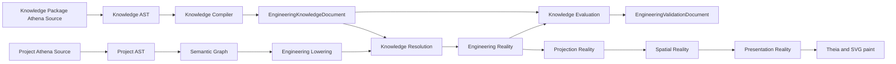
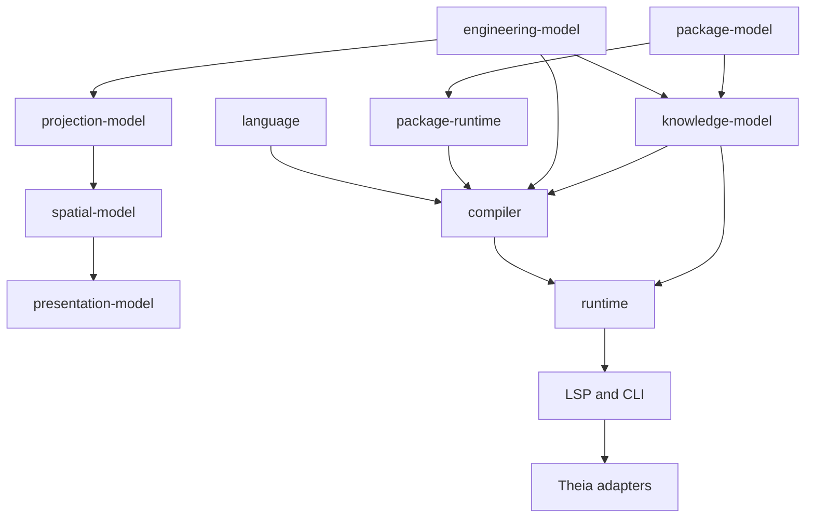

# Architecture Spine - Athena M42 Engineering Knowledge System

## Design Paradigm

M42 uses a **staged functional compiler with immutable documents** inside the inherited Reality
pipeline. Source files are the only mutable engineering authority. Compiler stages consume complete
inputs and return typed success or failure values. Runtime, LSP, CLI, and Theia are adapters over
published documents; none evaluates engineering meaning.



Knowledge participates in resolving Engineering Reality and evaluating it. It never owns project
subjects and never becomes another Reality, graph, database, or mutation path.

## Inherited Invariants

These parent decisions bind read-only. M42 replaces obsolete vocabulary without moving their
authority boundaries. Every still-applicable M40 AD-9 through AD-19 decision remains binding;
milestone-specific acceptance and routing decisions already fulfilled by M40 are not reopened.

| Inherited | From parent | Binds here |
| --- | --- | --- |
| M39 AD-1 | M39 Reality Architecture | Reality Graph remains a pipeline, not a generic framework or universal Fact graph. |
| M39 AD-2 | M39 Reality Architecture | Engineering Reality remains sole owner of project engineering truth. |
| M39 AD-3 | M39 Reality Architecture | Projection owns views and selection, never knowledge or validation. |
| M39 AD-4 | M39 Reality Architecture | Spatial owns placement, bounds, anchors, lanes, routes, and geometry metrics. |
| M39 AD-5 | M39 Reality Architecture | Presentation owns paint facts only. |
| M39 AD-6 | M39 Reality Architecture | Reality transformations remain thin and typed over immutable snapshots. |
| M39 AD-7 | M39 Reality Architecture | Renderer and Theia cannot repair engineering or validation truth. |
| M39 AD-8 | M39 Reality Architecture | Production names remain human-first; no milestone, V0/V1, Proof, Demo, or vague Evidence types. |
| M40 AD-9 | M40 Projection Reality | Projection owns view, sheet, occurrence, region, reading order, and A1/B3 grid references. |
| M40 AD-10 | M40 Projection Reality | Composition remains one Projection capability, never Knowledge Package authority. |
| M40 AD-11 | M40 Projection Reality | `ProjectionConstruct` remains domain-neutral; domain packages supply concrete construct types. |
| M40 AD-12 | M40 Projection Reality | Functional regions remain logical sections, never layout boxes or knowledge groupings. |
| M40 AD-13 | M40 Projection Reality | Spatial consumes Projection; knowledge creates no geometry path. |
| M40 AD-15 | M40 Projection Reality | Projection constructs remain concrete and boundary-validated. |
| M40 AD-18 | M40 Projection Reality | Retired drawing composition cannot return as a second composition authority. |
| M40 AD-19 | M40 Projection Reality | Projection compilation remains deterministic and boundary-validated. |

## Invariants And Rules

### AD-20 - One Staged Compiler Owns Knowledge Resolution And Evaluation [ADOPTED]

- **Binds:** all FRs; compiler, runtime, LSP, CLI, Theia.
- **Prevents:** independent evaluators, runtime mutation, a knowledge database, or frontend inference.
- **Rule:** One compiler orchestration runs project parsing, Semantic Graph construction, engineering
  lowering, Knowledge Package compilation, knowledge resolution, validation evaluation, then the
  inherited Reality transformations. Each stage accepts immutable typed input and returns an
  immutable typed result. No other module resolves definitions or evaluates rules.

### AD-21 - Model Dependencies Are Acyclic [ADOPTED]

- **Binds:** FR-1 through FR-24; Gradle modules and Kotlin packages.
- **Prevents:** Engineering Reality depending on validation, cyclic model imports, and another thin
  module per DTO.
- **Rule:** `engineering-model` owns shared engineering identities, exact values, Entities, Functions,
  Ports, Relationships, Flows, Structure Assignments, and resolved definition references.
  `knowledge-model` depends on `engineering-model` and `package-model`; its `definition`,
  `validation`, and `protocol` packages remain separate. `compiler` depends on both model modules,
  `language`, and package infrastructure. Downstream Reality modules depend on `engineering-model`
  but never on `knowledge-model`.



Arrows mean "may be consumed by." For canonical pipeline modules shown here, reverse dependencies
are forbidden. Surviving brownfield consumers migrate under this complete boundary table and may not
copy replacement DTOs:

| Survivor | Allowed M42 dependency/contract | Forbidden replacement |
| --- | --- | --- |
| `authoring-model` | `engineering-model`, `interaction-model`; compiler/runtime maps evaluator output into its independent `AuthoringActionAvailability` contract | `knowledge-model` dependency or copied Capability/Part definitions |
| runtime semantic diff/review and `semantic-scm` | immutable Engineering, Knowledge protocol, and Validation protocol snapshots; no evaluator | copied `EngineeringKnowledgeState` or UI-derived impact |
| `plugin-api` and plugin host | `engineering-model`, `package-model`, and existing non-knowledge extension contracts | Component/Connection/Part knowledge contributors or replacement definition DTOs |
| `routing-model` | `engineering-model`, `layout-model`, Projection/Spatial route inputs | `connection-model`, knowledge definitions, or engineering Relationship creation |
| LSP and CLI | runtime-published canonical documents and kernel query slices | independent evaluator or hand-written payload |
| Theia frontend | schema-generated TypeScript plus Ajv-validated transport | Kotlin-shaped duplicate models or engineering inference |

### AD-22 - Engineering Reality Owns Project Subjects, Not Definitions Or Judgements [ADOPTED]

- **Binds:** FR-2 through FR-6, FR-9, FR-14, FR-17, FR-24.
- **Prevents:** copied Concept graphs, validation facts mutating project truth, and a third Reality
  model.
- **Rule:** Engineering Reality stores project Entities, Functions, Ports, Relationships, Flows,
  authored facts, authored Requirement/Constraint applications and subject bindings, Part bindings,
  and resolved package-qualified definition references. Reusable Concept, Part, Capability, formula,
  and Constraint definitions remain in the Knowledge Document. Satisfaction, derived/evaluated facts,
  Judgements, and Correction Options remain in the Validation Document. Evaluation never mutates an
  authored application or its subject. `engineering-model` owns Structure Assignment identity and
  reference mechanics only; packages own structure aspect definitions and display designations such
  as `=`, `+`, and `-`. No production type named `ValidatedEngineeringReality` is created; that phrase
  means an Engineering Reality snapshot paired with a non-`INVALID` Validation Document.

### AD-23 - Knowledge And Validation Are Separate Open Documents [ADOPTED]

- **Binds:** FR-13 through FR-23.
- **Prevents:** package definitions carrying project state, project documents copying definitions,
  and invalid evaluation masquerading as compiled knowledge.
- **Rule:** Knowledge compilation returns either `Success(EngineeringKnowledgeDocument)` or
  `Failure(packageDiagnostics)`. Project evaluation always returns an
  `EngineeringValidationDocument`. The Knowledge Document contains definitions and Knowledge
  Package Provenance only. The Validation Document references canonical subject and definition IDs
  and contains project state, outcomes, diagnostics, corrections, and evaluation Provenance.

### AD-24 - Project And Knowledge Source Share One Language Frontend [ADOPTED]

- **Binds:** FR-7, FR-8, FR-12; `language`, compiler syntax lowering, editor support.
- **Prevents:** a second knowledge DSL, filename-based parser forks, and string formula evaluation.
- **Rule:** The existing ANTLR Athena lexer/parser and source-span model parse both project and
  Knowledge Package `.athena` files. Package graph context controls which declarations are admitted.
  Every M42 source file declares one default `domain`; unqualified references filter by that domain
  and must still resolve exactly once. Knowledge declarations compile to typed AST nodes, including a
  sealed formula/Constraint AST. Old Component/Connection and Semantic Macro grammar is deleted, not
  retained as an alias. ANTLR is the sole semantic parser. `ide/tree-sitter-athena` is an editor-only
  syntax/highlighting projection and owns no acceptance, resolution, or engineering meaning. Every
  language story updates one shared accepted/rejected M42 syntax fixture set, regenerates Tree-sitter
  parser/WASM artifacts, runs query/highlight tests, and rebuilds the frontend before closure.

### AD-25 - Knowledge Identity And Resolution Fail Closed [ADOPTED]

- **Binds:** FR-7, FR-8, FR-13, FR-14; package compilation.
- **Prevents:** package-order precedence, version-dependent semantic identity, hidden Kotlin defaults,
  and partial authoritative documents.
- **Rule:** A definition identity is package name plus qualified declaration name. Package version is
  Provenance, not identity. Compilation collects all identities, resolves locked dependencies and
  imports, validates all definitions, then emits one deterministically sorted Knowledge Document.
  Missing, duplicate, ambiguous, conflicting, or corrupt definitions produce package diagnostics and
  no authoritative Knowledge Document. Existing `package-model` and `package-runtime` own manifest,
  locked graph, dependency, and location mechanics only; they own no engineering definitions.

### AD-26 - Exact Values Use Rational Arithmetic And Package-Defined Dimensions [ADOPTED]

- **Binds:** FR-1, FR-7, FR-12, FR-16, FR-26, FR-28; Engineering Value contracts.
- **Prevents:** floating-point drift, string parsing at evaluator boundaries, and electrical units in
  kernel enums.
- **Rule:** `ExactNumber` is a normalized reduced `BigInteger` numerator and positive denominator.
  Quantity carries `ExactNumber` plus a package-qualified Unit reference. Unit definitions carry an
  exact rational scale, optional exact rational offset, and a dimension signature represented as a
  sparse map from package-qualified base-dimension ID to integer exponent. The kernel contains no
  named unit or dimension constant. A governed engineering-core Knowledge Package supplies shared
  dimensions; domain packages supply domain units.

### AD-27 - Formula And Constraint Evaluation Is A Closed Typed Algebra [ADOPTED]

- **Binds:** FR-12, FR-16 through FR-20; evaluator.
- **Prevents:** a scripting language, hidden rounding, reflection, arbitrary execution, and
  dimensionally invalid calculation.
- **Rule:** Formula AST admits only `+`, `-`, `*`, `/`, `min`, `max`, `round-up`, parentheses, and typed
  references. Comparison AST admits `>`, `>=`, `<`, `<=`, `=`, `!=`, and interval membership with
  explicit inclusive/exclusive bounds. `min`/`max` and interval bounds require compatible dimensions;
  `round-up` requires a positive exact quantum. Affine units support conversion, comparison,
  addition, and subtraction but must normalize to ratio units before multiplication or division.
  Constraint AST admits only the PRD judgement shapes and required `all`/`any` composition.

### AD-28 - Relationship And Flow Are Independent First-Class Facts [ADOPTED]

- **Binds:** FR-4, FR-5, FR-11, FR-14, FR-24, FR-25.
- **Prevents:** binary endpoint semantics, Relationship equals wire, Port invention, and electrical
  Flow enums in the kernel.
- **Rule:** A project Relationship stores stable ID, resolved definition ID, typed properties, and a
  list of named Participant Role bindings to Entity, Function, or Port subject references. Functions
  remain Entity-owned for identity only; Function-to-Function participation across Entities is
  first-class. Concrete connectivity definitions require exact Ports. A project Flow is a separate
  fact that references its Relationship, definition, source role, sink role, and typed properties.
  The name `EngineeringConnection` and generic `from`/`to` authority do not survive.

### AD-29 - Validation State Has One Total Classification [ADOPTED]

- **Binds:** FR-14 through FR-20, FR-26.
- **Prevents:** the same failure becoming `INCOMPLETE` in one surface and `INVALID` in another, or an
  `INVALID` result publishing satisfaction.
- **Rule:** `READY` means all required knowledge resolves, every required Capability is satisfied,
  and no blocking Constraint fails. `INCOMPLETE` means project structure and knowledge are well-formed
  but a Requirement, provider, Relationship, implementation choice, or blocking Constraint is
  unresolved, unsatisfied, or failed. `INVALID` means project or knowledge structure cannot be
  evaluated safely: malformed source/Relationship, ambiguous/conflicting definitions, corrupt
  package, or incompatible dimensions. `INVALID` carries diagnostics, correction options where
  meaningful, and Provenance; satisfaction and completed Constraint Judgement collections are empty.
  Non-blocking warnings may coexist with `READY`.

### AD-30 - Corrections Are Data, Never Commands [ADOPTED]

- **Binds:** FR-18 through FR-20; evaluator, runtime, LSP, Theia.
- **Prevents:** automatic source edits, provider choice, hidden Pattern behavior, and UI-owned fixes.
- **Rule:** Correction Option is a sealed contract limited to the PRD kinds. Every option references
  affected project source subjects and supporting definition/evaluation evidence. Eligible-provider
  evidence lists only existing project Entities in stable-ID order. Evaluator and
  `knowledge-model` have no dependency on source mutation, authoring sessions, Pattern, Semantic
  Macro, or AI services. A later system may turn an option into a reviewable mutation through an
  independent acceptance flow.

### AD-31 - Provenance Is Portable And Complete [ADOPTED]

- **Binds:** FR-8, FR-13, FR-18, FR-19, FR-21 through FR-23.
- **Prevents:** absolute filesystem leakage, prose-only trace, unrepeatable derivation, and frontend
  source guessing.
- **Rule:** Public Provenance uses a structured source document reference with scope
  (`PROJECT` or `KNOWLEDGE_PACKAGE`), normalized forward-slash relative path, optional package
  identity/version, and a source span. Paths are non-absolute and reject `..`. Public positions are
  zero-based UTF-16 line/character pairs for direct LSP mapping. Derivation/evaluation steps form an
  explicitly ordered list of stable subject, definition, formula, and Constraint IDs. LSP alone maps
  portable source references to local file URIs.

### AD-32 - JSON Shape And Canonical Bytes Are Separate Contracts [ADOPTED]

- **Binds:** FR-13, FR-17, FR-21, NFR-1, NFR-4.
- **Prevents:** JSON Schema being mistaken for engineering validation, non-deterministic hashes, and
  parallel hand-written wire formats.
- **Rule:** Knowledge and Validation JSON Schemas are closed records with explicit dialect, stable
  `$id`, numeric `schemaVersion`, required fields, and `additionalProperties: false`. Exact numbers
  serialize as reduced numerator/denominator decimal strings, never floating JSON numbers. Committed
  schemas are transport-shape authority; Kotlin protocol mappings and schema-generated TypeScript
  conform to them. Reflection-derived schemas and parallel hand-written transport DTOs are forbidden. A
  dedicated canonical adapter builds structured `JsonElement` and emits UTF-8 without BOM or
  insignificant whitespace. Object keys sort by unsigned UTF-16 code-unit order. Strings preserve
  authored Unicode scalar sequences without normalization; unpaired surrogates are rejected. Quote,
  reverse solidus, and standard short control escapes use `\"`, `\\`, `\b`, `\t`, `\n`, `\f`, and
  `\r`; remaining U+0000..U+001F controls use lowercase `\u00xx`; other scalars emit unescaped UTF-8.
  Every schema array declares one closed `x-athena-order`: `STABLE_ID`, `MAP_KEY`, `SEMANTIC`,
  `DERIVATION`, `DIAGNOSTIC`, or `CORRECTION`; codec validates and emits that order, using committed
  composite comparators for the final two. Golden property and byte fixtures bind every category.
  JSON Schema validates transport shape only. Every consumer checks `schemaVersion` before decoding
  document content and rejects an unsupported version explicitly; no fallback reader, partial decode,
  compatibility inference, or parallel payload exists.

### AD-33 - Product Surfaces Share Schema-Generated Contracts [ADOPTED]

- **Binds:** FR-21 through FR-23; runtime, LSP, CLI, Theia.
- **Prevents:** Kotlin/TypeScript DTO drift, frontend evaluation, and stale per-surface state.
- **Rule:** Runtime atomically publishes one immutable compilation revision containing Engineering,
  Knowledge, and Validation document digests and snapshots; readers never observe mixed revisions.
  CLI serializes the canonical documents directly. LSP
  returns canonical document shapes or subject-indexed slices created by kernel query functions and
  tied to document digests. TypeScript types generate from committed JSON Schemas; generated files
  are never edited. Ajv is a direct frontend dependency and validates received transport shape
  against those schemas; no transitive dependency supplies this contract. Theia Inspector, Problems,
  and source navigation render those facts without inference. Problems derive only from Validation
  diagnostics. Each document digest is lowercase hexadecimal SHA-256 over exactly the AD-32 canonical
  UTF-8 bytes; runtime, LSP, CLI, and Theia never hash decoded or reserialized objects.

### AD-34 - Projection Receives Resolved Engineering Facts Only [ADOPTED]

- **Binds:** FR-5, FR-6, FR-11, FR-24, FR-25; Projection and Spatial migration.
- **Prevents:** Projection importing the evaluator, `protects` becoming a wire, a compatibility
  Connection adapter, and rendering scope entering M42.
- **Rule:** Relationship definitions resolve projection/connectivity admission into a typed
  Engineering Reality fact. Projection consumes that resolved fact and Relationship/Participant/Port
  identities only; it never imports `knowledge-model` or Validation contracts. Projection connector
  facts reference Relationship IDs, not legacy Connection IDs. Relationships without connectivity
  admission produce no connector. Multi-participant connectivity remains one semantic Relationship
  and one Projection group. Definitions produce typed logical endpoint pairing/admission only;
  Projection preserves that coordinate-free grouping. Spatial alone derives zero or more route legs
  and owns all route geometry. No Knowledge definition or compiler emits Spatial facts or creates or
  splits engineering Relationships. Spatial and Presentation remain unchanged except direct
  type/name migration and regression fixes.

### AD-35 - Legacy Model And Semantic Macro Paths Are Deleted [ADOPTED]

- **Binds:** FR-6, FR-7, FR-29; settings, modules, compiler, runtime, LSP, frontend, docs, tests.
- **Prevents:** dual authority, compatibility shells, stale proof passing, and renamed Semantic Macro
  behavior surviving.
- **Rule:** After surviving responsibilities migrate, remove Gradle modules `component-model`,
  `part-model`, `connection-model`, `reuse-model`, and `template-model`, plus their settings entries
  and all consumers. Remove legacy `EngineeringKnowledgeState`, `EngineeringComponent`,
  `EngineeringConnection`, Kotlin/default knowledge templates, `.properties` definitions, Component
  knowledge runtime, Semantic Macro catalog/template/validation/preview/acceptance protocols, and
  dedicated UI. Generic authoring preview/acceptance moves to `authoring-model`/runtime only when it
  has a non-macro consumer; semantic diff/review/SCM stays in its independent existing modules.
  `physical-model` and package infrastructure remain where active non-legacy responsibilities exist.
  Deletion applies only to active production code, active tests, active docs, and active examples;
  closed M0-M41 BMad planning and implementation artifacts remain immutable history. Closure audits
  also reject electrical-specific Capability, Relationship, Flow, unit, terminal/interface, or rule
  constants and domain-specific structure aspect/display-designation constants in kernel and shared
  contracts; package-defined designations remain valid.

### AD-36 - Knowledge Execution Is Local, Pure, And Capability-Limited [ADOPTED]

- **Binds:** NFR-2, NFR-5, NFR-7; package compiler, evaluator, deployment.
- **Prevents:** package code execution, network truth, environment-dependent results, hidden caches as
  authority, and new operational infrastructure.
- **Rule:** M42 runs in the existing local JVM compiler used by desktop Theia/Electron and CLI.
  Knowledge Package source resolves only through the locked local repository graph. Parsing,
  formulas, and evaluation cannot read arbitrary files, call network services, inspect environment,
  use wall-clock/randomness, or mutate source. Any cache is an internal digest-keyed optimization and
  must be observationally identical to uncached compilation. M42 adds no server, database,
  credentials, telemetry, or background authority.

### AD-37 - Delivery Is Dependency-Ordered And Proof-Gated [ADOPTED]

- **Binds:** FR-25 through FR-29; all M42 stories and closure.
- **Prevents:** grammar depending on unfinished values, delayed cleanup, backend-only proof, and
  milestone-crossing evidence.
- **Rule:** Delivery order is Kernel Authority, Knowledge Contract, Evaluation/Product Surfaces, then
  Product Proof and Closure. Each replacement story deletes its superseded active paths immediately;
  final cleanup checks absence only. Canonical codec/schema generation completes before any transport
  consumer story. Unit/contract tests bind each model and compiler stage; canonical JSON/schema
  fixtures bind cross-language transport; runtime/LSP/frontend tests bind adapters;
  sequential Gradle verification and rebuilt frontend/product E2E bind the full product. Proof uses
  only `examples/m42/controlled-conveyor` and `_bmad-output/implementation-artifacts/m42`, including
  required screenshots. Existing M41 Projection/Spatial regression remains green.

### AD-38 - Fact Sources Never Merge By Precedence [ADOPTED]

- **Binds:** FR-9, FR-14, FR-17; project lowering, Part resolution, evaluator.
- **Prevents:** Part data rewriting design intent, generated authored anatomy, and silent last-writer
  truth.
- **Rule:** Project source owns authored instance facts. Part definitions own vendor implementation
  facts. Compiler derivations remain distinct evaluated facts in the Validation Document. Part
  assignment creates only a binding and never generates authored Functions or Ports. When two fact
  sources address the same contract they must agree exactly after typed normalization; disagreement
  is `INVALID`, with source-specific Provenance, and no source wins by precedence.

### AD-39 - Capability Is Participation, Never Classification [ADOPTED]

- **Binds:** FR-10, FR-11, FR-14, FR-15; knowledge definitions and evaluator.
- **Prevents:** ontology expansion, classification-triggered inference, and one overloaded admission
  contract.
- **Rule:** CapabilityDefinition states only what a subject can participate in, provide, or consume.
  Concept identity and explicit classification keys describe kind; classification triggers no
  engineering inference. `AuthoringActionAvailability`, Capability evidence, and
  `RelationshipParticipationRule` are separate contracts. Each Relationship definition alone owns
  participant level, named roles, cardinality, direction, required Capabilities, admitted Flows,
  logical endpoint pairing, and connectivity admission.

### AD-40 - Compiler Owns Impact And Constraint Authority Evidence [ADOPTED]

- **Binds:** FR-18 through FR-20, FR-28; evaluator, Validation Document, product adapters.
- **Prevents:** UI/runtime diff inference, unverifiable compliance claims, and example policy
  masquerading as a standard.
- **Rule:** Compiler evaluation is the sole producer of deterministic impact evidence linking changed
  inputs to affected Requirements, formula results, Constraint results, explanations, and Correction
  Options; the Validation Document publishes it in stable order. Runtime, LSP, CLI, and Theia may
  query or render this evidence but never reconstruct it from snapshots or UI state. Every Constraint
  definition carries typed authority (`PROJECT_POLICY`, `KNOWLEDGE_PACKAGE_POLICY`, `VENDOR_DATA`, or
  `EXTERNAL_STANDARD`). An external-standard claim additionally requires standard name, edition,
  clause, applicability, and source Provenance; absent exact evidence, controlled-conveyor rules are
  Knowledge Package policy only.

## Consistency Conventions

| Concern | Convention |
| --- | --- |
| Naming | Human terms lead: Entity, Function, Port, Relationship, Flow, Concept, Part, Knowledge Document, Validation Document. Public identifiers use full `Engineering*` names. No milestone, V0/V1, Proof, Demo, or vague Evidence names in production. |
| Kotlin files | Group small related types by role in `*Models.kt`, behavior in compiler/service files, protocol mapping in `*Protocol.kt`, and split mixed files near 200-300 lines. |
| Identities | Project subject IDs derive from stable source semantic identity. Definition IDs are package name plus qualified declaration name. Package version is Provenance only. Display structure never forms canonical identity. |
| Collections | Public documents use deterministic lists. Set-like collections sort by stable ID. Semantically ordered derivation steps retain explicit order. No hash-map iteration reaches public output. |
| Values | Exact numbers never cross boundaries as `Double`; JSON uses reduced numerator/denominator strings. Unit and dimension meaning resolves from Knowledge Packages. |
| Errors | Diagnostics name exact subject, problem, expected and actual typed facts, correction direction, and portable source reference. Internal code is secondary metadata, never primary UI text. |
| State | Source is the only mutation authority. Documents are immutable per compilation revision. Runtime caches are replaceable and digest-keyed. |
| Tests | Red-green-refactor per BMad story. Gradle runs strictly sequentially on Windows. Cross-language schemas, canonical bytes, state classification, and no-legacy audits require executable tests. |

## Stack

Versions are repository-verified unless marked as M42 addition.

| Name | Version |
| --- | --- |
| Java toolchain | 25 |
| Kotlin | 2.4.0 |
| Gradle | 9.6.1 |
| ANTLR | 4.13.2 |
| kotlinx-serialization-json | 1.11.0 (M42 addition; Maven Central verified 2026-08-04) |
| Node.js | 24.15.0 local; >=22 project contract |
| Yarn | 1.22.19 local; 1.22.22 project declaration |
| TypeScript | 5.9.3 lockfile |
| json-schema-to-typescript | 15.0.4 (M42 addition; npm verified 2026-08-04) |
| Ajv | 8.20.0 (existing lockfile; M42 direct dependency) |
| tree-sitter-cli | 0.26.11 lockfile; editor-only |
| web-tree-sitter | 0.26.11 lockfile; editor-only |
| Theia | 1.73.1 |
| Electron | 39.8.7 |

## Structural Seed

```text
kernel/
  engineering-model/
    .../engineering/              # IDs, values, Entity/Function/Port, Relationship/Flow, structure
  knowledge-model/
    .../knowledge/definition/     # Concepts, Parts, Capabilities, relationship/flow/unit/constraint definitions
    .../knowledge/validation/     # requirements, satisfaction, judgements, corrections, states
    .../knowledge/protocol/       # canonical JSON mapping and query slices
    src/main/resources/schema/    # Knowledge and Validation JSON Schemas
  language/                       # one Athena parser and typed project/knowledge AST
  compiler/
    .../compiler/knowledge/       # knowledge compilation, resolution, formula/constraint evaluation
  package-model/                  # manifest and locked package graph contracts only
  package-runtime/                # package discovery/resolution mechanics only
  authoring-model/                # independent authoring/availability contracts; no knowledge definitions
  projection-model/              # consumes Engineering Reality only
  spatial-model/                 # consumes Projection Reality only
  presentation-model/            # consumes Spatial Reality only

extensions/
  knowledge-engineering-core/    # governed base dimensions and shared units
  knowledge-electrical-basic/    # deep electrical proof definitions and policies
  knowledge-automation-basic/    # small real automation participation
  knowledge-mechanical-basic/    # small real mechanical participation

examples/
  m42/controlled-conveyor/        # sole M42 product fixture
```

Knowledge source packages contain manifests plus Athena source, not Kotlin:

```text
extensions/knowledge-electrical-basic/
  athena.yaml
  src/
    dimensions-and-units.athena
    capabilities.athena
    concepts.athena
    relationships.athena
    constraints.athena
```

## Capability To Architecture Map

| Capability / Area | Lives in | Governed by |
| --- | --- | --- |
| Exact values, Entity/Function/Port, Structure (FR-1..FR-3) | `engineering-model`, `language`, compiler | AD-21, AD-22, AD-24, AD-26, AD-27 |
| Relationship and Flow authority (FR-4..FR-6) | `engineering-model`, compiler, Projection migration | AD-21, AD-28, AD-34, AD-35 |
| Package-local knowledge and resolution (FR-7..FR-8) | `language`, `knowledge-model.definition`, package infrastructure, compiler | AD-24, AD-25 |
| Concepts, Parts, Capabilities, relationship rules (FR-9..FR-11) | `knowledge-model.definition`, compiler | AD-22, AD-25, AD-28, AD-38, AD-39 |
| Formula, Constraint, Knowledge Document (FR-12..FR-13) | `knowledge-model.definition/protocol`, compiler | AD-23, AD-26, AD-27, AD-32 |
| Resolution, satisfaction, validation state (FR-14..FR-17) | compiler evaluator, `knowledge-model.validation` | AD-20, AD-23, AD-29 |
| Judgements, corrections, Provenance (FR-18..FR-20) | `knowledge-model.validation`, compiler | AD-29, AD-30, AD-31, AD-40 |
| JSON, runtime, LSP, CLI, Theia (FR-21..FR-23) | `knowledge-model.protocol`, runtime, LSP, CLI, Theia | AD-31, AD-32, AD-33 |
| Projection and Spatial boundary (FR-24) | engineering/projection/spatial models and compiler | inherited M39/M40, AD-28, AD-34 |
| Controlled conveyor and closure (FR-25..FR-29) | knowledge packages, example, verifier, M42 artifacts | AD-35, AD-36, AD-37 |

## Deferred

- Exact declaration layout and optional syntactic sugar beyond PRD examples: the first Knowledge
  Source story freezes grammar fixtures before any dependent compiler story; semantics and accepted
  operators are already bound by AD-24 and AD-27.
- Package registry publication, organizational approval, signing, deprecation, and compatibility
  migration: no M42 product consumer needs them; revisit when external package distribution begins.
- Performance optimization and incremental evaluation: M42 first records deterministic
  controlled-conveyor baselines; revisit only from measured regression, without changing document
  authority.
- Pattern, variant, provider selection, automatic solution generation, and AI explanation/chat:
  depend on stable M42 Knowledge and Validation contracts; no M42 dependency points upward to them.
- PhysicalAsset lifecycle, procurement, catalog synchronization, standards platform, and simulation:
  outside the controlled-conveyor validation slice.
- Knowledge-aware engineering-drawing Presentation and Rendering Reality: M43; M42 transports facts
  to Inspector and Problems but changes no Presentation-to-Theia/SVG paint behavior.
- Server, database, remote package registry, cloud deployment, and operational telemetry: local
  desktop/CLI envelope remains sufficient until a product requirement introduces distributed state.
