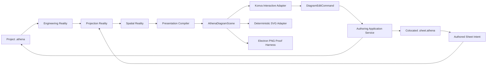

# Architecture Spine - Athena M43 Presentation and Rendering Reality

## Design Paradigm

M43 uses a compiler-owned scene graph with command-mediated renderer adapters. Engineering source
and its colocated Sheet Companion compile through Engineering, Projection, and Spatial Reality into
one immutable `AthenaDiagramScene`. That scene is the public shape of Presentation Reality. Konva,
SVG, PNG, Theia, and later adapters consume it; none owns engineering, placement, or route truth.



One short authority chain remains explainable:

```text
source meaning -> compiled engineering facts -> projection -> spatial -> AthenaDiagramScene
-> Theia paint and interaction -> typed source command -> recompile -> source trace
```

## Inherited Invariants

| Inherited | From parent | Binds here |
| --- | --- | --- |
| M39 AD-2 | Reality Architecture | Engineering Reality remains sole owner of engineering truth. |
| M39 AD-3 | Reality Architecture | Projection owns views and occurrences, never engineering meaning. |
| M39 AD-4 | Reality Architecture | Spatial owns placement, bounds, anchors, routes, and geometry metrics. |
| M39 AD-5 | Reality Architecture | Presentation owns paint facts only. |
| M39 AD-7 | Reality Architecture | Renderer and Theia cannot repair upstream truth. |
| M40 AD-9 | Projection Reality | Projection owns sheets, occurrences, regions, reading order, and coordinate references. |
| M40 AD-13 | Projection Reality | Spatial consumes Projection; no knowledge-to-geometry shortcut exists. |
| M40 AD-19 | Projection Reality | Projection compilation is deterministic and boundary-validated. |
| M41 AD-20 | Spatial Reality Recovery | Each `SpatialSheet` owns typed extent, drawing area, grid, occurrence geometry, anchors, lanes, routes, grid references, quality, and trace. |
| M41 AD-22 | Spatial Reality Recovery | Routes begin/end at exact typed Port Anchors and fail closed on unresolved or unroutable endpoints. |
| M41 AD-26 | Spatial Reality Recovery | Complete Spatial validation is the Presentation gate; failures publish no partial document. |
| M41 AD-27 | Spatial Reality Recovery | `ProjectionSpatialCompiler` remains the single Projection-to-Spatial orchestrator. |
| M41 AD-28 | Spatial Reality Recovery | Solvers stay internal and domain-neutral; no renderer or source syntax owns solver mechanics. |
| M41 AD-30 | Spatial Reality Recovery | Stable identity, source trace, and deterministic ordering are normalized before downstream consumers. |
| M42 AD-31 | Engineering Knowledge System | Public source trace is portable, structured, and LSP-mappable. |
| M42 AD-32 | Engineering Knowledge System | Public JSON shape and canonical bytes are separate, versioned contracts. |
| M42 AD-33 | Engineering Knowledge System | Kotlin and TypeScript share schema-generated contracts and atomic revisions. |
| M42 AD-34 | Engineering Knowledge System | Projection receives resolved engineering facts only. |
| M42 AD-36 | Engineering Knowledge System | Product execution remains local, pure, and free of hidden network authority. |

## Invariants And Rules

### AD-1 - Companion File Has Authored Layout Authority [ADOPTED]

- **Binds:** sheet source, compiler discovery, source navigation, and IDE grouping.
- **Prevents:** layout syntax leaking into project meaning, hidden layout databases, and tree grouping
  changing source identity.
- **Rule:** `project.athena` owns engineering meaning. Colocated `project.sheet.athena` owns page,
  coordinate-grid, visibility, and authored occurrence placement intent. Theia may display them as
  one project document group, but compiler inputs, diagnostics, provenance, and mutation targets stay
  independent. A governed live document requires exactly one same-basename companion; absence or
  ambiguity is an explicit `Sheet Companion unavailable` diagnostic and publishes no Presentation
  Reality. Engineering compilation may still serve non-presentation consumers. No legacy layout file
  or fallback reader participates.

### AD-2 - `cell: N` Means N By N Subdivisions [ADOPTED]

- **Binds:** Sheet Companion grammar, grid validation, spatial lowering, snapping, and viewport scale.
- **Prevents:** `cell: 4` becoming a 16-unit macro pitch, top-left crowding, and renderer-specific
  coordinate interpretations.
- **Rule:** `grid: C * R cell: N` defines `C` horizontal macro cells, `R` vertical macro cells, and
  `N x N` logical subdivisions inside every macro cell. `N` is a positive integer multiple of 4.
  One subdivision is one logical `SceneUnit`; one macro cell spans `N x N SceneUnit`; drawing extent
  is `C*N` by `R*N`. Thus `grid: 17 * 16 cell: 4` produces `68 x 64` logical units. Optional
  `micro(x,y)` indices are in `1..N`. Renderer maps logical units to viewport or page pixels only
  after compilation.

### AD-3 - A1 Coordinates Address Occurrences, Never Engineering Identity [ADOPTED]

- **Binds:** placement grammar, source trace, diagnostics, and move commands.
- **Prevents:** mutable page coordinates becoming Entity identity or relationship endpoints.
- **Rule:** vertical rows use letters and horizontal columns use numbers; `A2` means row `A`, column
  `2`. A quoted occurrence reference such as `"Supply" at A2` resolves exactly one Projection
  occurrence or fails as missing/ambiguous. Stable occurrence and semantic subject IDs remain
  independent of placement. Exact pixels, route vertices, and paint transforms are not authoring
  syntax.

### AD-4 - Persist Constraints, Derive Geometry [ADOPTED]

- **Binds:** placement, lock, initial layout, routing, labels, and recompilation.
- **Prevents:** renderer-owned layout state and brittle persistence of derived geometry.
- **Rule:** Sheet Companion persists only macro cell, optional micro anchor, lock, and explicit
  sheet-level visibility intent. Compiler derives exact occurrence bounds, port anchors, routes,
  labels, collisions, z-order, and paint geometry. Unplaced occurrences use deterministic initial
  layout. A lock fixes authored anchor intent, not downstream route or label geometry.

### AD-5 - Presentation Reality Is One Canonical Scene [ADOPTED]

- **Binds:** presentation model, runtime/LSP publication, Theia, renderers, and exporters.
- **Prevents:** raw Spatial facts leaking to frontend, parallel SVG/Canvas models, and mixed-revision
  paint.
- **Rule:** `AthenaDiagramScene` is the canonical public document of Presentation Reality, not a new
  Reality or database. It contains one page coordinate system, stable scene/occurrence/subject/port
  IDs, compiled bounds and transforms, routes, labels, asset references, z-order, source trace,
  revision, and digest. Runtime atomically publishes one complete scene. Frontend never reconstructs
  frame, symbols, routes, labels, hit identity, or engineering meaning from raw Projection or Spatial
  payloads.

### AD-6 - Patterns Stay Outside M43 [ADOPTED]

- **Binds:** future macro/pattern work and M43 scope.
- **Prevents:** presentation macros becoming a second engineering-composition authority.
- **Rule:** reusable Engineering Patterns, variants, provider selection, and solution generation are
  later Knowledge capabilities. M43 may render their future occurrences but defines no Pattern or
  macro authority.

### AD-7 - Compilation Is Deterministic And Fail-Closed [ADOPTED]

- **Binds:** compiler, runtime, LSP, CLI, Theia, renderers, and proof tools.
- **Prevents:** stale scenes, guessed placement, partial paint, and cross-surface drift.
- **Rule:** identical Engineering Reality, Sheet Intent, package snapshot, compiler version, and
  presentation profile produce identical scene facts, ordering, canonical digest, and diagnostics.
  Invalid source references, grid values, asset profiles, geometry, or blocking overlaps publish no
  new authoritative scene. Product may retain the explicitly identified previous valid revision but
  must show current diagnostics and never merge revisions or invoke a legacy renderer.

### AD-8 - Scene Transport Is Closed, Logical, And Renderer-Neutral [ADOPTED]

- **Binds:** `presentation-model`, schema, Kotlin producer, TypeScript consumer, and adapters.
- **Prevents:** Konva/Pixi/DOM types entering kernel, hand-written DTO drift, and device-pixel truth.
- **Rule:** Scene transport has a committed closed JSON Schema with numeric `schemaVersion`, ordered
  arrays, stable IDs, revision, and digest. Kotlin emits the contract; TypeScript is generated and
  validates it before paint. Scene geometry uses integer logical `SceneUnit`; asset-internal geometry
  stays behind validated `AssetRef`. No DOM, Canvas, Konva, Pixi, CSS pixel, device scale, or Theia
  object appears in compiler or scene contracts. Exact scene topology, ID algebra, canonical order,
  digest, trace, and schema paths are normative in `M43-CONTRACT-PACK.md`.

### AD-9 - Konva Is First Interactive Adapter, Not Architecture [ADOPTED]

- **Binds:** Theia live document, dependency boundary, viewport transform, hit testing, and future
  renderer replacement.
- **Prevents:** framework lock-in, two interaction owners, transform drift, and fixed-size canvas
  failure on narrow windows.
- **Rule:** `@engineeringood/athena-theia-frontend` declares exact direct dependencies
  `konva@10.3.0` and `ajv@8.20.0`. One imperative `KonvaDiagramAdapter` is the only Konva import
  boundary. React 18 supplies a host element, not a second scene tree. Adapter owns one Stage,
  hit-testing path, pan/zoom transform, and transient interaction state. `ResizeObserver` fits page
  bounds using host CSS pixels only; Konva owns backing-store DPR, which never changes logical or CSS
  transform math. Independent DOM SVG occurrence paint plus Canvas route paint is retired. HTML
  overlays may host controls, text input, or accessibility affordances, but never duplicate geometry
  or hit authority.

### AD-10 - Editing Uses Typed Intent Commands [ADOPTED]

- **Binds:** drag/drop, snapping, connection gestures, source mutation, undo/redo, and recompilation.
- **Prevents:** Konva state becoming truth, stale edits, direct file string surgery, and relationship
  meaning being written into Sheet Companion.
- **Rule:** Adapter emits a sealed `DiagramEditCommand` with expected scene revision and stable IDs.
  `MoveOccurrence` carries target Sheet Anchor and lock intent and mutates `*.sheet.athena`.
  `ConnectPorts` carries stable Port IDs plus required authored relationship intent and mutates the
  owning project `*.athena`. An application service resolves a structured source edit, validates it,
  uses the existing editor/workspace undo transaction, recompiles, and replaces scene only on
  success. During gesture the adapter may show transient preview; rejection restores accepted scene
  and compiler diagnostic. Runtime `DiagramAuthoringService` is sole semantic owner; LSP transports
  generated schemas and Theia applies one versioned single-file `WorkspaceEdit`. Exact CAS, query,
  command/result, idempotency, stale, undo, and publication states follow `M43-CONTRACT-PACK.md`.

### AD-11 - Printable Canvas Is Clean By Default [ADOPTED]

- **Binds:** page frame, coordinate border, interaction overlays, export, and screenshots.
- **Prevents:** engineering content drowning in grid lines, test UI entering print, and adapters
  disagreeing on visible page structure.
- **Rule:** normal scene paint contains white page, outer frame, top numeric coordinate cells, left
  alphabetic coordinate cells, and compiled engineering content. It contains no interior macro grid,
  micro grid, bottom title table, feature banner, or instruction text. A later grid toggle may show
  macro/micro alignment as viewport-only adapter state; it is absent from SVG/PNG output unless a
  future explicit presentation requirement promotes it into scene truth. Canvas consumes remaining
  widget area; chrome cannot reserve unexplained whitespace.

### AD-12 - Assets And Fonts Are Governed Inputs [ADOPTED]

- **Binds:** package-local SVG/PNG/icon material, text metrics, cache keys, and renderer security.
- **Prevents:** assets owning engineering facts, semantic source owning shapes, script/network
  execution, unstable system fonts, and one adapter interpreting resources differently.
- **Rule:** Athena source owns stable Port identity, direction, flow, and engineering properties; it
  never defines, selects, or draws an entity shape. A governed IEC/part SVG owns only visual geometry,
  visual center, and named visual anchor coordinates/properties. A symbol anchor can reference an
  existing Port only for compiler validation/mapping; it cannot create, rename, remove, or alter a Port
  or its engineering facts. `PresentationAssetCompiler` is the sole package/profile resolver: it consumes
  the locked package snapshot, validates mappings against existing Engineering Port IDs, and emits
  `SceneAsset` plus compiler-owned visual Port geometry. Package/profile/asset digests enter
  `inputRevision`; adapters never select or map assets. M43 `svg-safe-1` treats generic `id`, `title`,
  `desc`, and anchor-like metadata as inert; symbol-anchor interpretation is deferred to a versioned
  `symbol-asset-v1` profile. Package compilation admits a documented sanitized SVG/image profile and
  rejects scripts, event handlers, foreign objects, external URLs, and undeclared resources. Text uses
  compiler-selected style tokens and bundled digest-pinned fonts where metrics affect geometry; adapters
  cannot silently substitute a layout-changing system font. Compiler publishes canonical admitted bytes
  through a revision-scoped, digest-verified asset bundle; adapters never reopen paths or network.
  `svg-safe-1`, byte/decoded limits, cache lifetime, and font delivery follow `M43-CONTRACT-PACK.md`.

### AD-13 - SVG Is Deterministic Oracle; PNG Is Environment-Pinned Proof [ADOPTED]

- **Binds:** renderer parity, visual regression, screenshots, and future export surfaces.
- **Prevents:** Konva screenshots becoming the only truth and false byte-determinism claims across
  browsers, GPUs, and operating systems.
- **Rule:** a pure SVG adapter serializes `AthenaDiagramScene` in canonical element order with fixed
  numeric and asset rules; it is renderer-independent visual oracle and future export base. PNG proof
  records scene digest, viewport, scale, background, font set, runtime, and platform. SVG canonical
  bytes are exact. PNG is Electron/Chromium E2E capture after READY/assets/fonts/two frames and
  compares pixels with declared tolerance; PNG is not another scene adapter. M43 adds no PDF product
  surface.

### AD-14 - Scale Is Measured Behind Adapter Boundary [ADOPTED]

- **Binds:** scene partitioning, Konva performance work, benchmark evidence, and Pixi adoption.
- **Prevents:** unsupported 100,000-element claims, premature WebGPU coupling, and a second scene
  model created for speed.
- **Rule:** interactive adapters use viewport culling, delegated events, scene-layer partitioning,
  static-layer caching, drag-layer isolation, batched redraw, and zoom-dependent detail while
  preserving stable selection and source trace. Tests include actual M43 page plus synthetic
  100,000-element scene fixture. On recorded reference hardware it must meet the exact fixture,
  warm-up, first-paint, 512 MiB incremental heap, 50 ms interaction p95, 100 ms selection p95, and
  zero identity/error gates in `M43-CONTRACT-PACK.md`; failure blocks closure. A future Pixi adapter
  is admitted only after profiling shows Konva cannot meet that same budget after these controls, and
  it must consume unchanged scene and command contracts.

### AD-15 - Upstream Reuse Is Classified And Pinned [ADOPTED]

- **Binds:** dependencies, `reference/`, licensing, upgrades, and architectural borrowing.
- **Prevents:** copied framework code, accidental copyleft import, duplicate infrastructure, and
  dependency-driven truth ownership.
- **Rule:** every studied upstream capability is classified `ADOPT`, `ADAPT`, or `REJECT` in
  `UPSTREAM-ADOPTION.md`, with version/commit, license, Athena boundary, verification, and upgrade
  policy. `reference/` is read-only evidence and never a production import root. Runtime adoption
  uses exact package dependencies. Any upgrade repeats license, adapter, visual, interaction, and
  scale gates before lockfile change.

### AD-16 - Runtime Remains Local And Has No Legacy Fallback [ADOPTED]

- **Binds:** Electron/Theia deployment, browser features, assets, failures, and operations.
- **Prevents:** remote render authority, hidden collaboration stores, network assets, and stale
  compatibility paths.
- **Rule:** M43 runs in existing local Electron/Theia and CLI processes with browser Canvas support.
  It adds no server, database, remote collaboration state, required WebGPU, telemetry, or network
  asset fetch. Adapter initialization or schema failure becomes a visible product diagnostic and no
  new scene; product never falls back to GLSP, retired hybrid paint, milestone examples, or old
  renderer contracts.

### AD-17 - Verification Covers Authority, Interaction, Pixels, And Scale [ADOPTED]

- **Binds:** every M43 story and closure decision.
- **Prevents:** model-only tests claiming product quality, screenshots without interaction proof,
  and stale frontend bundles hiding failures.
- **Rule:** executable evidence covers Sheet grammar and coordinate math, scene schema/canonical
  order, source trace, asset rejection, adapter contract, command round trip, stale revision,
  selection and port hit tests, atomic refresh, SVG golden, nonblank Canvas pixels, desktop and narrow
  viewport screenshots, and scale fixtures. Final E2E rebuilds kernel/LSP/frontend sequentially,
  opens the active `examples/m43` workspace explicitly, proves source selection and move persistence,
  and stores screenshots under `_bmad-output/implementation-artifacts/m43`.

### AD-18 - Normative Contract Pack Gates Independent Work [ADOPTED]

- **Binds:** compiler, schema, LSP, Theia, Konva, SVG, asset, command, and proof story ordering.
- **Prevents:** individually green units using incompatible scene shapes, IDs, anchors, traces,
  commands, assets, or fixtures.
- **Rule:** `M43-CONTRACT-PACK.md` is binding architecture, implemented first as committed schemas,
  profiles, generated TypeScript, Kotlin/schema validation, and one shared
  `contracts/presentation/v1` corpus. No dependent story may invent a local DTO, formula, fixture, or
  equivalent protocol. Contract change requires version decision and simultaneous shared-vector
  update; no compatibility reader is added.

### AD-19 - Scene Publication Has One Explicit State Machine [ADOPTED]

- **Binds:** runtime/LSP/frontend state, invalid text edits, commands, and diagnostics.
- **Prevents:** mixed snapshots, edits against stale paint, silent scene fallback, and divergent error
  envelopes.
- **Rule:** publication state is exactly `READY`, `STALE`, or `UNAVAILABLE` as defined in
  `M43-CONTRACT-PACK.md`. STALE may display one identified last-valid scene but disables diagram
  mutation and shows attempted-revision diagnostics. Command rejection leaves READY source/scene
  unchanged. All failures use one portable diagnostic envelope.

### AD-20 - Replaced Presentation Contracts Die With Activation [ADOPTED]

- **Binds:** current LSP DTOs/request, frontend bridge/widget/CSS, proof script, tests, and dependency
  manifests.
- **Prevents:** new scene path coexisting with raw Projection/Spatial presentation transport or split
  hit/render ownership.
- **Rule:** `LEGACY-REPLACEMENT.md` is the deletion ledger. Story activating canonical scene transport
  deletes or rewrites every listed raw `athena/projectionSession` presentation DTO/request, hand-written
  TypeScript mirror, frontend frame/label reconstruction, DOM SVG plus Canvas paint path, CSS selector,
  and proof selector. A Projection query survives only for a named non-presentation consumer with an
  independent contract; no compatibility alias or fallback remains.

## M41 Policy Supersession

M41 AD-21's fixed `1200 x 800` page and `1120 x 640` drawing-area seed was an implementation policy
for the M41 proof, not a cross-reality authority. M43 replaces that policy with the logical grid
contract in AD-2 and a profile-owned page/frame mapping. M41 ownership, exact anchors/routes,
validation, orchestration, solver, identity, trace, and ordering rules remain binding as listed above.

## Downstream Source Reconciliation

The current M43 PRD and epic draft predate this approved arena. Before any M43 story is marked
`ready-for-dev`, BMad PRD/epic update must reconcile their fixed `4 x 4` wording, split SVG/Canvas
interaction wording, title-block requirement, and missing-companion assumption with AD-2, AD-5,
AD-9, AD-11, and AD-1. This spine is the architecture authority; stale acceptance text must not
drive implementation.

## Consistency Conventions

| Concern | Convention |
| --- | --- |
| Human syntax | `grid: 17 * 16 cell: 4`; `"Supply" at A2`; optional `micro(2,1)` and `lock`. No `place occurrence` ceremony. |
| Coordinates | Row letter first, column number second. `cell: N` means N subdivisions per axis. Compiler scene uses integer logical units. |
| Identity | Scene element ID, Projection occurrence ID, engineering subject ID, Port ID, and source trace remain distinct typed fields. |
| Transport | One closed versioned scene schema; generated TypeScript; deterministic arrays; schema validation before paint. |
| State | Sources are durable mutation authority. Scene is immutable revision. Adapter state is transient selection/tool/viewport/preview only. |
| Rendering | Compiler owns geometry and z-order. Adapter owns batching, culling, device scale, event delegation, and viewport transform only. |
| Errors | Name exact source, subject, problem, and correction. Framework names and internal codes stay secondary. |
| Kotlin files | Group scene models by role; keep compilation, serialization, and orchestration in separate cohesive files. |
| TypeScript files | Keep adapter interface, Konva adapter, interaction commands, and Theia host separate; no renderer imports outside adapter. |
| Tests | Red-green-refactor through BMad stories; no concurrent Gradle; renderer E2E includes screenshots and canvas pixel evidence. |

Canonical authoring shape:

```athena
sheet "rolling-shutter" {
  page format A3 landscape
  grid: 17 * 16 cell: 4
  "Supply" at A2
  "Q1" at C3 micro(2,1) lock
}
```

Minimal scene shape:

```text
AthenaDiagramScene
  schemaVersion, sceneId, revision, digest
  page bounds, drawing bounds, coordinate frame
  assets[]
  elements[]
    occurrence, port, route, label, frame
    stable IDs, logical geometry, z-order, source trace
```

## Stack

Versions are repository or registry verified on 2026-08-06.

| Name | Version | Role |
| --- | --- | --- |
| Java toolchain | 25 | Existing compiler/runtime |
| Kotlin | 2.4.0 | Existing compiler/runtime |
| Theia | 1.73.1 | Existing desktop workbench |
| Electron | 39.8.7 | Existing local desktop runtime |
| React | 18.3.1 | Existing Theia widget host only |
| Konva | 10.3.0, exact | First interactive scene adapter; MIT |
| TypeScript | 5.9.3 lockfile | Frontend adapter and generated scene types |
| Ajv | 8.20.0, exact direct | Scene transport validation |

`react-konva`, PixiJS, tldraw, Excalidraw, GLSP, and ELK are not M43 runtime dependencies.

## Structural Seed

```text
kernel/
  presentation-model/                 # renderer-neutral scene/publication models and schemas
    src/main/resources/schema/         # committed scene and publication JSON Schemas
    src/main/resources/profile/        # svg-safe-1 and paint profiles
  interaction-model/                  # command/query/result model and committed JSON Schema
  compiler/.../presentation/          # Spatial Reality -> AthenaDiagramScene
  svg-renderer/                        # deterministic scene -> SVG adapter

ide/
  lsp/                                # atomic scene publication and source command protocol
  theia-frontend/src/browser/diagram/
    athena-diagram-adapter.ts          # renderer-neutral host contract
    konva-diagram-adapter.ts           # only production Konva import boundary
    diagram-interaction-commands.ts    # typed intent commands
    athena-diagram-widget.tsx          # Theia host and product lifecycle

examples/
  m43/rolling-shutter/                 # sole active M43 product fixture

contracts/presentation/v1/             # cross-language scenes, grids, commands, traces, assets, render, scale

_bmad-output/implementation-artifacts/m43/
  screenshots/                         # desktop, narrow viewport, trace, move proof
  benchmarks/                          # named-hardware scale evidence
```

## Capability To Architecture Map

| Capability | Governing decisions |
| --- | --- |
| Sheet Companion and A1 placement | AD-1, AD-2, AD-3, AD-4 |
| Canonical Presentation Reality | AD-5, AD-7, AD-8 |
| Live editable Theia canvas | AD-9, AD-10, AD-11 |
| Mixed SVG/PNG/icon material | AD-8, AD-12 |
| Deterministic render proof | AD-13, AD-17 |
| Large-scene growth path | AD-9, AD-14, AD-15 |
| Local product and no compatibility | AD-16, AD-17 |

## Deferred

- Production PDF, print pagination, report generation, and user-facing export commands. Revisit
  after scene/SVG parity and professional page composition are proven.
- PixiJS/WebGL/WebGPU adapter. Revisit only with recorded Konva scale-budget failure.
- Automatic layout through ELK or another solver. Revisit as an explicit Spatial compiler service,
  never as live-renderer authority.
- Collaboration, multiplayer presence, remote scene storage, and tldraw-style document stores.
- Engineering Pattern language, macro migration, variants, and automatic solution generation.
- AI chat, explanation, and AI-authored engineering or layout mutation.
- Visible micro-grid editing overlay, alignment guides, multi-select transform, and advanced connector
  tools beyond the first command contracts. These must reuse scene/command authority.
- Full EPLAN or QElectroTech import compatibility and reproduction of proprietary databases.
