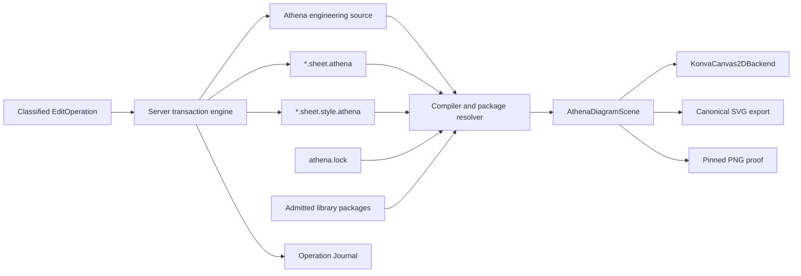

# Architecture Spine - Athena M44 Asset-First Editable Engineering Canvas

## Design Paradigm

Governed projection pipeline.



Frontend displays and previews. Kernel/LSP validates, mutates source, and republishes scene.

## Inherited Invariants

| Inherited | From parent | Binds here |
| --- | --- | --- |
| `athena.yaml` is authored dependency intent; `athena.lock` is derived reproducibility state | M5 architecture | Library Package resolution |
| Production `src/main` contains product architecture only | AGENTS.md source-set hygiene | All implementation stories |
| Athena source remains engineering truth; SVG owns geometry only | AGENTS.md pre-1.0 rule and M44 PRD | Port, Symbol, Part, Relationship authority |
| No compatibility shims for retired behavior | AGENTS.md pre-1.0 rule | M44 refactor and test cleanup |

## Invariants & Rules

### AD-1 - One Canonical Scene Authority [ADOPTED]

- **Binds:** FR-4, FR-5, FR-12, FR-13, FR-15
- **Prevents:** Theia, SVG export, and PNG proof each building their own scene rules.
- **Rule:** All visible canvas/export facts come from `AthenaDiagramScene`. Renderer backends may cache
  and cull, but may not derive engineering identity, valid ports, relationship meaning, source trace, or
  persisted placement.

### AD-2 - Library Item Admission Uses `symbol.yaml` [ADOPTED]

- **Binds:** FR-1, FR-2, FR-3, FR-14
- **Prevents:** Local descriptor formats, copied SVG catalogs, or runtime QElectroTech parsing.
- **Rule:** A M44 `SymbolDefinition` is exactly one canonical SVG resource plus one UTF-8 `symbol.yaml`
  descriptor using schema `athena-symbol-v1`. Loader parses YAML to canonical JSON for digesting. Unknown
  unnamespaced fields reject admission; namespaced vendor extensions are preserved. No alternate syntax,
  fallback parser, or reference-directory runtime dependency is allowed.

### AD-3 - Engineering Ports Own Semantics [ADOPTED]

- **Binds:** FR-2, FR-4, FR-9, FR-10, FR-14
- **Prevents:** Library metadata silently changing engineering ports.
- **Rule:** Engineering source owns Port identity, direction, domain, flow kind, and semantic properties.
  Library metadata owns keyed geometry, orientation, label/hit zones, and compatibility envelope only.
  Mismatch blocks publication or edit acceptance.

### AD-4 - Function-Level Representation Binding Is First-Class [ADOPTED]

- **Binds:** FR-3, FR-4, FR-15
- **Prevents:** One Entity forcing one Symbol and losing EPLAN-like Function separation.
- **Rule:** One Engineering Entity may publish multiple Function/Symbol occurrences through explicit
  `RepresentationBinding` and concrete `RepresentationInstance`. Source Trace resolves Function before
  Entity when both exist. Valid Symbol or Part replacement preserves Entity, Function, Occurrence,
  Relationship, and Port identity.

### AD-5 - Relationship Truth Is Not Route Paint [ADOPTED]

- **Binds:** FR-4, FR-10, FR-14
- **Prevents:** wire labels or line geometry substituting for connection semantics.
- **Rule:** A M44 Relationship carries kind, endpoint identities, domain, flow kind, and direction. Route
  geometry is a Sheet projection. Terminal, Cable, Wire, BOM, report, and manufacturing projections are
  deferred.

### AD-6 - Source Revision Is Full Input Compare-And-Set [ADOPTED]

- **Binds:** FR-9, FR-10, FR-11, FR-15
- **Prevents:** stale edits accepted because only part of the input tuple was checked.
- **Rule:** Source Revision contains scene `inputRevision`, engineering-source digest, Sheet digest, Style
  Companion digest or absent marker, `athena.lock` digest, admitted package/item digests,
  compiler/schema/profile version, and source-root identity. Any mismatch rejects mutation.

### AD-7 - Edit Operations Are Classified Server Transactions [ADOPTED]

- **Binds:** FR-9, FR-10, FR-11, SM-2, SM-7
- **Prevents:** direct scene persistence, frontend source assembly, partial file mutation, and per-pointer
  Undo history.
- **Rule:** Each operation declares authority class, target identity, Source Trace, Source Revision, and
  writable file set. `PresentationEditOperation` writes Sheet/Style only. `RepresentationEditOperation`
  writes representation binding only. `EngineeringEditOperation` writes Engineering Reality and must run
  Relationship, Capability, and Flow validation. Server stages patches, compiles and validates staged
  workspace, then atomically publishes every changed file with one publication correlation id or rolls
  back all files.

### AD-8 - Writable File Ownership Is Fixed [ADOPTED]

- **Binds:** FR-8, FR-10
- **Prevents:** operations writing the wrong authority file or spreading source mechanics into frontend.
- **Rule:** Placement writes `*.sheet.athena`. Persisted style writes same-basename
  `*.sheet.style.athena`. Relationship/port edits write engineering source. Symbol/Part edits write the
  declared project binding file(s). More than one style companion for a sheet is an error.

### AD-9 - Renderer Backend Is Replaceable, But M44 Ships One Backend [ADOPTED]

- **Binds:** FR-5, FR-12, FR-13
- **Prevents:** Konva-specific contracts leaking into source/scene and second interactive engines splitting
  behavior.
- **Rule:** `KonvaCanvas2DBackend` implements the M44 interactive backend boundary. No WebGL/WebGPU,
  GLSP, tldraw, Excalidraw, draw.io, or Graphite runtime integration ships in M44. Backend replacement
  must not change Source Revision, EditOperation, or `AthenaDiagramScene`.

### AD-10 - Export Evidence Has Two Determinism Levels [ADOPTED]

- **Binds:** FR-5, FR-15, SM-4
- **Prevents:** false PNG byte determinism claims.
- **Rule:** SVG export is canonical UTF-8 with exact byte determinism for fixed full input tuple. PNG is
  pinned Electron/Chromium raster evidence with recorded OS, browser, viewport, DPR, fonts, color profile,
  and pixel tolerance.

### AD-11 - Operation Journal Owns History [ADOPTED]

- **Binds:** FR-10, FR-11, SM-7
- **Prevents:** Undo/Redo and future AI collaboration reading raw canvas events or mutable renderer state.
- **Rule:** Every accepted source transaction appends one Operation Journal entry containing operation
  type, authority class, target identity, Source Revision, writable file set, accepted patch, publication
  correlation id, and resulting Source Revision. Undo/Redo replays/inverts journaled source
  transactions, never mouse events or Konva nodes.

### AD-12 - M44 Closure Proves The Golden Authoring Loop [ADOPTED]

- **Binds:** MVP, SM-1, SM-2, SM-3, SM-7
- **Prevents:** breadth-first implementation that misses real-symbol round-trip.
- **Rule:** Work still starts with admitted package, real Symbol, one Entity with multiple
  Function/Symbol occurrences, traceable ports, clean render, Move, Align, and one rejected edit. M44 is
  not closed until the same example also proves Change Symbol, valid Reconnect, invalid Reconnect
  rejection, Bind Part, Undo, Redo, restart/reopen, stable identity, SVG proof, PNG proof, and operation
  journal evidence.

### AD-13 - Performance Proof Uses One Checked Profile [ADOPTED]

- **Binds:** NFR 7.2, FR-13, FR-15
- **Prevents:** unrepeatable performance claims and scale hacks that hide real geometry.
- **Rule:** Performance evidence uses Windows 11, 1920x1080 viewport, DPR 1, 60 Hz, pinned
  Electron/Chromium, 300 real occurrences, 3 seconds warm-up, p95 pan/zoom frame time <=20 ms, p95 drag
  preview <=100 ms, and heap growth <=20 MB over 60 seconds. Out-of-profile results are exploratory.

## Consistency Conventions

| Concern | Convention |
| --- | --- |
| Symbol descriptor files | `symbol.yaml`, schema `athena-symbol-v1`, UTF-8, canonical JSON digest |
| Scene contract | Kotlin `AthenaDiagramScene` is source; generated TypeScript follows schema generation |
| Diagnostics | Plain engineering subject/problem/correction; internal codes may exist but cannot be primary UI text |
| Edit naming | Operation class names are intent verbs under `PresentationEditOperation`, `RepresentationEditOperation`, or `EngineeringEditOperation` |
| Evidence paths | `_bmad-output/implementation-artifacts/m44/` only |
| Production source | No `M44`, `Demo`, `Proof`, `Sample`, `V0`, or `V1` production class names |

## Stack

| Name | Version |
| --- | --- |
| Kotlin | 2.4.0 |
| LSP4J | 0.23.1 |
| TypeScript | 5.9.2 |
| Node.js | >=22 |
| Yarn | 1.22.22 |
| Theia | 1.73.1 |
| Konva | 10.3.0 |
| React | 18.3.1 |

## Structural Seed

```text
kernel/package-model/
  RepresentationDescriptorModels.kt      # descriptor identity and package-facing model
kernel/package-runtime/
  BindingResolver.kt                     # library/package binding selection and diagnostics
kernel/presentation-model/
  PresentationContracts.kt               # AthenaDiagramScene and publication contracts
  schema/                                # JSON schemas for generated frontend contracts
kernel/interaction-model/
  ...                                    # EditOperation, authority class, Operation Journal contracts
kernel/compiler/
  ...                                    # source + package + sheet/style -> scene compiler
ide/lsp/
  ...                                    # EditOperation validation and source transaction protocol
ide/theia-frontend/
  ...                                    # Konva backend, generated scene types, interaction previews
examples/m44/
  rolling-shutter/                       # active governed example only
_bmad-output/implementation-artifacts/m44/
  screenshots/
  exports/
  operation-transcripts/
  performance/
```

## Capability To Architecture Map

| Capability / Area | Lives in | Governed by |
| --- | --- | --- |
| Library Package resolution | `kernel/package-model`, `kernel/package-runtime` | AD-2, AD-3 |
| Function/Symbol occurrence trace | `kernel/compiler`, `kernel/presentation-model` | AD-1, AD-4 |
| Relationship and port compatibility | `kernel/engineering-model`, `kernel/compiler`, `ide/lsp` | AD-3, AD-5, AD-7 |
| Operation journal and Undo/Redo | `kernel/interaction-model`, `ide/lsp` | AD-7, AD-11 |
| Style companion and placement | `kernel/compiler`, `ide/lsp` | AD-6, AD-8 |
| Konva interactive canvas | `ide/theia-frontend` | AD-1, AD-9, AD-13 |
| SVG/PNG evidence | `kernel/presentation-model`, `ide/theia-frontend`, proof scripts | AD-10, AD-13 |
| M44 acceptance evidence | `_bmad-output/implementation-artifacts/m44` | AD-12 |

## Deferred

- Remote public library registry and publishing workflow: later package-platform milestone.
- Macro authoring and macro expansion authority: later representation-library milestone; M44 allows only
  read-only representation macro package references.
- Engineering Pattern authoring: later knowledge/pattern milestone; representation macros must not create
  breaker/contactor/overload style engineering solutions.
- `=Function +Location -Device` structured addressing: later identity milestone; M44 prohibits label
  parsing as identity.
- Terminal, Cable, Wire, BOM, report, manufacturing, lifecycle views: later Projection milestones.
- WebGPU/Graphite/GLSP/tldraw/Excalidraw/draw.io runtime adoption: later renderer/editor architecture
  decision after M44 real-symbol round-trip proof.
