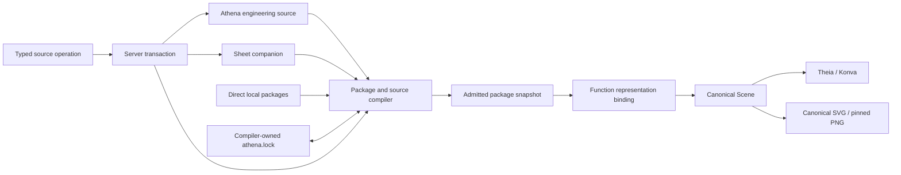

# Architecture Spine - Athena M45 Engineering Package Authoring

## Design Paradigm

Governed package compiler feeding the inherited governed projection pipeline.



Package authors provide native metadata and governed package-local SVG resources. Package admission
resolves reusable facts. Athena source owns engineering meaning. Canonical Scene remains the only render
contract.

### Future Package Index Boundary

Future third-party package tooling may precompile authored package metadata and resources into a governed
package index before runtime resolution. The index is compiler-owned derived package state, keyed by
stable PackageItem identity and digest. Runtime and binding resolution consume the admitted index/package
snapshot; they never hard-match filenames or inspect external catalog formats. M45 proves native local
package source and keeps index materialization out of the runtime authority path.

## Inherited Invariants

| Inherited | From parent | Binds here |
| --- | --- | --- |
| `AD-1` One Canonical Scene Authority | M44 spine | Every package-backed occurrence and export |
| `AD-3` Engineering Ports Own Semantics | M44 spine | Symbol anchors, Element public ports, compatibility |
| `AD-4` Function-Level Representation Binding Is First-Class | M44 spine | `FunctionRepresentationBinding` evolution |
| `AD-5` Relationship Truth Is Not Route Paint | M44 spine | Macro, Element, and imported geometry boundaries |
| `AD-6` Source Revision Is Full Input Compare-And-Set | M44 spine | Package/item/resource/lock mutation safety |
| `AD-7` Edit Operations Are Classified Server Transactions | M44 spine | Insert, bind, variant, placeholder, and macro operations |
| `AD-8` Writable File Ownership Is Fixed | M44 spine | Package, engineering source, binding, and Sheet writes |
| `AD-9` Renderer Backend Is Replaceable | M44 spine | Package model and scene remain Konva-independent |
| `AD-10` Export Evidence Has Two Determinism Levels | M44 spine | Golden SVG and PNG evidence |
| `AD-11` Operation Journal Owns History | M44 spine | Package-backed authoring Undo/Redo |
| `AD-13` Performance Proof Uses One Checked Profile | M44 spine | M45 canvas regression evidence |
| M44 `AD-2` `athena-symbol-v1` admission is superseded | M44 spine | Replaced by M45 AD-3, AD-4, and kind-specific PackageItem payloads; no legacy descriptor path remains |
| Production `src/main` contains product architecture only | AGENTS.md | Import tooling, proof, and example placement |
| No compatibility shims; Athena source owns engineering metadata; SVG owns geometry only | AGENTS.md | Entire M45 refactor |

## Invariants & Rules

### AD-1 - One Package System [ADOPTED]

- **Binds:** FR-1 through FR-5, FR-11, FR-12
- **Prevents:** Engineering, Representation, import, and runtime subsystems defining incompatible package identities or resolver paths.
- **Rule:** M45 evolves existing `kernel/package-model`, `kernel/package-runtime`, compiler repository graph,
  lock materializer, and Source Revision seams into one package system. Superseded duplicate metadata
  contracts are deleted or folded into the common model. No parallel registry, resolver, lock, snapshot,
  compatibility adapter, or fallback path may remain.

### AD-2 - Direct-Child Package Discovery [ADOPTED]

- **Binds:** FR-1, local package layout, SM-1
- **Prevents:** accidental nested registries, ambiguous package roots, and dependency resolution by directory traversal.
- **Rule:** A project catalogs packages only from immediate directories at `packages/<package-name>/`.
  Each child contains one `package.yaml`; manifest `packageId` must equal the directory name. Root
  `athena.yaml` remains authored dependency intent and selects exact packages from this local catalog.
  Catalog candidates and selected dependencies feed the existing compiler-owned `ResolvedPackageGraph`;
  semantic requirements are validation edges on those same nodes. Inserting from an undeclared package
  updates `athena.yaml` through a typed transaction before lock materialization. Nested package roots,
  implicit global caches, and runtime reads from `reference/elements` or `reference/elements_contrib`
  reject admission. Existing `representationPackageRoots` and `LocalPackageRegistry` resolution paths are
  deleted; no second graph or resolver remains.

### AD-3 - Package Item Has Authored And Admitted Phases [ADOPTED]

- **Binds:** FR-1 through FR-4, domain model 3.1
- **Prevents:** authored content asserting READY/digests, or Symbol, Element, Part, Macro, Variant, and Placeholder duplicating common contracts.
- **Rule:** `PackageItemMetadata` is authored once and contains `packageId`, `itemId`, `itemVersion`, closed
  `kind`, provenance, license, and kind payload reference. A normalized kind payload includes
  `PortCompatibilityContract` where needed. Compiler produces `AdmittedPackageItem`, which composes the
  metadata with normalized payload, resolved references, canonical digest, package provenance,
  admission state, and diagnostics. Digest, resolved references, state, and diagnostics cannot be
  authored. Item identity is `(packageId, itemId, itemVersion)`. `athena-package-item-c14n-v1` hashes
  SHA-256 over UTF-8 canonical JSON with NFC strings, lexicographically sorted object keys, semantic-list
  order preserved, declared-set order sorted, canonical EngineeringValue text, forward-slash relative
  resource paths, and absent optional fields omitted. Digest/state/diagnostics and machine-local paths are
  excluded from the preimage. Payload change without item-version change is lock drift and rejects open.

### AD-4 - Admission Is Staged And Fail-Closed [ADOPTED]

- **Binds:** FR-1 through FR-5, FR-10, FR-12
- **Prevents:** incomplete definitions reaching binding or rendering through placeholder graphics or raw external files.
- **Rule:** Admission executes `parse -> normalize -> resolve -> validate -> digest -> admit` over a staged
  package graph. `PACKAGE_READY` is the only state publishable into package snapshots, bindings, locks,
  Source Revision, or Canonical Scene. `PACKAGE_INCOMPLETE` remains inspectable only through an immutable
  `AdmissionReport` read model containing normalized authored identity, diagnostics, and package
  provenance; it never enters the ready runtime snapshot. Package state is the strict aggregation of all
  manifest-declared exported items: any INCOMPLETE item makes the package INCOMPLETE; any INVALID item
  makes it INVALID; no partial package snapshot publishes. Optional warnings may remain READY and are
  excluded from canonical digest. Package Browser may read AdmissionReport while Engineering Document
  remains unavailable; binding, lock publication, runtime snapshot, and scene read READY packages only.
  No fallback box, point, raw SVG-only item, or previous-version substitution is permitted.

### AD-5 - Lock V3 Is The Only Package Digest Authority [ADOPTED]

- **Binds:** FR-1, FR-3, FR-11, FR-12, deterministic NFRs
- **Prevents:** hand-edited locks, resource drift, and compilers resolving equal manifests differently.
- **Rule:** M45 replaces Repository Lock V2 with `athena-lock-v3`; V2 parsing/materialization and pseudo
  item ids (`snapshot`, `source:*`, `resource:*`) are deleted. V3 is canonical compiler-owned output from
  the existing `ResolvedPackageGraph`. It pins package coordinates/manifest digest, exported
  `(packageId,itemId,itemVersion)` identities and item digests, required resource digests, concrete and
  semantic dependency edges/providers, and safe asset-profile identity. `athena-lock-v3-c14n-v1` uses the
  same canonical primitives as AD-3 with sorted packages/items/resources/edges. Opening or mutation fails
  when authored manifests and expected V3 bytes differ. Source Revision reads detailed package/item/
  resource digests only from this expected-lock model; no independent filesystem digest ledger exists.

### AD-6 - Package Dependency Graph Has Two Explicit Edge Kinds [ADOPTED]

- **Binds:** FR-1, FR-5, FR-12
- **Prevents:** semantic compatibility being confused with exact artifact dependency.
- **Rule:** `requires.packages` creates exact package-coordinate/resource edges in the one
  `ResolvedPackageGraph`. `requires.capabilities` and `requires.interfaces` create exact-version semantic
  contract edges on the same nodes. M45 performs no version-range/provider preference selection. Every
  semantic edge has exactly one provider; duplicate providers remain ambiguous even when their digests
  match. Missing, ambiguous, cyclic, or incompatible resolution blocks admission before binding. V3 lock
  records each selected provider and contract version.

### AD-7 - Geometry And Engineering Semantics Stay Separate [ADOPTED]

- **Binds:** FR-2 through FR-7, FR-9
- **Prevents:** imported SVG metadata or Element composition becoming Engineering Reality.
- **Rule:** Symbol owns SVG resource, viewBox, bounds, center/origin, transform policy, label slots, hit
  geometry, and keyed anchors carrying `PortCompatibilityContract` declarations for direction, domain,
  and flow kind. These are reusable compatibility constraints, not Engineering Port facts. Engineering
  source exclusively owns port identity and accepted semantics, Function, Entity, Relationship, and Part
  binding. Element composes Symbols, declares Function slots, maps anchors, and exposes public
  compatibility ports. Binding/admission must match source ports to package compatibility contracts
  without copying those declarations into Engineering Reality. Part owns physical/procurement
  implementation facts. Package items cannot create or alter Engineering Reality.

### AD-8 - Function Representation Binding Is Explicit [ADOPTED]

- **Binds:** FR-5 through FR-8, FR-11, SM-6
- **Prevents:** `Function -> Symbol`, `Entity = Element`, and one representation overwriting another projection.
- **Rule:** The only representation selection path is `EngineeringEntity -> EngineeringFunction ->
  FunctionRepresentationBinding -> Element -> Symbol`. Binding has a source-persisted `bindingId`, and at
  most one active binding exists per `(functionId, projectionId, bindingRole)`. It contains Function
  identity, projection identity, binding role, Element item identity, optional Variant identity, typed
  Placeholder values, compatibility constraints, package trace, and provenance. Changing Element,
  Variant, or Placeholder values preserves bindingId; delete/recreate allocates a new id. Scene occurrence
  identity remains separate. Binding edits preserve Entity, Function, engineering Port, Relationship,
  and unaffected occurrence identities.

### AD-9 - Package Resources Are Native And Governed [ADOPTED]

- **Binds:** FR-2, FR-3, FR-4, FR-11
- **Prevents:** external reference/catalog formats becoming compiler or runtime contracts.
- **Rule:** Package authors may curate SVG bytes into package `resources/` and author all metadata directly
  through Athena-native PackageItem contracts. Admission records digest, license, provenance, and
  package-relative resource identity. Compiler and runtime parse only Athena package contracts and
  admitted package-local SVG. They never inspect, parse, convert, package, or execute other reference
  formats, and never access `reference/elements` or `reference/elements_contrib`.

### AD-10 - Provenance Is An Immutable Lineage Graph [ADOPTED]

- **Binds:** FR-2 through FR-4, FR-11, provenance NFRs
- **Prevents:** a digest or filename being mistaken for supply-chain traceability.
- **Rule:** Immutable package provenance ends at admitted PackageItem and records normalized logical source
  locator, source digest, license, and package/item identity. Compiler-owned usage trace starts at
  FunctionRepresentationBinding and ends at scene occurrence. A read-only provenance view joins both
  segments through stable PackageItem identity. Package digest covers only package provenance; binding
  and scene inputs are covered separately by Source Revision. Machine-local absolute paths are audit-only
  and excluded from canonical digests and exports.

### AD-11 - Macro, Variant, And Placeholder Cannot Reason [ADOPTED]

- **Binds:** FR-7, FR-8, FR-10, UJ-2, UJ-3
- **Prevents:** representation reuse becoming a hidden Engineering Pattern or Part selector.
- **Rule:** Macro expands declared representation occurrences, bindings, and placement only through one
  explicit classified source transaction listing every write. Variant changes representation while
  preserving semantic identity. Placeholder performs typed substitution against a declared schema.
  None may select a Part, infer a Function, create a Relationship, satisfy a capability, or apply an
  engineering rule. Every Variant of one Element preserves the exact normalized Function-slot/public-port
  interface fingerprint. Placeholder targets are limited to declared label, style, and non-interface
  representation property fields; they cannot alter item/resource identity, Function slots, anchors, or
  public port compatibility. Interface change requires a new Element item/version and full admission.
  Macro geometry is package-owned relative placement only. Insertion supplies target Sheet, explicit
  existing Function ids, transform, and operation id; server allocates persisted binding/occurrence ids
  once and journals the exact expansion. Recompile reuses persisted ids and never re-expands identity.

### AD-12 - All Authoring Mutations Recompile Before Publish [ADOPTED]

- **Binds:** FR-5, FR-6, FR-8, FR-10, UJ-2, UJ-3
- **Prevents:** frontend package assembly, partial package writes, and scenes diverging from accepted source.
- **Rule:** Package authoring, Element insertion, binding, Part selection, Variant selection, and
  Placeholder configuration submit typed operations with full Source Revision. Server stages every
  declared file, materializes canonical lock, admits packages, and compiles source and scene before a
  durable commit. Files and lock commit through AD-17 recovery protocol under one correlation id. Journal,
  ready snapshot, and scene publish in that order only after durable source commit; they are recoverable/
  rebuildable projections, not members of a false cross-memory atomic transaction. Validation failure
  commits nothing. Commit interruption retains previous READY scene until startup recovery completes.

### AD-13 - Source Revision Covers Package Compiler Inputs [ADOPTED]

- **Binds:** FR-1 through FR-12, reopen stability
- **Prevents:** edits accepted against stale package items, resources, admission profiles, bindings, or locks.
- **Rule:** The inherited M44 Source Revision tuple additionally fixes the expected V3 lock digest and
  detailed package manifest, PackageItem, resource, semantic-provider, admission/schema, Part-binding,
  and FunctionRepresentationBinding digests projected from that same expected-lock/compiler model. It
  never rescans an independent package ledger. Any mismatch rejects mutation and requests refresh; no
  force apply exists.

### AD-14 - Package Browser Is A Read/Intent Client [ADOPTED]

- **Binds:** FR-8, UJ-1, UJ-2
- **Prevents:** Theia inventing metadata, mutating source text, or using renderer nodes as package state.
- **Rule:** Theia package browser reads admitted package snapshots and lineage through typed server
  protocols. Search, preview, and inspection are projections. Insert/configure actions emit typed intent
  operations only. UI caches are disposable and keyed by snapshot/Source Revision.

### AD-15 - Golden Closure Proves The Full Supply Chain [ADOPTED]

- **Binds:** FR-9 through FR-12, Golden Acceptance, all Success Metrics
- **Prevents:** closing M45 on model/unit tests without a complete package-backed engineering page.
- **Rule:** `examples/m45/rolling-shutter` uses at least three direct packages and proves SVG copy,
  directly authored native metadata, common items, Parts, one composite Element, three Variants, one Placeholder value
  set, semantic dependencies, explicit bindings, lineage, invalid cases, real geometry, ports, routes,
  labels, edit, reopen, stable identities, canonical SVG, and pinned PNG. Evidence lives only under
  `_bmad-output/implementation-artifacts/m45/` and visually approaches the supplied reference.

### AD-16 - Package SVG Is Inert And Workspace-Contained [ADOPTED]

- **Binds:** FR-2 through FR-4, FR-8, import security and resource NFRs
- **Prevents:** active SVG content, path escape, network loading, or resource exhaustion reaching package preview or render.
- **Rule:** SVG admission uses the repository `svg-safe-1` allowlist profile and rejects DTD/entities,
  scripts, event attributes, CSS, `foreignObject`, external/data URLs, recursive references, malformed
  UTF-8, and profile limit violations. Every resource path is canonicalized,
  symlink-resolved, and proven contained within its declared import/package root before access. Network
  access is forbidden. Versioned admission profiles own deterministic byte, element, nesting, dimension,
  and decoded-resource limits; limit failure is `PACKAGE_INVALID` with exact diagnostics.

### AD-17 - Package Transactions Are Crash-Recoverable [ADOPTED]

- **Binds:** FR-1 through FR-4, FR-8, FR-10, authoring operations
- **Prevents:** process failure leaving source, package files, lock, journal, snapshot, and scene at mixed revisions.
- **Rule:** Server takes one workspace write lock and stages files plus canonical lock on the same volume.
  Before PREPARED state, durable verified before-image bytes exist for every replaced/deleted file and
  durable verified after-image bytes exist for every created/replaced file. Transaction manifest records
  both image paths/digests, intended deletion/creation state, correlation id, and journal payload. Recovery
  rolls back PREPARED transactions whose originals remain untouched. Once any replacement occurred, it
  rolls forward only when every after-image verifies; otherwise it restores every verified before-image
  and removes files that did not exist before. Journal recovery and scene recompile follow durable source
  commit; snapshots and UI publication occur only after recovered/normal commit validation. Recovery data
  is removed only after a durable COMMITTED marker and accepted Source Revision verification.

### AD-18 - Part Binding Is Source-Owned And Projection-Independent [ADOPTED]

- **Binds:** FR-5, FR-6, FR-8, UJ-2, Part compatibility
- **Prevents:** Part identity leaking into Element/representation binding or changing across projections.
- **Rule:** `FunctionPartBinding` is authored Engineering Reality with stable identity
  `(functionId, implementationRole)` and exactly one active Part item per role. Multiple roles are
  explicit. It references admitted Part item identity and compatibility evidence but no Symbol, Element,
  Variant, or scene occurrence. Part selection is an `EngineeringEditOperation`; compatibility validates
  before publish. Representation projections read this binding and cannot own or override it.

### AD-19 - Legacy Package Contracts Are Replaced, Not Adapted [ADOPTED]

- **Binds:** AD-1, all package/compiler/runtime implementation stories
- **Prevents:** stories retaining old Symbol/Representation paths beside M45 contracts.
- **Rule:** Repository `PackageIdentifier` becomes the one cross-module package identity.
  `EngineeringPackageDescriptor`, `RepresentationPackageDescriptor`, and their duplicate ids/provenance
  are replaced by native `PackageManifest` plus PackageItem contracts. `BindingManifest` and
  `RepresentationBindingRule` are replaced by source-persisted `FunctionRepresentationBinding` and
  `FunctionPartBinding`. `symbol.yaml`/`athena-symbol-v1` is replaced by indexed
  `symbols/<itemId>.yaml` using `athena-package-item-v1`. `representationPackageRoots`,
  `LocalPackageRegistry`, and Lock V2 are deleted. No shim, adapter, fallback parser, or dual-write exists.

### AD-20 - Spatial Location Has Three Authorities [ADOPTED]

- **Binds:** FR-8, FR-9, Macro placement, Sheet authoring, Canonical Scene geometry
- **Prevents:** semantic intent, page-grid position, raw canvas pixels, and snap settings becoming one unstable coordinate truth.
- **Rule:** `SemanticPlacementIntent` owns engineering region/role intent. `LogicalLayoutCoordinate` owns
  persisted Sheet/Region/Cell/SubGrid position in Sheet source. Compiler derives
  `PhysicalGeometryCoordinate` x/y/rotation/bounds for Canonical Scene and renderer. Frontend never writes
  raw canvas X/Y into engineering source. Snap is a separate policy and cannot reinterpret persisted
  logical coordinates. Package Symbol/Element anchors map stable port keys to geometry; Engineering Port
  remains semantic connection authority.

## Consistency Conventions

| Concern | Convention |
| --- | --- |
| Package root | `packages/<packageId>/package.yaml`; `packageId` equals direct-child directory name |
| Item identity | `(packageId, itemId, itemVersion)`; stable lowercase dotted package ids and package-local item ids |
| Item kinds | Closed uppercase values: `SYMBOL`, `ELEMENT`, `PART`, `MACRO`, `VARIANT`, `PLACEHOLDER` |
| Admission state | `PACKAGE_READY`, `PACKAGE_INCOMPLETE`, `PACKAGE_INVALID`; only READY publishes |
| Resource paths | Package-relative forward-slash paths; digest covers exact bytes |
| Canonical data | `athena-package-item-c14n-v1` and `athena-lock-v3-c14n-v1`; SHA-256 lowercase hex |
| Diagnostics | Exact package/item/input, problem, and correction in plain engineering language |
| Asset admission | `svg-safe-1`; package-local resources only; reference curation stays outside production `src/main` |
| Protocols | Generated or explicit typed contracts; no untyped frontend JSON assembly |
| Spatial location | `SemanticPlacementIntent` -> `LogicalLayoutCoordinate` -> compiler-derived `PhysicalGeometryCoordinate`; Snap is separate |
| Evidence | `_bmad-output/implementation-artifacts/m45/` only |
| Production names | No `M45`, `Demo`, `Proof`, `Sample`, `V0`, or `V1` production class names |

## Stack

| Name | Version |
| --- | --- |
| Kotlin | 2.4.0 |
| LSP4J | 0.23.1 |
| TypeScript | 5.9.2 |
| Node.js | >=22 |
| Yarn | 1.22.22 |
| Theia | 1.73.1 |
| Konva | 10.3.0 |
| React | 18.3.1 |

## Structural Seed

```text
kernel/package-model/
  ...                         # shared PackageItem, PortCompatibilityContract, manifest, dependency, lineage, binding contracts
kernel/package-runtime/
  ...                         # staged admission, AdmissionReport, ready snapshot, compatibility, macro/variant resolution
kernel/compiler/
  ...                         # repository discovery, graph resolution, canonical lock, scene compilation
kernel/interaction-model/
  ...                         # typed package/binding/import operations and journal records
ide/lsp/
  ...                         # Source Revision CAS and recoverable transaction orchestration
ide/theia-frontend/
  ...                         # package browser/preview and intent clients
examples/m45/rolling-shutter/
  packages/
    com.athena.iec/
    com.vendor.siemens/
    com.community.reference-elements/
_bmad-output/implementation-artifacts/m45/
  imports/
  locks/
  lineage/
  screenshots/
  exports/
  operation-transcripts/
```

## Capability To Architecture Map

| Capability / Area | Lives in | Governed by |
| --- | --- | --- |
| Direct local package discovery and lock | `kernel/compiler`, `kernel/package-model` | AD-1, AD-2, AD-5, AD-6, AD-19 |
| Common items and admission | `kernel/package-model`, `kernel/package-runtime` | AD-3, AD-4 |
| Symbol, Element, Part facts | `kernel/package-model`, `kernel/package-runtime` | AD-3, AD-7, AD-8 |
| Package-local SVG and native metadata | package authoring, `kernel/package-model` | AD-9, AD-10, AD-16 |
| Function representation and Part binding | engineering/package/compiler boundaries | AD-7, AD-8, AD-13, AD-18 |
| Macro, Variant, Placeholder | `kernel/package-runtime`, interaction transactions | AD-11, AD-12 |
| Package browser and insertion | `ide/lsp`, `ide/theia-frontend` | AD-4, AD-12, AD-14, AD-17 |
| Golden rolling-shutter page | active M45 example and evidence | AD-15 |
| Placement and coordinate lowering | engineering/source, Sheet, compiler, Canonical Scene | AD-20 |

## Deferred

- Remote registry, authentication, publishing, cache distribution, and marketplace operations: M45
  proves local package contracts only.
- Engineering Pattern reasoning and AI solution selection: Macro remains representation reuse and cannot
  create engineering solutions.
- External EPLAN/QElectroTech/CAD catalog ingestion: reference material remains outside Athena compiler
  and runtime contracts.
- Public third-party package signing, trust policy, vulnerability policy, and revocation: local packages
  still preserve digest, license, and lineage for later supply-chain governance.
- 3D Macro, BOM, reports, terminal/cable/manufacturing projections, and production circuit certification:
  later engineering and projection milestones.
- Remote/multi-user concurrency, package publishing UX, and AI-assisted package authoring: later platform
  milestones; M45 retains Source Revision and journal foundations.
- New renderer or CAD-scale 100k-node claims: M45 inherits M44 Konva backend and checked performance
  profile while keeping Canonical Scene renderer-neutral.
