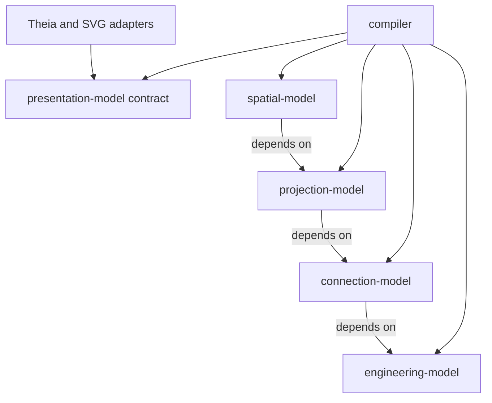

# Architecture Spine - Athena M46 Semantic Connection Kernel

## Design Paradigm

Semantic-first staged compiler. Each stage owns one truth and only depends leftward.

```mermaid
flowchart LR
  Source[Athena Engineering Source] --> ER[Engineering Reality]
  ER --> CIR[Canonical Connection IR]
  CIR --> CP[Connection Projection]
  CP --> RP[Spatial Route Plan]
  RP --> Scene[Canonical Scene]
  Scene --> Paint[Theia / Konva / SVG]
  Intent[Typed Edit Intent] --> Tx[Server Source Transaction]
  Tx --> Source
```





## Inherited Invariants

| Inherited | From parent | Binds here |
| --- | --- | --- |
| M45 `AD-1` One Package System | M45 spine | M46 example assets and package locks |
| M45 `AD-5` Lock V3 | M45 spine | Connection source revision and reopen proof |
| M45 `AD-7` Geometry and semantics stay separate | M45 spine | Port anchors and connection meaning |
| M45 `AD-8` Explicit Function representation binding | M45 spine | Endpoint occurrence resolution |
| M45 `AD-12` Mutations recompile before publish | M45 spine | Connect, reconnect, and route edits |
| M45 `AD-13` Full Source Revision | M45 spine | Every connection authoring operation |
| M45 `AD-14` Theia is a read/intent client | M45 spine | Navigator and canvas interaction |
| M45 `AD-15` Full supply-chain closure proof | M45 spine | M46 golden product evidence |
| M45 `AD-16` Package SVG is inert | M45 spine | Symbol and Port anchor rendering |
| M45 `AD-17` Crash-recoverable transactions | M45 spine | Connection source writes and journal |
| M45 `AD-19` Legacy contracts are replaced | M45 spine | Route/scene contract replacement |
| M45 `AD-20` Three spatial authorities | M45 spine | Route intent, logical coordinates, geometry |
| Engineering Document Visual Golden Rule | AGENTS.md | All connection and page paint |
| Human-First Language Rule | AGENTS.md | Connection authoring syntax and diagnostics |

## Invariants & Rules

### AD-1 - Connection Meaning Is First-Class Engineering Reality [ADOPTED]

- **Binds:** FR-1 through FR-6
- **Prevents:** generic Relationship groups or graphic lines impersonating electrical connectivity.
- **Rule:** `EngineeringDocument` owns explicit `EngineeringConnection` and `EngineeringNet` collections.
  `EngineeringConnection` has exactly two Endpoints. `EngineeringNet` has two or more Endpoints and owns
  multi-endpoint equivalence. Generic `EngineeringRelationship` remains available for other meaning but
  is never projected as a conductor unless an explicit connection definition references it. Graphic
  adjacency may produce a candidate operation only.

### AD-2 - Endpoint Role And Port Direction Are Orthogonal [ADOPTED]

- **Binds:** FR-1, FR-2, FR-3, FR-6
- **Prevents:** device-local `in/out` rules being confused with graph source/sink/pass topology.
- **Rule:** every `EngineeringConnectionEndpoint` references one resolved Engineering Port and one closed
  role `SOURCE`, `SINK`, or `PASS`. Engineering Port retains `INPUT`, `OUTPUT`, or `BIDIRECTIONAL`.
  Validation evaluates both contracts. Endpoint order never substitutes for role.

### AD-3 - Connection Kinds And Physical Requirements Are Typed Source Facts [ADOPTED]

- **Binds:** FR-4, FR-5, FR-6
- **Prevents:** line style or package SVG carrying procurement, installation, or electrical truth.
- **Rule:** M46 closed electrical kinds are `CONDUCTOR`, `WIRE`, `CABLE_CORE`, `JUMPER`, `BUSBAR`, and
  `SIGNAL`. Typed requirements include cross-section, color code, conductor type, shielding, source/target
  termination, and required length. Engineering source owns accepted values. Package contracts may
  constrain compatibility only. Stroke color, width, dash, bend, and label position remain projection.

### AD-4 - Connection Specification Precedence Is Fixed [ADOPTED]

- **Binds:** FR-5, FR-7, FR-13
- **Prevents:** two compilers or UI surfaces resolving equal connection defaults differently.
- **Rule:** resolved specification precedence is `project < potential-or-signal < EngineeringNet <
  EngineeringConnection`. More-specific defined values replace broader values. Two contradictory values
  at the same scope reject compilation with both source locations. Projection annotations display the
  resolved value but never own it.

### AD-5 - Connection IR Is One Canonical Compiler Contract [ADOPTED]

- **Binds:** FR-7, FR-8, FR-9, NFR-1, NFR-5
- **Prevents:** projection, spatial, renderer, and navigator inventing separate connection models.
- **Rule:** new `kernel/connection-model` owns `ConnectionDocument`, `ConnectionFact`, `NetFact`,
  `ConnectionEndpointFact`, resolved specifications, topology operators, source traces, canonicalization,
  and `athena-connection-ir-c14n-v1` SHA-256 digest. It depends only on `engineering-model`. Authored code
  cannot set derived topology, validation state, canonical order, or digest. No coordinate, Konva, DOM,
  viewport, or mouse field is permitted.

### AD-6 - Connection IR Admission Is Fail-Closed [ADOPTED]

- **Binds:** FR-6 through FR-9, NFR-2
- **Prevents:** invalid endpoints, partial Nets, or incompatible physical facts reaching layout/paint.
- **Rule:** compiler executes `resolve -> validate -> normalize -> topology -> canonicalize -> publish`.
  Any unresolved endpoint, invalid role/direction, unsupported kind, incompatible potential/signal,
  contradictory specification, or invalid topology blocks the new Connection IR and retains previous
  accepted publication through existing STALE/UNAVAILABLE rules.

### AD-7 - Topology Operators Are Derived Facts, Not Symbols [ADOPTED]

- **Binds:** FR-2, FR-8, FR-11
- **Prevents:** T-nodes, angles, crossings, or jumpers hiding traversal semantics inside graphics.
- **Rule:** Connection IR publishes stable `BRANCH`, `MERGE`, `PASS_THROUGH`, and `INTERRUPTION` operators
  with ordered endpoint/continuation identities. An operator may control projection order but cannot
  change EngineeringNet membership. An angle is a route bend, not an operator or package Symbol. A jumper
  is an Engineering Connection Kind; its projection may use operators and representation markers.

### AD-8 - Connection Projection Replaces Generic ProjectionConnection [ADOPTED]

- **Binds:** FR-8, FR-9, FR-10
- **Prevents:** arbitrary EngineeringRelationship participants being lowered directly into routes.
- **Rule:** `ConnectionProjection` references exactly one Connection IR connection/net identity, selected
  projection endpoints, projection role, optional authored logical route constraints, and source trace.
  Existing `ProjectionConnection` is deleted. No adapter or dual projection path remains.

### AD-9 - Route Plan Is Typed Spatial Reality [ADOPTED]

- **Binds:** FR-10, FR-11, FR-12
- **Prevents:** a point list carrying no junction/crossing/shared-segment meaning or renderer recomputing topology.
- **Rule:** `ConnectionRoutePlan` replaces `SpatialRoute`. It owns typed orthogonal segments, shared segment
  references, junctions, unconnected crossings, bridge/gap markers, interruption anchors, annotation
  anchors, endpoint anchor ids, quality metrics, and source trace. It contains physical geometry only and
  cannot change connection semantics.

### AD-10 - Planner Cost And Tie-Breaking Are Deterministic [ADOPTED]

- **Binds:** FR-10, FR-11, NFR-1
- **Prevents:** first-valid routing, giant detour rectangles, and platform-dependent route choice.
- **Rule:** `ConnectionRoutePlanner` replaces `SpatialRouteCompiler` and selects plans lexicographically by:
  semantic/topological validity, hard-obstacle violations, ambiguous overlap count, crossing count, bend
  count, Manhattan length, then stable encoded geometry identity. Hard constraints include admitted Port
  anchors, symbol bounds, frame/rulers, drawing area, and authored keep-outs. Equal inputs produce equal
  plans regardless of viewport or zoom.

### AD-11 - Junction, Crossing, And Shared Paint Grammar Is Exact [ADOPTED]

- **Binds:** FR-11, FR-16
- **Prevents:** false electrical meaning and duplicate/thick coincident routes.
- **Rule:** electrically joined topology emits exactly one tiny junction. Unconnected crossing emits no
  junction and uses one deterministic bridge/gap marker when needed. Shared Net trunk segments are
  canonicalized and painted once. Interruption uses paired stable anchors. Renderer cannot infer any of
  these from segment intersection.

### AD-12 - SceneConnection Is The Only Paint Contract [ADOPTED]

- **Binds:** FR-10 through FR-16, NFR-3, NFR-5
- **Prevents:** renderer access to Engineering Reality/Connection IR or legacy `SceneRoute` point lists.
- **Rule:** `SceneConnection` replaces `SceneRoute` and contains semantic connection/net id, path segments,
  junction/crossing/interruption markers, explicit annotations, endpoint ids, z-order, style ids, and trace.
  Canonical Scene schema increments once. Konva and SVG adapters paint this contract only. Route, marker,
  and text weight stays constant in screen space. Interaction hit targets stay invisible.

### AD-13 - Connection Labels Are Explicit And Minimal [ADOPTED]

- **Binds:** FR-12, FR-13, FR-16
- **Prevents:** AST links, source paths, anchor ids, every Port id, or debug text flooding the sheet.
- **Rule:** `ConnectionAnnotation` has one declared display role and one resolved engineering value. Default
  route paint has no annotation unless source/Sheet/style selects it. Internal ids exist only in trace and
  interaction attributes. Selection never changes annotation visibility or style target.

### AD-14 - Edit Operation Authority Is Classified [ADOPTED]

- **Binds:** FR-14, FR-15
- **Prevents:** route dragging silently reconnecting Ports or endpoint dragging mutating only canvas state.
- **Rule:** Connect, Reconnect, source/target exchange, Net membership, kind, and physical requirement
  changes are `EngineeringEditOperation`. Bend/segment constraint and annotation placement changes are
  `PresentationEditOperation`. Both submit full Source Revision to the server, stage source/Sheet writes,
  validate, compile, journal accepted transaction, then publish. Pointer events never enter history.

### AD-15 - Connection Navigator Is A Read/Intent Client [ADOPTED]

- **Binds:** FR-13, FR-14
- **Prevents:** UI caches or canvas selection becoming connection state.
- **Rule:** compiler/LSP publishes immutable `ConnectionReadModel` from accepted Connection IR, including
  placed/unplaced state, endpoints, roles, kind, resolved specifications, validation, and source traces.
  Theia caches by accepted Input Revision and emits typed intents only. Route and Navigator selections
  resolve through stable trace without mutating style, source, or Scene.

### AD-16 - M46 Performance Is Incremental And Measured [ADOPTED]

- **Binds:** NFR-4, SM-6
- **Prevents:** full-scene repaint/replan on one route edit and unverifiable scale claims.
- **Rule:** Connection IR, projection, planner, Scene adapter, and spatial index use stable ids and changed
  connection/net sets. One route edit invalidates its connected topology group and colliding local plans,
  not every route. Pinned 1,000-connection proof records p95 frame, selection, replan, paint count, identity
  errors, and unhandled errors under M46 artifacts.

### AD-17 - Human Source Expresses Meaning Only [ADOPTED]

- **Binds:** FR-1 through FR-5, Human-First Language Rule
- **Prevents:** Connection IR, operator, routing, paint, and protocol fields leaking into `.athena` syntax.
- **Rule:** grammar exposes direct engineering phrases for typed binary connections, Nets, potentials/
  signals, and physical requirements. It does not expose topology operator ids, path segments, X/Y, bridge
  markers, scene styles, digests, or renderer fields. Sheet companion may express durable logical route
  constraints only when manually authored presentation intent exists.

### AD-18 - M46 Replaces Legacy Route Architecture [ADOPTED]

- **Binds:** all implementation stories, NFR-6
- **Prevents:** new Connection IR coexisting with old generic relationship-to-route behavior.
- **Rule:** delete `ProjectionConnection`, `SpatialRoute`, `SpatialRouteCompiler`, `SceneRoute`, generated
  legacy route schema fields, tests/examples asserting retired behavior, and milestone-specific proof code
  from production paths as their replacements land. No deprecated aliases, fallback parsing, compatibility
  adapters, dual writes, or stale M45 fixture assumptions remain.

### AD-20 - Folio Projects Engineering Reality Through Independent Pages [ADOPTED]

- **Binds:** FR-9, FR-10, FR-16, NFR-1, UX-DR1 through UX-DR6
- **Prevents:** one overloaded page, duplicated engineering truth per page, and package ownership leaking
  into document organization.
- **Rule:** a same-root Folio Companion owns ordered Documents and Pages. Each Page Companion owns format,
  frame, snap, logical placements, route constraints, and an independently compiled Route Plan/Scene page.
  The project imports any number of packages; resolved Function Representation Bindings select their assets,
  so one Page may use occurrences from different packages without importing packages itself. Engineering
  Connections and Nets remain project facts; a cross-page projection preserves the one Connection IR identity
  and emits the existing explicit interruption/reference fact. The M46 surface does not implement cross-page
  Smart Connect authoring or infer semantic connectivity from continuation geometry.

### AD-19 - Golden Closure Is Product Evidence [ADOPTED]

- **Binds:** FR-16, all Success Metrics, NFR-7
- **Prevents:** closing on model tests while product still shows crude, stale, or semantically false lines.
- **Rule:** `examples/m46/rolling-shutter` is independent from prior milestone examples and uses direct local
  packages. Closure rebuilds affected kernel, LSP, frontend, and Electron bundles; opens example root as
  workspace; verifies Explorer, Repository Session `READY`, exact LSP root, accepted Connection IR, Scene,
  reconnect rejection/acceptance, route edit/Undo/Redo/reopen; captures deterministic SVG/PNG plus desktop
  and narrow screenshots under `_bmad-output/implementation-artifacts/m46/`; then runs hygiene and encoding
  audits.

## Consistency Conventions

| Concern | Convention |
| --- | --- |
| Engineering ids | Stable source-derived identities; connection and Net ids never derive from route geometry |
| Connection IR format | `athena-connection-ir-c14n-v1`, canonical JSON, NFC strings, sorted identity sets, SHA-256 lowercase |
| Endpoint roles | `SOURCE`, `SINK`, `PASS`; never inferred from list order |
| Connection kinds | `CONDUCTOR`, `WIRE`, `CABLE_CORE`, `JUMPER`, `BUSBAR`, `SIGNAL` |
| Specification order | project < potential/signal < Net < Connection |
| Diagnostics | Exact connection/net/Port/property, problem, and correction in plain engineering language |
| Spatial geometry | Integer logical compiler geometry; viewport pixels never persist |
| Route style | Approximately one screen pixel; butt/miter default; no arrow unless explicitly selected |
| Junction marker | Tiny screen-space marker from SceneConnection topology only |
| Evidence | `_bmad-output/implementation-artifacts/m46/` only |
| Production names | No milestone, Demo, Proof, Sample, V0, V1, compatibility, or deprecated names |

## Stack

| Name | Version |
| --- | --- |
| Kotlin | 2.4.0 |
| LSP4J | 0.23.1 |
| TypeScript | 5.9.2 |
| Node.js | >=22 |
| Yarn | 1.22.22 |
| Theia | 1.73.1 |
| Konva | 10.3.0 |
| React | 18.3.1 |

## Structural Seed

```text
kernel/engineering-model/
  EngineeringConnectionModels.kt       # authored semantic truth
kernel/connection-model/
  ConnectionIrModels.kt                 # canonical compiler handoff
  ConnectionTopologyModels.kt           # derived topology operators
  ConnectionCanonicalProtocol.kt        # deterministic canonicalization/digest
kernel/projection-model/
  ConnectionProjectionModels.kt         # projection selection, no geometry
kernel/spatial-model/
  ConnectionRoutePlanModels.kt           # typed geometry/topology paint plan
kernel/compiler/
  ConnectionIrCompiler.kt
  ConnectionProjectionCompiler.kt
  ConnectionRoutePlanner.kt
  ConnectionAnnotationPlanner.kt
kernel/validation/
  EngineeringConnectionValidator.kt
kernel/interaction-model/
  ConnectionEditOperations.kt
ide/lsp/
  ConnectionOperationHandler.kt
  ConnectionReadModelService.kt
ide/theia-frontend/
  connection navigator and SceneConnection adapter
examples/m46/rolling-shutter/
_bmad-output/implementation-artifacts/m46/
```

## Capability To Architecture Map

| Capability / Area | Lives in | Governed by |
| --- | --- | --- |
| Semantic Connection/Net | `engineering-model`, language/lowering, validation | AD-1 through AD-4, AD-17 |
| Canonical Connection IR | `connection-model`, compiler | AD-5 through AD-7 |
| Projection selection | `projection-model`, compiler | AD-8 |
| Route planning and topology geometry | `spatial-model`, compiler | AD-9 through AD-11 |
| Canonical paint contract | `presentation-model`, SVG/Theia adapters | AD-12, AD-13 |
| Connection edits and Navigator | interaction model, LSP, Theia | AD-14, AD-15 |
| Performance and closure | compiler, Theia, M46 example/evidence | AD-16, AD-19 |
| Legacy removal | all affected modules | AD-18 |

## Deferred

- Cross-page Smart Connect UX: M46 owns named page projection and interruption/reference identity; later
  milestone owns cut/paste and interactive cross-reference authoring experience.
- Cable/harness fabrication, terminal diagrams, numbering, reports, and 3D physical routing: require
  manufacturing/physical projections beyond M46 schematic connection scope.
- Fluid/process kind implementations: kernel stays implementation-neutral; domain packages add later
  contracts without changing M46 electrical truth.
- ELK or another external layout engine: reconsider only if future measured profiles exceed the custom
  planner and an adapter can consume Connection IR without becoming authority.
- Remote collaboration and registry services: existing local Source Revision/transaction/package contracts
  remain sufficient for M46 desktop proof.
